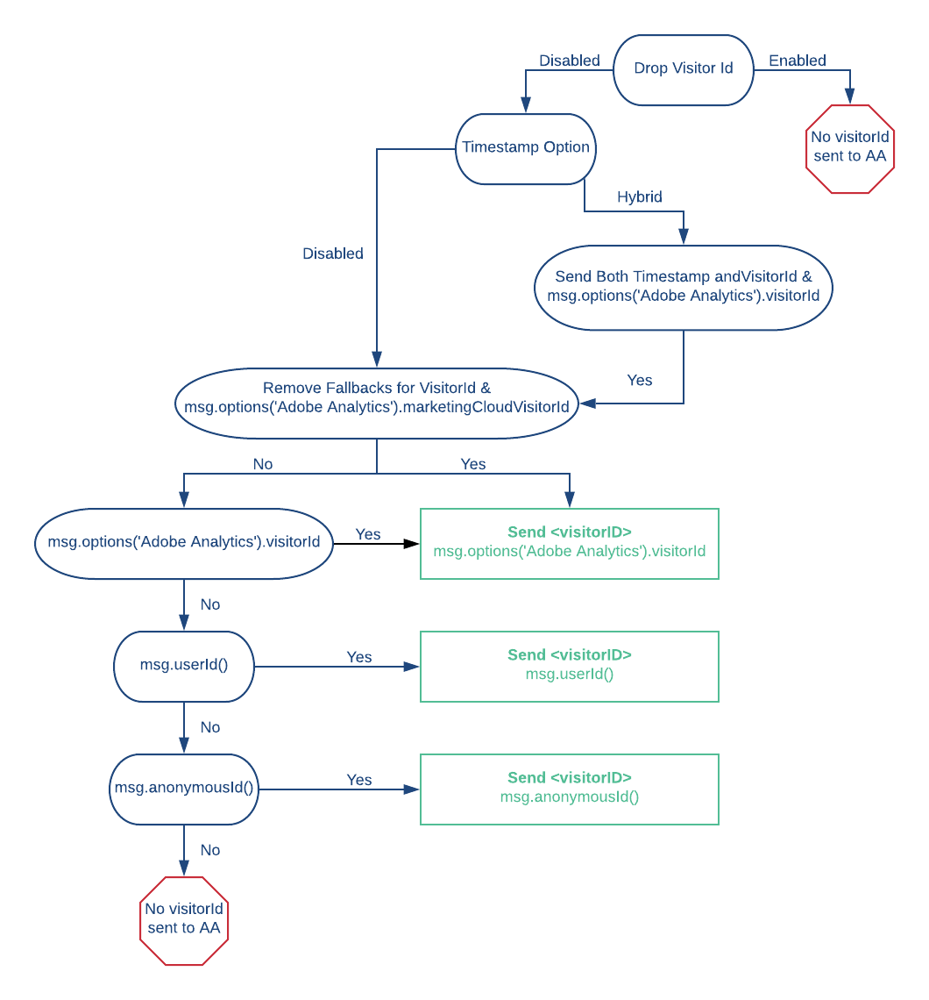

## Identity Resolution 

### No Fallbacks for VisitorId
As Adobe Analytics customers begin to migrate from using visitorId to using the marketingCloudVisitorID (MCVID), we introduced a new setting called **No Fallbacks for Visitor ID**, to assist in this transition. If you disable  **Drop Visitor ID**, Segment sends a `<visitorID>` in these three scenarios:

1. A customer isn't sending timestamps (meaning the Timestamp Option setting is set to disabled)
2. A customer is using hybrid timestamp mode and is sending `visitorId`
3. A customer is using hybrid timestamp mode and is sending `visitorId` and timestamp

**NOTE:** If one of these three scenarios is met and a customer does not send a `visitorId` in the integrations object, Segment falls back to setting the visitorId to either a Segment `userId` or `anonymousId`. This timestamp dependent functionality of when Segment sends a visitorID does not change when you enable **No Fallbacks for Visitor ID**. The **No Fallbacks for Visitor ID** setting is added functionality on top of that.

The **No Fallbacks for Visitor ID** setting functionality behaves as such, if a customer is sending data in one of the three above scenarios, Segment checks if the setting is enabled and if they are sending a marketingCloudVisitorId in the integrations object. If they meet both of those criteria Segment removes the fallback behavior and sets `<visitorID>` to the value passed in the destination specific setting for `visitorId`. If that value is not passed, it leaves it blank.

## Best practices for userId and sessioning
You can enable **Drop Visitor ID** from the Segment app to prevent Adobe from creating a new user profile when you set `window.s.visitorID` with a custom value. However, this can break the links between anonymous and identified users inside your reports, if you're only using Analytics.js to send data to Adobe.

Adobe Analytics unfortunately counts every "effective" visitor ID as a *unique* visitor. There is no ability for Segment to alias, implicitly or explicitly, two effective IDs on your behalf.

Key to understanding the implications of this fact is an understanding of what Adobe Analytics means by **"effective" visitor ID**. To do so, we recommend reading [this section of their documentation](https://marketing.adobe.com/resources/help/en_US/sc/implement/xdevice_visid.html).

With analytics.js, we use the default auto-generated Adobe Analytics [`s_vi` cookie value](https://marketing.adobe.com/developer/documentation/data-insertion/c-visitor-id) as effective visitor ID until you `identify` your users. If you provide your Marketing Cloud ID Service Organization ID, then we'll set the MCVID and use that instead.

Once you `identify` your user, Segment sets the `visitorId` variable to your `userId`. This effectively creates a new user, which *does* have unique user implications. However, based on a thorough reading of their documentation and discussion with many customers, we believe this is the best practice because now you can seamlessly track this user across devices whenever they are logged in.

So if you'd like to track your users on the server as well, you have a few options. If you're only tracking logged-in users, sending their `userId` in your events ensures that the events are attributed to the proper user. If you're tracking anonymous users too, Segment sends the `s_vi` cookie from Adobe if you pass it under `context['Adobe Analytics'].visitorId` as the `visitorId`. Then we fallback on the `userId` and lastly the Segment `anonymousId`, which you'll notice is a different ID from the anonymous `s_vi` value used on the client (Adobe Analytics' auto-generated effective ID for anonymous users).

If you don't mind slightly inflated unique user counts, this may be acceptable, as all events in that anonymous user's session are still attributable to a single user ID. If you really do want to tie the anonymous event from the client side with your server side events, you could grab the `s_vi` cookie value from the client and pass it to your server. We respect any value passed in `context["Adobe Analytics"].visitorId` and pass that as the `visitorID` if provided. But keep in mind that if you go this route, you would probably need to manage the `s_vi` cookies for all your users since you always need to pass it with all your server side calls. Note that you can only parse the `s_vi` cookie if you have **1st party cookie** enabled in you reporting suite.

Thus our recommendation is to take the slightly inflated user count, and just use the Segment `userId` as the `visitorId`. Yes, you'll have two user profiles if you have any anonymous client side events, but you can always set up custom eVars to connect the few anonymous events to the right user.

If you're using the `marketingCloudVisitorID`, we recommend doing this and including it in `context["Adobe Analytics"].marketingCloudVisitorId`. Segment sends both the `userId` (or `anonymousId`, if the call is anonymous) in the `<visitorId>` tag and the MCVID in the `<marketingCloudVisitorID>` tag, and Adobe handles it from there.

**Note**: If you pass in the `visitorId` in a destination specific `integration` object within your Segment `page` or `track` events, then the `visitorId` persists on page or track calls that occur after an identify call. This effectively supersedes Segment setting the `visitorId` variable to your `userId` after an `identify` call.

<!-- TODO if you manually pass the visitorID in the Segment page or track call, then it sticks around after identify is called, and it prevents it from breaking - whatever you pass in the integrations object overrides what segment's adobe integration code logic does-->

We know this is daunting territory, so don't hesitate to contact us directly for guidance!
