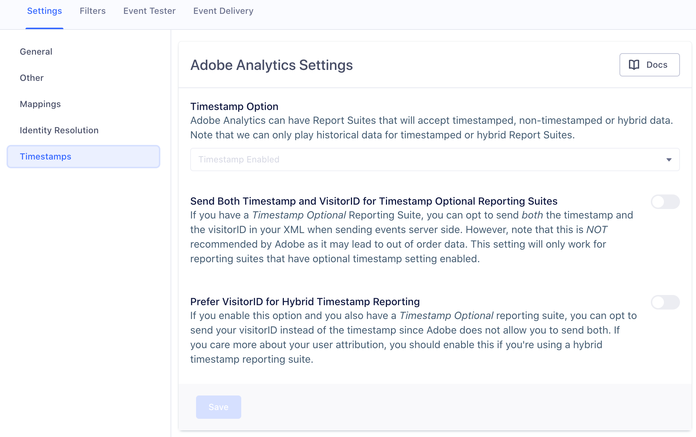

## Identity Resolution and Timestamps 
In this section we will cover how your destination settings for Identity Resolution and Timestamps impact how user session (ie. userId & visitorId) data are sent to Adobe Analytics. We suggest familiarizing yourself with the destination settings in app prior to continuing this section. The Identity Resolution settings refer to the **Marketing Cloud ID**, **Drop VisitorID**, and **No Fallbacks for VisitorID:Server-Side Only** destination settings. 

The Timestamp settings refer to the **Timestamp Option**, **Send Both Timestamp and VisitorID for Timestamp Optional Reporting Suites**, **Prefer VisitorID for Hybrid Timestamp Reporting**. 

### Analytics.js - Device Mode

<!-- L Comment: Some more introductory explanantion might be good here? "In device-mode, you bundle the Adobe Analytics SDK with Analytics.js so it is included on your site or app. When you do this, Analytics.js events are routed to the API endpoints for Adobe and send data both to the Segment servers, and to the Adobe systems."-->
<!-- 
B Comment: IMO that seems redundant to what is covered in index. These tabs are more tailored to specific information related to specific topics. I covered that info in the index. Maybe we can include a linkto? -->

You can enable **Drop Visitor ID** from the Segment app to prevent Adobe from creating a new user profile when you set `window.s.visitorID` with a custom value. However if you're only using Analytics.js to send data to Adobe, this can make it difficult to combine anonymous and identified users inside your reports.

Adobe Analytics counts every "effective" visitor ID as a *unique* visitor. Unfortunately, Segment cannot to alias two effective IDs on your behalf, either implicitly or explicitly.

To understand this, it's important to first understand what Adobe Analytics means by **"effective" visitor ID identifiers**. We recommend reading [the Adobe documentation on connecting users across devices](https://docs.adobe.com/content/help/en/analytics/implementation/js/xdevice-visid/xdevice-connecting.html).

Analytics.js automatically generates an Adobe Analytics [`s_vi` cookie value](https://docs.adobe.com/content/help/en/core-services/interface/ec-cookies/cookies-analytics.html) which it uses as a visitor ID until you `identify` your users. If you provide your Marketing Cloud ID Service Organization ID, then Segment sets the Experience Cloud ID and uses that instead.

Once you `identify` your user, Segment sets the `visitorId` variable to your `userId`. This effectively creates a new user, which *does* have unique user implications. However, based on a thorough reading of the Adobe documentation and discussion with many customers, we believe this is the best practice because it allows you to seamlessly track logged-in users across devices.

### Cloud Mode - Server Side

<!-- Same comment plus we should distinguish between if we mean using a source installed on a server, sending through Segment's cloud, or both. "When you use cloud-mode to connect to Adobe Analytics, your sources... and this results in...  which means you need to..."-->

There are several options for tracking your users on the server. If you only track logged-in users, you can send their `userId` in your events to ensures that the events are attributed to the correct user. If you're tracking anonymous users, Segment sends the `s_vi` cookie from Adobe if you pass it under `context['Adobe Analytics'].visitorId` as the `visitorId`. If you do not pass as `visitorID`, Segment uses the `userId` if present, or as a last resort uses the Segment `anonymousId`. The Segment `anonymousId` is different from the anonymous `s_vi` value that Adobe Analytics auto-generates and uses on the client as an anonymous ID.

This may be acceptable if your organization can handle slightly inflated user counts, because all events in that anonymous user's session can still be attributed to a single user ID. If you want to tie the anonymous event from the device with your server-side events, you could extract the `s_vi` cookie value from the client and pass it to your server. Segment retains any value passed in `context["Adobe Analytics"].visitorId` and passes that as the `visitorID` when provided. However if you use this method, you might need to manage the `s_vi` cookies for all of your users since you must always pass it with each server side call. You can only parse the `s_vi` cookie if you have **1st party cookie** enabled in you reporting suite.

Segment recommends that you accept the slightly inflated user count, and use the Segment `userId` as the `visitorId`. Yes, you'll have two user profiles if you have any anonymous client side events, but you can always set up custom `eVars` to connect the few anonymous events to the correct user.

If you're using the Experience Cloud ID, you should accept this and use the Segment `userId`, and include a `marketingCloudVisitotId` in `context["Adobe Analytics"].marketingCloudVisitorId`. Segment sends both the `userId` (or `anonymousId`, if the call is anonymous) in the `<visitorId>` tag and the Experience Cloud ID in the `<marketingCloudVisitorID>` tag, and Adobe resolves the users from there.

> note ""
> **Note**: If you use the destination-specific `integration` object to pass the `visitorId` in your Segment `page` or `track` events, then the `visitorId` persists on Page or Track calls that occur after an Identify call. You can use this to override the Segment setting the `visitorId` variable to your `userId` after an `identify` call.

We know this is daunting territory, so don't hesitate to [contact us directly for guidance](https://segment.com/help/contact/).

#### No Fallbacks for VisitorId Setting - Cloud Mode Only

Segment introduced a new **No Fallbacks for Visitor ID** setting to help with the transition from using the Adobe Analytics `visitorID` to using the Experience Cloud ID (ECID). This can also reduce inflated user counts<!-- how?-->. <!-- Probably also want to cover what sorts of visitorID we can use? (Segment userID and anonId, s_vi, visitorID, visitorID in the integrations object, ECID? do we have this in another doc we can copy/paste in?) why are timestamps involved here? and what does No Fallbacks do?-->

If you disable the **Drop Visitor ID** setting, Segment sends a `<visitorID>` in these three scenarios:
<!-- L Comment: does the customer have control over this setting about timestamps? if not, reword. I think we mean 'if the customer's call includes..' -->

<!-- B Comment: Yes this is fully customer controlled through settings see above timestamps image -->
- A customer isn't sending timestamps (meaning the Timestamp Option setting is set to disabled)
- A customer is using hybrid timestamp mode and is sending `visitorId`
- A customer is using hybrid timestamp mode and is sending `visitorId` and timestamp

**NOTE:** If one of these three scenarios is met and a customer does not send a `visitorId` in the integrations object, Segment falls back to setting the visitorId to either a Segment `userId` or `anonymousId`. This timestamp-dependent functionality of when Segment sends a visitorID does not change when you enable **No Fallbacks for Visitor ID**. The **No Fallbacks for Visitor ID** setting is an added feature on top of that.

The **No Fallbacks for Visitor ID** setting functionality behaves as such, if a customer is sending data in one of the three above scenarios, Segment checks if the setting is enabled and if they are sending a marketingCloudVisitorId in the integrations object. If they meet both of those criteria Segment removes the fallback behavior and sets `<visitorID>` to the value passed in the destination specific setting for `visitorId`. If that value is not passed, it leaves it blank.

This decision tree is a visual representation of how Segment's Adobe Analytics destination settings and payload data interact with Segment to determine when to send a `visitorId` to Adobe.

