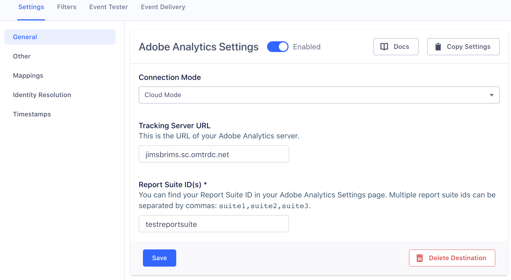
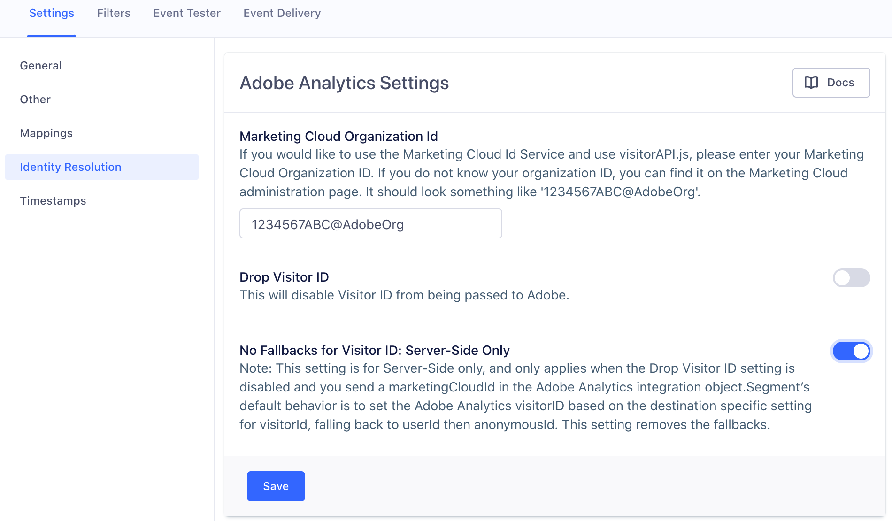

Once you enable Adobe Analytics (formerly known as Omniture or Sitecatalyst) in Segment, you can start sending data from any of the Segment [libraries](/docs/connections/sources/catalog/) to an Adobe report suite. When you send events from Segment's mobile SDKs or Cloud-mode libraries, Segment translates that data using a mapping that you configure, and then passes it to the Adobe Analytics [Data Insertion API](https://docs.adobe.com/content/help/en/analytics/import/c-data-insertion-api.html).

The following documentation provides detailed explanation of how both destination the Device-mode and Cloud-mode components work. For FAQs about Device- vs Cloud-mode tracking, unique users, identifiers, and more, see the Best Practices page!

<!-- TOC depthFrom:2 depthTo:2 withLinks:1 updateOnSave:1 orderedList:0 -->

- [Mapping Segment for Adobe Analytics](settings/)
- [Identity Resolution](identity/)
- [Adobe Analytics for Mobile](mobile/)
- [Adobe Analytics for Heartbeat](heartbeat/)
- [Adobe Analytics Best Practices](best-practices/)

<!-- /TOC -->

## Planning for Adobe Analytics

Adobe Analytics uses a slightly different approach to tracking than Segment, and it's important to understand the difference so you can effectively set up your account. Segment uses a user-action data model, which uses different types of calls to track different activities of a user on a website or app. Adobe Analytics uses page views as the basic unit of activity, and variables like custom traffic variables (also called 'props'), eVars, list variables, and hierarchy variables to add details that allow more nuanced analysis.

For example, a `Welcome Dialog Dismissed` event in Segment (where the action is "dismissed") with properties that contain the user ID (`user123`) and the dialog name `welcome-dialog`, could be modeled in Adobe Analytics as a pageView with variables that represent the dialog name, visitorID, and the event name mapping the user action ("dismissed") to an eVar.

Both Segment and Adobe Analytics have recommended standard data for tracking events. Segment has [the Spec](/docs/connections/spec/), and Adobe uses predefined events. Segment automatically maps incoming event data and some product level properties to Adobe's predefined events, when the event data is in the correct Segment Ecommerce Spec format. Video calls using the format described in this document are also automatically mapped. If you're using the Mobile SDKs, mobile lifecycle events are also automatically mapped. If you will be creating Page and Track events that are outside the scope of the Ecommerce spec, you'll need to map those to your Segment destinations settings UI.

We strongly recommend that you create a tracking plan for both your Segment and Adobe Analytics events before you send any events or properties to Adobe. This will help you map your Segment events to Adobe `events`, and Segment properties to Adobe variables. If you decide to set up Adobe Analytics for mobile, you'll have to do this mapping in both the Segment settings, and the Adobe Mobile Services dashboard - so it's good to keep your options open!


### Choosing between Device-mode and Cloud-mode

If you're using device-mode JavaScript, by default Segment "bundles" (mobile) or "wraps" (when using Analytics.js) the Adobe libraries. In this configuration, Segment sends Events directly from the client using the Adobe Analytics [`Appmeasurement.js` library](https://docs.adobe.com/content/help/en/analytics/implementation/js/overview.html). Adobe's client-side libraries can provide services to other Adobe suites and products, however they can also increase the size of your page.

If you prefer, you can enable [Cloud-mode](/docs/connections/destinations/#connection-modes), and send data through the Segment servers where it is then mapped and sent on to Adobe Analytics. By default, mobile and server sources will use Adobe Analytics in Cloud-mode. You can enable Cloud-mode for Javascript sources from the Adobe Analytics source settings in the Segment app.

Our Cloud-mode Adobe Analytics destination also provides support for **Adobe Mobile Services** "states", "actions", and lifecycle events, metrics, and dimensions.

*Note*: Segment only supports Adobe Heartbeat through device-mode implementations, using Segment's JavaScript source or mobile SDKs bundled.

### Connecting Segment to Adobe Analytics

To set up Adobe Analytics as a destination for your Segment data, Segment needs some information on how to connect to Adobe.

- If you're using Device-mode data collection with Analytics.js, or using a server-side library, you need your Adobe Report Suite ID, and your Tracking Server URL. You'll add this information in the Destination settings in the Segment app UI so that Segment can send information to Adobe. An example tracking server is `jimsbrims.sc.omtrdc.net`. You do not  need to include the hypertext transfer protocol (ie. `http://`). For more information on  how to identify your analytics tracking server and report suites see Adobe's [documentation here](https://docs.adobe.com/content/help/en/analytics-learn/tutorials/implementation/implementation-basics/how-to-identify-your-analytics-tracking-server-and-report-suites.html).



- If you're collecting data from mobile devices, you can download the `ADBMobileConfig.json` file instead of specifying these settings in the UI which contains that information. Follow the instructions in Adobe's documentation, [here for iOS](https://marketing.adobe.com/resources/help/en_US/mobile/ios/dev_qs.html), and [here for Android](https://marketing.adobe.com/resources/help/en_US/mobile/android/dev_qs.html).

Once you've done that, you can either use the default Ecommerce Spec and the mappings Segment provides, or write custom Page and Track events, and then configure how they map to your Adobe Analytics fields and settings. For more information on how to get started with implementation see the [Mapping Segment to Adobe Analytics](settings/) guide.

### When Will I See Data?

If you just enabled Adobe Analytics for an app already deployed with the Segment library, Adobe can require up to 24 hours to process and display new data. There is also a known [reporting delay](https://helpx.adobe.com/forums/update-forumname/page/en/index.html) on the Adobe side due to [processing times](https://forums.adobe.com/thread/2326058).

It can also take up to an hour for all of the mobile users' Segment settings caches to refresh. Once they refresh, the mobile devices learn about the new service and begin sending data to Adobe Analytics.

Adobe Analytics has a real-time reporting feature which displays web page traffic and ranks page views in real time. Configuring and enabling these reports are restricted to Adobe Admin users. To learn more see Adobe's [overview on Real-time reporting](https://docs.adobe.com/content/help/en/analytics/components/real-time-reporting/realtime.html)

---

## Device-mode - Analytics.js

Device-mode web data is sent using Analytics.js, with Analytics.js either serving as a wrapper/bundle around the Adobe Analytics code, or sending directly to Segment servers where the data is then sent on to the Adobe destination.

Our Adobe Analytics device-mode destination code is open sourced on GitHub. Feel free to check it out:
[iOS](https://github.com/segment-integrations/analytics-ios-integration-adobe-analytics),
[Android](https://github.com/segment-integrations/analytics-android-integration-adobe-analytics) and
[JS](https://github.com/segmentio/analytics.js-integrations/tree/master/integrations/adobe-analytics).

### Initialization

When you use Adobe Analytics with Analytics.js, Segment first checks to see if you have any global properties (such as `window.s_account`) or any properties on the `window.s` object, and uses them. However, if it doesn't find anything, it uses the **Report Suite ID**, **Tracking Server URL**, and **Tracking Server Secure URL** (optional) you defined in the destination settings in the Segment app.

Once these required properties are set, Segment loads `appmeasurement.js` version 2.20.0.

### Marketing Cloud Visitor ID Service

Segment's Analytics.js destination loads the Adobe `visitorAPI.js` library, but does not initialize it unless you provide your Marketing Cloud Organization ID. When you do, Segment sets `window.s.visitor` with the return value from `window.Visitor.getInstance(<Your Marketing Cloud Org Id>)`. See [the Adobe Marketing Cloud documentation](https://marketing.adobe.com/resources/help/en_US/mcvid/mcvid-setup-analytics.html) for more information.

**Note:** Segment loads `visitorAPI.js` in the same script as `appmeasurement.js` because Adobe Analytics requires synchronous execution of the two scripts. Using the visitor API is **optional** but if you do, Segment makes it available on the page.

To use Adobe's Marketing Cloud Visitor ID Service, enter your **Marketing Cloud Organization ID** in the **Identity Resolution** settings tab in the Segment app.



---

## Cloud-mode - Server-side

"Cloud-mode" data is data sent _without_ bundling the Segment-Adobe-Analytics SDK. It can be sent using mobile libraries, Analytics.js, and other server-based sources. Cloud mode data is sent to Adobe using Adobe's data insertion API in XML format. To learn more about Adobe's data insertion API see the [documentation here](https://docs.adobe.com/content/help/en/analytics/import/c-data-insertion-api.html).

*For more information on mobile native integrations using Segment's iOS and Android Adobe Analytics SDKs, see the [section "Setting up Adobe Analytics for Mobile"](mobile/).*

**Important**: For data sent from server-side libraries, you must define your events and custom properties BEFORE you send events to Adobe Analytics server-side destination. However, *for data sent from mobile devices*, Segment sends *every* event along automatically, and you can use the Adobe Analytics [processing rules](https://marketing.adobe.com/resources/help/en_US/reference/processing_rules.html) UI to map actions, lifecycle dimensions, and custom properties from `contextData` to events, props and eVars.

Segment's server-side integration is not open-source. Let's explore what happens when Segment generates the XML to send to Adobe:

1. If your **Timestamp Option** is **Timestamp Enabled** or **Timestamp Optional**, Segment sets the `<timestamp>`.

2. For `.track()` events, Segment sets `<channel>` as `properties.channel` or fallback to `properties.category`.
   If neither property is provided, the XML tag is not set.

   For `.page()` events, this XML tag is set as the `category` of the page call, which is sent by providing both `category` and `name` (ie. `.page('Some Category', 'Some Name');`)

3. For `.track()` events, Segment sets `<pageName>` as `properties.pageName`, `properties.page`, `context.page.title`, or `context.screen.name` (in order of precedence). If none of these fields are available and **Page Name Fallback to Screen** is enabled, Segment sets `properties.screen` to `<pageName>`.  Otherwise, Segment falls back to `'None'`.
   For `.page()` calls, Segment sets the tag as the `name`. This can be sent by providing the first parameter: `.page('Some Name');`

4. Since Adobe Analytics does not support sending timestamped hits a `<visitorID>`, if you have set your Report to **Timestamp Disabled**, Segment sets `<visitorID>` as these values in order of precedence:

   - `visitorId` passed manually from the client. Adobe Analytics sets a cookie with their own `visitorId` on the client. You can read from this cookie and pass it to your servers manually and then send it to Segment. This is generally unnecessary, but may be worth considering if you're concerned about unique user identification.

      (In Node.js)
   ```javascript
   analytics.track({
      userId: '019mr8mf4r',
      event: 'Gotta catch em all',
      properties: {
        caught: 1738
      },
      integrations: {
        'Adobe Analytics': {
          visitorId: '12345'
        }
      }
   });
   ```

 - `userId`
 - `anonymousId`

5. Segment map a number of other supported XML tags. For example, it sets `<ipAddress>` with the `ip` of the call.

   **Note**: For server side libraries, the `ip` is by default be the `ip` address of your company servers, NOT the customers' own. This means that for server side events, it is best practice to record the customer's `ip` from their requests, and manually send that to Segment as `context.ip`.

   Segment also set your `context.locale` (which is automatically collected if using a mobile library) to `<language>`. Since mobile libraries also send your `traits` from previous `.identify()` calls inside the `context.traits`, Segment tries to send `<state>` and `<zip>` by looking up `context.traits.address.state` and `context.traits.postalCode` respectively, as noted in the [Identify spec](/docs/connections/spec/identify/). If these lookups fail, Segment uses the default `properties.state` and `properties.zip`.

   For mobile libraries, since Segment can detect whether the event occurred while the user had a wifi connection, it also sends the `<connectionType>` as `lan/wifi`. All other events are treated as `Mobile Carrier` inside Adobe's Mobile Web Reports.

   Segment also calculates the timezone offset from UTC/GMT as required by Adobe, and sends a `<timezone>` based on your `context.timezone` and the `timestamp` fields.

   Since many out of the box reports from Mobile Web services rely on the `<userAgent>` tag, Segment also maps this to your `context.userAgent`.

   **Important**: The Android library can collect the `userAgent` automatically - however, the iOS library cannot do so. However, since Segment does collect other contextual metadata about a device, it can render a valid iOS userAgent string to populate your Mobile Web Reports.

6. If you are using the Marketing Cloud ID Service, you can pass the **Marketing Cloud Visitor ID** as a destination specific setting and which Segment sets as `<marketingCloudVisitorID>`.

 (In Node.js)
 ```javascript
 analytics.track({
    userId: '019mr8mf4r',
    event: 'Gotta catch em all',
    properties: {
     caught: 1738
    },
    integrations: {
      'Adobe Analytics': {
        marketingCloudVisitorId: '12345'
      }
    }
 });
 ```

7. For `.track()` events only, set some custom link report parameters such as:

  - `<linkType>` to `'o'` (stands for `'Other'`)
  - `<linkURL>` to `context.page.url` with a default fallback to `'No linkURL provided'`
  - `<linkName>` to `'Link Name - <whatever was set as the linkURL>'`

8. On the server, Segment sends *all* property values as `contextData.$propertyKey` by default, so you can further map them with Adobe Processing Rules. You can also choose to add a prefix for properties in the destination's advanced settings page. Properties with a prefix are sent as `contextData.<prefix>.$propertyKey`.

9. Segment automatically translates [native mobile spec](/docs/connections/spec/native-mobile-spec/) events and forwards them to Adobe Analytics as [Mobile Services Lifecycle Metrics](https://marketing.adobe.com/resources/help/en_US/mobile/ios/metrics.html).

Specifically, Segment maps the following events:

<table>
  <tr>
    <td>Segment Event Name</td>
    <td>Adobe Analytics Event Name</td>
  </tr>
  <tr>
    <td>Application Opened</td>
    <td>`a.LaunchEvent`</td>
  </tr>
  <tr>
    <td>Application Installed</td>
    <td>`a.InstallEvent`</td>
  </tr>
  <tr>
    <td>Application Updated</td>
    <td>`a.UpgradeEvent`</td>
  </tr>
</table>

The following metrics and dimensions are supported:

- `a.AppID`
- `a.HourOfDay`
- `a.DayOfWeek`
- `a.OSVersion`
- `a.DeviceName`
- `a.CarrierName`

10. Set `<userAgent>` with `context.userAgent` (which is automatically populated by the Segment libraries). Note this is omitted for mobile events and superseded by `DeviceName` and `OSVersion`.

11. For any ecommerce events, Segment tries to set `<products>` if possible. The product description has the same logic as the ecommerce event processing done on the client side destination.

13. Segment follows the same logic as the client side: it looks up any mappings for custom properties and generates the correct `<eVar>`, `<prop>`, and `<hVar>` XML tags.

14. Finally, Segment sends the event `POST` request to your **Tracking Server URL**!
