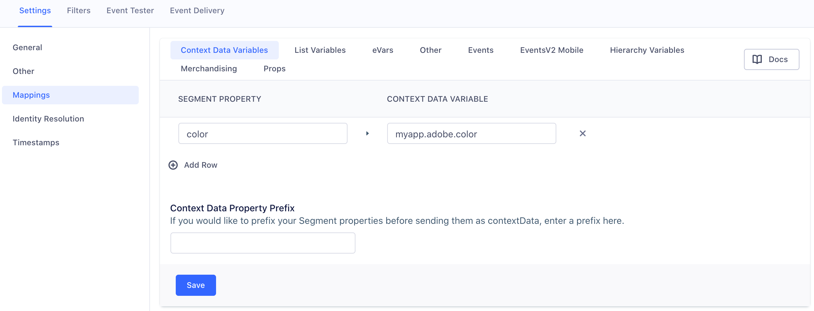

<!-- LR note: Setting rewrite true to remove bad boilerplate, manually including the footer partial-->

Once you enable Adobe Analytics (formerly known as Omniture/Sitecatalyst) in Segment, you can start sending data from any of our [libraries](/docs/connections/sources/) to an Adobe report suite. When you send events from our mobile SDKs or Cloud-mode libraries, Segment translates that data using a mapping that you configure, and then passes it to the Adobe Analytics `Data Insertion API`.

The following documentation provides detailed explanation of how both destination the Device-mode and Cloud-mode components work. For FAQs about Device- vs Cloud-mode tracking, unique users, identifiers, and more, read the Best Practices at the bottom of this page!

<!-- TOC depthFrom:2 depthTo:2 withLinks:1 updateOnSave:1 orderedList:0 -->

- [Planning for Adobe Analytics](#planning-for-adobe-analytics)
- [Device-mode - Analytics.js](#device-mode-analytics-js)
- [Cloud-mode - aka Server-side](#cloud-mode-aka-server-side)
- [Implementing Segment for Adobe Analytics](#implementing-segment-for-adobe-analytics)
- [Adobe Analytics List Variables - lVars](#adobe-analytics-list-variables-lvars)
- [Adobe Analytics Properties - props](#adobe-analytics-properties-props)
- [Settings](#settings)
- [Setting up Adobe Analytics for Mobile](#setting-up-adobe-analytics-for-mobile)
- [Setting up Adobe Heartbeat](#setting-up-adobe-heartbeat)
- [Best Practices](#best-practices)

<!-- /TOC -->

## Planning for Adobe Analytics
Adobe Analytics uses a slightly different approach to tracking than Segment, and it's important to understand the difference so you can effectively set up your account. Segment uses a user-action data model, in which we use different types of calls to track different activities of a user on a website or app. Adobe Analytics uses page views as the basic unit of activity, and variables like "props", eVars, lVars, and hVars to add details that allow more nuanced analysis.

For example, a `Welcome Dialog Dismissed` event in Segment (where the action is "dismissed") with properties that contain the user ID (`user123`) and the dialog name `welcome-dialog`, could be modeled in Adobe Analytics as a pageView with variables for the dialog name, visitorID, and with the event name mapping the user action ("dismissed") to a variable.

Both Segment and Adobe Analytics have recommended standard formats for tracking events. Segment has [the Spec](/docs/connections/spec/), and Adobe uses [predefined events](https://marketing.adobe.com/resources/help/en_US/sc/implement/event_predefined.html). Segment automatically maps incoming data that's in the Ecommerce Spec format to Adobe's predefined events, and can also map data in the Ecommerce Spec format to some of Adobe's product level properties. Video calls using the format described in this document are also automatically mapped. If you're using the Mobile SDKs, mobile lifecycle events are also automatically mapped. If you will be creating Page and Track events that are outside the scope of the Ecommerce spec, you'll need to map those to your Adobe events.

We strongly recommend that you create a tracking plan for both your Segment and Adobe Analytics events before you send any events or properties to Adobe. This will help you map your Segment events to Adobe `events`, and Segment properties to Adobe variables. If you decide to set up Adobe Analytics for mobile, you'll have to do this mapping in both the Segment settings, and the Adobe Mobile Services dashboard - so it's good to keep your options open!


### Choosing between Device-mode and Cloud-mode
If you're using device-mode javascript, by default Segment "bundles" (mobile) or "wraps" (when using Analytics.js) the Adobe libraries. In this configuration, Segment sends Events directly from the client using the Adobe Analytics `Appmeasurement.js` library. Adobe's client-side libraries can provide services to other Adobe suites and products, however they can also increase the size of your page.

If you prefer, you can enable [Cloud-mode](/docs/connections/destinations/#connection-modes), and send data through the Segment servers where it is then mapped and sent on to Adobe Analytics. You enable Cloud-mode for Javascript or Legacy sources from the Adobe Analytics source settings in the Segment app.

Our Cloud-mode Adobe Analytics destination also provides support for **Adobe Mobile Services** "states", "actions", and lifecycle events, metrics, and dimensions.

### Connecting Segment to Adobe Analytics
To set up Adobe Analytics as a destination for your Segment data, Segment needs some information on how to connect to Adobe.

- If you're using Device-mode data collection with Analytics.js, or using a server-side library, you need your Adobe Report Suite ID, and your Tracking Server URL. You'll add this information in the Destination settings in the Segment app UI so that Segment can send information to Adobe.

- If you're collecting data from mobile devices, you can download the `ADBMobileConfig.json` file instead of specifying these settings in the UI which contains that information. Follow the instructions in Adobe's documentation, [here for iOS](https://marketing.adobe.com/resources/help/en_US/mobile/ios/dev_qs.html), and [here for Android](https://marketing.adobe.com/resources/help/en_US/mobile/android/dev_qs.html).

Once you've done that, you can either use the default Ecommerce Spec and the mappings Segment provides, or write custom Page and Track events, and then configure how they map to your Adobe Analytics fields and settings.

### When Will I See Data?

If you just enabled Adobe Analytics for an app already deployed with the Segment library, Adobe can require up to 24 hours to process and display new data. There is also a known [reporting delay](https://helpx.adobe.com/forums/update-forumname/page/en/index.html) on the Adobe side due to [processing times](https://forums.adobe.com/thread/2326058).

It can also take up to an hour for all of the mobile users' Segment settings caches to refresh. Once they refresh, the mobile devices learn about the new service and begin sending data to Adobe Analytics.

---

## Device-mode - Analytics.js

Device-mode web data is sent using Analytics.js, with Analytics.js either serving as a wrapper/bundle around the Adobe Analytics code, or sending directly to Segment servers where the data is then sent on to the Adobe destination.

### Initialization

When you use Adobe Analytics with Analytics.js, we first check to see if you have any global properties (such as `window.s_account`) or any properties on the `window.s` object, and use them. However, if we don't find anything, we use the **Report Suite ID**, **Tracking Server URL**, and **Tracking Server Secure URL** (optional) you defined in the destination settings from the Segment app.

Once these required properties are set, we load `appmeasurement.js` version 1.6.

### Marketing Cloud Visitor ID Service

Our Analytics.js destination loads the Adobe `visitorAPI.js` library, but does not initialize it unless you provide your Marketing Cloud Organization ID. When you do, we set `window.s.visitor` with the return value from `window.Visitor.getInstance(<Your Marketing Cloud Org Id>)`. See [the Adobe Marketing Cloud documentation](https://marketing.adobe.com/resources/help/en_US/mcvid/mcvid-setup-analytics.html) for more information.

**Note:** We load `visitorAPI.js` in the same script as `appmeasurement.js` because Adobe Analytics requires synchronous execution of the two scripts. Using the visitor API is **optional** but if you do, we make it available on the page.

To use Adobe's Marketing Cloud Visitor ID Service, enter your **Marketing Cloud Organization ID** in the **Advanced Options** in the Segment app.

## Cloud-mode - aka Server-side

"Cloud-mode" data is data sent _without_ bundling the Segment-Adobe-Analytics SDK. It can be sent using mobile libraries, Analytics.js, and other server-based sources.

*For more information on mobile native integrations using Segment's iOS and Android Adobe Analytics SDKs, see the [next section in this doc](#setting-up-adobe-analytics-for-mobile).*

**Important**: For data sent from server-side libraries, you need to predefine your events and custom properties to send events to Adobe Analytics server-side destination. However, *for data sent from mobile devices*, we send *every* event along automatically, and you can use the Adobe Analytics [processing rules](https://marketing.adobe.com/resources/help/en_US/reference/processing_rules.html) UI to map actions, lifecycle dimensions, and custom properties from `contextData` to events, props and eVars.

When we generate the XML to send to Adobe, there are a few things that happen:

1. If your **Timestamp Option** is **Timestamp Enabled** or **Timestamp Optional**, we set the `<timestamp>`.

2. For `.track()` events, we set `<channel>` as `properties.channel` or fallback to `properties.category`.
   If neither property is provided, we don't set this XML tag.

   For `.page()` events, this XML tag is set as the `category` of the page call, which is sent by providing both `category` and `name` (ie. `.page('Some Category', 'Some Name');`)

3. For `.track()` events, we set `<pageName>` as `properties.pageName`, `properties.page`, `context.page.title`, `context.screen.name` or `'None'` (in order of precedence).
   For `.page()` calls, we set the tag as the `name`. This can be sent by providing the first parameter: `.page('Some Name');`

4. Since Adobe Analytics does not [support sending timestamped hits a `<visitorID>`](https://marketing.adobe.com/resources/help/en_US/sc/implement/timestamps-overview.html), if you have set your Report to **Timestamp Disabled**, we set `<visitorID>` as these values in order of precedence:

   - `visitorId` passed manually from the client. Adobe Analytics sets a cookie with their own `visitorId` on the client. You can read from this cookie and pass it to your servers manually and then send it to Segment. This is generally unnecessary, but may be worth considering if you're concerned about unique user identification.

      (In Node.js)
   ```javascript
   analytics.track({
      userId: '019mr8mf4r',
      event: 'Gotta catch em all',
      properties: {
        caught: 1738
      },
      integrations: {
        'Adobe Analytics': {
          visitorId: '12345'
        }
      }
   });
   ```

 - `userId`
 - `anonymousId`

5. We map a number of other supported XML tags. For example, we set `<ipAddress>` with the `ip` of the call.

 **Note**: For server side libraries, the `ip` is by default be the `ip` address of your company servers, NOT the customers' own. This means that for server side events, it is best practice to record the customer's `ip` from their requests, and manually send that to Segment as `context.ip`.

 We also set your `context.locale` (which is automatically collected if using a mobile library) to `<language>`. Since mobile libraries also send your `traits` from previous `.identify()` calls inside the `context.traits`, we try to send `<state>` and `<zip>` by looking up `context.traits.address.state` and `context.traits.postalCode` respectively, as noted in our [identify spec](/docs/connections/spec/identify). If these lookups fail, we default to `properties.state` and `properties.zip`.

 For mobile libraries, since we can detect whether the event occurred while the user had a wifi connection, we also send the `<connectionType>` as `lan/wifi`. All other events are treated as `Mobile Carrier` inside Adobe's Mobile Web Reports.

 We also calculate your timezone offset from UTC/GMT as required by Adobe, and send `<timezone>` based on your `context.timezone` and the `timestamp` fields.

 Since many out of the box reports from Mobile Web services rely on the `<userAgent>` tag, we also map this to your `context.userAgent`.

 **Important**: The Android library can collect the `userAgent` automatically - however, the iOS library cannot do so. However, since we do collect other contextual metadata about your device, we render a valid iOS userAgent string that populates all your Mobile Web Reports.

6. If you are using the [Marketing Cloud ID Service](https://marketing.adobe.com/resources/help/en_US/mcvid/mcvid_overview.html), you can pass the **Marketing Cloud Visitor ID** as an destination specific setting and we set that as `<marketingCloudVisitorID>`.

 (In Node.js)
 ```javascript
 analytics.track({
    userId: '019mr8mf4r',
    event: 'Gotta catch em all',
    properties: {
     caught: 1738
    },
    integrations: {
      'Adobe Analytics': {
        marketingCloudVisitorId: '12345'
      }
    }
 });
 ```

7. For `.track()` events only, set some custom link report parameters such as:

  - `<linkType>` to `'o'` (stands for `'Other'`)
  - `<linkURL>` to `context.page.url` with a default fallback to `'No linkURL provided'`
  - `<linkName>` to `'Link Name - <whatever was set as the linkURL>'`

8. On the server, we send *all* property values as `contextData.$propertyKey` by default, so you can further map them with Adobe Processing Rules. You can also choose to add a prefix for properties in the destination's advanced settings page. Properties with a prefix are sent as `contextData.<prefix>.$propertyKey`.

9. For Segment [native mobile spec]() events, we automatically translate them and forward them to Adobe Analytics as [Mobile Services Lifecycle Metrics](https://marketing.adobe.com/resources/help/en_US/mobile/ios/metrics.html).

Specifically, we map the following events:

<table>
  <tr>
    <td>Segment Event Name</td>
    <td>Adobe Analytics Event Name</td>
  </tr>
  <tr>
    <td>Application Opened</td>
    <td>`a.LaunchEvent`</td>
  </tr>
  <tr>
    <td>Application Installed</td>
    <td>`a.InstallEvent`</td>
  </tr>
  <tr>
    <td>Application Updated</td>
    <td>`a.UpgradeEvent`</td>
  </tr>
</table>

The following metrics and dimensions are supported:

- `a.AppID`
- `a.HourOfDay`
- `a.DayOfWeek`
- `a.OSVersion`
- `a.DeviceName`
- `a.CarrierName`

Support for additional "stateful" lifecycle dimensions is coming in a future Adobe Analytics release. If there are any missing that are of importance to you, let us know and we'll get them shipped!

10. Set `<userAgent>` with `context.userAgent` (which is automatically populated by our libraries). Note this is omitted for mobile events and superseded by `DeviceName` and `OSVersion`.

11. For any ecommerce events, we try to set `<products>` if possible. The product description has the same logic as the ecommerce event processing done on the client side destination.

13. We follow the same logic as the client side, and look up any mappings for custom properties and generate the proper `<eVar>`, `<prop>`, and `<hVar>` XML tags.

14. Finally, we send the event `POST` request to your **Tracking Server URL**!


## Implementing Segment for Adobe Analytics

This section contains information about how to implement Segment calls for Adobe Analytics. You can choose to use the [automatic Ecommerce Spec mapping](#using-default-ecommerce-spec-events) so you don't have to set up a mapping in Segment and Adobe. If you need more event types or different ones, you can implement custom [Page calls](#creating-page-calls) and [Track events](#creating-track-events) to add to the standard Ecommerce spec. <!-- TODO: You can also override or opt-out of automatically mapping the Ecommerce events by passing `integration: AA: false` as part of your call.-->

### Using default Ecommerce Spec Events

The Adobe Analytics destination automatically works with our standard [Ecommerce API](/docs/connections/spec/ecommerce/v2/), and automatically maps the follwing events between Segment and Adobe Analytics.

<table>
  <tr>
    <td>Segment Event Name</td>
    <td>Adobe Analytics Event Name</td>
  </tr>
  <tr>
    <td>Product Viewed
    <br>Product List Viewed
    </td>
    <td>`prodView`</td>
  </tr>
  <tr>
    <td>Product Added</td>
    <td>`scAdd`</td>
  </tr>
  <tr>
    <td>Product Removed</td>
    <td>`scRemove`</td>
  </tr>
  <tr>
    <td>Cart Viewed</td>
    <td>`scView`</td>
  </tr>
  <tr>
    <td>Checkout Started</td>
    <td>`scCheckout`</td>
  </tr>
  <tr>
    <td>Order Completed</td>
    <td>`purchase`</td>
  <tr>
    <td>Cart Opened</td>
    <td>`scOpen`</td>
  </tr>
  </tr>
</table>

Segment sends the Ecommerce event data like a standard `track` event. If you implement Segment events using the Ecommerce spec and naming conventions, you do **NOT** need create a mapping in your Segment settings. These Ecommerce events are automatically mapped and sent to Adobe Analytics along with product description data. You don't need to map **event names** unless you want to set them as the value of an `eVar`.

Ecommerce properties such as `orderId` and `products` are also sent automatically. However, if you use other custom properties and want to send them to Adobe's `eVar`, `prop`, `hVar`, or `lVar` variables, you *do* need to map them as properties in your Segment settings.

### Example using Segment Ecommerce spec

Given the sample `Order Completed` Segment event below:

```js
analytics.track('Order Completed', {
 orderId: '50314b8e9bcf000000000000',
 total: 30.00,
 revenue: 25.00,
 shipping: 3.00,
 tax: 2.00,
 discount: 2.50,
 coupon: 'hasbros',
 currency: 'USD',
 products: [
   {
     id: '507f1f77bcf86cd799439011',
     sku: '45790-32',
     name: 'Monopoly: 3rd Edition',
     price: 19,
     quantity: 1,
     category: 'Games'
   },
   {
     id: '505bd76785ebb509fc183733',
     sku: '46493-32',
     name: 'Go Pro',
     price: 99,
     quantity: 2,
     category: 'Electronics'
   }
 ]
});
```
Segment does the follwing:

1. Sets `window.s.products` with the product description string.

   The product description is a semi-colon delimited string per product which is additionally delimited by commas if you have multiple products. The string format per product is `[category];[name];[quantity];[total]`. Total is calculated by multiplying price and quantity for each product.

   **Note**: You can choose whether to map the `name`, `sku`, or `id` for each item in the `products` array. So you could alternatively send product descriptions with `[category];[sku];[quantity];[total]`. To configure this option, go to your Adobe Analytics settings in Segment, locate the Advanced Options, and select the mapping from the **Product Identifier**. The `name` is the default identifier.

   For the example above, we would set `window.s.products` to `'Games;Monopoly: 3rd Edition;1;19,Electronics;Go Pro;2;99'`.

   The default fallback value for `quantity` is `1`, and for `price` it is `0`.

   **Important**: You should't use this option if any items in the `products` array have property values that include commas or semi-colons. Adobe Analytics uses these characters as delimiters.

2. Updates common variables such as `channel`, `campaign`, `state`, `zip`, and `pageName`. These values are set if they exist at the property level, your existing Adobe Analytics variables already attached on the `window.s` object, or `context.page.title` (for `pageName`).

3. Sets `window.s.events` with the corresponding Adobe Analytics naming convention. The example above wouild set this as `'purchase'`.

4. Checks if the event name is mapped as an `eVar` and if so, set it on the `window.s`.

5. Checks if any other top level properties (not the custom properties at the item level inside `products` array) have been mapped to a custom variable in the Segment settings such as `eVar`, `prop`, and `hVar`. If so, set them on the `window.s`.

6. Sets `window.s.purchaseID` and `window.s.transactionID` as the `orderId`, which for the example above would be `'50314b8e9bcf000000000000'`.
   Note that this is only for `Order Completed` events.

   The default `currencyCode` we set upon pageload is `USD`. However, we check if you have passed any currency other than this in your event by checking `properties.currency`.

   **Important**: To collect `transactionID`, make sure to enable the transactionID storage setting inside your [Reporting Suite](https://marketing.adobe.com/resources/help/en_US/sc/implement/transactionID.html)!

7. Attaches the `timestamp` as `window.s.timestamp` if your **Timestamp Option** is **Timestamp Enabled** or **Timestamp Optional**.

8. Sets `window.s.linkTrackEvents` to the Adobe Analyics event name, which would be `purchase` for the example above.

9. Sets `window.s.linkTrackVars` which is a string of keys we want Adobe Analytics to read from the `window.s` object when the request is sent. For the example above, the value of `linkTrackVars` would be set as `'pageName,events,products,purchaseID,transactionID,timestamp'`.

10. Finally, fires off the event via `window.s.tl(true, 'o', 'Order Completed');`.

### Creating Page calls

By default, the Segment snippet includes an empty `page` call. Page calls are more similar to the native Adobe tracking methodology, and don't require as extensive a mapping process.

When you make a `page` call, here's what Segment does:

1. Sets the Adobe property `window.s.pageName` to the `name` of the page call.
   By default, a Segment `.page()` call sets this property as `undefined` since no parameters are passed, but if you include a `name` such as `.page('Home')`, Segment sets `window.s.pageName` to `'Home'`.

   **Note**: If you don't pass a `name`, Adobe Analytics uses the `url` as the page name by default.

2. Sets the Adobe property `window.s.events` to the `name` from your `.page(<name>)` call.

3. Checks if the page call is associated with a `userId` from a previous `.identify()` call. If so, we set the `userId` as `window.s.visitorID`.

  **IMPORTANT**: Adobe Analytics [does not support setting visitorID](https://marketing.adobe.com/resources/help/en_US/sc/implement/timestamps-overview.html) if you are sending a timestamped call. So Segment first checks if your **Timestamp Option** is `disabled` _and_ that a `userId` exists on the event, and only then sets `window.s.visitorID`.

4. Checks for some common properties, and sets them on the `window.s` object:

   - `channel`
   - `campaign`
   - `state`
   - `zip`

   We first use the `properties` you sent using the `.page()` call. An example page call in order to set the four properties above would be:

   ```js
   analytics.page({
     channel: 'Laptops',
     campaign: '0813',
     state: 'RI',
     zip: '02818'
   });
   ```

   For `campaign`, we use the [Segment spec](/docs/connections/spec/common) and check `context.campaign.name` first before checking `properties.campaign`.

   Alternatively, if you already set any of these properties on your existing Adobe Analytics instance on the page (`window.s.channel`, `window.s.campaign`, etc.), we use that as the default value. This way you can easily set a default values for all your web pages, but can still programmatically change them for each page if needed.

5. If your **Timestamp Option** is either **Timestamp Enabled** or **Timestamp Optional**, we attach the `timestamp` to `window.s.timestamp`.
   Make sure this setting matches your *actual* timestamp setting inside Adobe Analytics for the same Report Suite ID.

6. Checks if any of the page call's properties are mapped to any custom Adobe Analytics variables such as `eVar`, `props`, and `hVar`.

   Given the mapping setting below:

   

   If you make the following page call:

   ```js
   analytics.page({
     browser: 'chrome',
     searchTerm: 'swim shorts',
     section: 'swimwear'
   });
   ```

   We set the following properties on the `window.s` object:

   - `window.s.prop1 = 'chrome'`
   - `window.s.eVar7 = 'swim shorts'`
   - `window.s.eVar3` is set to the `url` of the page where the call was made (`.page()` automatically sets a `url` property)
   - `window.s.hier1 = 'swimwear'`

7. Finally, Segment flushes the pageview request to Adobe Analytics using `window.s.t()`.

### Creating Custom Track events

Before you send Events from Segment to Adobe Analytics, you must first list which `events` to collect so you can set up a mapping. This list of `.track()` events must be defined in both Adobe Analytics, and the Segment destination settings UI, including the properties to send as custom variables.

This means that you **must** create a mapping for each event and property to a corresponding Adobe Analytics `event`, `prop`, or `eVar`.

The image below shows an example of how you might map variables in Segment:


Using the sample settings in the image above, if you make the `.track()` call example below:

```js
analytics.track('Watched Video', {
  plan: 'free',
  videoName: 'The Uptick'
});
```

Here's what happens:

1. First Segment checks if the event name, `'Watched Video'`, is mapped in your Segment settings for Adobe Analytics.
   If you haven't configured a mapping for this event name, Segment does nothing and aborts the call.
   If a mapping is configured, we set `window.s.linkTrackEvents` and `window.s.events` to the corresponding Adobe Analytics event name as specified in the mapping, in this example `'event1'`.

2. Next, if the setting for  **Timestamp Option** is either **Timestamp Enabled** or **Timestamp Optional**, Segment maps the `timestamp` to `window.s.timestamp`.

3. If any properties were included in the event's mapping or on the `window.s` object, we update common variables such as `channel`, `campaign`, `state`, `zip` with the track call values.

4. Next, we check if the Segment event name, `Watched Video` is mapped to an `eVar`. Since it is in the example case above, we set `window.s.eVar3` as `'Watched Video'`.

5. We check if any other properties are mapped to either a `prop`, `eVar`, or `hVar`. For the example above, we'd set `window.s.prop1` as `'free'` and `window.s.eVar4` as `'The Uptick'`.

6. Next, we try to set `window.s.pageName` to one of the following values, in order of precedence:

  - `properties.pageName` (for backward compatibility)
  - `options.pageName` (if you already have `window.s.pageName` defined on the web page)
  - `context.page.title` (which is automatically tracked by our Analytics.js library, and always has a value)
   If you don't configure any other `pageName` mappings, `window.s.pageName` is set to the value of the `<title>` tag in the page where the `.track()` call was fired.

7. Next, we create a comma-delimited joined string of variable keys to send as  `window.s.linkTrackVars`. This tells Adobe Analytics which properties on the `window.s` object to send with this event.
   In the example above, the a string would be `'eVar3,events,pageName,timestamp,eVar3,prop1'`.

8. Finally, we flush the request to Adobe Analytics via `window.s.tl(true, 'o', 'Watched Video')`

  *Note*: `true` sets a `500ms` delay to give your browser time to flush the event. It also signifies to Adobe that this event is something other than a `href` link. The `'o'` stands for `'Other'`, as opposed to `'d'` for `'Downloads'` and `'e'` for `'Exit Links'`. The final parameter is the link name as it appears in reports inside Adobe Analytics.


## Adobe Analytics List Variables - lVars

You can map your Segment properties in your settings to any of your three list variables.

You can either send the property value as a comma delimited string (ie. `'brady,edelman,blount'`) or as an array (`['brady', 'edelman', 'blount']`). If you choose to send them as an array, Segment defaults joins it as a comma delimited string before sending it to Adobe. To set up a custom delimiter, see the [documentation section on custom delimiters](https://segment.com/docs/connections/destinations/catalog/adobe-analytics/#custom-delimiter).

## Adobe Analytics Properties - props

You can map your Segment properties in your settings to any of your Adobe props.

You can either send the property value as a string (ie. `'brady'`) or as an array (`['brady', 'edelman', 'blount']`). If you choose to send them as an array, Segment defaults to join it so that it is a pipe (`|`) delimited string before sending to Adobe (ie. `'brady|edelman|blount'`). If you would like to set up a custom delimiter please see our documentation [here](https://segment.com/docs/connections/destinations/catalog/adobe-analytics/#custom-delimiter) for configuring custom delimiters.

## Options

The Adobe Analytics destination offers a couple of different ways to configure behavior using destination specific options. These are options that are defined in your event payloads rather than in the Segment app. To use these options, you must define them as values of an object in the following property of your Segment event payloads:

```javascript
integrations: {
  'Adobe Analytics': {
    // insert options here...
  }
}
```
Here's an example of a `track` call using this:

```javascript
 analytics.track({
    userId: '019mr8mf4r',
    event: 'Gotta catch em all',
    properties: {
     caught: 1738
    },
    integrations: {
      'Adobe Analytics': {
        // Insert custom options here...
      }
    }
 });
 ```

The section below outlines each of these options and what they do.

### Events
This option allows you to associate specific Adobe events with individual Segment events.

```javascript
 analytics.track({
    userId: '019mr8mf4r',
    event: 'Gotta catch em all',
    properties: {
     caught: 1738
    },
    integrations: {
      'Adobe Analytics': {
        events: ['scAdd', 'event2']
      }
    }
 });
 ```

### IMS Region
This option allows you to associate events with IMS Regions. **Please note. If you specify this you must also define a `Marketing Cloud Visitor Id`.**

```javascript
 analytics.track({
    userId: '019mr8mf4r',
    event: 'Gotta catch em all',
    properties: {
     caught: 1738
    },
    integrations: {
      'Adobe Analytics': {
        imsregion: 'aamlh'
      }
    }
 });
 ```

### Marketing Cloud Visitor ID
This option allows you to associate a specific Marketing Cloud Visitor ID (mcvid) with the event.

```javascript
 analytics.track({
    userId: '019mr8mf4r',
    event: 'Gotta catch em all',
    properties: {
     caught: 1738
    },
    integrations: {
      'Adobe Analytics': {
        marketingCloudVisitorId: 'user1234'
      }
    }
 });
 ```

### Visitor ID
This option allows you to associate a standard Visitor ID with the event.

```javascript
 analytics.track({
    userId: '019mr8mf4r',
    event: 'Gotta catch em all',
    properties: {
     caught: 1738
    },
    integrations: {
      'Adobe Analytics': {
        visitorId: 'user1234'
      }
    }
 });
 ```

 ## Link Names, Link URLs, Link Types
 Please see [this](#setting-custom-linktypes-linknames-and-linkurls) section for information about configuring these as options.

## Settings

### Merchandising Events

The Merchandising Events settings allow you to set eVars and events on a per-product basis within the "products" string, and support increment and currency events. This provides robust product string support, which you can read more about [here](https://marketing.adobe.com/resources/help/en_US/sc/implement/products.html).

The setting operates as follows:

- Keys off of the Segment `track` call event name, or for `page` support, a `property.eventName`
- Maps to the Adobe event to send in as an increment or currency event.
- Reads if the event is scoped to the product or event level.
- [optional] Sets a value on the event. This value is the increment or currency to pass to Adobe. If you don't include a value, Segment sends the event without one, and Adobe understands this as an increment of 1. If you configure a value and the value is not present on the `track` or `page` call, we do not send the event to Adobe.
- Map of product eVars to set on the products string. This is only supported at the product level, as expected by Adobe Analytics.

Let's take the following example:


The configuration in the example image above configures a `Product Added` Segment event which sends Adobe Analytics:
- `event1` in `s.events` with the value passed from `properties.increment`.
- `event2` on `s.products` with the value passed from `properties.products.price`.
- the value for `properties.products.priceStatus` in `eVar1`
- the value for `properties.products.coupon` in `eVar2`


_Considerations_:
- We also pass in `event2` without a value on `s.events`, as this is a requirement for Adobe.
- We still map to Adobe's predefined `scAdd` event.
- we use dot notation for product values, for example `products.priceStatus` parses through properties for this value.
  - This includes the product string, so if you want a value nested in products, you would configure `products.priceStatus`.

Once you have the above example mapping configured, you send in the relevant event to Segment.

For example, in a Node.js environment we sent:

```javascript
analytics.track({
    userId: '098094356890',
    event: 'Product Added',
    properties: {
      cart_id: '124efsdovnt4edvsldfpf',
      product_id: '342039402fsl12njfs',
      sku: 'G-32',
      priceStatus:'promo',
      increment: i,
      category: 'Games',
      name: 'The Settlers of Catan',
      brand: 'Kosmos',
      variant: 'Cities and Knights',
      price: 34.99,
      quantity: 1,
      coupon: 'MAYDEALS',
      position: 2,
      url: 'https://www.example.com/product/path',
      image_url: 'https://www.example.com/product/path.jpg'
    }
  });
  ```

The `s.events` call passes in `scAdd` and `event1= 20`, and `s.products` passes in `event2=18.99` and `evar1=discounted|evar2=MAYDEALS`.

The resulting request payload to Adobe looks like:

```xml
<events>scAdd,event1=20,event2</events>
<products>Games;Monopoly: 3rd Edition;1;18.99;event2=18.99;eVar1=discounted|eVar2=MAYDEALS</products></request>
```

#### Page Example:

```javascript
analytics.page({
    userId: '098094356890',
    event: 'Product Added',
    properties: {
      cart_id: '124efsdovnt4edvsldfpf',
      product_id: '342039402fsl12njfs',
      sku: 'G-32',
      priceStatus:'promo',
      increment: i,
      category: 'Games',
      name: 'The Settlers of Catan',
      brand: 'Kosmos',
      variant: 'Cities and Knights',
      price: 34.99,
      quantity: 1,
      coupon: 'MAYDEALS',
      position: 2,
      url: 'https://www.example.com/product/path',
      image_url: 'https://www.example.com/product/path.jpg'
    },
    integrations: {
    "Adobe Analytics": {
      "events": ["scAdd"]
    }
  },
  });
  ```
**Note** To send `<events>` on `page`, you must pass in `events` on the Adobe Analytics integration option. We merge the configured event within the setting with the array passed in. In the example above, we pass in `scAdd`, as this is not automatically mapped on `page`.

### Custom Delimiter

For list variables and props, you can either send the property value as a comma delimited string (ie. `'brady,edelman,blount'`) or as an array (`['brady', 'edelman', 'blount']`). In your Segment settings UI, **List Variable and Prop Custom Delimiter: Server-Side Only**, you can configure a custom delimiter to join the array before sending to Adobe. If you choose to send those properties as an array, without configuring a custom delimiter, we default to join it so that it is a comma delimited string.

**Note:** You must configure the custom delimiter in the Adobe Analytics dashboard for each list variable and prop prior to instantiating this mapping.

For the following List Variable and Prop Mapping configured in the Segment UI:


Here is an example of how to configure the Segment custom delimiter mapping:


When you send an event:
```javascript
analytics.track({
   userId: 'user12345',
   event: 'Event1',
   properties: {
    list_var1: ['hello', 'world'],
    prop1: ['howdy', 'yall']
   }
});
```

Segment concatenates `list_var1` into `hello|world` and `prop1` into `howdy:yall` before sending it to Adobe. The XML request to Adobe includes `<list1>hello|world<list1>` and `<prop1>howdy:yall<prop1>`.

### No Fallbacks for VisitorId
As Adobe Analytics customers begin to migrate from using visitorId to using the marketingCloudVisitorID (MCVID), we introduced a new setting called **No Fallbacks for Visitor ID**, to assist in this transition. If you disable  **Drop Visitor ID**, Segment sends a `<visitorID>` in these three scenarios:

1. A customer isn't sending timestamps (meaning the Timestamp Option setting is set to disabled)
2. A customer is using hybrid timestamp mode and is sending `visitorId`
3. A customer is using hybrid timestamp mode and is sending `visitorId` and timestamp

**NOTE:** If one of these three scenarios is met and a customer does not send a `visitorId` in the integrations object, Segment falls back to setting the visitorId to either a Segment `userId` or `anonymousId`. This timestamp dependent functionality of when Segment sends a visitorID does not change when you enable **No Fallbacks for Visitor ID**. The **No Fallbacks for Visitor ID** setting is added functionality on top of that.

The **No Fallbacks for Visitor ID** setting functionality behaves as such, if a customer is sending data in one of the three above scenarios, Segment checks if the setting is enabled and if they are sending a marketingCloudVisitorId in the integrations object. If they meet both of those criteria Segment removes the fallback behavior and sets `<visitorID>` to the value passed in the destination specific setting for `visitorId`. If that value is not passed, it leaves it blank.


## Setting up Adobe Analytics for Mobile

Segment supports Adobe Analytics Mobile Services. With Segment, you don't need to package Adobe Analytics SDKs to take advantage of Adobe Analytics Mobile Services functionality.

To learn more about Segment's mobile libraries, check out the [iOS](/docs/libraries/ios) and [Android](/docs/libraries/android) technical docs.

Our Adobe-Analytics mobile SDKs are currently in beta. We invite you to try them and send us feedback through our [contact form](https://segment.com/help/contact/).

### Setting Up the Mobile SDKs

You'll need to do a few things before you can start sending data from your mobile application to Adobe Analytics:

- First, enable Segment-Adobe Analytics in your Segment account's UI
- Download the `ADBMobileConfig.json` file and follow the instructions in Adobe's documentation, [here for iOS](https://marketing.adobe.com/resources/help/en_US/mobile/ios/dev_qs.html), and [here for Android](https://marketing.adobe.com/resources/help/en_US/mobile/android/dev_qs.html)
- Finally, bundle Segment's Adobe Analytics SDK in your project:

Android:
```java
compile 'com.segment.analytics.android.integrations:adobe-analytics:1.0.0'
```

**Note** If you're working on Android, you'll also need to add these permissions to your `AndroidManifest.xml`:

```xml
<uses-permission android:name="android.permission.INTERNET" />
<uses-permission android:name="android.permission.ACCESS_NETWORK_STATE" />
```


iOS:
```objective-c
pod 'Segment-Adobe-Analytics', '1.1.0-beta'
```

**Note**: Implementations using a Segment-Adobe Analytics SDK don't require that you enter a Report Suite ID, a Timestamp Option, a Tracking Server Secure URL, a Tracking Server URL, or specify Use Secure URL for Server-side in your Segment settings UI. Your Adobe settings can be customized from the "Manage App Settings" tab of your Adobe Mobile Services dashboard, and downloaded as an `ADBMobileConfig.json` file by clicking the "Config JSON" link at the bottom of the same tab.

### Sending Data to Adobe analytics

We strongly recommend creating a tracking plan for both your Segment and Adobe Analytics events before you send any events or properties to Adobe. This will help you map your Segment events to Adobe `events`, and Segment properties to Adobe `eVars` or `props`, since you'll have to do this in both the Segment settings UI and your Adobe Mobile Services dashboard.

### Sending Events

You can map Segment events in your `Events V2` settings to any event variable you've already defined in your Adobe Analytics Mobile Services dashboard.

**Note**: Don't use the older, deprecated `Events` settings as they do not forward events to Adobe.

Here's an example of how you might map Segment events to Adobe Analytics events:


Here's an example of how you would implement the same mapping in Adobe's Mobile Services Dashboard:


### Sending Properties

You can use the `Context Data Variables` settings to map Segment `properties` to any context data variable defined in your Adobe Analytics Mobile Services dashboard. This includes both Adobe `props` and `eVars`. You can see a list of the Adobe variable types in your Adobe Mobile Services dashboard.



Here's an example of how you would implement the same mapping in Adobe's Mobile Services Dashboard:


### Adobe Lifecycle events

Segment implements Adobe Lifecycle Events automatically - you don't have to enable any additional settings! Lifecycle events gather important information such as app launches, crashes, session length, and more. You can find a full list of all lifecycle metrics and dimensions in [Adobe's documentation](https://marketing.adobe.com/resources/help/en_US/mobile/android/metrics.html).

### Identify on Mobile

Whenever you call `identify`, Segment sets the Adobe `visitorId` to the value of your user's Segment `userId`. Here's what we're doing behind the scenes, on Android:

```java
Config.setUserIdentifier("123");
```

And on iOS:

```objective-c
[ADBMobile setUserIdentifier:@"123"];
```

### Screen on Mobile

Whenever you call `screen`, Segment triggers an Adobe `trackState` event, passing your screen name, as well as any properties you've mapped to Adobe as context data values. Here's what we're doing behind the scenes, on Android:

```java
Analytics.trackState("Home Screen", <properties mapped in contextData>);
```

And on iOS:

```objective-c
[self.ADBMobile trackState:@"Home Screen" data:<properties mapped in contextData>];
```

### Track on Mobile

Whenever you call `track`, Segment triggers an Adobe `trackAction` event, passing your event name, as well as any properties you've mapped to Adobe as context data values. Here's what we're doing behind the scenes, on Android:

```java
Analytics.trackEvent("Clicked A Button", <properties mapped in contextData>);
```

And on iOS:

```objective-c
[ADBMobile trackAction:@"Clicked A Button" data:<properties mapped in contextData>];
```

### Reset on Mobile

Calling `reset` sets your user's `visitorId` to  `null`. `null` is Adobe's default `visitorId` value until you explicitly set it by calling `identify`. Here's what Segment triggers behind the scenes:

```java
Config.setUserIdentifier(null);
```

```objective-c
[ADBMobile trackingClearCurrentBeacon];
```

### Flush on Mobile

Calling `flush` immediately dispatches all locally queued hits to Adobe. Here's what Segment is triggering behind the scenes, on Android:

```java
Analytics.sendQueuedHits();
```

And on iOS:

```objective-c
[ADBMobile trackingSendQueuedHits];
```

## Setting up Adobe Heartbeat

- [Set up steps for mobile](#set-up-steps-for-mobile)
- [Configure the MediaHeartbeat Instance](#configure-the-mediaheartbeat-instance)
- [Supported Video Events](#supported-video-events)
- [Standard Video Metadata](#standard-video-metadata)
- [Standard Ad Metadata](#standard-ad-metadata)
- [Custom Video Metadata](#custom-video-metadata)
- [Troubleshooting and Logging Heartbeat](#troubleshooting-and-logging-heartbeat)

Adobe Heartbeat is an Adobe Analytics add-on that allows you to collect video analytics data from [mobile applications, and Javascript or website sources](https://marketing.adobe.com/resources/help/en_US/sc/appmeasurement/hbvideo/). At this time, Adobe Heartbeat is only available for events sent device mode.

Before you start, complete these required steps.

First, connect your Adobe heartbeat server URL to Segment:
1. Find your Adobe Analytics heartbeat tracking server URL and copy it.
2. Log in to your Segment workspace, and go to the Adobe Analytics settings.
   If you have multiple sources sending to Adobe Analytics, click the one that you'll be using with Adobe Heartbeat. If you'll be using Heartbeat with more than one source, repeat these steps for each source.
3. Open the **Heartbeat Tracking Server URL** setting, and paste your server URL in the field. Click Save.

**Note**: If you don't specify a tracking server URL, Segment can't send your video events to Adobe Analytics.

Next, enable Adobe's VisitorID service in your Adobe account. You must do this to track Heartbeat data. See Adobe's documentation for more on enabling the VisitorID service.

### Set up steps for mobile

Then, set up your mobile libraries:

For Android:

- Download the latest version of the `AdobeHeartbeat.jar` file and include it in your Android project, as outlined in [Adobe's documentation here](https://marketing.adobe.com/resources/help/en_US/sc/appmeasurement/hbvideo/android_2.0/c_vhl_download_android_sdk.html).
- Follow the remaining setup steps [outlined here](https://marketing.adobe.com/resources/help/en_US/sc/appmeasurement/hbvideo/android_2.0/r_vhl_getting-started-android.html).

For iOS: the Adobe Heartbeat SDK is already included with the Segment-Adobe-Analytics SDK.


### Configure the MediaHeartbeat Instance

Segment instantiates a `MediaHeartbeat` object to track video data, but you need more information about each video session to make sure we configure the instance properly.

A "Video Playback Started" begins a new video session and destroys any existing MediaHeartbeat instances. This means that you can only track one video session at a time.

The following fields are required in order to initialize the MediaHeartbeat instance:


| Field | Description |
| ------------ | ------------ |
| `SSL` | Segment UI setting that allows you to choose whether to track data via SSL. Defaults to `false`. |
| `appVersion` | Auto-collected from your SDK. Defaults to "unknown". |
| `properties.channel` | Must be passed as a property on a "Video Playback Started" event. Sets the "channel" configuration property. Defaults to an empty string. |
| `properties.playerName` | Must be passed as a property on a "Video Playback Started" event. Sets the "playerName" configuration property. Defaults to "unknown". |
| `options.ovpName` | Must be passed as an Adobe Analytics integration-specific option. Sets the "ovp" configuration property. Defaults to "unknown". |

The following example shows how to set an integration-specific option on Android:

```java
Map<String, Object> options = new HashMap<>();
        options.put("ovp", "ovpName");

Analytics.with(this).track("Video Playback Started",
        null,
        new Options()
          .setIntegrationOptions("Adobe Analytics", options));
```

The following example shows how to set an integration-specific option on iOS:

```objective-c
options:@{
  @"integrations": @{
   @"Adobe Analytics" : @{
     @"ovp_name": @"ovp name",
     @"debug" : @YES
    }
  }
}
```

### Supported Video Events

Adobe Analytics supports many - but not all - of our [specced video events](/docs/connections/spec/video/). Note, too, that **some events required for Adobe Analytics are not specced as part of Segment's standard video tracking**, so read the documentation closely. The list below includes supported events, as well as the corresponding Adobe method(s) triggered. In the next section, we go into more detail on the functionality of each event, as well as list any required properties:

<table>
  <tr>
    <td>**Segment Event Name**</td>
    <td>**Adobe Analytics Method(s) Triggered**</td>
  </tr>
  <tr>
    <td>Video Playback Started</td>
    <td>`trackSessionStart`</td>
  </tr>
  <tr>
    <td>Video Playback Paused</td>
    <td>`trackPause`</td>
  </tr>
  <tr>
    <td>Video Playback Resumed</td>
    <td>`trackPlay`</td>
  </tr>
  <tr>
    <td>Video Playback Buffer Started</td>
    <td>`trackEvent(bufferStart)`</td>
  </tr>
  <tr>
    <td>Video Playback Buffer Completed</td>
    <td>`trackEvent(bufferComplete)`</td>
  </tr>
  <tr>
    <td>Video Playback Seek Started</td>
    <td>`trackEvent(seekStart)`</td>
  </tr>
  <tr>
    <td>Video Playback Seek Completed</td>
    <td>`trackEvent(seekComplete)`</td>
  </tr>
  <tr>
    <td>Video Playback Completed</td>
    <td>`trackSessionEnd`</td>
  </tr>
  <tr>
    <td>Video Playback Interrupted</td>
    <td>Pauses video playhead.</td>
  </tr>
  <tr>
    <td>Video Quality Updated</td>
    <td>Sends quality of service information to Adobe.</td>
  </tr>
  <tr>
    <td>Video Content Started</td>
    <td>`trackPlay`<br>`trackEvent(chapterStart)`</td>
  </tr>
  <tr>
    <td>Video Content Completed</td>
    <td>`trackEvent(chapterComplete)`<br>`trackComplete`</td>
  </tr>
  <tr>
    <td>Video Ad Break Started</td>
    <td>`trackEvent(adBreakStart)`</td>
  </tr>
  <tr>
    <td>Video Ad Break Completed</td>
    <td>`trackEvent(adBreakComplete)`</td>
  </tr>
  <tr>
    <td>Video Ad Started</td>
    <td>`trackEvent(adStart)`</td>
  </tr>
  <tr>
    <td>Video Ad Skipped</td>
    <td>`trackEvent(adSkip)`</td>
  </tr>
  <tr>
    <td>Video Ad Completed</td>
    <td>`trackEvent(adComplete)`</td>
  </tr>
</table>

#### Video Playback Started

"Video Playback Started" is required to begin a new video session. This event **must** include the appropriate properties and options to configure the `MediaHeartbeat` instance for this video session. Although all the properties and options listed below are also **required**, you may send additional standard and custom video properties with this event.

<table>
  <tr>
    <td>**Segment Field**</td>
    <td>**Description**</td>
  </tr>
  <tr>
    <td>`properties.channel`</td>
    <td>Distribution station/channels or where the content is played.</td>
  </tr>
  <tr>
    <td>`properties.playerName`</td>
    <td>Name of the player responsible for rendering the ad.</td>
  </tr>
  <tr>
    <td>`properties.title`</td>
    <td>The title of the video session.</td>
  </tr>
  <tr>
    <td>`properties.contentAssetId`</td>
    <td>The unique id for the video session.</td>
  </tr>
  <tr>
    <td>`properties.totalLength`</td>
    <td>The total length in seconds of the video session.</td>
  </tr>
  <tr>
    <td>`properties.livestream`</td>
    <td>Whether the session is a livestream (boolean).</td>
  </tr>
  <tr>
    <td>`options.ovp`</td>
    <td>Name of the online video platform through which content gets distributed.</td>
  </tr>
</table>

#### Video Playback Completed

This Segment event triggers an Adobe `trackSessionEnd()` event. You do not need to pass any properties along with this event. Properties passed to this event are not forwarded to Adobe (but are sent to other downstream destinations that support video events).

#### Video Content Started

"Video Content Started" begins a new video chapter, or what is a content segment. This event **must** include the the following properties to configure a chapter `MediaObject`. You may also send additional standard and custom video properties with this event.

<table>
  <tr>
    <td>**Segment Field**</td>
    <td>**Description**</td>
  </tr>
  <tr>
    <td>`properties.title`</td>
    <td>The title of the current chapter.</td>
  </tr>
  <tr>
    <td>`properties.indexPosition`</td>
    <td>The index position, starting with 0, of the content in relation to the video session.(int)</td>
  </tr>
  <tr>
    <td>`properties.totalLength`</td>
    <td>The total length of the chapter in seconds.</td>
  </tr>
  <tr>
    <td>`properties.startTime`</td>
    <td>The position of the video playhead in seconds when the chapter starts playing.</td>
  </tr>
</table>

#### Video Content Completed

This Segment event triggers an Adobe `trackEvent(chapterComplete)` event and a `trackComplete()` event. You do not need to pass any properties along with this event. Properties passed to this event are not forwarded to Adobe (but are sent to other downstream destinations that support video events).

#### Video Playback Paused

This Segment event triggers an Adobe `trackPause()` event. You do not need to pass any properties along with this event. Properties passed to this event are not forwarded to Adobe (but are sent to other downstream destinations that support video events).

#### Video Playback Resumed

This Segment event triggers an Adobe `trackPlay()` event. You do not need to pass any properties along with this event. Properties passed to this event are not forwarded to Adobe (but are sent to other downstream destinations that support video events).

#### Video Playback Buffer Started

This Segment event triggers an Adobe `trackEvent(bufferStart)` event. You do not need to pass any properties along with this event. Properties passed to this event are not forwarded to Adobe (but are sent to other downstream destinations that support video events).

#### Video Playback Buffer Completed

This Segment event triggers an Adobe `trackEvent(bufferComplete)` event. You do not need to pass any properties along with this event. Properties passed to this event are not forwarded to Adobe (but are sent to other downstream destinations that support video events).

#### Video Playback Seek Started

This Segment event triggers an Adobe `trackEvent(seekStart)` event. You do not need to pass any properties along with this event. Properties passed to this event are not forwarded to Adobe (but are sent to other downstream destinations that support video events).

#### Video Playback Seek Completed

This Segment event triggers an Adobe `trackEvent(seekComplete)` event. To reconcile the new playhead position, you **must** pass this value as `seekPosition`.

<table>
  <tr>
    <td>**Segment Field**</td>
    <td>**Description**</td>
  </tr>
  <tr>
    <td>`properties.seekPosition`</td>
    <td>The new position of the playhead in seconds.</td>
  </tr>
</table>

#### Video Ad Break Started

This Segment event triggers an Adobe `trackEvent(adBreakStart)` event. This event **must** include the following properties to configure an ad break `MediaObject`. You may also send additional standard and custom video properties with this event.

<table>
<tr>
  <td>**Segment Field**</td>
  <td>**Description**</td>
</tr>
<tr>
  <td>`properties.title`</td>
  <td>The title of the current chapter.</td>
</tr>
<tr>
  <td>`properties.indexPosition`</td>
  <td>The index position of the content, starting with 0, in relation to the video session. (int)</td>
</tr>
<tr>
  <td>`properties.startTime`</td>
  <td>The position of the video playhead in seconds when the chapter starts playing.</td>
</tr>
</table>

#### Video Ad Break Completed

This Segment event triggers an Adobe `trackEvent(adBreakComplete)` event. You do not need to pass any properties along with this event. Properties passed to this event are not forwarded to Adobe (but are sent to other downstream destinations that support video events).

#### Video Ad Started

This Segment event triggers an Adobe `trackEvent(adStart)` event. This event **must** include the following properties to configure an ad break `MediaObject`. You may also send additional standard and custom video properties with this event.

<table>
  <tr>
    <td>**Segment Field**</td>
    <td>**Description**</td>
  </tr>
  <tr>
    <td>`properties.title`</td>
    <td>The title of the current ad.</td>
  </tr>
  <tr>
    <td>`properties.assetId`</td>
    <td>The asset id of the current ad.</td>
  </tr>
  <tr>
    <td>`properties.indexPosition`</td>
    <td>The index position of the content, starting with 0, in relation to the ad break session. (int)</td>
  </tr>
  <tr>
    <td>`properties.totalLength`</td>
    <td>The total length of the ad in seconds.</td>
  </tr>
</table>

##### Video Ad Completed

This Segment event triggers an Adobe `trackEvent(adComplete)` event. You do not need to pass any properties along with this event. Properties passed to this event are not forwarded to Adobe (but are sent to other downstream destinations that support video events).

#### Video Quality Updated

This event is required to set quality of service information in the `MediaHeartbeat` delegate. To do so, fire this event with the following properties. All properties not set default to 0.

<table>
  <tr>
    <td>`properties.bitrate`</td>
  </tr>
  <tr>
    <td>`properties.startupTime`</td>
  </tr>
  <tr>
    <td>`properties.framerate`</td>
  </tr>
  <tr>
    <td>`properties.droppedFrames`</td>
  </tr>
</table>

### Standard Video Metadata

We map the following Segment-specced properties to Adobe constants. Note you don't need to set up standard video properties in your Adobe dashboard as with `contextData` values.

<table>
  <tr>
    <td>**Segment Property**</td>
    <td>**Adobe Constant**</td>
  </tr>
  <tr>
    <td>assetId</td>
    <td>`MediaHeartbeat.VideoMetadataKeys.ASSET_ID`</td>
  </tr>
  <tr>
    <td>contentAssetId</td>
    <td>`MediaHeartbeat.VideoMetadataKeys.ASSET_ID`</td>
  </tr>
  <tr>
    <td>program</td>
    <td>`MediaHeartbeat.VideoMetadataKeys.SHOW`</td>
  </tr>
  <tr>
    <td>season</td>
    <td>`MediaHeartbeat.VideoMetadataKeys.SEASON`</td>
  </tr>
  <tr>
    <td>episode</td>
    <td>`MediaHeartbeat.VideoMetadataKeys.EPISODE`</td>
  </tr>
  <tr>
    <td>genre</td>
    <td>`MediaHeartbeat.VideoMetadataKeys.GENRE`</td>
  </tr>
  <tr>
    <td>channel</td>
    <td>`MediaHeartbeat.VideoMetadataKeys.NETWORK`</td>
  </tr>
  <tr>
    <td>airdate</td>
    <td>`MediaHeartbeat.VideoMetadataKeys.FIRST_AIR_DATE`</td>
  </tr>
  <tr>
    <td>publisher</td>
    <td>`MediaHeartbeat.VideoMetadataKeys.ORIGINATOR`</td>
  </tr>
  <tr>
    <td>rating</td>
    <td>`MediaHeartbeat.VideoMetadataKeys.RATING`</td>
  </tr>
</table>

### Standard Ad Metadata

At the moment, Segment only passes `publisher` as standard ad metadata. We map this property to Adobe constant `MediaHeartbeat.AdMetadataKeys.ADVERTISER`.

### Custom Video Metadata

You may send any custom metadata you wish along with any video event that accepts metadata. Remember that although you do not need to set up standard video or ad metadata in your Adobe dashboard first, you **must** set up all custom video and ad metadata in Adobe before sending it. Adobe discards all metadata that have not been set up before being received in their system.

### Troubleshooting and Logging Heartbeat

For Android, Segment sets verbose Adobe Heartbeat logging if you pass `VERBOSE` as your Analytics log level when initializing Segment.

On iOS, pass in an integration specific option `debug: @YES` on `Video Playback Started` events so you can initialize the heartbeat with debugging enabled.


## Best Practices

There are a few common questions that we've heard over time that are worth mentioning.

### Reducing API calls by sending events on page or screen

You might want to associate Adobe `<events>` with Segment page or screen events to reduce the number of API calls Segment sends to Adobe Analytics.

For example, instead of sending the Product Viewed event as a `track` to AA, you can trigger a Segment `page` call with an `integrations.Adobe Analytics.events` passed in, with an array of the Adobe events to send:

```javascript
"integrations": {
        "Adobe Analytics": {
          "events": ["event35", "scAdd"]
        }
    }
```

When the integration option `events` is passed in, we map the events and send them using the `<events>` tag. In the example above, we would build `<events>event35, scAdd</events>`.

_Considerations_

- We do not automatically map to Adobe Pre-Defined events on `page` or `screen` calls
- You must change your implementation to pass integration: AA: false on the event you do not want duplicated.

```javascript
"integrations": {
    "Adobe Analytics": false
    }
```

### Setting custom linkTypes, linkNames and linkUrls
If you are setting up the Adobe Analytics destination in cloud-mode, you can pass in custom linkTypes, linkNames and linkURLs.

**Note**: If you pass in the `visitorId` in a destination specific `integration` object within your Segment `page` or `track` events, then the `visitorId` passed will persist on page or track calls that occur after an identify call. This will effectively supersede Segment stting the `visitorId` variable to your `userId` after an `identify` call.

We know this is daunting territory, so please don't hesitate to reach out directly for guidance!

**Setting the event linkType**

By default, Segment's integration with Adobe Analytics automatically sets an events linkType as a custom link or 'o' for 'other' within the s.tl() call. If you want to set the linkType of an event as download or exit links, you can pass in the following values within the `integrations.adobe analytics` object of your Segment event payload.

A value of `d` or `D` will map to download links and a value of `e` or `E` will map to exit links

Below is a sample snippet of how you would set a Segment event as a download link type:

```javascript
"integrations": {
    "Adobe Analytics": {
      "linkType": "d"
    }
}
```

If you pass in Segment events with a download (d or D) linkType, it will populate the Download link report in your Adobe Analytics reporting suite. If you pass in Segment events with a exit (e or E) linkType, it will populate the Exit link report in your Adobe Analytics reporting suite. Finally, if you pass in Segment event with either no linkType or a value of "o" or "O" in the integration.Adobe Analytics object, it will populate the custom link report in your Adobe Analytics reporting suite.

**Setting the event linkName**

If you want to pass in a custom LinkName to Adobe Analytics, you can now define it by passing it as a string within the `integrations.Adobe Anlaytics`object of your Segment event. An example would be like the one below:

```javascript
"integrations": {
        "Adobe Analytics": {
          "linkName": "some link name"
        }
    }
```

If a custom linkName is not specified in the integration specific object in the payload, Segment will default to mapping `linkName` to the value from `(context.page.url)`. If there is no URL present Segment will set `linkName`  to `No linkName provided`.

NOTE: The `useLegacyLinkName` setting in the UI will be respected if you have the setting enabled and you send a custom `linkName` in the integration specific object.

**Setting the event LinkURL**

If you want to pass in a custom LinkUrl to Adobe Analytics, you can do this by passing it as a string within the `integrations.Adobe Anlaytics`object of your Segment event. An example would be like the one below:

```javascript
"integrations": {
        "Adobe Analytics": {
          "linkUrl": "some link url"
        }
    }
```

If a custom linkUrl is not specified in the integration specific object in the payload, Segment will default to mapping `linkUrl` to the `(context.page.url)`. If there is no URL present Segment will set `linkUrl`  to `No linkUrl provided`.


### Best practices for userId and sessioning
You can enable **Drop Visitor ID** from the Segment app to prevent Adobe from creating a new user profile when you set `window.s.visitorID` with a custom value. However, this can break the links between anonymous and identified users inside your reports, if you're only using Analytics.js to send data to Adobe.

Adobe Analytics unfortunately counts every "effective" visitor ID as a *unique* visitor. There is no ability for Segment to alias, implicitly or explicitly, two effective IDs on your behalf.

Key to understanding the implications of this fact is an understanding of what Adobe Analytics means by **"effective" visitor ID**. To do so, we recommend reading [this section of their documentation](https://marketing.adobe.com/resources/help/en_US/sc/implement/xdevice_visid.html).

With analytics.js, we use the default auto-generated Adobe Analytics [`s_vi` cookie value](https://marketing.adobe.com/developer/documentation/data-insertion/c-visitor-id) as effective visitor ID until you `identify` your users. If you provide your Marketing Cloud ID Service Organization ID, then we'll set the MCVID and use that instead.

Once you `identify` your user, Segment sets the `visitorId` variable to your `userId`. This effectively creates a new user, which *does* have unique user implications. However, based on a thorough reading of their documentation and discussion with many customers, we believe this is the best practice because now you can seamlessly track this user across devices whenever they are logged in.

So if you'd like to track your users on the server as well, you have a few options. If you're only tracking logged-in users, sending their `userId` in your events ensures that the events are attributed to the proper user. If you're tracking anonymous users too, Segment sends the `s_vi` cookie from Adobe if you pass it under `context['Adobe Analytics'].visitorId` as the `visitorId`. Then we fallback on the `userId` and lastly the Segment `anonymousId`, which you'll notice is a different ID from the anonymous `s_vi` value used on the client (Adobe Analytics' auto-generated effective ID for anonymous users).

If you don't mind slightly inflated unique user counts, this may be acceptable, as all events in that anonymous user's session are still attributable to a single user ID. If you really do want to tie the anonymous event from the client side with your server side events, you could grab the `s_vi` cookie value from the client and pass it to your server. We respect any value passed in `context["Adobe Analytics"].visitorId` and pass that as the `visitorID` if provided. But keep in mind that if you go this route, you would probably need to manage the `s_vi` cookies for all your users since you always need to pass it with all your server side calls. Note that you can only parse the `s_vi` cookie if you have **1st party cookie** enabled in you reporting suite.

Thus our recommendation is to take the slightly inflated user count, and just use the Segment `userId` as the `visitorId`. Yes, you'll have two user profiles if you have any anonymous client side events, but you can always set up custom eVars to connect the few anonymous events to the right user.

If you're using the `marketingCloudVisitorID`, we recommend doing this and including it in `context["Adobe Analytics"].marketingCloudVisitorId`. Segment sends both the `userId` (or `anonymousId`, if the call is anonymous) in the `<visitorId>` tag and the MCVID in the `<marketingCloudVisitorID>` tag, and Adobe handles it from there.

**Note**: If you pass in the `visitorId` in a destination specific `integration` object within your Segment `page` or `track` events, then the `visitorId` persists on page or track calls that occur after an identify call. This effectively supersedes Segment setting the `visitorId` variable to your `userId` after an `identify` call.

<!-- TODO if you manually pass the visitorID in the Segment page or track call, then it sticks around after identify is called, and it prevents it from breaking - whatever you pass in the integrations object overrides what segment's adobe integration code logic does-->

We know this is daunting territory, so please don't hesitate to reach out directly for guidance!

### Populating Custom Links report with server side data

Since we cannot automatically track page data for **server side** calls, if you want to populate the **Custom Links** report in Adobe Analytics, you must manually pass `context.page.url`.
