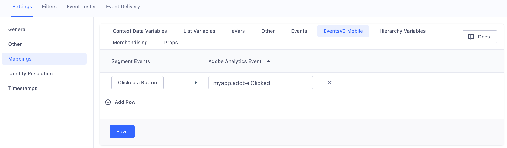
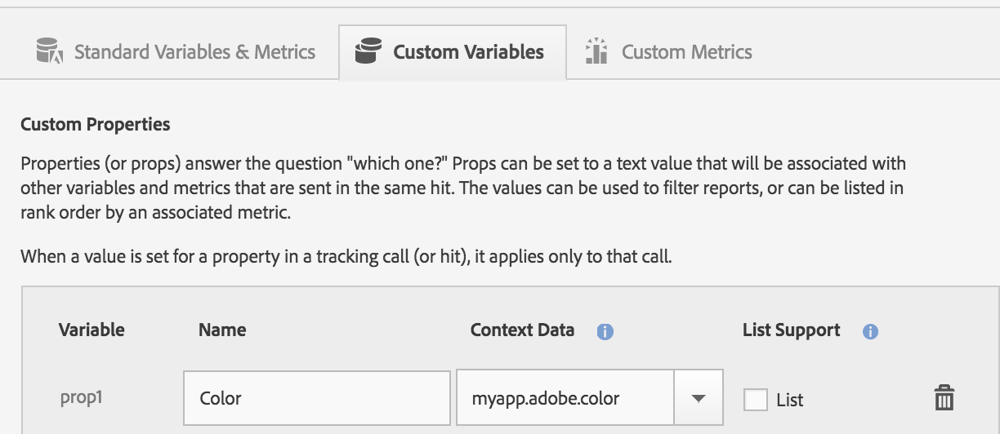

Segment supports Adobe Analytics Mobile Services. With Segment, you don't need to package Adobe Analytics SDKs to use Adobe Analytics Mobile Services features.

To learn more about Segment's mobile libraries, see the [iOS](/docs/connections/sources/catalog/libraries/mobile/ios) and [Android](/docs/connections/sources/catalog/libraries/mobile/android) technical docs.

The Segment Adobe-Analytics mobile SDKs are currently in beta. Please try them and [contact us](https://segment.com/help/contact/) with any feedback!

## Setting Up the Mobile SDKs

You'll need to do a few things before you can start sending data from your mobile application to Adobe Analytics:

- First, enable Segment-Adobe Analytics in your Segment account's UI
- Download the `ADBMobileConfig.json` file and follow the instructions in Adobe's documentation, [here for iOS](https://marketing.adobe.com/resources/help/en_US/mobile/ios/dev_qs.html), and [here for Android](https://marketing.adobe.com/resources/help/en_US/mobile/android/dev_qs.html)
- Finally, bundle Segment's Adobe Analytics SDK in your project:

Android:
```java
compile 'com.segment.analytics.android.integrations:adobe-analytics:1.0.0'
```

**Note** If you're working on Android, you'll also need to add these permissions to your `AndroidManifest.xml`:

```xml
<uses-permission android:name="android.permission.INTERNET" />
<uses-permission android:name="android.permission.ACCESS_NETWORK_STATE" />
```


iOS:
```objective-c
pod 'Segment-Adobe-Analytics', '1.1.0-beta'
```

**Note**: Implementations using a Segment-Adobe Analytics SDK don't require that you enter a Report Suite ID, a Timestamp Option, a Tracking Server Secure URL, a Tracking Server URL, or specify Use Secure URL for Server-side in your Segment settings UI. Your Adobe settings can be customized from the "Manage App Settings" tab of your Adobe Mobile Services dashboard, and downloaded as an `ADBMobileConfig.json` file by clicking the "Config JSON" link at the bottom of the same tab.

## Sending Data to Adobe analytics

We strongly recommend creating a tracking plan for both your Segment and Adobe Analytics events before you send any events or properties to Adobe. This will help you map your Segment events to Adobe `events`, and Segment properties to Adobe `eVars` or `props`, since you'll have to do this in both the Segment settings UI and your Adobe Mobile Services dashboard.

## Sending Events

You can map Segment events in your `Events V2` settings to any event variable you've already defined in your Adobe Analytics Mobile Services dashboard.

**Note**: Don't use the older, deprecated `Events` settings as they do not forward events to Adobe.

Here's an example of how you might map Segment events to Adobe Analytics events connected in device mode:



Here's an example of how you would implement the same mapping in Adobe's Mobile Services Dashboard:


## Sending Custom Properties

You can use the `Context Data Variables` settings to map Segment `properties` to any context data variable defined in your Adobe Analytics Mobile Services dashboard. This includes both Adobe `props` and `eVars`. You can see a list of the Adobe variable types in your Adobe Mobile Services dashboard.


Here's an example of how you would implement the same mapping in Adobe's Mobile Services Dashboard:




<table>
  <tr>
    <td>**Segment Payload Field**</td>
    <td>**iOS Mapping Notation**</td>
    <td>**Android Mapping Notation**</td>
  </tr>
  <tr>
    <td>`anonymousId`</td>
    <td>`anonymousId`</td>
    <td>`.anonymousId`</td>
  </tr>
  <tr>
    <td>`messageId`</td>
    <td>`messageId`</td>
    <td>`.messageId`</td>
  </tr>
  <tr>
    <td>`event`<br>`.track()` calls only</td>
    <td>`event`</td>
    <td>`.event`</td>
  </tr>
  <tr>
    <td>`name`<br>`screen()` calls only</td>
    <td>`name`</td>
    <td>`.name`</td>
  </tr>
  <tr>
    <td>`context.traits.key`</td>
    <td>`traits.key`</td>
    <td>`.context.traits.key`</td>
  </tr>
  <tr>
    <td>`context.key`</td>
    <td>`key`</td>
    <td>`.context.key`</td>
  </tr>
  <tr>
    <td>`context.arrayKey.key`<br>ie. `context.device.id`</td>
    <td>`arrayKey.key`<br>ie. `device.id`</td>
    <td>`.context.arrayKey.key`</td>
  </tr>
  <tr>
    <td>`properties.key`</td>
    <td>`key`</td>
    <td>`key`</td>
  </tr>
</table>

## Adobe Lifecycle events

Segment implements Adobe Lifecycle Events automatically - you don't have to enable any additional settings! Lifecycle events gather important information such as app launches, crashes, session length, and more. You can find a full list of all lifecycle metrics and dimensions in [Adobe's documentation](https://marketing.adobe.com/resources/help/en_US/mobile/android/metrics.html).

## Identify on Mobile

Whenever you call `identify`, Segment sets the Adobe `visitorId` to the value of your user's Segment `userId`. Here's what we're doing behind the scenes, on Android:

```java
Config.setUserIdentifier("123");
```

And on iOS:

```objective-c
[ADBMobile setUserIdentifier:@"123"];
```

## Screen on Mobile

Whenever you call `screen`, Segment triggers an Adobe `trackState` event, passing your screen name, as well as any properties you've mapped to Adobe as context data values. Here's what we're doing behind the scenes, on Android:

```java
Analytics.trackState("Home Screen", <properties mapped in contextData>);
```

And on iOS:

```objective-c
[self.ADBMobile trackState:@"Home Screen" data:<properties mapped in contextData>];
```

## Track on Mobile

Whenever you call `track`, Segment triggers an Adobe `trackAction` event, passing your event name, as well as any properties you've mapped to Adobe as context data values. Here's what we're doing behind the scenes, on Android:

```java
Analytics.trackEvent("Clicked A Button", <properties mapped in contextData>);
```

And on iOS:

```objective-c
[ADBMobile trackAction:@"Clicked A Button" data:<properties mapped in contextData>];
```

## Reset on Mobile

Calling `reset` sets your user's `visitorId` to  `null`. `null` is Adobe's default `visitorId` value until you explicitly set it by calling `identify`. Here's what Segment triggers behind the scenes:

```java
Config.setUserIdentifier(null);
```

```objective-c
[ADBMobile trackingClearCurrentBeacon];
```

## Flush on Mobile

Calling `flush` immediately dispatches all locally queued hits to Adobe. Here's what Segment is triggering behind the scenes, on Android:

```java
Analytics.sendQueuedHits();
```

And on iOS:

```objective-c
[ADBMobile trackingSendQueuedHits];
```
