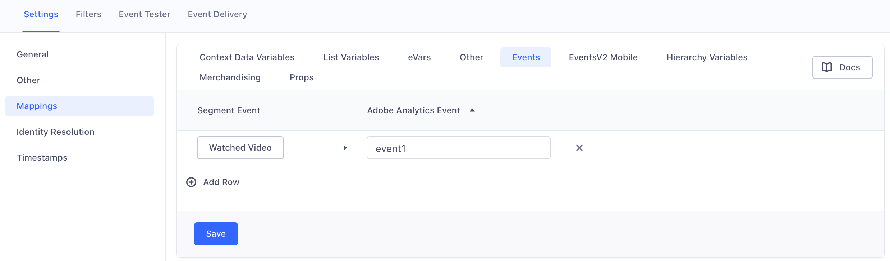
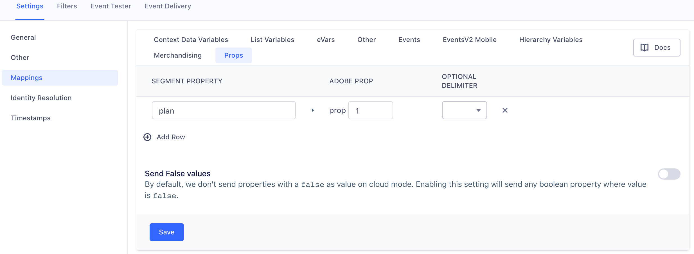
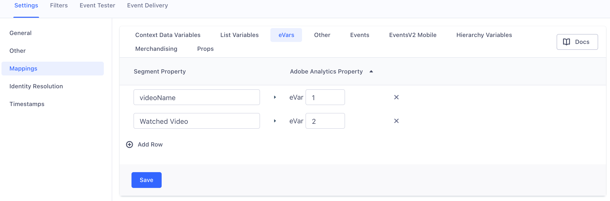
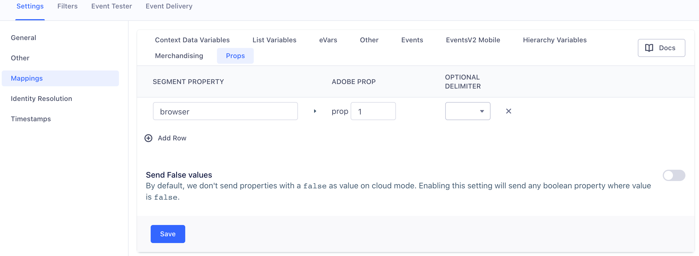
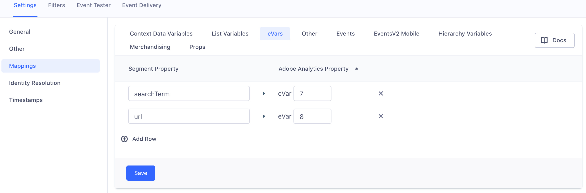
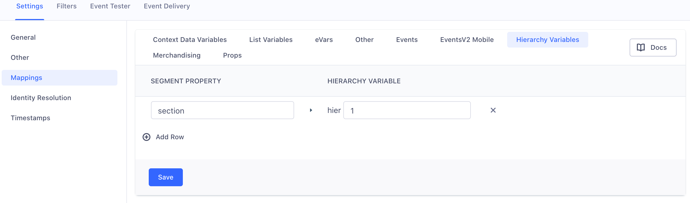

## Data Mapping Model Overview 
As we have mentioned elsewheree, Segment uses a user-action data model, in which we use different types of calls to track different activities of a user on a website or app. Adobe Analytics uses page views as the basic unit of activity, and specific data variables such as "props", eVars, lVars, and hVars to add details that allow more nuanced analysis.

In this section we will discuss in detail how to configure your Segment Adobe Analytics Destination settings to customzie your Segment calls for Adobe Analytics. In this section we will cover: 
1. [Success Events](#implementing-success-events)
2. [Conversion Variables (eVars)](#conversion-variables---eVars)
4. [Merchandising Variables](#merchandising-events)
4. [Properties (props)](#properties---props)
5. [List Variables (lVars)](#list-variables---lVars)
6. [Heirarchy Variables (hVars)](#hierarchy-variables---hVars)
7. [Segment Options Object](#segment-options-object)

## Implementing Success Events
When getting started with sending Success Events to Adobe, you can choose to use the [automatic Ecommerce Spec mapping](#using-default-ecommerce-spec-events) so you don't have to set up a mapping in Segment and Adobe. If you need event support beydont the the standard Ecommerce spec, to support more event types or different ones, you can implement custom [Track events](#creating-custom-track-events) or [Page calls](#creating-page-calls). 

### Using default Ecommerce Spec Events

The Adobe Analytics destination automatically works with our standard [Ecommerce API](/docs/connections/spec/ecommerce/v2/). The following events are automatically mapped between Segment and Adobe Analytics across all our components: iOS, Android, A.js (device-mode), and Server Side (Cloud-Mode). 
<!-- TODO LAURA to check wording of last sentence -->

<table>
  <tr>
    <td>Segment Event Name</td>
    <td>Adobe Analytics Event Name</td>
  </tr>
  <tr>
    <td>Product Viewed
    <br>Product List Viewed
    </td>
    <td>`prodView`</td>
  </tr>
  <tr>
    <td>Product Added</td>
    <td>`scAdd`</td>
  </tr>
  <tr>
    <td>Product Removed</td>
    <td>`scRemove`</td>
  </tr>
  <tr>
    <td>Cart Viewed</td>
    <td>`scView`</td>
  </tr>
  <tr>
    <td>Checkout Started</td>
    <td>`scCheckout`</td>
  </tr>
  <tr>
    <td>Order Completed</td>
    <td>`purchase`</td>
  <tr>
    <td>Cart Opened</td>
    <td>`scOpen`</td>
  </tr>
  </tr>
</table>

Segment sends the Ecommerce event data to Adobe like a standard `track` event. These Ecommerce events are automatically mapped and sent to Adobe Analytics along with product description data. If you implement Segment events using the Ecommerce spec and naming conventions you do **NOT** need to create a mapping in your Segment Adobe destination settings. You only need to map **event names** if you want to set them as the value of an `eVar`. 
<!-- TODO add a link to eVar docs below --> 
<!-- TODO: You can also override or opt-out of automatically mapping the Ecommerce events by passing `integration: AA: false` as part of your call.-->

Ecommerce properties such as `orderId` and `products` are also sent automatically. However, if you use other custom properties and want to send them to Adobe's `eVar`, `prop`, `hVar`, or `lVar` variables, you *do* need to map them as properties in your Segment Adobe Analytics destination settings.

### Example using Segment Ecommerce spec
<!-- Should this be moved to a new section. Like What is happening to my events? -->

Given the sample `Order Completed` Segment event below:

```js
analytics.track('Order Completed', {
 orderId: '50314b8e9bcf000000000000',
 total: 30.00,
 revenue: 25.00,
 shipping: 3.00,
 tax: 2.00,
 discount: 2.50,
 coupon: 'hasbros',
 currency: 'USD',
 products: [
   {
     id: '507f1f77bcf86cd799439011',
     sku: '45790-32',
     name: 'Monopoly: 3rd Edition',
     price: 19,
     quantity: 1,
     category: 'Games'
   },
   {
     id: '505bd76785ebb509fc183733',
     sku: '46493-32',
     name: 'Go Pro',
     price: 99,
     quantity: 2,
     category: 'Electronics'
   }
 ]
});
```
Segment does the follwing:

1. Sets `window.s.products` with the product description string.

   The product description is a semi-colon delimited string per product which is additionally delimited by commas if you have multiple products. The string format per product is `[category];[name];[quantity];[total]`. Total is calculated by multiplying price and quantity for each product.

   **Note**: You can choose whether to map the `name`, `sku`, or `id` for each item in the `products` array. So you could alternatively send product descriptions with `[category];[sku];[quantity];[total]`. To configure this option, go to your Adobe Analytics settings in Segment, locate the Advanced Options, and select the mapping from the **Product Identifier**. The `name` is the default identifier.

   For the example above, we would set `window.s.products` to `'Games;Monopoly: 3rd Edition;1;19,Electronics;Go Pro;2;99'`.

   The default fallback value for `quantity` is `1`, and for `price` it is `0`.

   **Important**: You should't use this option if any items in the `products` array have property values that include commas or semi-colons. Adobe Analytics uses these characters as delimiters.

2. Updates common variables such as `channel`, `campaign`, `state`, `zip`, and `pageName`. These values are set if they exist at the property level, your existing Adobe Analytics variables already attached on the `window.s` object, or `context.page.title` (for `pageName`).

3. Sets `window.s.events` with the corresponding Adobe Analytics naming convention. The example above wouild set this as `'purchase'`.

4. Checks if the event name is mapped as an `eVar` and if so, set it on the `window.s`.

5. Checks if any other top level properties (not the custom properties at the item level inside `products` array) have been mapped to a custom variable in the Segment settings such as `eVar`, `prop`, and `hVar`. If so, set them on the `window.s`.

6. Sets `window.s.purchaseID` and `window.s.transactionID` as the `orderId`, which for the example above would be `'50314b8e9bcf000000000000'`.
   Note that this is only for `Order Completed` events.

   The default `currencyCode` we set upon pageload is `USD`. However, we check if you have passed any currency other than this in your event by checking `properties.currency`.

   **Important**: To collect `transactionID`, make sure to enable the transactionID storage setting inside your [Reporting Suite](https://marketing.adobe.com/resources/help/en_US/sc/implement/transactionID.html)!

7. Attaches the `timestamp` as `window.s.timestamp` if your **Timestamp Option** is **Timestamp Enabled** or **Timestamp Optional**.

8. Sets `window.s.linkTrackEvents` to the Adobe Analyics event name, which would be `purchase` for the example above.

9. Sets `window.s.linkTrackVars` which is a string of keys we want Adobe Analytics to read from the `window.s` object when the request is sent. For the example above, the value of `linkTrackVars` would be set as `'pageName,events,products,purchaseID,transactionID,timestamp'`.

10. Finally, fires off the event using `window.s.tl(true, 'o', 'Order Completed');`.

### Creating Custom Track events

You can send custom `.track()` events to Adobe if you would like event support beyond the standard Ecommerce spec. We strongly recommend that you create a tracking plan for both your Segment and Adobe Analytics events before you send any events or properties to Adobe. Once you have your tracking plan prepared, you can use the list of `events` to set up a mapping in the Segment destination settings UI. 

When configuring the mapping, the list of `.track()` events must be defined in both Adobe Analytics, and the Segment destination settings UI, including the properties to send as custom data variables.

This means that you **must** create a mapping for each event and property to a corresponding Adobe Analytics `event`, `prop`, or `eVar`. 

The image below shows an example of how you might map an event and thecorresponding custom variables in the Segment destination settings UI:





Using the sample settings in the image above, if you make the `.track()` call example below:

```js
analytics.track('Watched Video', {
  plan: 'free',
  videoName: 'The Uptick'
});
```

Here's what happens to this event sent from the browser in our A.js or Device Mode integration:

1. First Segment checks if the event name, `'Watched Video'`, is mapped in your Segment settings for Adobe Analytics.
   If you haven't configured a mapping for this event name, Segment does nothing and aborts the call.
   If a mapping is configured, we set `window.s.linkTrackEvents` and `window.s.events` to the corresponding Adobe Analytics event name as specified in the mapping, in this example `'event1'`.

2. Next, if the setting for  **Timestamp Option** is either **Timestamp Enabled** or **Timestamp Optional**, Segment maps the `timestamp` to `window.s.timestamp`.

3. If any properties were included in the event's mapping or on the `window.s` object, we update common variables such as `channel`, `campaign`, `state`, `zip` with the track call values.

4. Next, we check if the Segment event name, `Watched Video` is mapped to an `eVar`. Since it is in the example case above, we set `window.s.eVar3` as `'Watched Video'`.

5. We check if any other properties are mapped to either a `prop`, `eVar`, or `hVar`. For the example above, we'd set `window.s.prop1` as `'free'` and `window.s.eVar4` as `'The Uptick'`.

6. Next, we try to set `window.s.pageName` to one of the following values, in order of precedence:

  - `properties.pageName` (for backward compatibility)
  - `options.pageName` (if you already have `window.s.pageName` defined on the web page)
  - `context.page.title` (which is automatically tracked by our Analytics.js library, and always has a value)
   If you don't configure any other `pageName` mappings, `window.s.pageName` is set to the value of the `<title>` tag in the page where the `.track()` call was fired.

7. Next, we create a comma-delimited joined string of variable keys to send as  `window.s.linkTrackVars`. This tells Adobe Analytics which properties on the `window.s` object to send with this event.
   In the example above, the a string would be `'eVar3,events,pageName,timestamp,eVar3,prop1'`.

8. Finally, we flush the request to Adobe Analytics using `window.s.tl(true, 'o', 'Watched Video')`

  *Note*: `true` sets a `500ms` delay to give your browser time to flush the event. It also signifies to Adobe that this event is something other than a `href` link. The `'o'` stands for `'Other'`, as opposed to `'d'` for `'Downloads'` and `'e'` for `'Exit Links'`. The final parameter is the link name as it appears in reports inside Adobe Analytics.

### Creating Page calls

By default, the Segment snippet includes an empty `page` call. Page calls are more similar to the native Adobe tracking methodology, and don't require as extensive a mapping process.

When you make a `page` call, here's what Segment does from the browser in our A.js or Device Mode integration:

1. Sets the Adobe property `window.s.pageName` to the `name` of the page call.
   By default, a Segment `.page()` call sets this property as `undefined` since no parameters are passed, but if you include a `name` such as `.page('Home')`, Segment sets `window.s.pageName` to `'Home'`.

   **Note**: If you don't pass a `name`, Adobe Analytics uses the `url` as the page name by default.

2. Sets the Adobe property `window.s.events` to the `name` from your `.page(<name>)` call.

3. Checks if the page call is associated with a `userId` from a previous `.identify()` call. If so, we set the `userId` as `window.s.visitorID`.

  **IMPORTANT**: Adobe Analytics [does not support setting visitorID](https://marketing.adobe.com/resources/help/en_US/sc/implement/timestamps-overview.html) if you are sending a timestamped call. So Segment first checks if your **Timestamp Option** is `disabled` _and_ that a `userId` exists on the event, and only then sets `window.s.visitorID`.

4. Checks for some common properties, and sets them on the `window.s` object:

   - `channel`
   - `campaign`
   - `state`
   - `zip`

   We first use the `properties` you sent using the `.page()` call. An example page call in order to set the four properties above would be:

   ```js
   analytics.page({
     channel: 'Laptops',
     campaign: '0813',
     state: 'RI',
     zip: '02818'
   });
   ```

   For `campaign`, we use the [Segment spec](/docs/connections/spec/common) and check `context.campaign.name` first before checking `properties.campaign`.

   Alternatively, if you already set any of these properties on your existing Adobe Analytics instance on the page (`window.s.channel`, `window.s.campaign`, etc.), we use that as the default value. This way you can easily set a default values for all your web pages, but can still programmatically change them for each page if needed.

5. If your **Timestamp Option** is either **Timestamp Enabled** or **Timestamp Optional**, we attach the `timestamp` to `window.s.timestamp`.
   Make sure this setting matches your *actual* timestamp setting inside Adobe Analytics for the same Report Suite ID.

6. Checks if any of the page call's properties are mapped to any custom Adobe Analytics variables such as `eVar`, `props`, and `hVar`.

   Given the mapping setting below:

   
   
   

   If you make the following page call:

   ```js
   analytics.page({
     browser: 'chrome',
     searchTerm: 'swim shorts',
     section: 'swimwear'
   });
   ```

   We set the following properties on the `window.s` object:

   - `window.s.prop1 = 'chrome'`
   - `window.s.eVar7 = 'swim shorts'`
   - `window.s.eVar3` is set to the `url` of the page where the call was made (`.page()` automatically sets a `url` property)
   - `window.s.hier1 = 'swimwear'`

7. Finally, Segment flushes the pageview request to Adobe Analytics using `window.s.t()`.


## Conversion Variables - eVars 

Custom Conversion variables, also known as eVars, are how Adobe segments conversion success metrics in custom marketing reports. To learn more about eVars and how to configure them see Adobe's [documentation here](https://docs.adobe.com/content/help/en/analytics/admin/admin-tools/conversion-variables/conversion-var-admin.html). 

You must configure an eVar mapping in your Segment destination settings to send eVars to Adobe on `.track()` and `.page()` calls. When configuring the mapping, the list of eVars must be defined in the Adobe Analytics UI. Map your Adobe Analytics eVar names to the Segment property names you’re using in your Segment events. Enter a Segment property name on the left and an Adobe Analytics eVar number on the right. You can view your Segment events and properties in your Schema.

An example eVar mapping in the Segment Destination settings UI should look like this:


## Merchandising Events

The Merchandising Events setting allows you to set eVars and events on a per-product basis within the "products" string, and supports increment and currency events. This provides robust product string support, which you can read more about [here](https://marketing.adobe.com/resources/help/en_US/sc/implement/products.html).

The setting operates as follows:

- Keys off of the Segment `track` call event name, or for `page` support, a `property.eventName`
- Maps to the Adobe event to send in as an increment or currency event.
- Reads if the event is scoped to the product or event level.
- [optional] Sets a value on the event. This value is the increment or currency to pass to Adobe. If you don't include a value, Segment sends the event without one, and Adobe understands this as an increment of 1. If you configure a value and the value is not present on the `track` or `page` call, we do not send the event to Adobe.
- Map of product eVars to set on the products string. This is only supported at the product level, as expected by Adobe Analytics.

Let's take the following example:


The configuration in the example image above configures a `Product Added` Segment event which sends Adobe Analytics:
- `event1` in `s.events` with the value passed from `properties.increment`.
- `event2` on `s.products` with the value passed from `properties.products.price`.
- the value for `properties.products.priceStatus` in `eVar1`
- the value for `properties.products.coupon` in `eVar2`


_Considerations_:
- We also pass in `event2` without a value on `s.events`, as this is a requirement for Adobe.
- We still map to Adobe's predefined `scAdd` event. See default [Ecommerce Spec events](#using-default-ecommerce-spec-events)
- We use dot notation for product values, for example `products.priceStatus` parses through properties for this value.
  - This includes the product string, so if you want a value nested in products, you would configure `products.priceStatus`.

Once you have the above example mapping configured, you send in the relevant event to Segment.

For example, in a Node.js environment we sent:

```javascript
analytics.track({
    userId: '098094356890',
    event: 'Product Added',
    properties: {
      cart_id: '124efsdovnt4edvsldfpf',
      product_id: '342039402fsl12njfs',
      sku: 'G-32',
      priceStatus:'promo',
      increment: 20,
      category: 'Games',
      name: 'The Settlers of Catan',
      brand: 'Kosmos',
      variant: 'Cities and Knights',
      price: 34.99,
      quantity: 1,
      coupon: 'MAYDEALS',
      position: 2,
      url: 'https://www.example.com/product/path',
      image_url: 'https://www.example.com/product/path.jpg'
    }
  });
  ```

The `s.events` call passes in `scAdd` and `event1=20`, and `s.products` passes in `event2=18.99` and `evar1=discounted|evar2=MAYDEALS`.

The resulting request payload to Adobe looks like:

```xml
<events>scAdd,event1=20,event2</events>
<products>Games;Monopoly: 3rd Edition;1;18.99;event2=18.99;eVar1=discounted|eVar2=MAYDEALS</products></request>
```

### Page Example:
You can send Merchandising events on `.page()` calls. In order to send `<events>` on `page`, you must pass in `events` on the Adobe Analytics integration option. We merge the configured event within the setting with the array passed in. In the example below, we pass in `scAdd`, as this is not automatically mapped on `page`.

```javascript
analytics.page({
    userId: '098094356890',
    event: 'Product Added',
    properties: {
      cart_id: '124efsdovnt4edvsldfpf',
      product_id: '342039402fsl12njfs',
      sku: 'G-32',
      priceStatus:'promo',
      increment: i,
      category: 'Games',
      name: 'The Settlers of Catan',
      brand: 'Kosmos',
      variant: 'Cities and Knights',
      price: 34.99,
      quantity: 1,
      coupon: 'MAYDEALS',
      position: 2,
      url: 'https://www.example.com/product/path',
      image_url: 'https://www.example.com/product/path.jpg'
    },
    integrations: {
      "Adobe Analytics": {
        "events": ["scAdd"]
      }
    },
  });
  ```

## Properties - props 

You can map your Segment properties in your settings to any of your Adobe props.

You can either send the property value as a string (ie. `'brady'`) or as an array (`['brady', 'edelman', 'blount']`). If you choose to send them as an array, Segment defaults to join it so that it is a pipe (`|`) delimited string before sending to Adobe (ie. `'brady|edelman|blount'`). If you would like to set up a custom delimiter  see our documentation [here](https://segment.com/docs/connections/destinations/catalog/adobe-analytics/#custom-delimiter) for configuring custom delimiters.

## List Variables - lVars 

You can map your Segment properties in your settings to any of your three list variables.

You can either send the property value as a comma delimited string (ie. `'brady,edelman,blount'`) or as an array (`['brady', 'edelman', 'blount']`). If you choose to send them as an array, Segment defaults joins it as a comma delimited string before sending it to Adobe. To set up a custom delimiter, see the [documentation section on custom delimiters](https://segment.com/docs/connections/destinations/catalog/adobe-analytics/#custom-delimiter).

### Custom Delimiter

For list variables and props, you can either send the property value as a comma delimited string (ie. `'brady,edelman,blount'`) or as an array (`['brady', 'edelman', 'blount']`). In your Segment settings UI, **List Variable and Prop Custom Delimiter: Server-Side Only**, you can configure a custom delimiter to join the array before sending to Adobe. If you choose to send those properties as an array, without configuring a custom delimiter, we default to join it so that it is a comma delimited string.
<!-- TODO this has  changed in  V2  UI and  has a bug -->

**Note:** You must configure the custom delimiter in the Adobe Analytics dashboard for each list variable and prop prior to instantiating this mapping.

For the following List Variable and Prop Mapping configured in the Segment UI:


Here is an example of how to configure the Segment custom delimiter mapping:


When you send an event:
```javascript
analytics.track({
   userId: 'user12345',
   event: 'Event1',
   properties: {
    list_var1: ['hello', 'world'],
    prop1: ['howdy', 'yall']
   }
});
```

Segment concatenates `list_var1` into `hello|world` and `prop1` into `howdy:yall` before sending it to Adobe. The XML request to Adobe includes `<list1>hello|world<list1>` and `<prop1>howdy:yall<prop1>`.


## Hierarchy Variablse - hVars
<!-- TODO -->

## Segment Options Object 
The Adobe Analytics destination offers a couple of different ways to configure behavior using destination specific options. These are options that are defined in your event payloads rather than in the Segment app. To use these options, you must define them as values of an object in the following property of your Segment event payloads:

```javascript
integrations: {
  'Adobe Analytics': {
    // insert options here...
  }
}
```
Here's an example of a `track` call using this:

```javascript
 analytics.track({
    userId: '019mr8mf4r',
    event: 'Gotta catch em all',
    properties: {
     caught: 1738
    },
    integrations: {
      'Adobe Analytics': {
        // Insert custom options here...
      }
    }
 });
 ```

The section below outlines each of these options and what they do.

### Events
This option allows you to associate specific Adobe events with individual Segment events.

```javascript
 analytics.track({
    userId: '019mr8mf4r',
    event: 'Gotta catch em all',
    properties: {
     caught: 1738
    },
    integrations: {
      'Adobe Analytics': {
        events: ['scAdd', 'event2']
      }
    }
 });
 ```

### IMS Region
This option allows you to associate events with IMS Regions. **Note. If you specify this you must also define a `Marketing Cloud Visitor Id`.**

```javascript
 analytics.track({
    userId: '019mr8mf4r',
    event: 'Gotta catch em all',
    properties: {
     caught: 1738
    },
    integrations: {
      'Adobe Analytics': {
        imsregion: 'aamlh'
      }
    }
 });
 ```

### Marketing Cloud Visitor ID
This option allows you to associate a specific Marketing Cloud Visitor ID (mcvid) with the event.

```javascript
 analytics.track({
    userId: '019mr8mf4r',
    event: 'Gotta catch em all',
    properties: {
     caught: 1738
    },
    integrations: {
      'Adobe Analytics': {
        marketingCloudVisitorId: 'user1234'
      }
    }
 });
 ```

### Visitor ID
This option allows you to associate a standard Visitor ID with the event.

```javascript
 analytics.track({
    userId: '019mr8mf4r',
    event: 'Gotta catch em all',
    properties: {
     caught: 1738
    },
    integrations: {
      'Adobe Analytics': {
        visitorId: 'user1234'
      }
    }
 });
 ```

<!-- ## Link Names, Link URLs, Link Types
See [this](#setting-custom-linktypes-linknames-and-linkurls) section for information about configuring these as options. 
TODO: This link is dead and there is no associated section so need to add-->