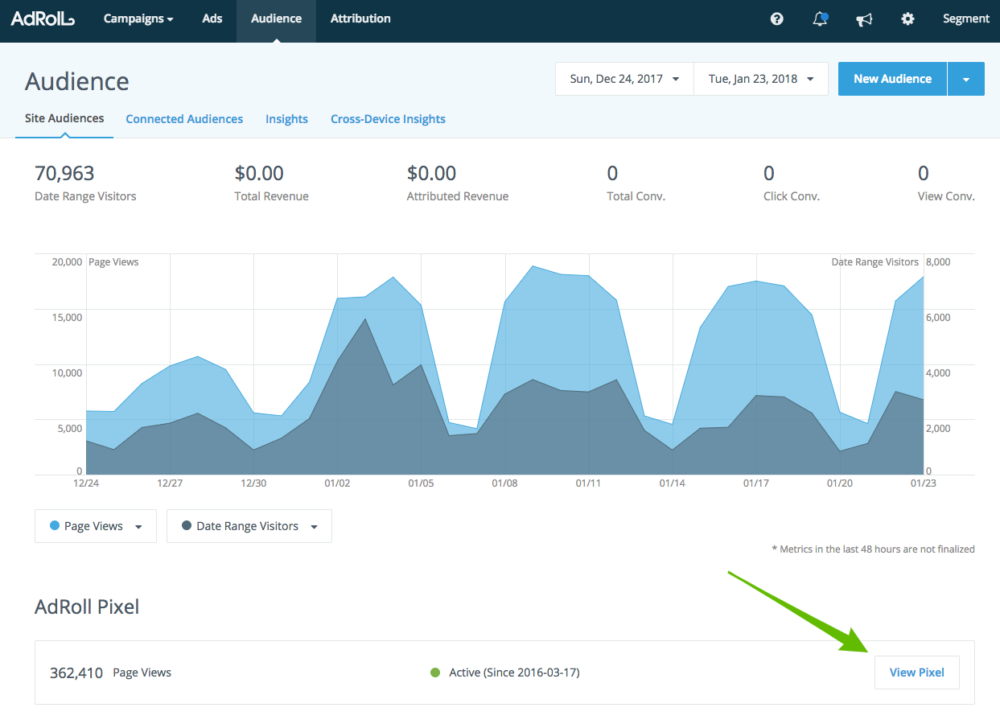
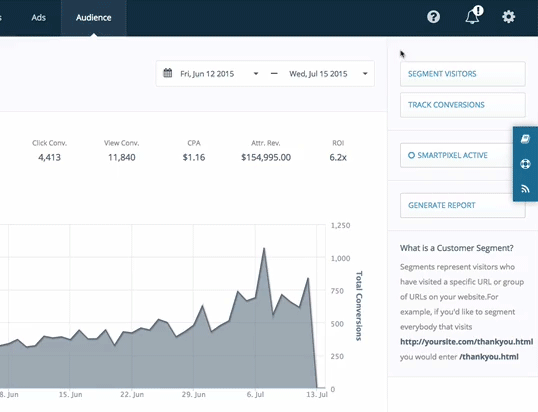
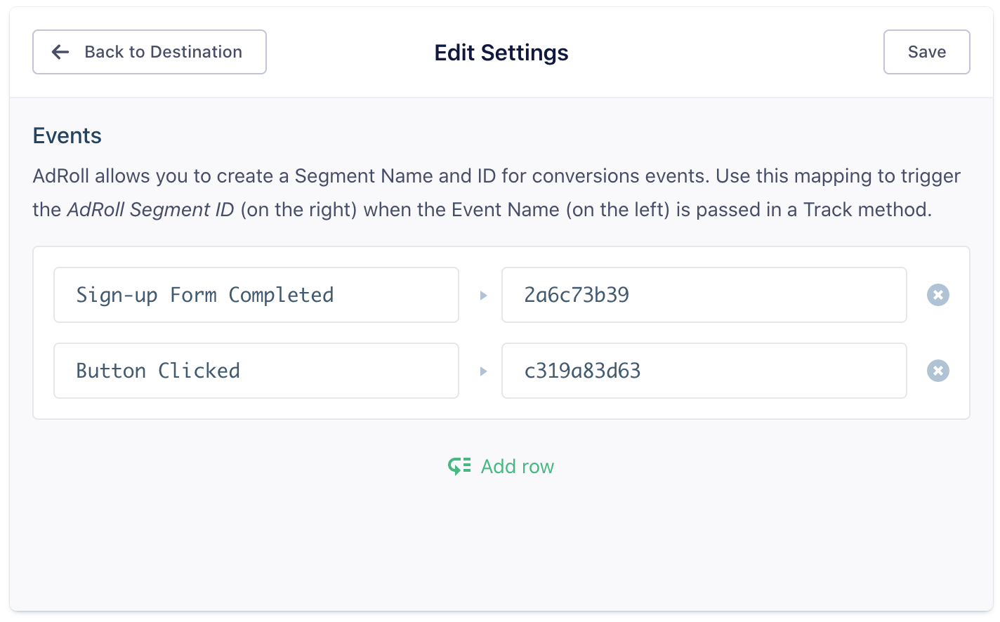
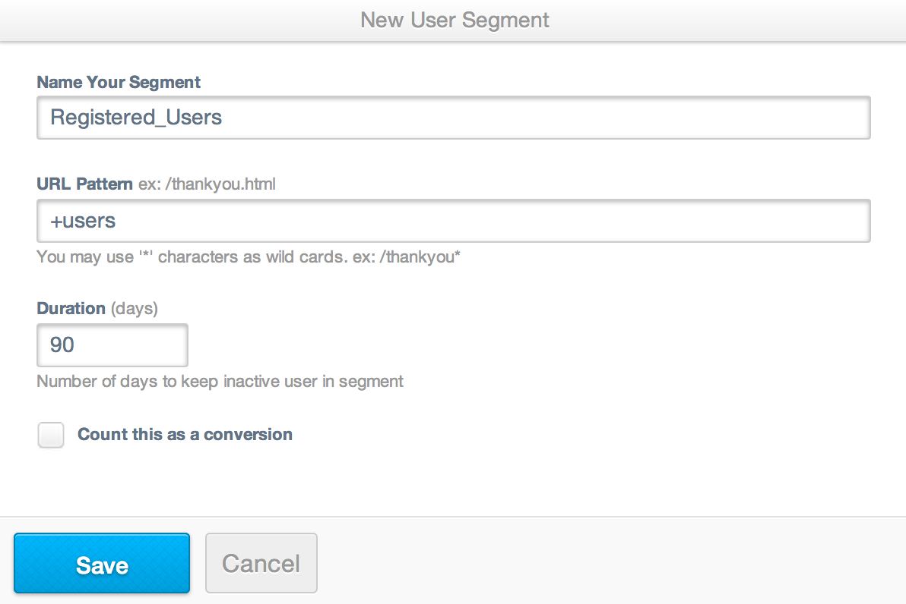

[AdRoll](https://adroll.com/) is a retargeting network that allows you to show ads to visitors who've landed on your site while browsing the web. The AdRoll Destination is open-source. You can browse the code on [GitHub](https://github.com/segment-integrations/analytics.js-integration-adroll).

## Getting Started



1. From the Segment web app, click **Catalog**.
2. Search for "Adroll" in the Catalog, select it, and choose which of your sources to connect the destination to.
3. Locate both your AdRoll Advertiser ID and Pixel ID in AdRoll's "Audience" tab, "AdRoll Pixel" section. Click on "View Pixel". Your Advertiser ID will be listed beside `adroll_adv_id` and your AdRoll Pixel will be listed beside `adroll_pix_id`.

    

4. Add both your Advertiser ID and Pixel ID to your Segment Destination Settings.

## Page

If you're not familiar with the Segment Specs, take a look to understand what the [Page method](/docs/connections/spec/page/) does. An example call would look like:
```javascript
analytics.page()
```
_**NOTE:** The `page` call **must** be made on a page for any `identify` or `track` events to be sent to AdRoll. Our Analytics.js snippet includes a `page` call by default so you should be fine, unless you've manually removed the page call from your Analytics.js snippet._

## Identify

If you're not familiar with the Segment Specs, take a look to understand what the [Identify method](/docs/connections/spec/identify/) does. An example call would look like:
```javascript
analytics.identify('123', {
  email: 'testing@segment.com'
});
```
Set a `userId` using the `identify` call which will then be passed it to AdRoll each time a [`track`](/docs/connections/destinations/catalog/adroll/#track) call is made. If you pass an `email` trait, we'll send that to AdRoll by setting `window.adroll_email` to that value.


## Track

If you're not familiar with the Segment Specs, take a look to understand what the [Track method](/docs/connections/spec/track/) does. An example call would look like:
```javascript
analytics.track('Sign-up Form Completed');
```
In order to send your `track` calls to AdRoll for segmenting your users, get started by creating a new "segment" in their interface, copying the "Segment ID", and pasting that following a `+` into the URL rule field.

   

Map your client-side Analytics.js event names to the corresponding AdRoll "Segment ID" in the Segment Settings UI.

   

We'll fire the correct pixel accordingly to put the user into that "segment" whenever they trigger the event you've chosen. Note that you will still need to map semantic events like `Viewed Product`, `Added Product`, and `Order Completed`.

Then, inside AdRoll you can create a "segment" of all users doing any of those events by adding a `+` to the segment name and adding it in the URL field, like this:

   

### Conversion Value

When you include an event property labeled `price` it will be tracked to AdRoll as `adroll_conversion_value`.

### Currency

When you send `Order Completed` event with `properties.currency`, we will send that as `adroll_currency`. AdRoll supports [these currency codes](https://help.adroll.com/hc/en-us/articles/213429827-Currency-Codes).

### Order ID

If you send an `Order Completed` event with `properties.orderId`, we will send that as `order_id`.

```javascript
analytics.track('Order Completed', {
  revenue: 100,
  currency: 'USD',
  orderId: 'abc12345'
});
```

### Product ID

If you send a `Viewed Product` or `Added Product` with `properties.id` we will map it as `product_id`.

```Javascript
analytics.track('Vewed Product', {
  id: 'abc98765'
});
```

### **Legacy:** Named Segments

Prior to rolling out Segment ID's, AdRoll allowed "named segments". If your account was created prior to 2015, then the track events you send from the browser using our [`analytics.track`](/docs/connections/destinations/catalog/adroll/#track) method will be passed on to AdRoll as `adroll_segments` with the segment being the snake-cased event name.

## Troubleshooting


