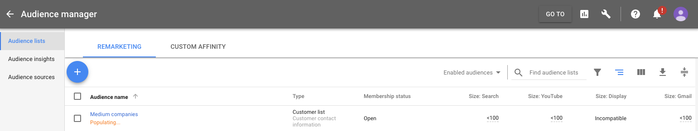

This destination lets you sync audiences created through [Segment Personas](/docs/personas) into Google Adword's Remarketing Lists as a **User-List**. Once you create an audience, Segment sends that list of users to Google and keeps it up to date as users enter and exit the audience specification.

This allows you to run advertising campaigns in Google without having to bug your data or engineering team for a csv of users. This doc explains how to authorize Google in Segment, how to create an audience, and what to expect in the Google Adwords UI.

> **Note**: You must have Personas in your Segment plan to use this destination. [Contact us for a demo](https://segment.com/contact/demo) if you'd like to try this out.

## Connection Modes

<table style="width:220px">
  <tr>
    <th style="text-align:center">Personas Audiences</th>
  </tr>
  <tr>
    <td style="text-align:center"> ✅ </td>
  </tr>
</table>

The Adwords Remarketing Lists destination consumes [Personas Audiences](/docs/personas/audiences/), and does not receive data directly from Segment Sources. Any data that you can build into an audience in Personas can be sent to Adwords Remarketing Lists.

## Getting started

### 1. Authorize Google Adwords

Steps:
1. Go to `https://app.segment.com/<your-workspace-slug>/destinations/catalog/adwords-remarketing-lists`
2. Configure Adwords on the personas source that we've pre-created for you (should be called `Personas default`)
3. Authorize Google Adwords.
   >**Note**: You need Admin access to the Adwords account you want to connect so that Personas can send audiences.

### 2. Create an audience in Segment

1. Go to [the Personas Audiences page in your workspace](https://app.segment.com/goto-my-workspace/personas/audiences) and create a new audience in Personas.
2. Give your audience some event and trait criteria, then click **Preview**.
4. Click **Create Audience** to Connect your audience to Adwords Remarketing Lists.
   Your audience starts syncing to Google, and may take a couple minutes

### 3. Check Adwords for audience

> **Note**: The audience appears in the Adwords Audience Manager shortly after you save it in Segment, with the status "Populating". Adwords can take 6-12 hours to process audience uploads before they can be used in a campaign.

1. In the Adwords UI, click **Go to** in the navigation and type "Audience Manager".
2. Click the audience with the name you put in the Segment UI. When it's done populating, check the size of the audience

## Troubleshooting

### Not seeing an audience in Google

Make sure you have authorized Google. You can review & re-authorize this connection directly here: [https://app.segment.com/goto-my-workspace/destinations/adwords-remarketing-lists/sources/personas_default/configuration](https://app.segment.com/goto-my-workspace/destinations/adwords-remarketing-lists/sources/personas_default/configuration)

### Audience size smaller than expected

We attempt to match users in your audience with the identifiers that Google supports. For Google this includes email.

## FAQ

### What Adwords platforms are supported?

This destination supports Search, Gmail, and Youtube ad campaigns. Adwords does not support Display campaigns through remarketing lists.
