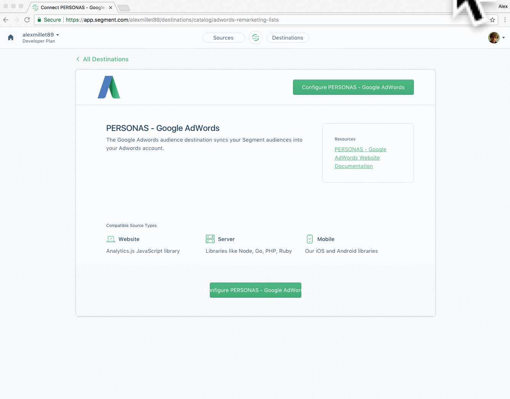
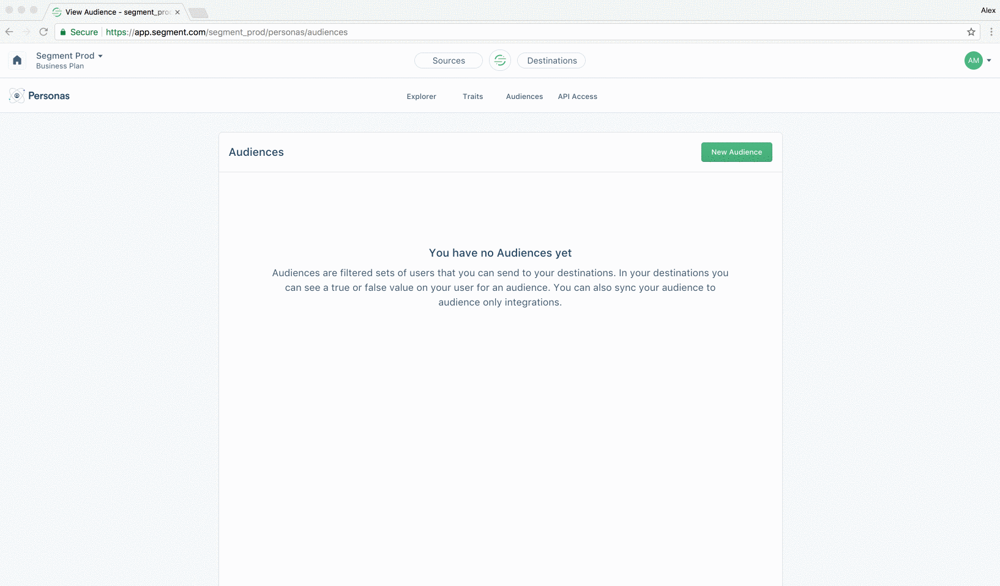

## Overview

The destination lets you sync audiences created through [Segment Personas](/docs/personas) into Google Adword's Remarketing Lists as a **User-List**. Once you've created an audience, Segment will take re of sending that list of users to Google and keeping it up to date as users enter and exit the audience specification.

This will allow you to run advertising campaigns in Google without having to bug your data or engineering team for a csv of users. This doc lays out how authorize Google in Segment, how to create an audience, and what to expect in your Google Adwords UI. Note that you must add Personas to your Segment plan to use this destination. Please [contact](https://segment.com/contact/demo) our sales team if you want to try this out.

## Getting started

### 1. Authorize Google Adwords

Steps:
- Go to `https://app.segment.com/<your-workspace-slug>/destinations/catalog/adwords-remarketing-lists`
- Configure Adwords on the personas source that we’ve pre-created for you (should be called `Personas default`)
- Authorize Google Adwords. *Note that you should have Admin access for the Adwords account you want to connect for Personas to be able to send audiences*

### 2. Create an audience in Segment

Steps:
- Go to `https://app.segment.com/<your-workspace-slug>/personas/audiences` & create a new audience
- Give your audience some event and trait criteria, then click Preview
- Connect your audience to Adwords Remarketing Lists
- Click Create Audience, your audience will now start syncing to Google in a couple minutes

### 3. Check Adwords for audience

Note: You should be able to see the audience under Adword’s Audience Manager shortly after saving the audience in Segment, with the status ‘Populating’. Adwords itself can take from 6-12 hours to process audience uploads before they can be used in a campaign.

- In the Adwords UI, click on ‘Go to’ shortcut in navigation and type ‘Audience Manager'
- Click on the audience with the same name as in the Segment UI, and once it’s done populating check the size of the audience

## Troubleshooting

### Not seeing an audience in Google

Make sure you have authorized Google. You can review & re-authorize this connection directly here: https://app.segment.com/<your_workspace_slug>/destinations/adwords-remarketing-lists/sources/personas_default/configuration

### Audience size smaller than expected

We attempt to match users in your audience with the identifiers that Google supports. For Google this includes email.

## FAQ

### What Adwords platforms are supported?

This destination supports Search, Gmail, and Youtube ad campaigns. Adwords does not support Display campaigns through remarketing lists.


