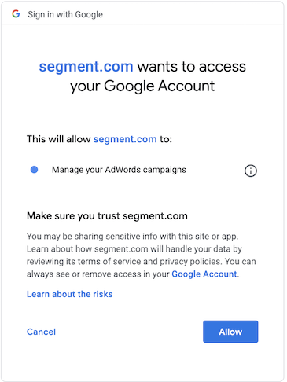

> note "About Google destinations"
> This page is about the **Google Adwords Remarketing Lists** destination supported by Segment Personas. For documentation on other Google Destinations, see the pages below.

| **Google Destination**       | **Supported by Personas** |
| ------------------- | ------------------------- |
| [Google Analytics](/docs/connections/destinations/catalog/google-analytics/)             | Yes - Event Destination   |
| [DoubleClick Floodlight](/docs/connections/destinations/catalog/doubleclick-floodlight/) | Yes - Event Destination   |
| [Google Cloud Pub/Sub](/docs/connections/destinations/catalog/google-cloud-pubsub/)      | Yes - Event Destination   |
| [Google Tag Manager](/docs/connections/destinations/catalog/google-tag-manager/)         | No                        |
| [Google Cloud Function](/docs/connections/destinations/catalog/google-cloud-function/)   | Yes - Event Destination   |
| [Google Cloud Storage](/docs/connections/destinations/catalog/google-cloud-storage/)     | Yes - Event Destination   |
| [Google Ads (Gtag)](/docs/connections/destinations/catalog/google-adwords-new/)          | No                        |
| [Google Ads (Classic)](/docs/connections/destinations/catalog/google-ads-classic/)       | Yes - Event Destination   |
| [Google Analytics](/docs/connections/destinations/catalog/google-analytics/)             | Yes - Event Destination   |
| Google Adwords Remarketing Lists        | Yes - List Destination   |

## Overview

The Google Adwords Remarketing Lists Destination is one of our most popular Personas List Destinations. It has a variety of use cases related to exclusion, acquisition (using Similar Audience), re-marketing, and more.

This Destination can send *audiences* (lists of users) created in [Personas](/docs/personas/) to Google Adwords Audience Lists as a [**Customer List**](https://support.google.com/google-ads/answer/7558048) type. Once you set this up, Segment sends an [initial list](https://developers.google.com/analytics/devguides/config/mgmt/v3/remarketing#insert) of users to Google Adwords Audience lists as a “Customer list”. As users move in and out of the audience, Segment automatically [updates the list](https://developers.google.com/analytics/devguides/config/mgmt/v3/remarketing#insert) in Google every 6 hours. This allows you to run advertising campaigns without having manually update the list of users to target in Adwords campaigns.

Currently, you can only send either an email address or mobile id (IDFA) from Segment Personas to Google as custom matchers. You can set an email address on the user profile by including `email` as a trait on an [`identify` call](/docs/connections/spec/identify/), as a property on a [`track` call](/docs/connections/spec/track/) or as an [external id](/docs/personas/identity-resolution/externalids/) for the user.
If you use Segment’s mobile SDK to collect events from a mobile app, the user’s IDFA is automatically captured. If you do not use Segment’s mobile SDK, you can set the user’s IDFA by setting it within `context.device.advertisingId`.

When you send an audience to Google Adwords Remarketing Lists, you can choose which custom matcher (email or mobile id/IDFA) to match with. If a user has multiple emails or IDFAs on their account as `external_ids`, Personas only sends Adwords the ID that was most recently added to the user profile.

These audience lists can be used serve content on Google Search, YouTube, and Gmail, but are not available on the Google Display Network. You can only target users with email addresses that are associated with a Google account, and you can target users in Gmail only if they have an `@gmail.com` address. <!--For Personas audiences that are compatible with Google Display Network, see our documentation for DV360. -->

> info ""
> **Note**: You must have access to Personas as part of your Segment plan to use this destination. [Contact our sales team](https://segment.com/demo/) to try this out.

## Use Cases: Known Users

Google Adwords Remarketing Lists allows you to efficiently run several marketing and advertising operations. The list below contains the most popular use cases when you know personally identifiable information (PII) about your users, such as email address or mobile device id (IDFA). When you send a Personas audience to Google Adwords Remarketing Lists with email addresses or mobile device ids (IDFA), Segment hashes the PII values before sending them to Google. Google then uses these identifiers to match with users on their ad network to allow the following use cases.

### Exclusion audiences (Suppression audiences)

Create an audience of users that signed up, purchased a product, or otherwise performed some conversion event. You can then send those users to Google in a timely manner (hourly syncs) to prevent advertising to users that already converted. You can do this by creating an Audience in Personas, syncing it to the Google Adwords Remarketing Lists, and setting it as an [Exclusion List](https://support.google.com/google-ads/answer/2549058?hl=en-AU) in your Adwords campaign.

### Similar audience

You can use Personas to create a detailed profile of your most loyal customers (sometimes called a “seed audience”) and then send this list of customers to Google. In Google, you can then use Google’s [Similar Audience](https://support.google.com/google-ads/answer/7151628?hl=en-AU) features to find similar users to target. For example, you might want to create a group of high-value users who have spent a certain amount of money on your product, and then use Similar Audiences to find users who might also spend that much.

> note ""
> **Note:** A “seed audience” must have at least 100 members for Google’s Similar Audience feature to function.

### Re-marketing audiences

You can use Personas to target users who completed some initial action, but didn’t follow through on a purchase or other conversion event. You can create audiences to re-target these individuals and remind them to complete the purchase or other process.  For example, you might send an email to someone who didn’t complete a sign-up form, or who didn’t complete a shopping cart checkout.

## How it works

When you create an audience in Personas and connect it to Google Adwords Remarketing Lists, Segment does the following:

1. Creates an Adwords Audience list (type Customer List) with the name you entered in Personas.
2. Adds any users that fit the audience definition based on Email or Mobile ID (IDFA). Google uses these identifiers to match users in your list to users in the Google system who can be served ads.
3. Every hour, Segment either adds or removes users from this audience based on the same identifiers.

## Quick Info

- **Supports Personas**: Yes
- **Personas Destination type**: List
- **Must create audience_name field before Personas can update those values?**: No, Personas creates the audience for you.
- **Audience appears as**: A Customer list, in the Audience Manager under Audience lists.
- **Destination rate limit**: None
- **Lookback window allowed**: Yes
- **Identifiers required** : Email or Mobile Device ID (IDFA)
- **Identifiers accepted** : Email and Mobile Device ID (IDFA)
- **Client or Server-Side Connection**: Server-side
- **Minimum audience size required**: 100

<!-- commenting out for now because this table format takes a wholepage
| **Support for Personas**      | Yes       |
| **Personas Destination Method** | List            |
| **Must create audience_name field in the tool before Personas can update those values** | No, Personas creates the audience for you. (Changes to the audience name in Personas, are not reflected in Google Adwords Audience lists.) |
| **How does the audience appear within the destination?**    | In the Audience Manager under Audience lists as a Customer list type.       |
| **Are there rate limits?**  | No  |
| **Lookback window allowed by Destination**     | Yes  |
| **Identifiers Required**  | Email or IDFA (Mobile Device ID) |
| **Identifiers Accepted**  | Email and Mobile Device ID (IDFA) |
| **Client vs. Server-Side Connection**   | Server-side  | -->

## Set up

Before you start, make sure you have administrative access to the Adwords account so you can set up and link this destination.

### 1. Add Adwords Remarketing Lists as a Personas Destination**

1. Navigate to the Destinations section of your Personas space, and click **Add Destination**.

2. Search for “Adwords Remarketing Lists” and click **Configure**.

3. Click **Connect to Adwords Remarketing Lists**. You are prompted to sign in to your Google Adwords account. (Make sure you sign in to the account that has administrator access!)

4. When prompted, click **Allow**. This is required for Segment to update your Google Adwords Remarketing Lists.

5. Select the Adwords account to connect with Personas.

### 2. Create an audience in Segment and connect it to Google Adwords Remarketing Lists

1. Navigate to the Personas Audiences tab or go to  `https://app.segment.com/goto-my-workspace/personas/audiences` and create a new audience.
2. Give your audience a name, some event and trait criteria, then click **Preview**.
3. Select “AdWords Remarketing Lists” as a destination for your Audience.
4. Select either Email or Mobile ID to use as a custom matcher.

5. Give your audience a name, and click **Create**.

> warning ""
> **Warning**: If you change the audience name in Personas, the change is not reflected in Google Adwords Audience lists.

### 3. Confirm that the Audience is building in Google Adwords Audience Manager

> info ""
> **Note**: Adwords can take 6-12 hours to process initial audience uploads before they can be used for a campaign. If the audience is still processing, the list status appears as “Populating”.

In Google Adwords go to **Tools & Settings** > **Shared Library**> **Audience manager** > **Audience lists**

## Troubleshooting

#### Not seeing an audience in Google Adwords Audience Manager

Make sure you authorized Google Adwords, and selected the correct account.

Make sure you have administrator access for your Google Adwords account. You can check that your Adwords credentials are correct by navigating the the Adwords Remarketing Lists destination in Personas→ Destinations, and viewing the settings.

### Audience size smaller than expected

Personas matches users in your audience using email and Mobile Device ID (IDFA) values. Make sure you are tracking these with Segment to have as high a match rate as possible.

You can set an email on the user profile by including `email` as a trait, as a property on an event, or as an external id for the user. If you use Segment’s mobile SDKs to collect events from a mobile app, IDFA is automatically captured for the user. You can also set a user’s IDFA on a mobile app by setting it within `context.device.advertisingId`.

If a user has more than one email address or IDFA on their account as `external_ids`, Personas only sends the most recent id on the user profile to Adwords for matching. The match rate will be low if Google can’t identify users based on the data that you provide.

## FAQs

#### What Google campaigns does Personas support?

Personas audiences can only send to Google Adwords Remarketing Lists for Google Search, YouTube and Gmail campaigns. Gmail campaigns can only target users with a `@gmail` address.

#### How many users must be in an audience be to use Google Adwords Campaigns?

100

#### What custom matchers does Personas send to Google Adwords?

Currently, Personas sends either email or mobile device id (IDFA) to Google Adwords for matching. We may add support for additional matchers in the future.

#### If a user has multiple emails or IDFAs on their account, which ids get sent to Google Adwords?

Personas sends the most recent id that was added to the user profile to Google Adwords.

#### How do I enter multiple Mobile App IDs when exporting mobile IDs to Google Adwords?

If you have more than one App ID (such as a separate App ID for Android and iOS apps), add a separate Google Adwords Remarketing List destination for each App ID, and make sure the settings for these destinations include the correct App IDs. 

When you create Personas audiences, add conditions to specify which App ID to send the audience to. For example, you might add a property condition of "where `device.type` contains `iOS`" to send only your iOS users to a specific destination.
