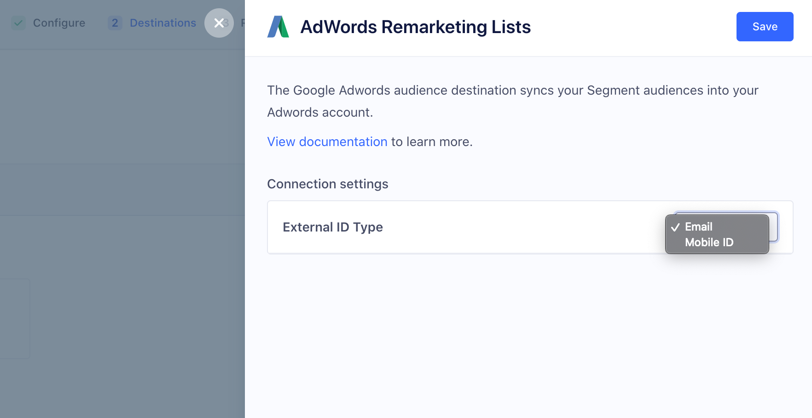

## Overview

The Google Ads Remarketing Lists destination is one of Segment's most popular Personas List destinations. It has a variety of use cases related to exclusion, acquisition (using Similar Audience), remarketing, and more.

This destination can send audiences created in [Personas](/docs/personas/) to Google Ads as a [Customer List](https://support.google.com/google-ads/answer/6276125){:target="_blank"}. Once you set this destination up, Segment sends an initial user list of users to the [Google Ads API](https://developers.google.com/google-ads/api/docs/remarketing/overview){:target="_blank"}. As users move in and out of the audience, Segment automatically updates the list in Google every hour. This allows you to run advertising campaigns without having manually update the list of users to target in your Google Ads campaigns.

You can send either an email address or mobile device ID (IDFA) from Segment Personas to Google as custom matchers. You can set an email address on the user profile by including `email` as a trait on an [`identify` call](/docs/connections/spec/identify/), as a property on a [`track` call](/docs/connections/spec/track/), or as an [external id](/docs/personas/identity-resolution/externalids/) for the user. If you use Segment’s mobile SDKs to collect events from a mobile app, the user’s IDFA is automatically captured. If you don't use Segment’s mobile SDKs, you can set the user’s IDFA by setting it within `context.device.advertisingId`.

Currently, you can only send either an email address or mobile id (IDFA) from Segment Personas to Google as custom matchers. You can set an email address on the user profile by including `email` as a trait on an [`identify` call](/docs/connections/spec/identify/), as a property on a [`track` call](/docs/connections/spec/track/), or as an [external id](/docs/personas/identity-resolution/externalids/) for the user.
If you use Segment's mobile SDK to collect events from a mobile app, the user's IDFA is automatically captured. If you don't use Segment's mobile SDK, you can set the user's IDFA by setting it within `context.device.advertisingId`.

When you send an audience to Google Ads Remarketing Lists, you can choose which custom matcher (email or mobile device ID/IDFA) to match with. If a user has multiple emails or IDFAs on their account as `external_ids`, Personas only sends the ID that was most recently added to the user profile to Google Ads.

These audience lists can be used to serve content on Google Search, YouTube, and Gmail. You can only target users with email addresses that are associated with a Google account, and you can target users in Gmail only if they have an `@gmail.com` address. <!--For Personas audiences that are compatible with Google Display Network, see our documentation for DV360. -->

> info ""
> **Note**: You must have access to Personas as part of your Segment plan to use this destination. [Contact Segment's sales team](https://segment.com/demo/) to try this out.

## Details

- **Supports Personas**: Yes
- **Must create audience_name field before Personas can update those values?**: No, Personas creates the audience for you.
- **Audience appears as**: A Customer list, in the Audience manager under Audience lists.
- **Destination rate limit**: No
- **Lookback window allowed**: Yes
- **Identifiers required** : Email or Mobile Device ID (IDFA)
- **Identifiers accepted** : Email and Mobile Device ID (IDFA)
- **Client or Server-Side Connection**: Server-side
- **Minimum audience size required**: 100

## Use Cases: Known Users

Google Ads Remarketing Lists allows you to efficiently run several marketing and advertising operations. The list below contains the most popular use cases when you know personally identifiable information (PII) about your users, such as email addresses or mobile device IDs (IDFA). When you send a Personas audience to Google Ads Remarketing Lists with email addresses or mobile device IDs (IDFA), Segment hashes the PII values before sending them to Google. Google then uses these identifiers to match with users on their ad network to allow the following use cases.

### Exclusion audiences (Suppression audiences)

Create an audience of users that signed up, purchased a product, or otherwise performed some conversion event. You can then send those users to Google in a timely manner (hourly syncs) to prevent advertising to users that already converted. You can do this by creating an audience in Personas, syncing it to the Google Ads Remarketing Lists, and setting it as an [Exclusion List](https://support.google.com/google-ads/answer/2549058){:target="_blank"} in your Google Ads campaign.

### Similar audience

You can use Personas to create a detailed profile of your most loyal customers (sometimes called a “seed audience”) and then send this list of customers to Google. In Google, you can then use Google's [Similar Audience](https://support.google.com/google-ads/answer/7151628?hl=en-AU) features to find similar users to target. For example, you might want to create a group of high-value users who have spent a certain amount of money on your product, and then use Similar Audiences to find users who might also spend that much.

> note ""
> **Note:** A “seed audience” must have at least 100 members for Google's Similar Audience feature to function.

### Remarketing audiences

You can use Personas to target users who completed some initial action, but didn't follow through on a purchase or other conversion event. You can create audiences to re-target these individuals and remind them to complete the purchase or other process.  For example, you might send an email to someone who didn't complete a sign-up form or who didn't complete a shopping cart checkout.

## How it works

When you create an audience in Personas and connect it to Google Ads Remarketing Lists, Segment performs the following actions:

1. Creates a Google Ads User List (Customer List) with the name you entered in Personas.
2. Adds any users that fit the audience definition based on email or mobile ID (IDFA). Google uses these identifiers to match users in your list to users in the Google system who can be served ads.
3. Every hour, Segment either adds or removes users from this audience based on the same identifiers.

## Set up

Before you start, make sure you have administrative access to the Google Ads account so you can set up and link this destination.

### 1. Add Google Ads Remarketing Lists as a Personas Destination

1. Navigate to the Destinations section of your Personas space, and click **Add Destination**.

2. Search for "Google Ads Remarketing Lists” and click **Configure**.

3. Click **Connect to Google Ads Remarketing Lists** and sign in to your Google Ads account. Make sure you sign in to the account that has administrator access!

4. When prompted, click **Allow**. This is required for Segment to update your Google Ads Remarketing Lists.

5. Select the Google Ads account or sub-account to connect with Personas.

> note ""
> **What are sub-accounts?** Because the Google My Client Center (MCC) account allows a user to access multiple Google Ads accounts through a single user account, Segment has updated the selector to include these additional "sub-accounts." By default, Segment syncs the "primary" Google Ads account connected to your Google account, but when using Google MCC, you can select any of the Google Ads accounts managed by your primary Google Ads account. If you're not using MCC, your primary Google Ads account is connected. MCC is typically used by advertisers or agencies that manage multiple client accounts.

### 2. Create an audience in Segment and connect it to Google Ads Remarketing Lists

1. Navigate to the Personas Audiences tab or go to  `https://app.segment.com/goto-my-workspace/personas/audiences` and create a new audience.
2. Give your audience a name, some event and trait criteria, then click **Preview**.
3. Select “Google Ads Remarketing Lists” as a destination for your audience.
4. Select either email or mobile ID to use as a custom matcher.

5. Give your audience a name, and click **Create**.

> warning ""
> **Warning**: If you change the audience name in Personas, the change will not be reflected in Google Ads.

### 3. Confirm that the list is building in Google Ads Audience manager

In Google Ads, go to **Tools & Settings** > **Shared Library** > **Audience manager** > **Audience lists**.

> info ""
> **Note**: Google Ads can take 24+ hours to fully process initial audience uploads before they can be used for a campaign. If the audience is still processing, the list status appears as “Populating”.

## Troubleshooting

### Not seeing an audience in Google Ads Audience manager

- Make sure you authorized Google Ads and selected the correct account.
- Make sure you have administrator access for your Google Ads account. You can check that your credentials are correct by navigating to the Google Ads Remarketing Lists destination in **Personas** > **Destinations**, and viewing the settings.

### Audience size smaller than expected

Personas matches users in your audience using email and mobile device ID (IDFA) values. Make sure you are tracking these with Segment to have as high a match rate as possible.

You can set an email address on the user profile by including `email` as a trait on an [`identify` call](/docs/connections/spec/identify/), as a property on a [`track` call](/docs/connections/spec/track/), or as an [external id](/docs/personas/identity-resolution/externalids/) for the user. If you use Segment’s mobile SDKs to collect events from a mobile app, the user’s IDFA is automatically captured. If you don't use Segment’s mobile SDKs, you can set the user’s IDFA by setting it within `context.device.advertisingId`.

You can set an email on the user profile by including `email` as a trait, as a property on an event, or as an external id for the user. If you use Segment's mobile SDKs to collect events from a mobile app, IDFA is automatically captured for the user. You can also set a user's IDFA on a mobile app by setting it within `context.device.advertisingId`.

If a user has more than one email address or IDFA on their account as `external_ids`, Personas only sends the most recent id on the user profile to Adwords for matching. The match rate will be low if Google can't identify users based on the data that you provide.

## FAQs

#### What Google Ads campaigns does Personas support?

Personas audiences can only send to Google Ads Remarketing Lists for Google Search, YouTube, and Gmail campaigns. Gmail campaigns can only target users with an `@gmail.com` address.

#### How many users must be in an audience to use Google Ads Campaigns?

100

#### What custom matchers does Personas send to Google Ads?

Currently, Personas sends either email or mobile device ID (IDFA) to Google Ads for matching. Segment may add support for additional matchers in the future.

#### If a user has multiple emails or IDFAs on their account, which IDs get sent to Google Ads?

Personas sends the most recent ID added to the user profile to Google Ads.

#### How do I enter multiple Mobile App IDs when exporting mobile IDs to Google Ads?

If you have more than one App ID (such as a separate App ID for Android and iOS apps), add a separate Google Ads Remarketing Lists destination for each App ID, and make sure the settings for these destinations include the correct App IDs.

When you create Personas audiences, add conditions to specify which App ID to send the audience to. For example, you might add a property condition of "where `device.type` contains `iOS`" to send only your iOS users to a specific destination.
