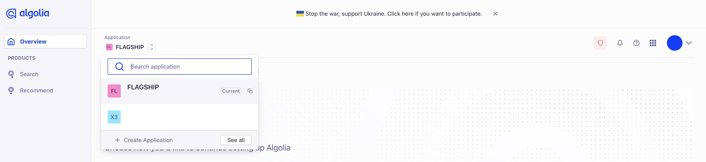
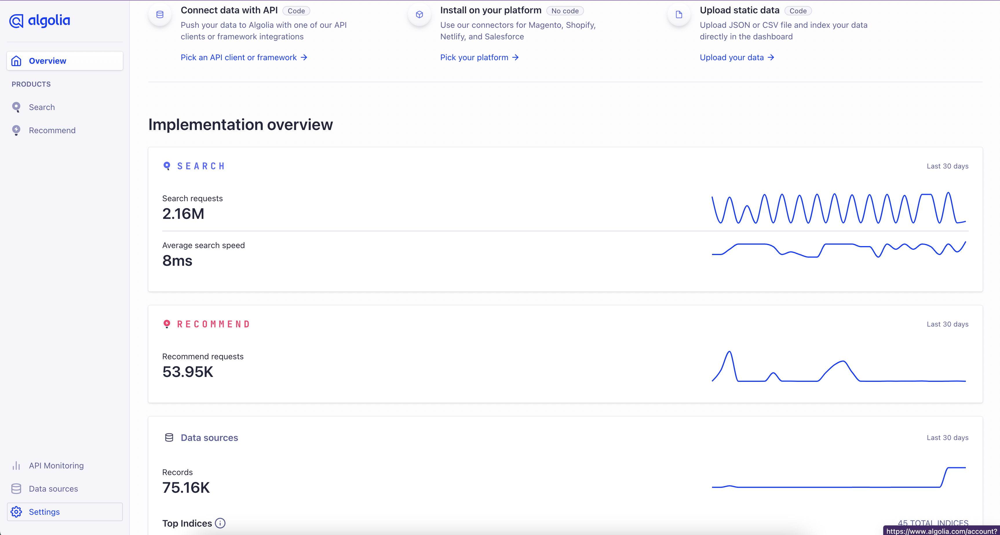
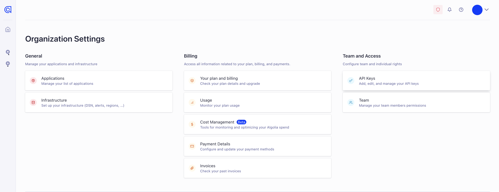
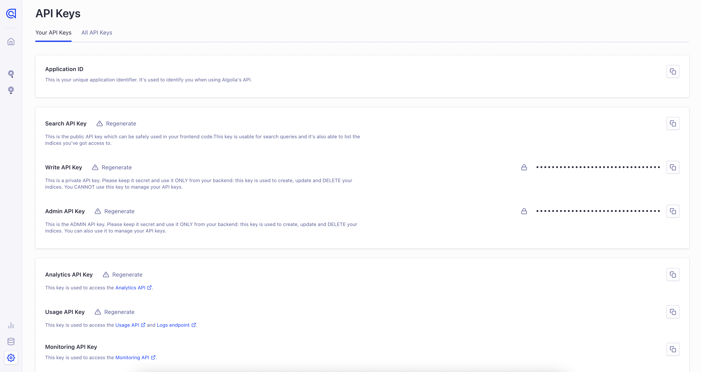
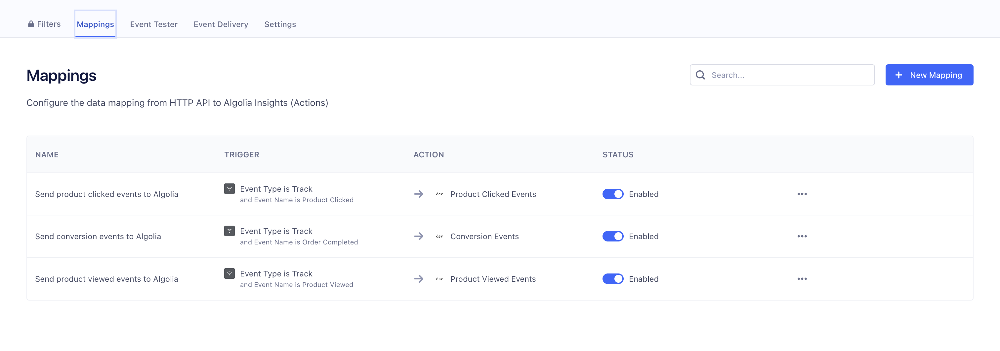
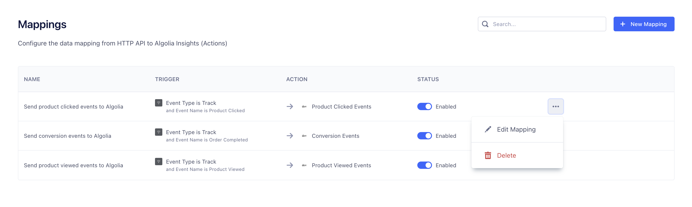

This [Algolia Insights](https://www.algolia.com/products/analytics/) destination is a means of facilitating sending [Insights Events](https://www.algolia.com/doc/guides/sending-events/getting-started/). Sending these events is a required step for using several Algolia features:

- Click and conversion analytics
- A/B Testing
- AI Re-Ranking
- Personalization
- Algolia Recommend

This destination is maintained by [Algolia](https://www.algolia.com/). For any issues with the destination, [contact the Algolia team](mailto:hey@algolia.com).




## Getting Started

1. From the Segment web app, click **Catalog**.
2. Search for "Algolia" in the Catalog, select it, and choose which of your sources to connect the destination to.
3. Enter the "App ID" & "API Key" into your Segment Settings UI which you can find on the Algolia Dashboard, under API Keys menu.

To find your App ID, there are two options. You can find the App Id in the Application dropdown in the Dashboard.



The other location is where you will also find your API Keys. You can find your API Keys in your settings under API Keys, you will need a Search API Key to set up the Destination in Segment. 







> _**NOTE:** The Algolia Insights Destination is not a plug-and-play integration. It requires you to modify your frontend code to send additional Algolia-related data like index name, queryID, etc._

To access your queryID, make sure clickAnalytics are enabled in your search event. If you're using Insights.js this will look like
```js
index.search('query', {
  userToken: 'user-1',
  clickAnalytics: true
})
``` 

Once this is enabled you will be able to send properties like queryId in your segment events. You can read more about how to send Algolia-related data to Segment from [the documentation at Algolia](https://www.algolia.com/doc/guides/sending-events/implementing/connectors/segment/).

## Mapping Events

By default, Algolia has set up mappings for Product Clicked, Product Viewed and Order Completed events. If your event structure doesn't match [Segments V2 Ecommerce Spec](/docs/connections/spec/ecommerce/v2/) you can update this by using the Mapping Tab.





## Track

If you're not familiar with the Segment Specs, take a look to understand what the [Track method](/docs/connections/spec/track/) does.

Algolia supports the following events from Segment's [Ecommerce Spec](/docs/connections/spec/ecommerce/v2/).

<table>
  <tr>
   <td>Supported Events</td>
   <td>Description</td>
  </tr>
  <tr>
   <td><code>Product Viewed</code></td>
   <td>Fire this event when a visitor views a product.</td>
  </tr>
  <tr>
   <td><code>Product Clicked</code></td>
   <td>Fire this event when a visitor clicks a product.</td>
  </tr>
  <tr>
   <td><code>Order Completed</code></td>
   <td>Fire this event whenever an order/transaction was successfully completed by the customer.</td>
  </tr>
</table>

For a full list of required properties for each event type, see the [Spec: V2 Ecommerce Events](/docs/connections/spec/ecommerce/v2/)

```js
analytics.track('Product Viewed', {
    objectID: "hit objectID",
    index: "my-index-name",
    queryID: "Algolia queryID", // required only for Click Analytics,
    // ... other required properties from the spec
})

analytics.track('Product Clicked', {
    objectID: "hit objectID",
    position: hitPositionOnIndex, // number
    index: "my-index-name",
    queryID: "Algolia queryID", // required only for Click Analytics,
    // ... other required properties from the spec
})

analytics.track('Order Completed', {
    index: "my-index-name",
    queryID: "Algolia queryID", // required only for Click Analytics,
    products: [
        {
            objectID: "hit objectID",
            // ... other required properties from the spec
        },
        // ...
    ]
})
```

> _**NOTE:** If you send anonymous activity to Algolia, it will not be connected to activity attributed to that same user once they are identified._
