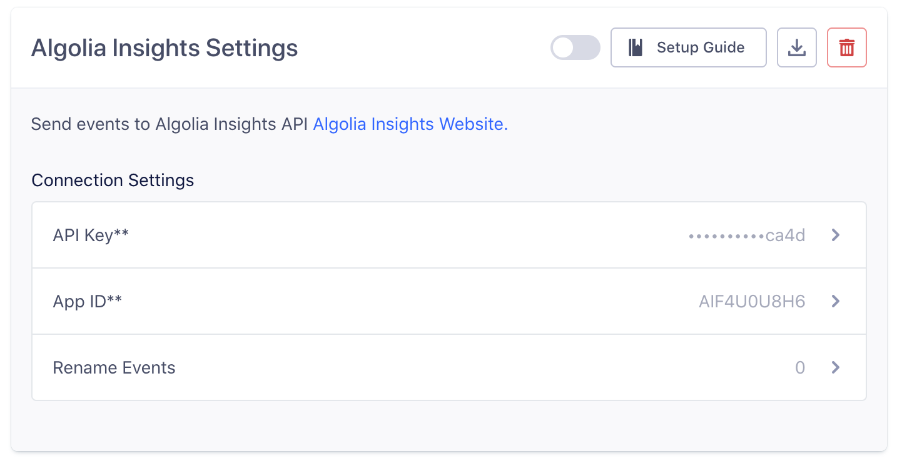

[Algolia Insights](https://www.algolia.com/products/analytics/) lets you push events related to how your product is being used. Sending those events is a required step for using several Algolia features:

- Click and conversion analytics
- A/B Testing
- AI Re-Ranking
- Personalization
- Algolia Recommend

This destination is maintained by [Algolia](https://www.algolia.com/). For any issues with the destination, [contact the Algolia team](mailto:hey@algolia.com).




## Getting Started

1. From the Segment web app, click **Catalog**.
2. Search for "Algolia" in the Catalog, select it, and choose which of your sources to connect the destination to.
3. Enter the "App ID" & "API Key" into your Segment Settings UI which you can find on the Algolia Dashboard, under API Keys menu.

_**NOTE:** The Algolia Insights Destination is not a plug-and-play integration. It requires you to modify your frontend code to send additional Algolia-related data like index name, queryID, etc._


You can read more about how to send Algolia-related data to Segment from [the documentation at Algolia](https://www.algolia.com/doc/guides/sending-events/implementing/connectors/segment/).


## Track

If you're not familiar with the Segment Specs, take a look to understand what the [Track method](/docs/connections/spec/track/) does.

Algolia supports the following six events from Segment's [Ecommerce Spec](/docs/connections/spec/ecommerce/v2/).

<table>
  <tr>
   <td>Supported Events</td>
   <td>Description</td>
  </tr>
  <tr>
   <td><code>Product List Viewed</code></td>
   <td>Fire this event when a visitor views a product list or category.</td>
  </tr>
  <tr>
   <td><code>Product List Filtered</code></td>
   <td>Fire this event when a visitor filters a product list or category.</td>
  </tr>
  <tr>
   <td><code>Product Viewed</code></td>
   <td>Fire this event when a visitor views a product.</td>
  </tr>
  <tr>
   <td><code>Product Clicked</code></td>
   <td>Fire this event when a visitor clicks a product.</td>
  </tr>
  <tr>
   <td><code>Product Added</code></td>
   <td>Fire this event when a visitor adds a product to their shopping cart.</td>
  </tr>
  <tr>
   <td><code>Order Completed</code></td>
   <td>Fire this event whenever an order/transaction was successfully completed by the customer.</td>
  </tr>
</table>

For a full list of required properties for each event type, see the [Spec: V2 Ecommerce Events](/docs/connections/spec/ecommerce/v2/)

```js
analytics.track('Product List Viewed', {
    index: "my-index-name",
    queryID: "Algolia queryID", // required only for Click Analytics,
    products: [{
        objectID: "hit objectID",
        // ... other required properties from the spec
    }]
})

analytics.track('Product List Filtered', {
    index: "my-index-name",
    filters: [
        { type : "free_delivery", value: "true" }
    ],
    // ... other required properties from the spec
})

analytics.track('Product Viewed', {
    objectID: "hit objectID",
    index: "my-index-name",
    queryID: "Algolia queryID", // required only for Click Analytics,
    // ... other required properties from the spec
})


analytics.track('Product Clicked', {
    objectID: "hit objectID",
    position: hitPositionOnIndex, // number
    index: "my-index-name",
    queryID: "Algolia queryID", // required only for Click Analytics,
    // ... other required properties from the spec
})

analytics.track('Product Added', {
    objectID: "hit objectID",
    index: "my-index-name",
    queryID: "Algolia queryID", // required only for Click Analytics,
    // ... other required properties from the spec
})

analytics.track('Order Completed', {
    index: "my-index-name",
    queryID: "Algolia queryID", // required only for Click Analytics,
    products: [
        {
            objectID: "hit objectID",
            // ... other required properties from the spec
        },
        // ...
    ]
})
```

Track calls will be sent to Algolia as a `track` event, and appear in your Click Analytics, A/B Testing and Personalization dashboard.


_**NOTE:** If you send anonymous activity to Algolia, it will not be connected to activity attributed to that same user once they are identified._


## Renaming Events

If you are already sending events of which the names are out of the spec, you need to rename them for Algolia to understand correctly. It doesn't necessarily mean you need to modify your code.

Go to the destination settings and click "Rename Events".



You can put your current event names on the left and the event names following the spec on the right.


