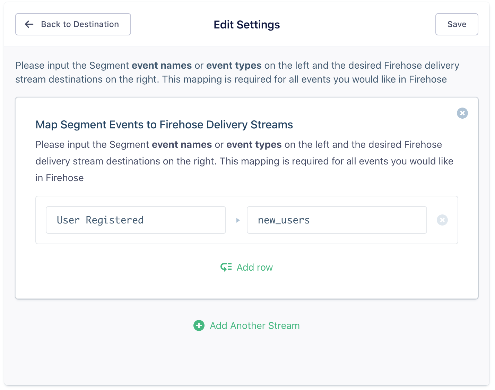
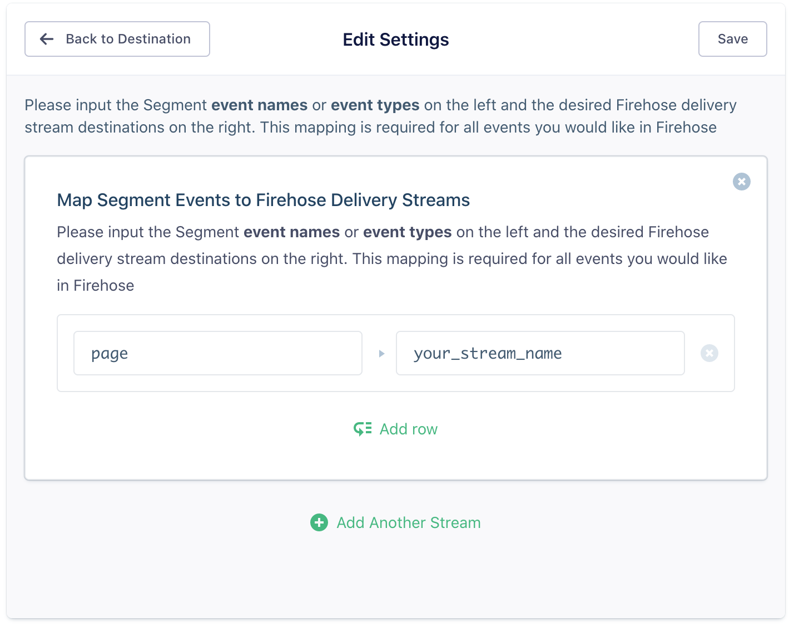

[Amazon Kinesis Firehose](https://aws.amazon.com/kinesis/data-firehose/) provides way to load streaming data into AWS. It can capture, transform, and load streaming data into Amazon Kinesis Analytics, Amazon S3, Amazon Redshift, and Amazon Elasticsearch Service, enabling near real-time analytics with existing business intelligence tools and dashboards you're already using today. It's a fully managed service that automatically scales to match the throughput of your data and requires no ongoing administration. It can also batch, compress, and encrypt the data before loading it, minimizing the amount of storage used at the destination and increasing security.

## Getting Started



To get started:
  1. Create at least one Kinesis Firehose delivery stream. You can follow these [instructions](http://docs.aws.amazon.com/firehose/latest/dev/basic-create.html){:target="_blank"} to create a new delivery stream.
  2. Create an IAM policy.
	  1. Sign in to the [Identity and Access Management (IAM) console](https://console.aws.amazon.com/iam/){:target="_blank"}.
	  2. Follow [these instructions](https://docs.aws.amazon.com/IAM/latest/UserGuide/access_policies_create-console.html#access_policies_create-json-editor){:target="_blank"} to create an IAM policy on the JSON to allow Segment permission to write to your Kinesis Firehose Stream.
     - Use the following template policy in the **Policy Document** field. Be sure to change the `{region}`, `{account-id}` and `{stream-name}` with the applicable values.


		```js
		{
		   "Version": "2012-10-17",
		   "Statement": [
		       {
		           "Effect": "Allow",
		           "Action": [
		               "firehose:PutRecord"
		           ],
		           "Resource": [
		               "arn:aws:firehose:{region}:{account-id}:deliverystream/{stream-name}"
		           ]
		       }
		   ]
		}
		```


  3. Create an IAM role.
	  1. Follow [these instructions](http://docs.aws.amazon.com/IAM/latest/UserGuide/id_roles_create_for-user.html#roles-creatingrole-user-console) to create an IAM role to allow Segment permission to write to your Kinesis Firehose Stream.
	  2. When prompted to enter an Account ID, enter `595280932656`.
	  3. Select the checkbox to enable **Require External ID**.
	  4. Enter your Segment Source ID as the **External ID**. This can be found in Segment by navigating to **Connections > Sources** and choosing the source you want to connect to your Kinesis Firehose destination. Click the **Settings** tab and choose **API Keys**.
    - **Note:** If you have multiple sources using Kinesis, enter one of their source IDs here for now and then follow the procedure outlined in the [Multiple Sources](#best-practices) section at the bottom of this doc once you've completed this step and saved your IAM role.
      5. When adding permissions to your new role, find the policy you created in step 2 and attach it.

4. Create a new Kinesis Firehose Destination.
    1. In the Segment source that you want to connect to your Kinesis Firehose destination, click **Add Destination**.
    2. Search and select the **Amazon Kinesis Firehose** destination and enter details for [these settings options](#settings).

## Page
Take a look to understand what the [Page method](/docs/connections/spec/page/) does. An example call would look like:
```javascript
  analytics.page();
```

## Identify
Take a look to understand what the [Identify method](/docs/connections/spec/identify/) does. An example identify call is shown below:
```javascript
analytics.identify('97980cfea0085', {
  email: 'gibbons@example.com',
  name: 'John Gibbons'
});
```

## Track
Take a look to understand what the [Track method](/docs/connections/spec/track/) does. An example identify call is shown below:

```js
analytics.track("User Registered", {
  checkinDate: new Date(),
  myCoolProperty: "foobar",
});
```

### Event Mapping
To begin using the Kinesis Firehose destination, you must first decide on which Segment events you would like to route to which Firehose delivery streams. This mapping then needs to be defined in your destination settings.

Segment `track` events can map based on their **event name**. For example, if you have an event called `User Registered`, and you want these events to be published to a Firehose delivery stream called `new_users`, create a row in your destination settings that looks like this:



Any Segment **event type** (ie. `page`, `track`, `identify`, `screen`, etc.) can also be mapped. This enables you to publish all instances of a given Segment event type to a given stream. To do this, create a row with the event type and its corresponding delivery stream:



Events can be defined **insensitive to case** so `Page` will be equivalent to `page`. The delivery stream name needs to be formatted exactly as it is on AWS.

If you would like to route all events to a stream, use an `*` as the event name.

### Data Model
Let's say you've decided to publish your Segment track events named `User Registered` to your Kinesis Firehose delivery stream named `online_registrations`. If you send Segment the following `track` call:

```json
{
  "userId": "user_1",
  "event": "User Registered",
  "properties": {
    "plan": "Pro Annual",
    "account_type" : "Facebook"
  }
}
```

The Segment Kinesis destination will issue a `PutRecord` request with the following parameters:

```js
firehose.putRecord({
  Record: {
    Data: JSON.stringify(msg)) + '/n'
  },
  DeliveryStreamName: 'online_registrations'
});
```

Segment appends a newline character to each record to allow for easy downstream parsing.

## Group
Take a look to understand what the [Group method](/docs/connections/spec/group/) does. An example group call is shown below:

```js
analytics.group("0e8c78ea9d9dsasahjg", {
  name: "group_name",
  employees: 3,
  plan: "enterprise",
  industry: "Technology"
});
```

## Best Practices

### Multiple Sources
If you have multiple sources using Kinesis/Firehose, you have two options:

#### Attach multiple sources to your IAM role
To attach multiple sources to your IAM role:
1. Find the IAM role you created for this destination in the AWS Console in **Services > IAM > Roles**.
2. Select the role and navigate to the **Trust Relationships** tab.
3. Click **Edit trust relationship**. You should see a snippet that looks something that looks like this:

    ```json
    {
      "Version": "2012-10-17",
      "Statement": [
        {
          "Effect": "Allow",
          "Principal": {
            "AWS": "arn:aws:iam::595280932656:root"
          },
          "Action": "sts:AssumeRole",
          "Condition": {
            "StringEquals": {
              "sts:ExternalId": "YOUR_SEGMENT_SOURCE_ID"
            }
          }
        }
      ]
    }
    ```

4. Replace that snippet with the following, and replace the contents of the array with all of your source IDs.

    ```json
    {
      "Version": "2012-10-17",
      "Statement": [
        {
          "Effect": "Allow",
          "Principal": {
            "AWS": "arn:aws:iam::595280932656:root"
          },
          "Action": "sts:AssumeRole",
          "Condition": {
            "StringEquals": {
              "sts:ExternalId": ["YOUR_SEGMENT_SOURCE_ID", "ANOTHER_SOURCE_ID", "A_THIRD_SOURCE_ID"]
            }
          }
        }
      ]
    }
    ```

#### Use Secret ID

If you have many sources using Kinesis that it's impractical to attach all of their IDs to your IAM role, you can instead opt to set a Secret ID.

To set this value for a Secret ID:
1. Go to the Kinesis Firehose destination settings from each of your Segment sources.
2. Click **Secret ID**.
    * **NOTE:** For security purposes, Segment sets your Segment Workspace ID as your Secret ID. If you're using a Secret ID different from your Workspace ID, reach out to our support team so they can change it to make your account more secure.
3. Find the IAM role you created for this destination in the AWS Console in **Services > IAM > Roles**.
4. Select the role and navigate to the **Trust Relationships** tab.
5. Click **Edit trust relationship**. You should see a snippet that looks something like this:

    ```json
    {
      "Version": "2012-10-17",
      "Statement": [
        {
          "Effect": "Allow",
          "Principal": {
            "AWS": "arn:aws:iam::595280932656:root"
          },
          "Action": "sts:AssumeRole",
          "Condition": {
            "StringEquals": {
              "sts:ExternalId": "YOUR_SEGMENT_SOURCE_ID"
            }
          }
        }
      ]
    }
    ```
6. Replace the value of `sts:ExternalId` ( "YOUR_SEGMENT_SOURCE_ID") with the Secret ID value from the previous step. In the case of requiring the use of multiple secretIds, replace the `sts:ExternalId` setting above with:

   ```
    "sts:ExternalId": ["A_SECRET_ID", "ANOTHER_SECRET_ID"]
   ```
