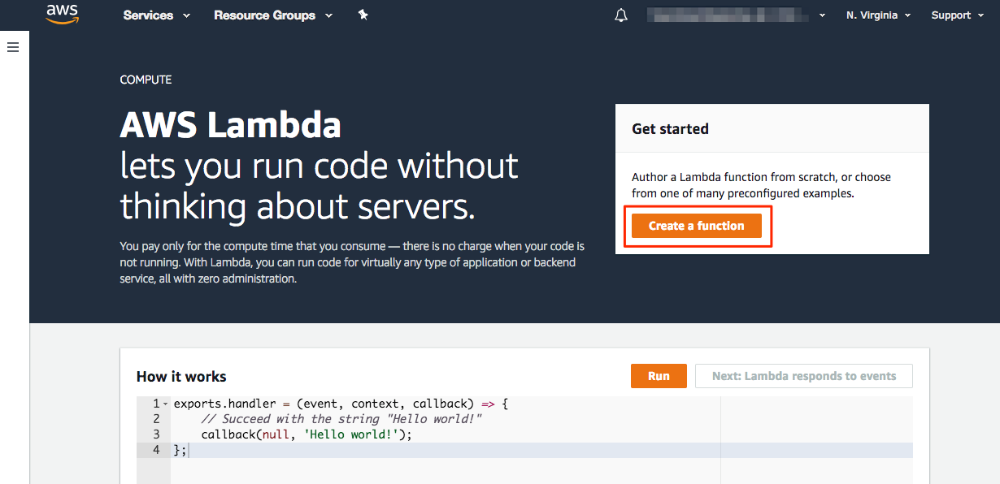
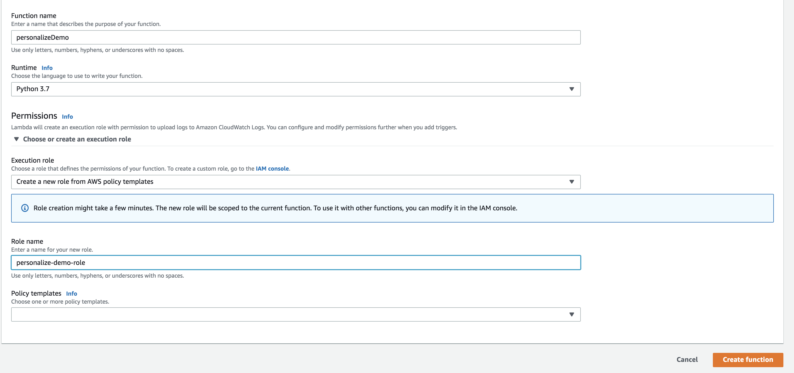
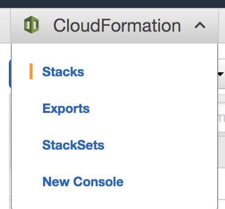
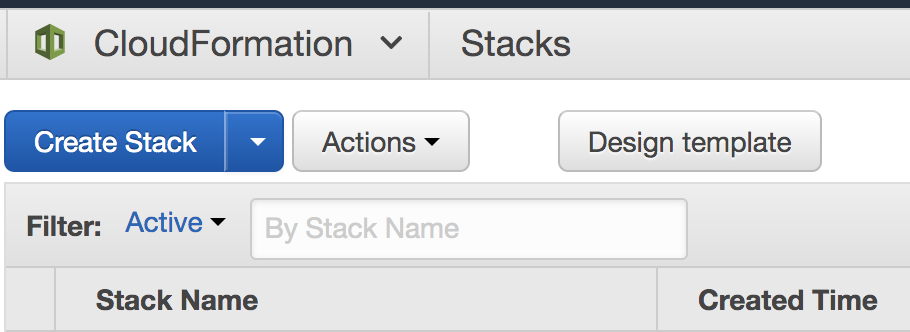
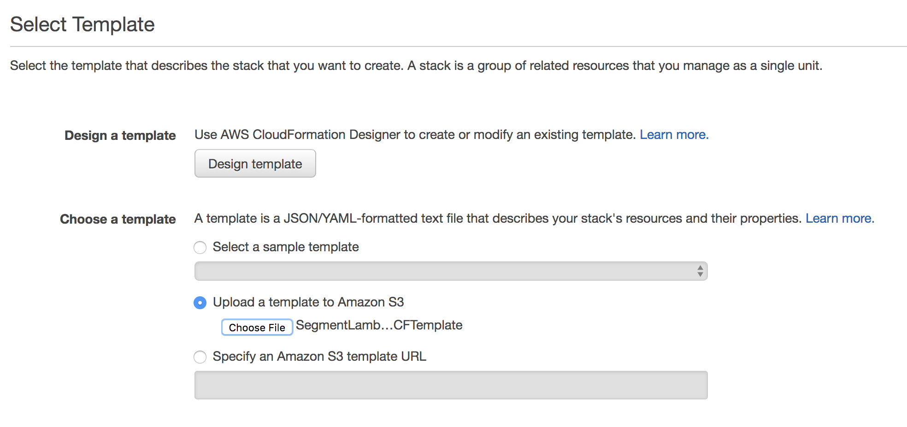
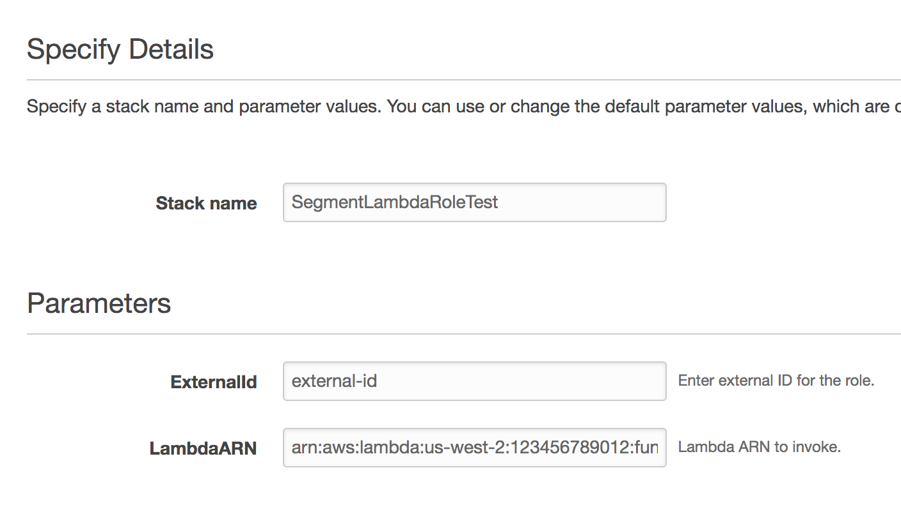
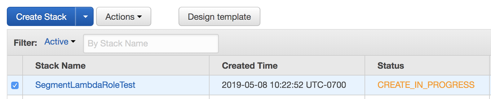
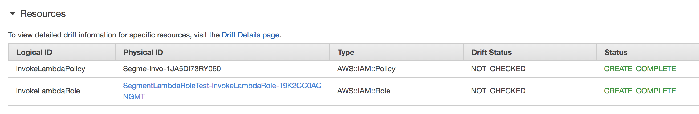
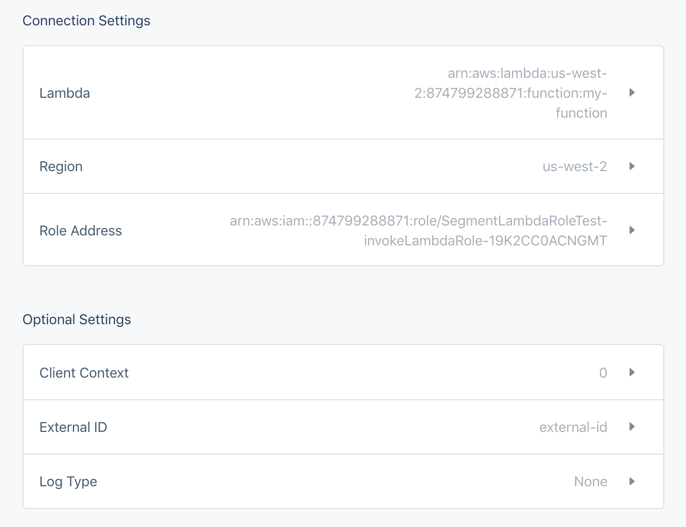
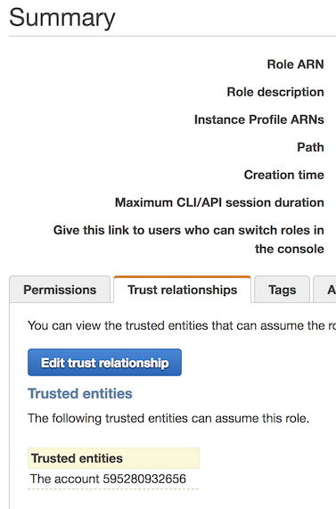

Segment makes it easy to send your data to AWS Lambda (and lots of other destinations). Once you collect your data using Segment's [open source libraries](/docs/connections/sources/catalog/), Segment translates and routes your data to AWS Lambda in the format it can use.

[AWS Lambda](https://aws.amazon.com/lambda/){:target="_blank"} lets you run code without provisioning or managing servers. You pay only for the compute time you consume - there is no charge when your code is not running.

With Lambda, you can run code for any type of application or backend service - all with zero administration. Just upload your code and Lambda takes care of everything required to run and scale your code with high availability. You can set up your code to automatically trigger from other AWS services or call it directly from any web or mobile app.

[Read more about AWS Lambda on the Segment blog](https://segment.com/blog/unleashing-the-power-of-raw-data-with-amazon-lambda/){:target="_blank"}.

## Getting started



To get started, you'll need to:
1. [Build a Lambda function to process Segment events](/docs/connections/destinations/catalog/amazon-lambda/#build-a-lambda-function-to-process-segment-events)
2. [Set up the Segment IAM policy & role for invoking your Lambda](/docs/connections/destinations/catalog/amazon-lambda/#set-up-segment-iam-policy--role-for-invoking-your-lambda)
3. [Configure your Segment Lambda Destination](/docs/connections/destinations/catalog/amazon-lambda/#configure-segment-lambda-destination)


### Build a Lambda function to process Segment events
In order to process events from Segment, you need to provide a Lambda function that can handle your event flow.

Segment allows you to send each call type (`track`,`identify`,etc) to a different Lambda function. The example below shows how to create a new Lambda function from scratch.

To build a Lambda function:
1. Go to the Lambda service page in your AWS account.
2. Click **Create a function** to create a new function.

    

3. Select **Author from scratch** since Segment will be providing the source code for the function.
4. Enter a name for your function and select your preferred runtime.
5. For the **Role** field, select **Create a new role from AWS policy templates** from the dropdown.
6. Create a **Role name** and leave **Policy templates** empty. This will create a role that can write to Cloud Watch logs. Cloud Watch logs are optional, though Segment supports them in the Segment settings.
7. Click **Create function**.

    

8. Copy the **ARN** for the Lambda and paste it into the **Lambda** setting in your Segment Lambda destination settings.

If you scroll down on the main page of your new Lambda function, you will see the code editor. You can write code here or use an existing Lambda function. See the [Lambda documentation](https://docs.aws.amazon.com/lambda/index.html#lang/en_us){:target="_blank"} for more details on creating a Lambda.

### Set up Segment IAM policy & role for invoking your Lambda

Segment will need to be able to call ("invoke") your Lambda in order to process events.  This requires you to configure an IAM role for your Lambda which allows the Segment account to invoke your function.

There are two options for setting up the IAM policy and role:

1. [Use a CloudFormation template](/docs/connections/destinations/catalog/amazon-lambda/#use-cloudformation)(recommended)
2. [Manually create the policy and role](/docs/connections/destinations/catalog/amazon-lambda/#create-policy-and-role-manually)

#### Use CloudFormation

Using CloudFormation minimizes the setup steps needed, and is Segment's recommended way to create your Lambda's policy and role. To use CloudFormation:
1. Create the CloudFormation Template.
   1. Copy or download the [SegmentLambdaDestinationCFTemplate](https://github.com/segmentio/segment-lambda-recipes/blob/ead6c0f77deb38cea7ed486a7b98b47207796b5c/SegmentLambdaDestinationCFTemplate#L1){:target="_blank"} from the [segment-lambda-recipes](https://github.com/segmentio/segment-lambda-recipes){:target="_blank"} GitHub repo.
   2. Save the file with a name you like, but make sure it doesn't have a file extension.
2. Create the CloudFormation stack.
   1. Within the AWS Console, navigate to **CloudFormation > Stacks**.

      

   2. Click **Create Stack**.

      

   3. On the **Select Template** page, select **Upload a template to Amazon S3**. Using **Choose File**, select the SegmentLambdaDestinationCFTemplate you downloaded in the previous step.

   4. Click **Next**.

      

   5. Give your stack a name.
   6. For the **ExternalId** parameter, enter the "External ID" setting in your Segment Lambda destination settings.
      * **NOTE:** For security purposes, Segment will set your Workspace ID as your External ID. If you're currently using an External ID different from your Workspace ID, reach out to our support team so they can change it and make your account more secure.
   7. The **LambdaARN** parameter corresponds to the **Lambda** setting in your Segment Lambda destination settings.

      

   8. You can leave the next page as is, no changes needed.
   9. On the last page, review your template details and click **Create**.
   10. You will now see your new Stack listed in the Stacks page.

        

   11. Once the status is **CREATE_COMPLETE**, click on the name of your Stack.
   12. On the Stack Detail page under the **Resources** section, you will see a policy and role listed.

        

   13. Click the **Physical ID** of the role. You will be redirected to the summary page for the role within the IAM console.
   14. Copy the **Role ARN** and copy it into the **Role Address** setting in your Segment Lambda destination settings.

Using the examples provided, your Segment Lambda destination settings will look something like this:




#### Create Policy and Role Manually

#### Create an IAM policy

To create an IAM policy:
1. Sign in to the [Identity and Access Management (IAM) console](https://console.aws.amazon.com/iam/){:target="_blank"}.
2. Follow these instructions to [Create an IAM policy](http://docs.aws.amazon.com/IAM/latest/UserGuide/access_policies_create.html){:target="_blank"} to allow Segment permission to invoke your Lambda function.
3. Select the **Create Policy from JSON** option and use the following template policy in the **Policy Document** field. Be sure to change the `{region}`, `{account-id}` and `{function-names}` with the applicable values. An example of a Lambda ARN is: `arn:aws:lambda:us-west-2:355207333203:function:``my-example-function`.

> note ""
> **NOTE:** You can put in a placeholder ARN for now, as you will need to come back to this step to update the ARN of your Lambda once you create that.

```json
{
  "Version": "2012-10-17",
  "Statement": [
    {
        "Effect": "Allow",
        "Action": [
            "lambda:InvokeFunction"
        ],
        "Resource": [
            "lambda ARN 1",
            "lambda ARN 2",
            ...
            "lambda ARN n"
        ]
    }
  ]
}
```

#### Create an IAM role

To create an IAM role:
1. Sign in to the [Identity and Access Management (IAM) console](https://console.aws.amazon.com/iam/){:target="_blank"}.
2. Follow these instructions to [Create an IAM role](http://docs.aws.amazon.com/IAM/latest/UserGuide/id_roles_create_for-user.html#roles-creatingrole-user-console){:target="_blank"} to allow Segment permission to invoke your Lambda function.
3. While setting up the new role, add the policy you created in the [previous section](/docs/connections/destinations/catalog/amazon-lambda/#create-an-iam-policy).
4. Finish with any other set up items you may want (like `tags`).
5. Search for and select your new roles from the [IAM home](https://console.aws.amazon.com/iam/home#/home){:target="_blank"}.
6. Select the **Trust Relationships** tab, then click **Edit trust relationship**.

    

7. Copy and paste the following code into your trust relationship. You should replace `<your-source-id>` with either the Source ID of the attached Segment source (the default) or the External ID set in your AWS Lambda destination settings.
  * `arn:aws:iam::595280932656:root` refers to Segment's AWS Account, and is what allows Segment's Destination to access the role to invoke your Lambda.

> note ""
> **Note**: Source ID can be found by navigating to **Settings > API Keys** from your Segment source homepage.

    ```json
    {
      "Version": "2012-10-17",
      "Statement": [
        {
          "Effect": "Allow",
          "Principal": {
            "AWS": "arn:aws:iam::595280932656:root"
          },
          "Action": "sts:AssumeRole",
          "Condition": {
            "StringEquals": {
              "sts:ExternalId": "YOUR_SEGMENT_SOURCE_ID"
            }
          }
        }
      ]
    }
    ```

If you have multiple Sources using this Role, or require the use of multiple External Ids, replace the `sts:ExternalId` setting above with:

```
    "sts:ExternalId": ["YOUR_SEGMENT_SOURCE_ID", "ANOTHER_SOURCE_ID", "AN_EXTERNAL_ID", "ANOTHER_EXTERNAL_ID"]
```

### Configure Segment Lambda Destination
To configure your Segment Lambda destination:
1. In the Segment source that you want to connect to your Lambda destination, click **Add Destination**.
2. Search and select the **Lambda** destination and enter details for [these settings options](/docs/connections/destinations/catalog/amazon-lambda/#settings)

## FAQ

**What is the Log Type Setting?**

This setting controls the [Log Type](https://docs.aws.amazon.com/lambda/latest/dg/API_Invoke.html#API_Invoke_RequestSyntax) for your Lambda function using Cloud Watch. Select option `Tail` if you would like to see [detailed logs](https://docs.aws.amazon.com/lambda/latest/dg/monitoring-functions.html) in Cloud Watch.

**My Lambda <> Segment connection is timing out, what do I do?**

Due to how our event delivery system, [Centrifuge](https://segment.com/blog/introducing-centrifuge/), works, your Lambda can't take more than 5 seconds to run per message. If you're consistently running into timeout issues, you should consult the [AWS Lambda docs](https://docs.aws.amazon.com/lambda/index.html#lang/en_us), as well as docs for your language of choice, for tips on optimizing performance.

**Handling Common Errors**
You can find delivery logs in Destination > [Event Delivery](/docs/connections/event-delivery/).

Here are some common errors you may come across and how to resolve:

`Execution Error` - occurs when the lambda throws an error. Check out the code to ensure the lambda will succeed for that event.

`Operation timedout` - occurs when the lambda takes more than 5s to respond.

`Accessdenied` - occurs when IAM permissions are not set up correctly. Check the IAM policy and role.

`Invalid Credentials` - occurs when IAM permissions are not set up correctly. Check the IAM policy and role.


