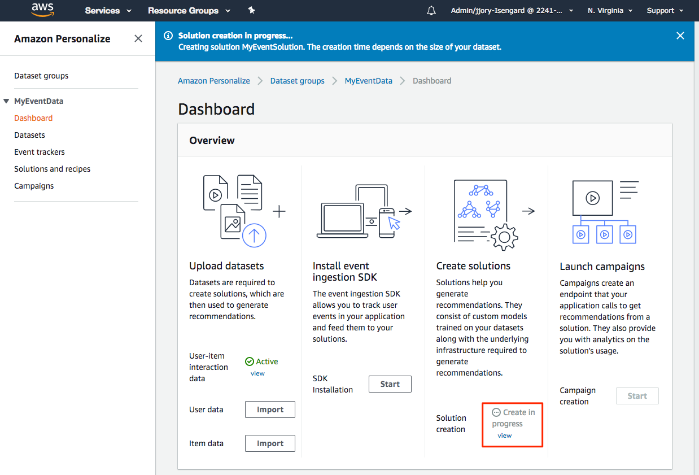

Segment makes it easy to send your data to Amazon Personalize (and lots of other destinations). Once you collect your data using Segment's [open source libraries](/docs/connections/sources/catalog/), Segment translates and routes your data to Amazon Personalize in the format it can use. [Amazon Personalize](https://aws.amazon.com/personalize/) is a machine learning service that makes it easy for developers to create individualized recommendations for customers using their applications. AWS Personalize enables:

  - Media companies to provide recommended content for viewers based on their viewing history
  - Retailers to provide personalized product recommendations based on shopping behavior
  - Any company to provide personalized search results and targeted marketing promotions based on the latest machine-learning capabilities developed at Amazon

Developing the machine-learning capabilities necessary to produce these recommendation systems has been beyond the reach of most organizations today due to the complexity of developing machine learning functionality. Amazon Personalize allows developers with no prior machine learning experience to build sophisticated personalization capabilities into their applications, using machine learning technology perfected from years of use on Amazon.com.

## Getting Started



These are the pre-requisites you need before getting started:

1. Segment data flowing into an S3 destination, a Snowflake warehouse, or Amazon Redshift warehouse.
2. You have the ability to create AWS Glue jobs (only required if using S3 to [train your model](#train-your-model))
3. You have the ability to deploy Lambda functions in Amazon Web Services
4. You have access to AWS Personalize

If you don't have S3, Redshift warehouse, or Snowflake warehouse configured, you can read more about setting up [S3](/docs/connections/storage/catalog/aws-s3/), [Redshift](/docs/connections/storage/catalog/redshift/), and [Snowflake](/docs/connections/storage/catalog/snowflake/).

***If you're a Segment business tier customer, contact your Success contact to initiate a replay to S3 or your Warehouse.***

There are three main parts to using Amazon Personalize with Segment:

1. [Train your model](/docs/connections/destinations/catalog/amazon-personalize/#train-your-model) on historical data in S3 or a Warehouse.
2. [Create a Personalize Dataset Group](/docs/connections/destinations/catalog/amazon-personalize/#create-personalize-dataset-group-solution-and-campaign) and Campaign
3. [Connect Recommendations](/docs/connections/destinations/catalog/amazon-personalize/#getting-recommendations-and-live-event-updates) and Live Event Updates to your Campaign and Segment

## Train Your Model

**S3 Bucket Permissions**

Whatever method you choose to train your model will result in placing a CSV into an S3 bucket. Be sure to update the policies of the bucket to include [these permissions](https://docs.aws.amazon.com/personalize/latest/dg/data-prep-upload-s3.html){:target="_blank"} to allow Personalize to access your CSV:

```json
{
    "Version": "2012-10-17",
    "Id": "PersonalizeS3BucketAccessPolicy",
    "Statement": [
        {
            "Sid": "PersonalizeS3BucketAccessPolicy",
            "Effect": "Allow",
            "Principal": {
                "Service": "personalize.amazonaws.com"
            },
            "Action": [
                "s3:GetObject",
                "s3:ListBucket"
            ],
            "Resource": [
                "arn:aws:s3:::bucket-name",
                "arn:aws:s3:::bucket-name/*"
            ]
        }
    ]
}
```

**Define a Schema**

To train a Personalize model, you'll need to define the event schema for the event names and properties that your model uses as features. For the examples below, Segment is using the following Personalize Dataset schema to train the model. You'll want to modify this to suit your use cases.  You can learn more about [Personalize schemas](https://docs.aws.amazon.com/personalize/latest/dg/how-it-works-dataset-schema.html){:target="_blank"}.

```json
{
    "type": "record",
    "name": "Interactions",
    "namespace": "com.amazonaws.personalize.schema",
    "fields": [
        {
            "name": "USER_ID",
            "type": "string"
        },
        {
            "name": "ITEM_ID",
            "type": "string"
        },
        {
            "name": "EVENT_TYPE",
            "type": "string"
        },
        {
            "name": "TIMESTAMP",
            "type": "long"
        }
    ],
    "version": "1.0"
}
```

The examples show how multiple Segment `track` events are mapped into this schema and used to train a Personalize solution.

### From Redshift

If you already use Redshift, training your model on the data in your warehouse is the simplest way to get up and running.

**Unload Data from Redshift to S3**

  Assuming you have a Personalize schema like that described [below](#create-personalize-dataset-group), you can use the following query to pull out all the date from your `Order Completed`, `Product Added`, and `Product Viewed` events.

```sql
unload ('
  select
    user_id as USER_ID,
    products_sku as ITEM_ID,
    event as EVENT_TYPE,
    date_part(epoch,"timestamp") as TIMESTAMP
  from prod.order_completed
  UNION
  select
    user_id as USER_ID,
    products_sku as ITEM_ID,
    event as EVENT_TYPE,
    date_part(epoch,"timestamp") as TIMESTAMP
  from prod.product_added
  UNION
  select
    user_id as USER_ID,
    products_sku as ITEM_ID,
    event as EVENT_TYPE,
    date_part(epoch,"timestamp") as TIMESTAMP
  from prod.product_viewed
')
to
's3://mybucket/my_folder'
credentials 'aws_access_key_id=AWS_ACCESS_KEY_ID;aws_secret_access_key=AWS_SECRET_ACCESS_KEY;token=AWS_SESSION_TOKEN'
HEADER
REGION AS '<your-region>'
DELIMITER AS ','
PARALLEL OFF;
```

**Note:** Use `date_part(epoch,"timestamp") as TIMESTAMP` because Personalize requires timestamps to be specified in UNIX/epoch time.

**Verify the Output file**
Browse to the S3 service page in the AWS console and navigate to the bucket path specified in the `unload` command. You should see the output file.


### From Snowflake

There are a few ways to load a CSV into S3 from your [Snowflake](https://docs.snowflake.net/manuals/user-guide/data-unload-s3.html){:target="_blank"} warehouse. This example shows loading the data directly into an S3 bucket.

Assuming you have a Personalize schema like that described [below](/docs/connections/destinations/catalog/amazon-personalize/#create-personalize-dataset-group), you can use the following query to pull out all the date from your `Order Completed`, `Product Added`, and `Product Viewed` events.

**Unload Data from Snowflake to S3**

```sql
    copy into
    s3://mybucket/my_folder/my_file.csv
    from
    (
      select
      user_id as USER_ID,
      products_sku as ITEM_ID,
      event as EVENT_TYPE,
      date_part(epoch,"timestamp") as TIMESTAMP
      from prod.order_completed
      UNION
      select
      user_id as USER_ID,
      products_sku as ITEM_ID,
      event as EVENT_TYPE,
      date_part(epoch,"timestamp") as TIMESTAMP
      from prod.product_added
      UNION
      select
      user_id as USER_ID,
      products_sku as ITEM_ID,
      event as EVENT_TYPE,
      date_part(epoch,"timestamp") as TIMESTAMP
      from prod.product_viewed
    )
    file_format=(type=csv)
    single = true -- Personlize requires a single CSV file
    credentials = (aws_key_id='xxxx' aws_secret_key='xxxxx' aws_token='xxxxxx');
```

This example uses temporary S3 credentials, which are generated by AWS STS and expire after a specific period of time. Temporary credentials are [recommended](https://docs.snowflake.net/manuals/user-guide/data-unload-s3.html#unloading-data-directly-into-an-s3-bucket){:target="_blank"} to protect access to the bucket.

**Verify the Output file**
Go to the S3 service page in the AWS console and navigate to the bucket path specified in the `unload` command. You should see the output file.


### From S3

**Historical Data Preparation**

Segment's S3 destination contains a copy of all of the source data you configured to go to S3.  In your S3 bucket there's a folder called `/segment-logs`.  Under this folder is another folder for each source of data you connected to your Segment S3 destination.

Note that this step is not required unless you plan to do batch data extraction from S3.

Your Glue ETL job will need to crawl each source folder to extract the backup data that forms your training set.  Analysis of this data set is beyond the scope of this document.  It is strongly recommended you familiarize yourself with the types of events that can be sent through Segment.  Segment's event structure is described in detail [here](/docs/connections/sources/catalog/libraries/server/http/).

The following examples show how to configure an AWS Glue job to convert Segment historical data into the Apache Avro format that Personalize wants to consume for training data sets.

**Create AWS Glue ETL Job**

To create an AWS Glue ETL Job:
1. Create a new AWS service IAM role using the following execution policies. These policies give your Glue job the ability to write to your S3 bucket:
  * Policy 1:

      ```json
      {
          "Version": "2012-10-17",
          "Statement": [
              {
                  "Effect": "Allow",
                  "Action": [
                      "glue:*",
                      "s3:GetBucketLocation",
                      "s3:ListBucket",
                      "s3:ListAllMyBuckets",
                      "s3:GetBucketAcl",
                      "ec2:DescribeVpcEndpoints",
                      "ec2:DescribeRouteTables",
                      "ec2:CreateNetworkInterface",
                      "ec2:DeleteNetworkInterface",
                      "ec2:DescribeNetworkInterfaces",
                      "ec2:DescribeSecurityGroups",
                      "ec2:DescribeSubnets",
                      "ec2:DescribeVpcAttribute",
                      "iam:ListRolePolicies",
                      "iam:GetRole",
                      "iam:GetRolePolicy",
                      "cloudwatch:PutMetricData"
                  ],
                  "Resource": [
                      "*"
                  ]
              },
              {
                  "Effect": "Allow",
                  "Action": [
                      "s3:CreateBucket"
                  ],
                  "Resource": [
                      "arn:aws:s3:::aws-glue-*"
                  ]
              },
              {
                  "Effect": "Allow",
                  "Action": [
                      "s3:GetObject",
                      "s3:PutObject",
                      "s3:DeleteObject"
                  ],
                  "Resource": [
                      "arn:aws:s3:::aws-glue-*/*",
                      "arn:aws:s3:::*/*aws-glue-*/*"
                  ]
              },
              {
                  "Effect": "Allow",
                  "Action": [
                      "s3:GetObject"
                  ],
                  "Resource": [
                      "arn:aws:s3:::crawler-public*",
                      "arn:aws:s3:::aws-glue-*"
                  ]
              },
              {
                  "Effect": "Allow",
                  "Action": [
                      "logs:CreateLogGroup",
                      "logs:CreateLogStream",
                      "logs:PutLogEvents"
                  ],
                  "Resource": [
                      "arn:aws:logs:*:*:/aws-glue/*"
                  ]
              },
              {
                  "Effect": "Allow",
                  "Action": [
                      "ec2:CreateTags",
                      "ec2:DeleteTags"
                  ],
                  "Condition": {
                      "ForAllValues:StringEquals": {
                          "aws:TagKeys": [
                              "aws-glue-service-resource"
                          ]
                      }
                  },
                  "Resource": [
                      "arn:aws:ec2:*:*:network-interface/*",
                      "arn:aws:ec2:*:*:security-group/*",
                      "arn:aws:ec2:*:*:instance/*"
                  ]
              }
          ]
      }
      ```

    * Policy 2:

        ```json
        {
            "Version": "2012-10-17",
            "Statement": [
                {
                    "Effect": "Allow",
                    "Action": [
                        "s3:GetObject",
                        "s3:PutObject"
                    ],
                    "Resource": [
                        "arn:aws:s3:::{ your bucket arn }/segment-logs/*",
                        "arn:aws:s3:::{ your bucket arn }/transformed/*"
                    ]
                }
            ]
        }
      ```
1. Navigate to the Glue service in your AWS console.
2. Click **Get started** and then select **Jobs** from the left navigation on the Glue console page.
3. Select **Spark script editor** and click **Create**.
4. The following code sample is the source code for a generic Glue job. Copy the code example to your clipboard and paste it into the Glue editor window, modifying as necessary to reflect the names of the events you wish to extract from the Segment logs (see line #25).

    ```python
    import sys
    from awsglue.transforms import *
    from awsglue.utils import getResolvedOptions
    from awsglue.context import GlueContext
    from awsglue.dynamicframe import DynamicFrame
    from awsglue.job import Job
    from pyspark.context import SparkContext
    from pyspark.sql.functions import unix_timestamp

    ## @params: [JOB_NAME,S3_JSON_INPUT_PATH,S3_CSV_OUTPUT_PATH]
    args = getResolvedOptions(sys.argv, ['JOB_NAME', 'S3_JSON_INPUT_PATH', 'S3_CSV_OUTPUT_PATH'])

    sc = SparkContext()
    glueContext = GlueContext(sc)
    spark = glueContext.spark_session
    job = Job(glueContext)
    job.init(args['JOB_NAME'], args)

    # Load JSON into dynamic frame
    datasource0 = glueContext.create_dynamic_frame.from_options('s3', {'paths': [args['S3_JSON_INPUT_PATH']], 'recurse': True}, 'json')
    print("Input file: ", args['S3_JSON_INPUT_PATH'])
    print("Input file total record count: ", datasource0.count())

    # Filters the JSON documents that we want included in the output CSV
    supported_events = ['Product Added', 'Order Completed', 'Product Clicked']
    def filter_function(dynamicRecord):
            if ('anonymousId' in dynamicRecord and
                            'userId' in dynamicRecord and
                            'properties' in dynamicRecord and
                            'sku' in dynamicRecord["properties"] and
                            'event' in dynamicRecord and
                            dynamicRecord['event'] in supported_events):
                    return True
            else:
                    return False

    # Apply filter function to dynamic frame
    interactions = Filter.apply(frame = datasource0, f = filter_function, transformation_ctx = "interactions")
    print("Filtered record count: ", interactions.count())

    # Map only the fields we want in the output CSV, changing names to match target schema.
    applymapping1 = ApplyMapping.apply(frame = interactions, mappings = [ \
            ("anonymousId", "string", "ANONYMOUS_ID", "string"), \
            ("userId", "string", "USER_ID", "string"), \
            ("properties.sku", "string", "ITEM_ID", "string"), \
            ("event", "string", "EVENT_TYPE", "string"), \
            ("timestamp", "string", "TIMESTAMP_ISO", "string")], \
            transformation_ctx = "applymapping1")

    # Repartition to a single file since that is what is required by Personalize
    onepartitionDF = applymapping1.toDF().repartition(1)
    # Coalesce timestamp into unix timestamp
    onepartitionDF = onepartitionDF.withColumn("TIMESTAMP", \
            unix_timestamp(onepartitionDF['TIMESTAMP_ISO'], "yyyy-MM-dd'T'HH:mm:ss.SSS'Z'"))
    # Convert back to dynamic frame
    onepartition = DynamicFrame.fromDF(onepartitionDF, glueContext, "onepartition_df")

    # Write output back to S3 as a CSV
    glueContext.write_dynamic_frame.from_options(frame = onepartition, connection_type = "s3", \
            connection_options = {"path": args['S3_CSV_OUTPUT_PATH']}, \
            format = "csv", transformation_ctx = "datasink2")

    job.commit()
    ```
5. Select the **Job details** tab.
6. Enter a name for your Glue job. 
6. Leave Type as **Spark**.
7. Make any optional changes on the Job details page, and click **Save** to save the job script.

To review key parts of the Python script in more detail:
1. The script is initialized with a few job parameters. You'll see how to specify these parameter values when the job below runs. For now, see that Segment is passing in the location of the raw JSON files using `S3_JSON_INPUT_PATH` and the location where the output CSV should be written through `S3_CSV_OUTPUT_PATH`.

    ```python
        args = getResolvedOptions(sys.argv, ['JOB_NAME', 'S3_JSON_INPUT_PATH', 'S3_CSV_OUTPUT_PATH'])
    ```

2. The Spark and Glue contexts are created and associated. A Glue Job is also created and initialized.

    ```python
        sc = SparkContext()
        glueContext = GlueContext(sc)
        spark = glueContext.spark_session
        job = Job(glueContext)
        job.init(args['JOB_NAME'], args)
    ```

3. The first step in Segment's Job is to load the raw JSON file as a Glue DynamicFrame.

    ```python
       datasource0 = glueContext.create_dynamic_frame.from_options('s3', {'paths': [args['S3_JSON_INPUT_PATH']], 'recurse': True}, 'json')
    ```

4. Since not all events that are written to S3 by Segment are relevant to training a Personalize model, Segment uses Glue's `Filter` transformation to keep the records needed.
5. The `datasource0` DynamicFrame created above is passed to `Filter.apply(...)` function along with the `filter_function` function. It's in `filter_function` where Segment keeps events that have a product SKU and `userId` specified. The resulting DynamicFrame is captured as `interactions`.

    ```python
    def filter_function(dynamicRecord):
        if dynamicRecord["properties"]["sku"] and dynamicRecord["userId"]:
            return True
        else:
            return False

    interactions = Filter.apply(frame = datasource0, f = filter_function, transformation_ctx = "interactions")
    ```

6. Segment calls Glue's `ApplyMapping` transformation, passing the `interactions` DynamicFrame from above and field mapping specification that indicates the fields Segment wants to retain and their new names. These mapped field names become the column names in Segment's output CSV. You'll notice that Segment is using the product SKU as the `ITEM_ID` and `event` as the `EVENT_TYPE`. Segment also renames the `timestamp` field to `TIMESTAMP_ISO` since the format of this field value in the JSON file is an ISO 8601 date and Personalize requires timestamps to be specified in UNIX time (number seconds since Epoc).

    ```python
    applymapping1 = ApplyMapping.apply(frame = interactions, mappings = [ \
        ("anonymousId", "string", "ANONYMOUS_ID", "string"), \
        ("userId", "string", "USER_ID", "string"), \
        ("properties.sku", "string", "ITEM_ID", "string"), \
        ("event", "string", "EVENT_TYPE", "string"), \
        ("timestamp", "string", "TIMESTAMP_ISO", "string")], \
        transformation_ctx = "applymapping1")
    ```

7. To convert the ISO 8601 date format to UNIX time for each record, Segment uses Spark's `withColumn(...)` to create a new column called `TIMESTAMP` that is the converted value of the `TIMESTAMP_ISO` field. Before Segment can call `withColumn`, Segment needs to convert the Glue DynamicFrame into a Spark DataFrame. That is accomplished by calling `toDF()` on the output of ApplyMapping transformation above. Since Personalize requires Segment's uploaded CSV to be a single file, Segment calls `repartition(1)` on the DataFrame to force all data to be written in a single partition. After creating the `TIMESTAMP` in the expected format, `DyanmicFrame.fromDF()` is called to convert the DataFrame back into a DyanmicFrame.

    ```python
        # Repartition to a single file
        onepartitionDF = applymapping1.toDF().repartition(1)
        # Coalesce timestamp into unix timestamp
        onepartitionDF = onepartitionDF.withColumn("TIMESTAMP", \
            unix_timestamp(onepartitionDF['TIMESTAMP_ISO'], "yyyy-MM-dd'T'HH:mm:ss.SSS'Z'"))
        # Convert back to dynamic frame
        onepartition = DynamicFrame.fromDF(onepartitionDF, glueContext, "onepartition_df")
    ```

8. Segment's CSV is written back to S3 at the path specified by the `S3_CSV_OUTPUT_PATH` job property and commits the job.

    ```python
        glueContext.write_dynamic_frame.from_options(frame = onepartition, connection_type = "s3", \
            connection_options = {"path": args['S3_CSV_OUTPUT_PATH']}, \
            format = "csv", transformation_ctx = "datasink2")

        job.commit()
    ```

**Run Your AWS Glue ETL Job**

With Segment's ETL Job script created and saved, it's time to run the job to create the CSV needed to train a Personalize Solution. To do this:

1. Open another AWS console browser tab/window by right-clicking on the AWS logo in the upper left corner of the page and select **Open Link in New Tab** (or Window).

2. While still in the Glue service console and the job listed, click **Run job**. This will cause the Parameters panel to display.

3. Click the **Security configuration, script libraries, and job parameters** section header to cause the job parameters fields to be displayed.

    


4. Scroll down to the **Job parameters** section. This is where Segment will specify the job parameters that Segment's script expects for the path to the input data and the path to the output file.
5. Create two job parameters with the following key and value.
  * Be sure to prefix each key with `--` as shown. Substitute your account ID for `[ACCOUNT_ID]` in the values below. You copy the bucket name to your clipboard from the S3 service page in the tab/window you opened above. The order they are specified does not matter.

    | **Key**              | **Value**                                      |
    | -------------------- | ---------------------------------------------- |
    | --S3_JSON_INPUT_PATH | s3://personalize-data-[ACCOUNT_ID]/raw-events/ |
    | --S3_CSV_OUTPUT_PATH | s3://personalize-data-[ACCOUNT_ID]/transformed |

    


6. Click **Run job** to start the job.  Note that this dialog scrolls.

7. Once the job has started running, you'll see log output in the **Logs** tab at the bottom of the page. It may take a few minutes to complete.

8. When the job completes, click the **X** in the upper right corner of the page to exit the job script editor.

**Verify Output File**

To verify the output file:

1. Go to the S3 service page in the AWS console and find the bucket with a name starting with `personalize-data-...`.
2. Click on the bucket name. If the job completed successfully, you'll see a folder named **transformed**.
3. Click on **transformed** and you'll see the output file created by the ETL job.

    


## Create Personalize Dataset Group, Solution and Campaign

### Create Personalize Dataset Group

To create a personalize dataset group:

1. Browse to the Amazon Personalize service landing page in the AWS console.

2. Click **View dataset groups** to get started.

    

3. On the Dataset Groups page, click **Create dataset group**.

    

4. On the **Create dataset group** page, give your dataset group a name.

5. Select **Upload user-item interaction data** since Segment will be uploading the CSV prepared in the previous steps.

6. Click **Next** to continue.

    


7. On the **Create user-item interaction data** page, select **Create new schema** and give your schema a name.

    


8. Scroll down to the **Schema definition** editor. Dataset schemas in Personalize are represented in [Avro](https://avro.apache.org/docs/current/spec.html){:target="_blank"}. Learn more about For detailed [Personalize schema definitions](https://docs.aws.amazon.com/personalize/latest/dg/how-it-works-dataset-schema.html){:target="_blank"}.
  * Avro is a remote procedure call and data serialization framework developed within Apache's Hadoop project. It uses JSON for defining data types and protocols, and serializes data in a compact binary format.
  * This example uses the following example schema:

        ```json
        {
            "type": "record",
            "name": "Interactions",
            "namespace": "com.amazonaws.personalize.schema",
            "fields": [
                {
                    "name": "USER_ID",
                    "type": "string"
                },
                {
                    "name": "ITEM_ID",
                    "type": "string"
                },
                {
                    "name": "EVENT_TYPE",
                    "type": "string"
                },
                {
                    "name": "TIMESTAMP",
                    "type": "long"
                }
            ],
            "version": "1.0"
        }
        ```

        * The required fields for the user-item interaction dataset schema are `USER_ID`, `ITEM_ID`, and `TIMESTAMP`. There's also an optional field `EVENT_TYPE`.

9. Copy the contents of Avro schema to your clipboard and paste it into the "Schema definition" editor (replacing the proposed schema).

10. Click **Next** to save the schema and move to the next step.

11. The **Import user-item interaction data** step is displayed next. To complete this form Segment needs to get two pieces of information from IAM and S3. Give your import job a name and set the automatic import to **Off**.

12. For the **IAM service role**, select **Create a new role** from the dropdown.
13. In the next pop-up, Segment recommends listing your bucket name in the **Specific S3 buckets** option, but you're free to choose the option that best suits your needs.

14. Find the location of the CSV file you generated in the earlier steps. This needs to be configured in the **Data Location** field on this screen.

    

15. After clicking the **Finish** button at the bottom of the page, you'll return to the Personalize Dashboard where you can monitor the progress of your interaction dataset as it is being created.

Be patient as this process can take a long time to complete.


### Create Personalize Solution

Once Segment's event CSV is finished importing into a user-item interaction dataset, Segment can create a Personalize Solution. To do this:

1. From the Dashboard page for the dataset group created above, click **Start** in the **Create solutions** column.

    

2. On the **Create solution** page, enter a **Solution name**.
  * For a discussion on the different recipes you can use with Personalize, see [here](https://docs.aws.amazon.com/personalize/latest/dg/working-with-predefined-recipes.html){:target="_blank"}.

    


3. Click **Finish** to create your Solution. This process can take several minutes to several hours to complete.

    

### Create Personalize Campaign

A deployed solution is known as a campaign, and is able to make recommendations for your users. To deploy a solution, you create a campaign in the console or by calling the CreateCampaign API. You can choose which version of the solution to use. By default, a campaign uses the latest version of a solution.

To create a Personalize campaign:

1. From the Dataset Group Dashboard, click **Create new campaign**.

    

2. Enter the name for your campaign.
3. Select the solution you created above and click **Create campaign**.

    

4. Personalize will start creating your new campaign. This process can take several minutes.

    


In the next section, Segment will build a real-time clickstream ingestion pipeline that accepts events from Segment and can query the solution you just deployed.

## Getting Recommendations and Live Event Updates

Once you deploy your Personalize solution and enable a Campaign, your Lambda instance consumes event notifications from Segment and uses the Solution and Campaign to react to events which drive your business cases.

The example code Segment provides below shows how to forward events to the Personalize Solution you deployed to keep your model updated.  It then forwards an `identify` event back to Segment with the recommendations from your Solution.


### Set up Segment IAM policy & role for invoking your Lambda

Segment will need to be able to call ("invoke") your Lambda in order to process events.  This requires you to configure an IAM role for your Lambda which allows the Segment account to invoke your function.

#### Create an IAM policy
To create an IAM policy:
1. Sign in to the [Identity and Access Management (IAM) console](https://console.aws.amazon.com/iam/){:target="_blank"}  and follow these instructions to [Create an IAM policy](http://docs.aws.amazon.com/IAM/latest/UserGuide/access_policies_create.html){:target="_blank"} to allow Segment permission to invoke your Lambda function.

2. Select **Create Policy from JSON** and use the following template policy in the `Policy Document` field. Be sure to change the `{region}`, `{account-id}` and `{function-names}` with the applicable values. Here's example of a Lambda ARN `arn:aws:lambda:us-west-2:355207333203:function:``my-example-function`.

> note ""
> **NOTE:** You can put in a placeholder ARN for now, as you will need to come back to this step to update with the ARN of your Lambda once that's been created.

```json
{
  "Version": "2012-10-17",
  "Statement": [
    {
        "Effect": "Allow",
        "Action": [
            "lambda:InvokeFunction"
        ],
        "Resource": [
            "lambda ARN 1",
            "lambda ARN 2",
            ...
            "lambda ARN n"
        ]
    }
  ]
}
```

#### Create an IAM role
To create an IAM role:
1. Sign in to the [Identity and Access Management (IAM) console](https://console.aws.amazon.com/iam/){:target="_blank"} and follow these instructions to [Create an IAM role](http://docs.aws.amazon.com/IAM/latest/UserGuide/id_roles_create_for-user.html#roles-creatingrole-user-console){:target="_blank"} to allow Segment permission to invoke your Lambda function.
2. While setting up the new role, add the policy you created in the [previous step](/docs/connections/destinations/catalog/amazon-personalize/#create-an-iam-policy).
3. Finish with any other set up items you may want (like `tags`).
4. Search for and click on your new roles from the [IAM home](https://console.aws.amazon.com/iam/home#/home){:target="_blank"}.
5. Select the **Trust Relationships** tab, then click **Edit trust relationship**.

    

6. Copy and paste the following into your trust relationship. You should replace `<your-source-id>` with either the Source ID of the attached Segment source (the default) or the custom external ID you set in your Amazon Lambda destination settings.

> note ""
> **NOTE:** Your Source ID can be found by navigating to **Settings > API Keys** from your Segment source homepage.
>
> For security purposes, Segment will set your Workspace ID as your External ID. If you are currently using an External ID different from your Workspace ID, reach out to Segment support so they can change it and make your account more secure.

```json
{
  "Version": "2012-10-17",
  "Statement": [
    {
      "Effect": "Allow",
      "Principal": {
        "AWS": "arn:aws:iam::595280932656:root"
      },
      "Action": "sts:AssumeRole",
      "Condition": {
        "StringEquals": {
          "sts:ExternalId": "YOUR_SEGMENT_SOURCE_ID"
        }
      }
    }
  ]
}
```

If you have multiple Sources using this Role, or require the use of multiple externalIds, replace the `sts:ExternalId` setting above with:

```
    "sts:ExternalId": ["YOUR_SEGMENT_SOURCE_ID", "ANOTHER_SOURCE_ID", "AN_EXTERNAL_ID", "ANOTHER_EXTERNAL_ID"]
```

### Build a Lambda Function to Process Segment Events

In order to process events from Segment, you will need to provide a Lambda function that can handle your event flow.  This function can be used to forward events to a Tracker for your Personalize solution, or to post process events, get recommendations from your Solution, or to push these results back to Segment for later use in the destinations you have configured.

Segment allows you to send each call type (`track`,`identify`,etc) to a different Lambda function. The example below shows one generic function that could be used to handle any call.

Segment provides an example Lambda function, written in Python, for you to get up and running.

To build a Lambda function to process Segment events:
1. Go to the Lambda service page in your AWS account.
2. Click **Create a function** to create a new function.

    

3. Select **Author from scratch** since Segment will be providing the source code for the function.

4. Enter a name for your function and select **Python 3.7** for the runtime.

5. For the **Role** field, select **Create a new role from AWS policy templates** from the dropdown.
6. Create a **Role name** that makes sense for you, and leave **Policy templates** empty. You will come back to modify this role shortly.

7. Click **Create function**.

    


**Lambda Function Source Code**

1. Download the `.zip` file at https://github.com/segmentio/segment-lambda-recipes/blob/master/segment-personalize/support/segment_personalize_boilerplate.zip.

2. Within the Lambda function screen, scroll down to the **Function code** panel.
3. For **Code entry type** choose **Upload a .zip file**, and click **Upload**, then load the `.zip` you downloaded in the first step.

You should now be able to see the code (and associate folders) in the code editor.


Segment will call your lambda once per event.  The provided code maps Segment event fields from the Segment event it gets, and sends them to your Personalize Tracker. It then calls Personalize to get a recommendation for the userId in the event, and pushes that recommendation back as a user trait into Segment, using the `identify` call.

Make sure you are clicking **Save** frequently during the next steps!

**Wire up Personalize API using Lambda Layer (Preview only)**

You will notice in the function source the following `import` and function call.

```python
import of import init_personalize_api as api_helper
...
api_helper.init()
```

This `import` and function call uses some boilerplate code, packaged as a [Lambda Layer](https://docs.aws.amazon.com/lambda/latest/dg/configuration-layers.html) needed to configure the Personalize API with the AWS Python SDK. This is only necessary while Personalize is in Preview. Once Personalize is GA and the API is bundled with the Python SDK, as well as other language SDKs, this supporting Layer will no longer be needed.

To install Segment's Layer:

1. Open the Lambda navigation panel and click **Layers**.

    

    

2. From the Lambda Layers view, click **Create layer**.

    

3. Create the layer by specifying a name such as "PersonalizeApiInstaller", browsing to the pre-made zip in https://github.com/segmentio/segment-lambda-recipes/blob/master/segment-personalize/support/python_personalize_init.zip, and select **Python 3.7** as the compatible runtime.
4. Click **Create** to upload the zip file and create the layer.

    

5. Add the layer just created to Segment's function.
6. Return to the Lambda function by opening the Lambda navigation panel and clicking **Functions**.

    

    

7. Click on your function name to access the configuration page again.
8. In the Lambda Designer, click the **Layers** panel below the function name and then **Add layer**  in the **Referenced layers** panel at the bottom of the page.

    

9. Select the layer you just added and the latest version.
10. Click **Add** to add the layer to the function.

    

**Update your IAM role for your Lambda to call Personalize**

You need to modify the IAM Role & Policy originally created with this Lambda to allow it to send and receive data from Personalize. To do this:

1. From the **Execution role** section of your Lambda function, click the **View the <your-role-name>** link.

    

2. Click the arrow next to your policy in this role, then **Edit Policy**.

    

3. Add the code below to the existing permissions from within the JSON editor.
4. Click **Review Policy** and **Save Changes**.

```json
{
    "Effect": "Allow",
    "Action": [
        "personalize:GetRecommendations",
        "personalize:Record",
        "personalize:PutEvents"
    ],
    "Resource": [
        "*"
    ]
}
```

**Wire-up Personalize Event Tracker**

Another dependency in the function is the ability to call the Personalize [PutEvents API](https://docs.aws.amazon.com/personalize/latest/dg/API_UBS_PutEvents.html) endpoint as shown in the following excerpt.

```js
    personalize_events.put_events(
      trackingId = os.environ['personalize_tracking_id'],
      userId = event['userId'],
      sessionId = event['anonymousId'],
      eventList = [
          {
              "eventId": event['messageId'],
              "sentAt": int(dp.parse(event['timestamp']).strftime('%s')),
              "eventType": event['event'],
              "properties": json.dumps(properties)
          }
      ]
      )
```

The `trackingId` function argument identifies the Personalize Event Tracker which handles the events Segment submits. This value is passed to Segment's Lambda function as an Environment variable.

You need to create a Personalize Event Tracker for the Dataset Group you created earlier. To do this:

1. In another browser tab/window, go to the Personalize service landing page in the AWS console.

2. Click on your Dataset Group and then **Event trackers** in the left navigation.

3. Click **Create event tracker** button.

    

4. Enter a name for your Event Tracker.

5. You need to configure a role for Personalize to that allows it to execute the tracker.  This is the same as the execution role you defined earlier for Personalize. Often this is automatically included as a policy labelled "AmazonPersonalizeFullAccess"

      ```json
          {
              "Version": "2012-10-17",
              "Statement": [
                  {
                      "Effect": "Allow",
                      "Action": [
                          "personalize:*"
                      ],
                      "Resource": "*"
                  },
                  {
                      "Effect": "Allow",
                      "Action": [
                          "cloudwatch:PutMetricData"
                      ],
                      "Resource": "*"
                  },
                  {
                      "Effect": "Allow",
                      "Action": [
                          "s3:GetObject",
                          "s3:PutObject",
                          "s3:DeleteObject",
                          "s3:ListBucket"
                      ],
                      "Resource": [
                          "arn:aws:s3:::*Personalize*",
                          "arn:aws:s3:::*personalize*"
                      ]
                  },
                  {
                      "Effect": "Allow",
                      "Action": [
                          "iam:PassRole"
                      ],
                      "Resource": "*",
                      "Condition": {
                          "StringEquals": {
                              "iam:PassedToService": "personalize.amazonaws.com"
                          }
                      }
                  }
              ]
          }
      ```

    * This may be automatically included as policy "AmazonPersonalize-ExecutionPolicy-<some-set-of-numbers>"

      ```json
          {
              "Version": "2012-10-17",
              "Statement": [
                  {
                      "Action": [
                          "s3:ListBucket"
                      ],
                      "Effect": "Allow",
                      "Resource": [
                          "arn:aws:s3:::{ your s3 bucket }"
                      ]
                  },
                  {
                      "Action": [
                          "s3:GetObject",
                          "s3:PutObject"
                      ],
                      "Effect": "Allow",
                      "Resource": [
                          "arn:aws:s3:::{ your s3 bucket }/*"
                      ]
                  }
              ]
          }
      ```

      


6. The Event Tracker's tracking ID is displayed on the following page and is also available on the Event Tracker's detail page. Copy this value to your clipboard.

    

7. Returning to the Lambda function, paste the Event Tracker's tracking ID into an Environment variable for the function with the key `personalize_tracking_id`.

    

8. Add environment variables for Segment and for the function to tell it the Personalize Campaign to call for retrieving recommendations.

9. To obtain the Personalize Campaign ARN, go to the Personalize service landing page in the AWS console.

10. Select the Dataset Group you created earlier and then Campaigns in the left navigation.

11. Click on the campaign you created earlier and copy the **Campaign ARN** to your clipboard.

    


12. Return to your Lambda function and scroll down to the **Environment variables** panel.

13. Add an environment variable with the key `personalize_campaign_arn` and value of the Campaign ARN in your clipboard.
14. Scroll to the top of the page and click **Save** to save your changes.

    

15. You need a key for the Segment source that will get Segment's update events. Go back to your Segment workspace tab or window, and click on the source which will receive events from your Lambda, and copy the write key from the **Overview** tab.

  


16. Go back to your Lambda tab or window, and paste the key under a property called `connections_source_api_key`.

_Make sure to click **Save**_ here or you will need to do this again.


Your lambda is now ready to receive events from Segment.  Next, you will need to enable your Segment Personalize Destination.


### Configure Segment Personalize Lambda Destination

Once your Lambda function is enabled, you can send it events from Segment using the Personalize Destination.

1. In the Segment source that you want to connect to your Personalize destination to, click **Add Destination**.
2. Search and select the **Personalize** destination and enter details for [these settings options](/docs/connections/destinations/catalog/amazon-personalize/#settings)

Segment allows you to send each call type to a different Lambda. If you leave the Lambda field blank for a given call type, Segment won't attempt to send any of those calls.


**Track**

There are two settings relevant for track calls:

1. Lambda for track calls - the Lambda where the Segment app should route track calls.
2. Events - a list of specific events to send. You may send *all* track events (see setting details for instructions on how), but use caution with this option, as it may significantly increase your Lambda costs.


## FAQ

**What is the Log Type Setting?**

This setting controls the [Log Type](https://docs.aws.amazon.com/lambda/latest/dg/API_Invoke.html#API_Invoke_RequestSyntax) for your Lambda function using Cloud Watch. Select option `Tail` if you would like to see [detailed logs](https://docs.aws.amazon.com/lambda/latest/dg/monitoring-functions.html) in Cloud Watch.

**My Lambda <> Segment connection is timing out, what do I do?**

Due to how Segment's event delivery system, [Centrifuge](https://segment.com/blog/introducing-centrifuge/), works, your Lambda can't take more than five seconds to run per message. If you're consistently running into timeout issues, you should consult the [AWS Lambda docs](https://docs.aws.amazon.com/lambda/index.html#lang/en_us), as well as docs for your language of choice, for tips on optimizing performance.
