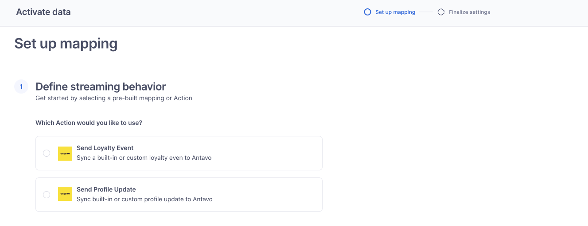
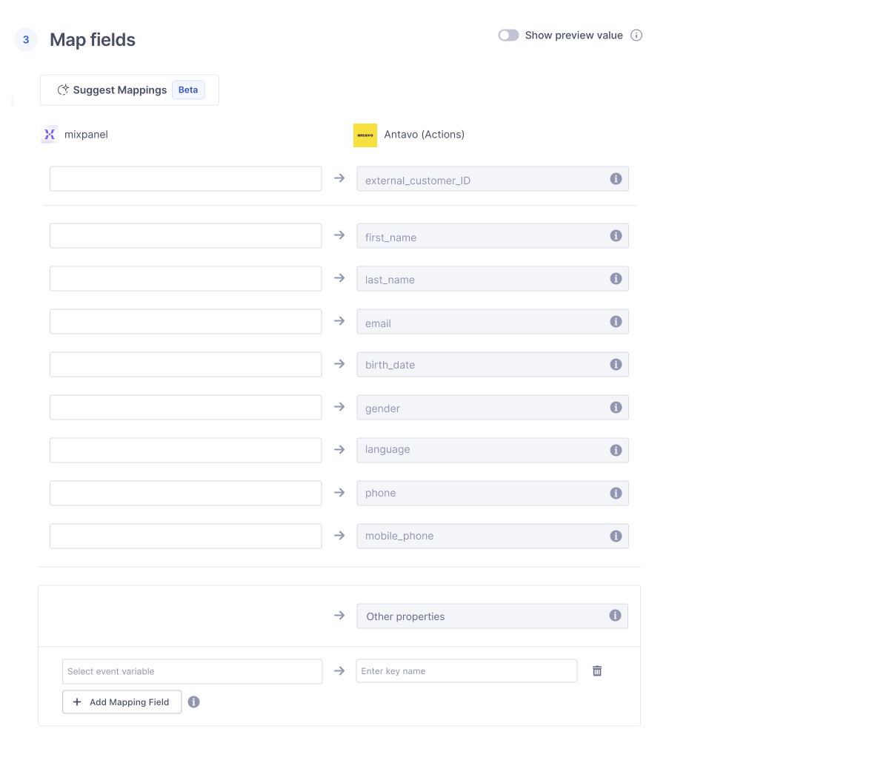

```
title: Antavo Actions Destination
```

Antavo Actions Destination app allows you to sync profile updates in Segment and trigger loyalty events.

This destination app is maintained by Antavo. For any issues with the destination app, [contact the Antavo support team](mailto:support@antavo.com).

## Getting started

1. From your workspace's [Destination catalog page](https://app.segment.com/goto-my-workspace/destinations/catalog){:target="_blank”} search for "Antavo Actions".
2. Select and click **Add Destination**.
3. Select an existing Source to connect to Antavo Actions.
4. Log in to Antavo and go to the **Settings → API Settings** menu; find and copy your Antavo **API key**.
5. Paste the **API Key** in the destination settings in Segment.
6. Go to mappings to set events you want to sync into Antavo
   - Select the Profile event template to sync customer data changes into Antavo
      - in this template, you need to map the customer ID first, which should match with the Antavo settings
      - if the multi-account extension is enabled in Antavo, you need to make sure to include the account ID
      - customer attributes be included in the Data section - make sure attribute names match your Antavo settings
      
   
   - Select the Loyalty event template to trigger loyalty events.
      - in this template, you need to map the customer ID first, which should match with the Antavo settings
      - if the multi-account extension is enabled in Antavo, you need to make sure to include the account ID
      - event attributes can be included in the Data section - make sure attribute names match your Antavo settings

   
7. If you haven’t configured the Segment integration in Antavo, please go to the Modules menu and enable Twilio Segment Extension
