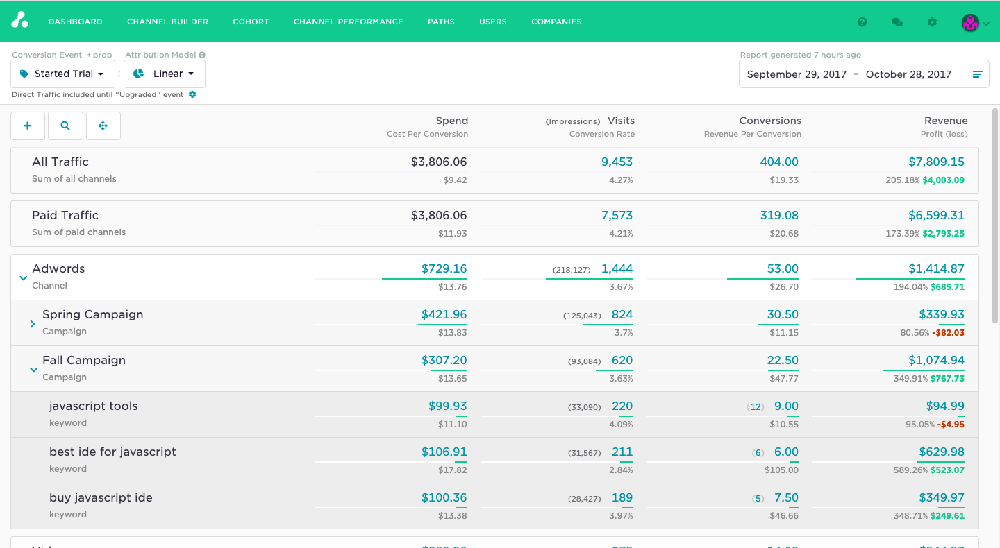
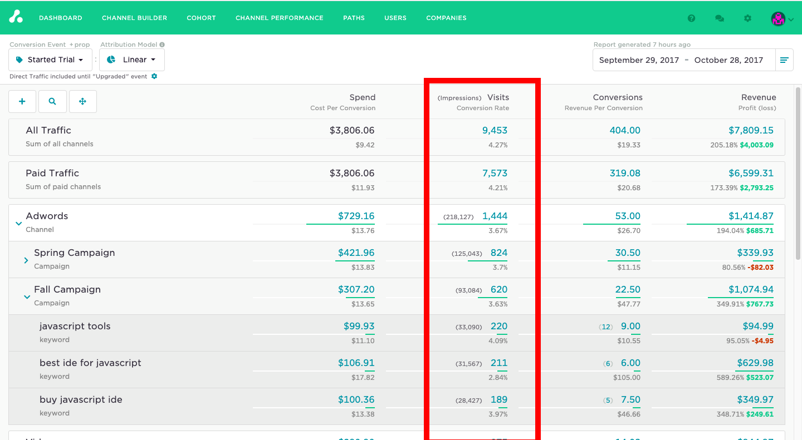
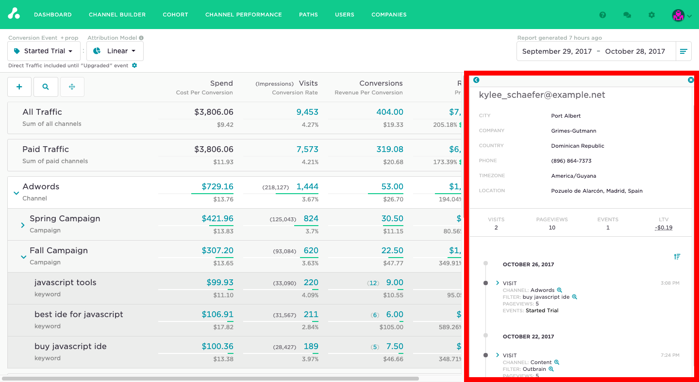
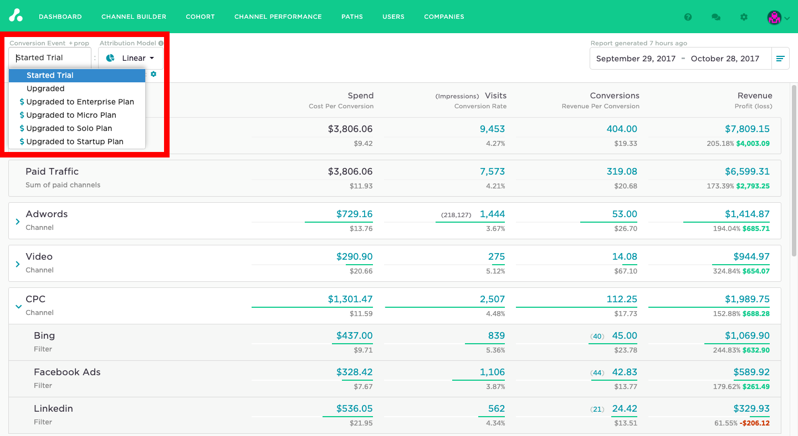

[Attribution](http://attributionapp.com/) is an easy to use one stop dashboard for multi-touch attribution across all marketing channels. Attribution prides itself on high-fidelity and allows marketers to trace every visit, conversion or revenue dollar to the source. Marketers can easily integrate Attribution and Segment to begin measuring the effectiveness of their campaigns today.

## Getting Started



1. From the Segment web app, click **Catalog**.
2. Search for "Attribution" in the Catalog, select it, and choose which of your sources to connect the destination to.
3. Enter the "Project ID" into your Segment Settings UI which you can find from your [Attribution settings](https://dashboard.attributionapp.com/v1/#!/settings).
4. It will take 15 - 30 minutes for data to begin populating on your Attribution dashboard.



## Page

If you haven't had a chance to review our spec, take a look tounderstand what the [Page method](/docs/connections/spec/page/) does. An example call would look like:

```js
analytics.page("pageLoaded");
```

Page calls are sent to Attribution to record visits on your dashboard.



## Identify

If you're not familiar with the Segment Specs, take a look to understand what the [Identify method](/docs/connections/spec/identify/) does. An example call would look like:

```js
analytics.identify("userId123", {
  email: "john.doe@segment.com"
});
```

Identify calls are sent to Attribution as an `identify` event and are used to assign traits like `userid`, `name`, and `email` to anonymous visitors.



## Track

If you're not familiar with the Segment Specs, take a look to understand what the [Track method](/docs/connections/spec/track/) does. An example call would look like:

```js
analytics.track("Clicked Login Button")
```

Track calls are sent to Attribution as a `conversion event`. You should add a `conversion event` anywhere a customer takes an action that you'd like to measure the return on ad spend & attribution for. Examples include `sign up`, `demo scheduled`, `deal won`, etc.



## Alias
If you're not familiar with the Segment Specs, take a look to understand what the [Alias method](/docs/connections/spec/alias/) does. An example call would look like:

```js
analytics.alias('507f191e81');
```

The `alias` method can be used to merge two user identities in both Segment & Attribution, effectively connecting two sets of user data as one.
