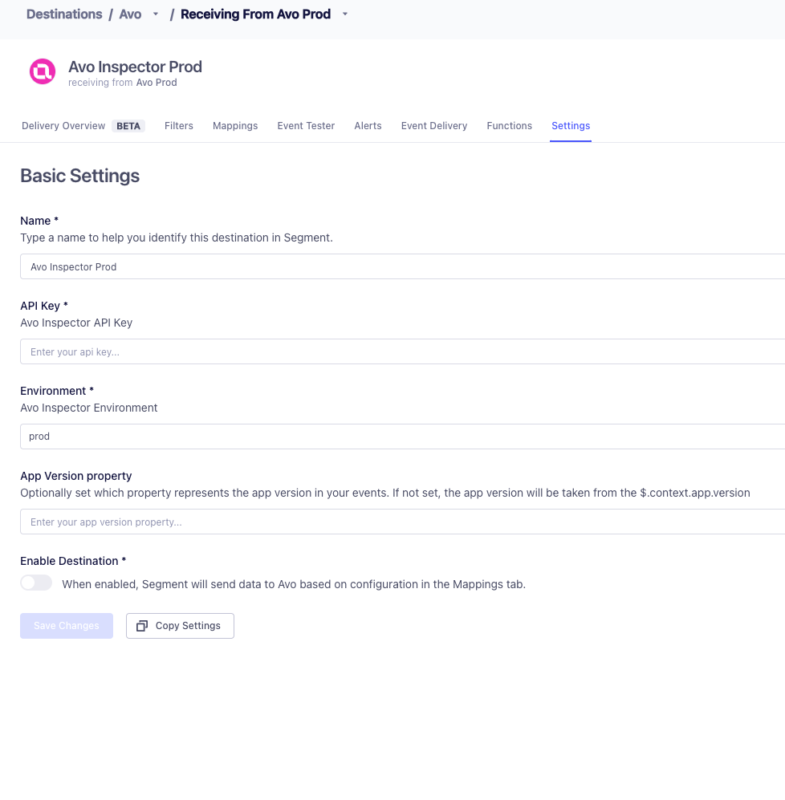

**Avo lets you find, fix, and prevent data quality issues upstream.** World class data and product teams at companies like Fender, IKEA, Wolt use Avo to guarantee event data quality upstream, so they can focus on building great user experiences. With Avo you get reliable data with less effort, by moving from reactive damage control to proactive data management and addressing your data quality issues at the source, where the data is created.

With [Avo](https://avo.app){:target="\_blank”} Inspector, data quality is no longer a dream, it’s a workflow.
[Inspector](https://www.avo.app/data-observability){:target="\_blank”} lets you find, triage, fix, and prevent data quality issues in your event based data. Launch Inspector to discover all your data quality issues and systematically work towards better data, one resolved issue at a time.

The Avo Inspector destination automatically extracts event schemas from your product events, sending only the signatures from the connected Segment sources to the Inspector API. **Avo Inspector receives no PII data from your source**.



## Supported methods

### Track events

The Avo destination supports `Track` events.

Example of Track call:

```js
analytics.track("Login", {
  userName: "John",
  city: "San Fransisco"
  age: 32
});
```

This Track call is translated into an event signature that is sent to Avo's Inspector API.

```js
{
  "eventName": "Login",
  "properties": [
    {"userName": "string"},
    {"city": "string"}
    {"age": "integer"}
  ]
}
```

## Getting started

1. From the Segment web app, click **Catalog**, then click **Destinations**.
2. Find the Destinations Actions item in the left navigation, and click it.
3. Select [Avo](https://app.segment.com/goto-my-workspace/destinations/catalog/actions-avo) from the list of destinations, then click **Add destination**.
4. Select a source to connect to Avo (Actions) and click **Next**.
5. Enter a name for your Avo (Actions) destination and click **Create destination**.

## Configure Avo Setup

### Getting Avo API key

Before connecting the Segment source to Avo, you will need an API key for your source.

1. Create your Avo workspace at avo.app (If you don’t have one already).
2. From the Avo workspace sidebar, select **Sources**.
3. Select an existing source or create a new one. (Avo recommends naming your Avo sources the same as your Segment sources, for example "Web", "iOS", "Android")
   
4. Click the **Inspector Setup** tab in the Avo source
5. Copy the API Key
   

### Configure Destination

1. Copy the **API Key** from Avo into the field `API Key` in settings.
2. Select an environment you'd like the data to go to within Avo. It should reflect from what environment the source is receiving data from. (**Production** / **Development** / **Staging**)
3. **App Version Property (Optional):** If you have an event property describing the app release version of your source you can provide it under App Version. For most mobile sources, we will automatically fetch the app version from segment context. Having accurate app release versions in Avo Inspector will help you identify which releases an issue is impacting, and monitor for regressions in future releases after you’ve resolved the issue.
   


