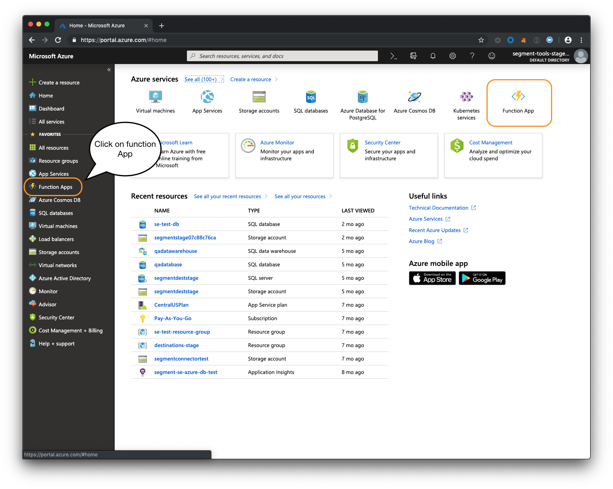
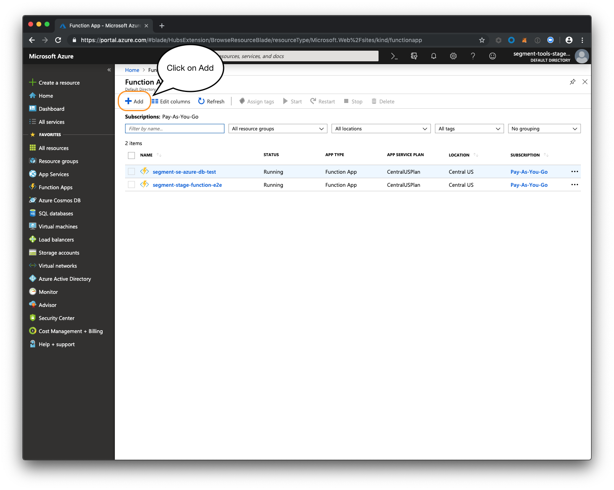
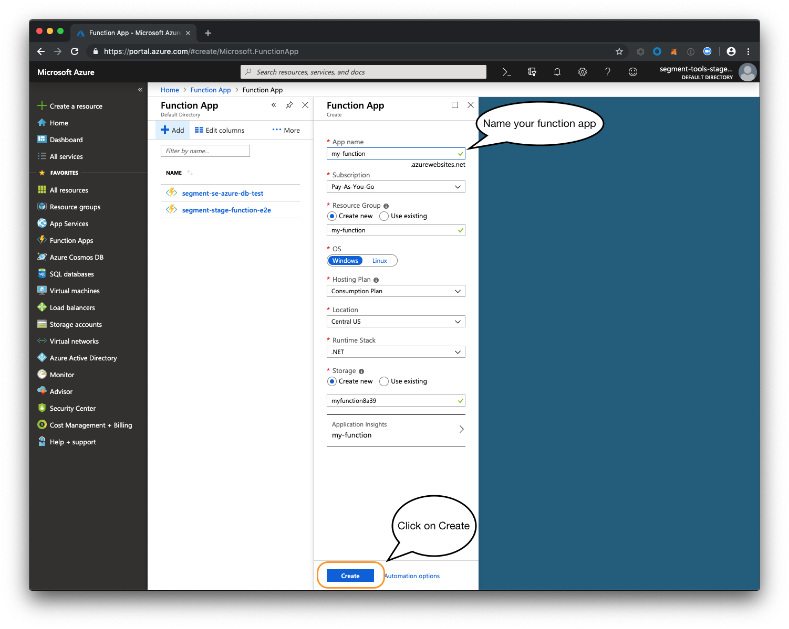
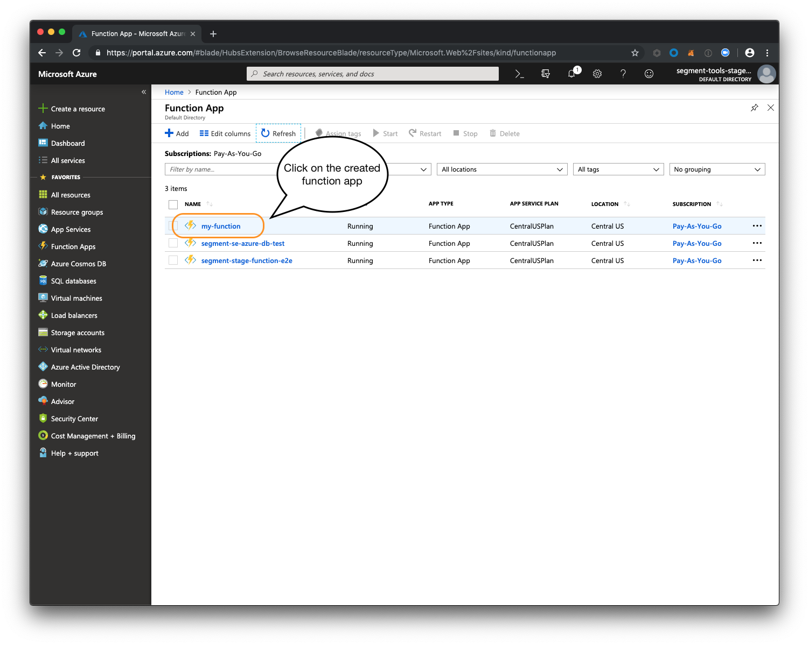
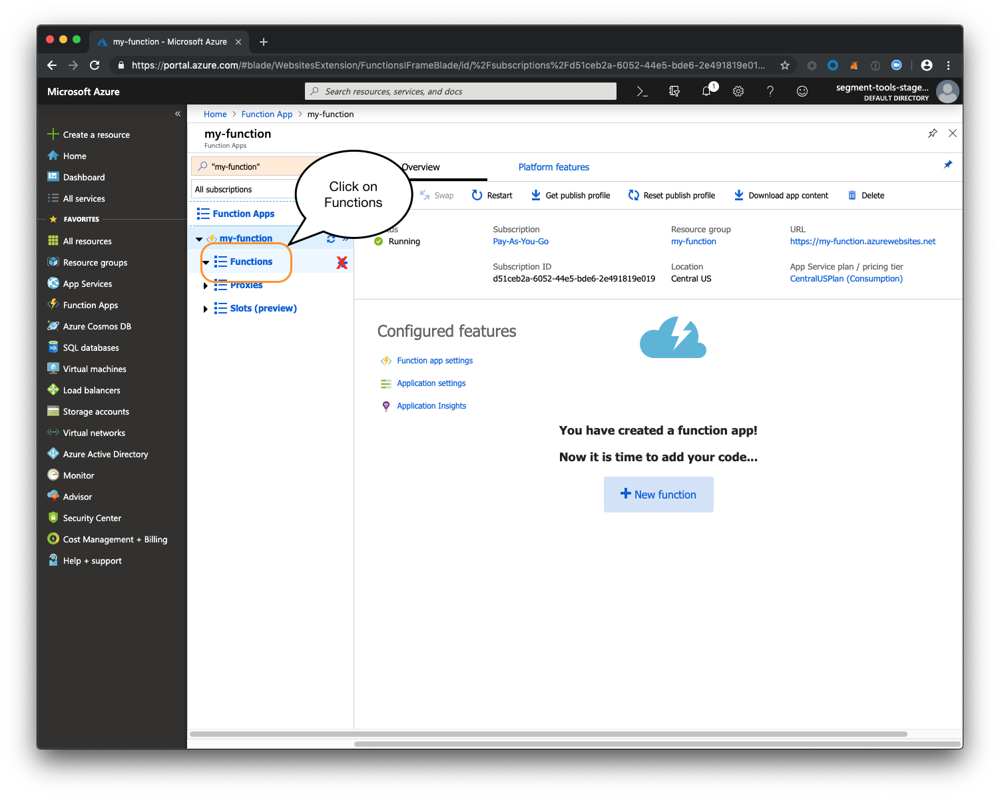
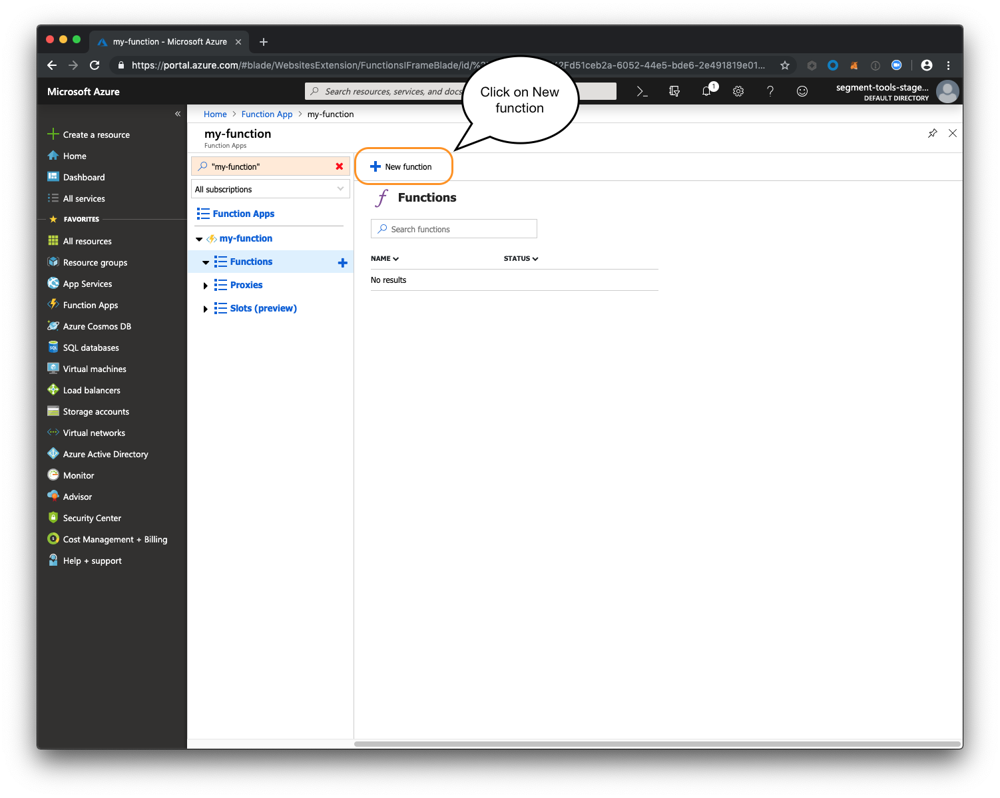
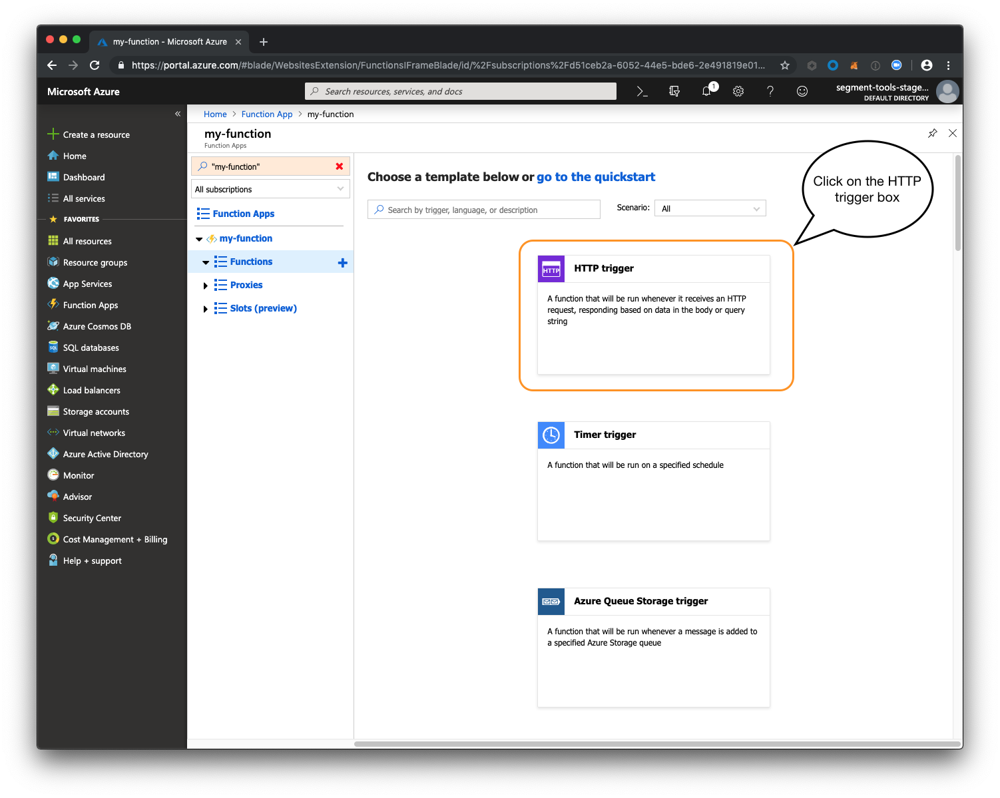
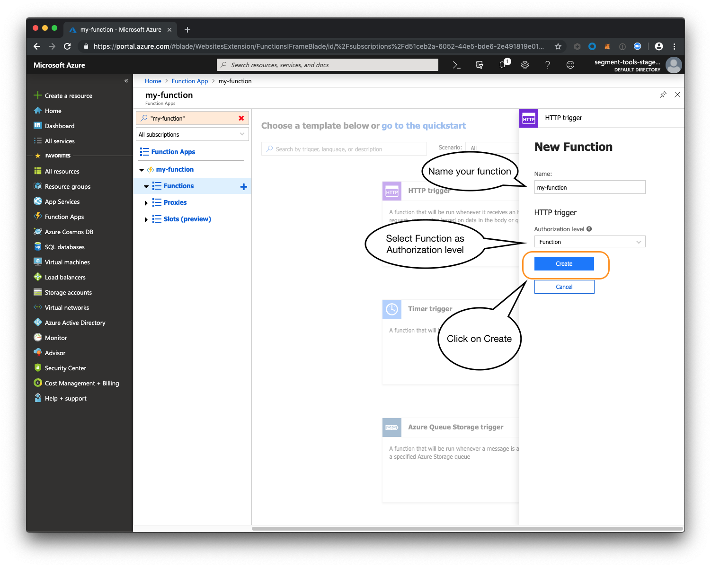
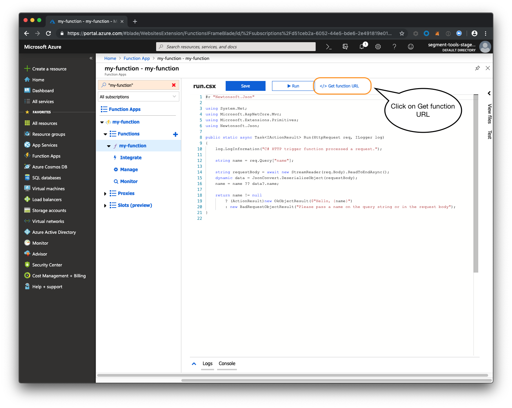
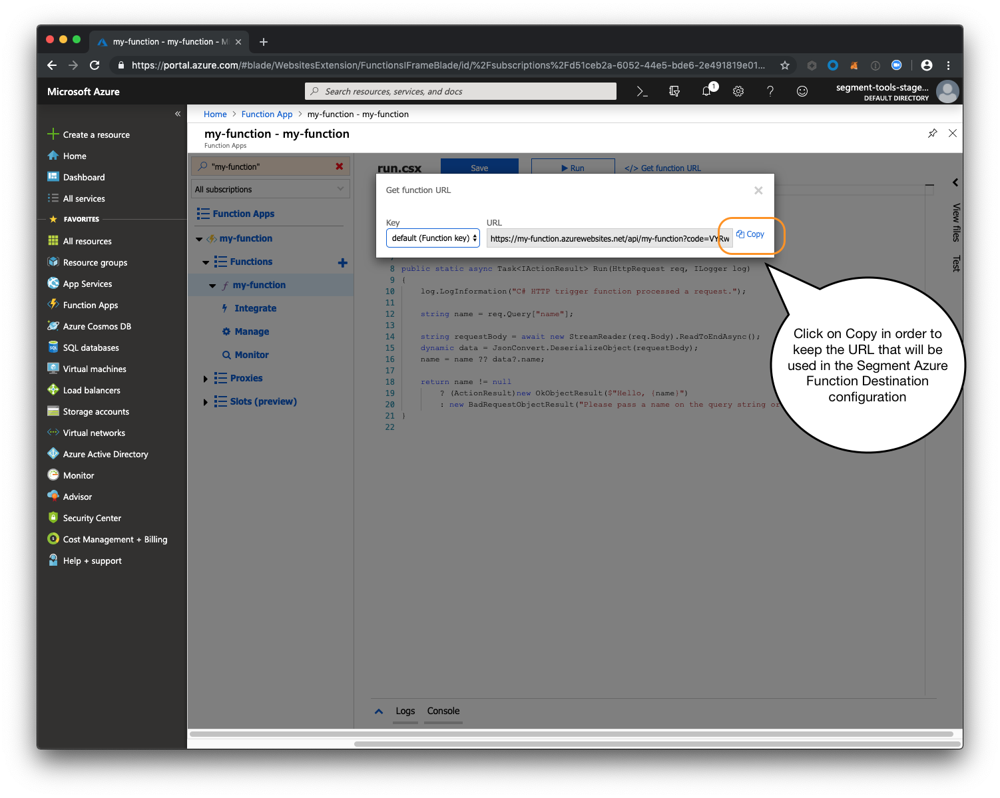

Segment makes it easy to send your data to Azure Function (and lots of other destinations). When you track your data using Segment's open-source [libraries](/docs/connections/sources/catalog/), Segment can translate and route your data to an Azure Function in the format it expects.

[Azure Function](https://azure.microsoft.com/en-us/services/functions) is a serverless compute service that enables you to run code on-demand without having to explicitly provision or manage infrastructure. Use Azure Functions to run a script or piece of code in response to a variety of events.



# Getting Started



## Build an Azure Function to Process Segment Events

To process events from Segment, first create a Azure Function that can handle your event flow.

#### Create a Functions App

1. Go to https://portal.azure.com, and click **Functions App**.
   

2. Click **+Add** to create your Function App.
   

3. Enter a name for your app in the **App name** field, and configure any other fields as needed own flavor.
4. Click **Create**. Azure creates your new function app.
   

#### Create a new Azure function

1. Click the new function app's name. (You might need to click the **Refresh** button if the new function doesn't appear.)
   

2. On the left pane, click **Functions**.
   

3. In the main frame, click **New function**.
   

4. Choose **HTTP trigger**.
   

5. Enter a name for your function, and choose `Function` for the **Authorization level** field.
   
6. Click `Create`.

11. Set up your function code.
12. In the created function screen, click on `</> Get function URL`.
    

13. In the **Key** field, choose `default (Function key)`.
14. Click **Copy** to the right of the URL. You'll use this URL to tell Segment where to connect to use this Azure Function.
   

## Configure Azure Function Destination

After you create the Azure Function, configure a Segment destination that calls the function.

1. In the Segment web app, click **Destinations**.
2. Click **Add Destination** to go to the Catalog.
3. Search for and choose the **Azure Function** destination.
4. Click **Configure Azure Function**.
5. In the **HTTP Trigger** field, enter the URL you copied from the `</> Get function URL` button in the Azure function code screen.
