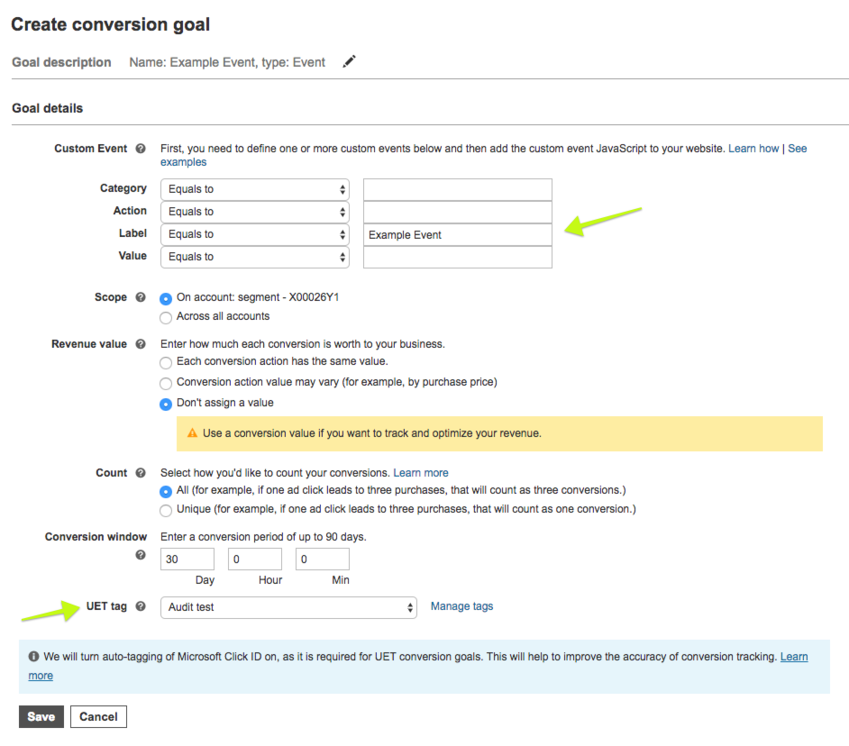

 [Bing Ads](https://bingads.microsoft.com) enables Marketers to track and monitor campaigns, clicks, CTRs, spend and budget. Bing Ads lets you place cross-device product ads in front of Bing, Yahoo, and MSN customers and support imported pay-per-click ad campaigns from third-party platforms like Google AdWords. With Bing Ads you can also retarget ads to customers after they complete an action like leaving a shopping cart or viewing a product without purchasing. Learn more about all you can do with Bing Ads [here](https://advertise.bingads.microsoft.com/en-us/resources/training/what-is-bing-ads). You can also browse the code [on GitHub](https://github.com/segment-integrations/analytics.js-integration-bing-ads).

## Getting Started



Before you can track conversions or target audiences, you need to create a UET tag in Bing Ads and then add it to the destination settings. Follow the steps within [the Bing Ads documentation to create a UET tag](https://advertise.bingads.microsoft.com/en-us/resources/training/universal-event-tracking).

Once you have created the Tag ID, you can follow the steps below:

1. From the Segment web app, click **Catalog**.
2. Search for "Bing Ads" in the Catalog, select it, and choose which of your sources to connect the destination to. Note the source must be sending events using our JavaScript library Analytics.js.
3. In the destination settings, enter your Tag Id

Your changes appear in the Segment CDN in about 45 minutes, and then Analytics.js starts asynchronously loading Bing Ads' snippet on your page and sending data.

_**Note:** You'll only be able to include one Tag ID per source so make sure to associate the conversion goals to the correct Tag ID that is included in your settings._

## Page

If you're not familiar with the Segment Specs, take a look to understand what the [Page method](/docs/connections/spec/page/) does. An example call would look like:

```javascript
// name and properties are optional
analytics.page();
```

Page events will be sent to Bing Ads as a `Page Load` event where name and properties are optional.

## Track

If you're not familiar with the Segment Specs, take a look to understand what the [Track method](/docs/connections/spec/track/) does.

In order for us to map your track events to a Conversion Goal, you'll first need to create the goal on your Bing Ads account:

1. Click the **Campaigns** tab, and then on the left pane, click **Conversion Tracking**.
2. Under **Conversion Tracking**, click **Conversion Goals**.
3. On the conversion goals page, click **Create conversion goal**.
4. Enter a name for your goal in the **Goal name** box. When naming your goal, use a descriptive name that makes sense to you. (For example, "Checkout page")
5. Choose the `Event` type of conversion and click **Next**.
6. Fill in the appropriate values. Make sure to add the Segment event name as the **label** field and to associate the goal to the correct Tag (**UET Tag**) that is set up in your Segment source.





Only the event name is required - other properties are optional. An example track call is shown below:

```javascript
// Segment event
analytics.track('Order Completed', {
    category: 'tools'
    revenue: 25,
    ... // additional properties
});
```

**Label**: Event Name (`'Order Completed'` in this case)

**Value**: `revenue` property

**Category**: `category` property

**Action**: always sent with value of `track`

## Troubleshooting


