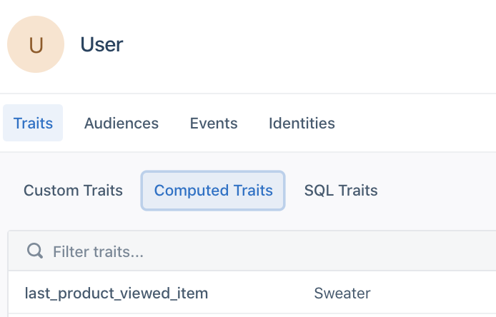
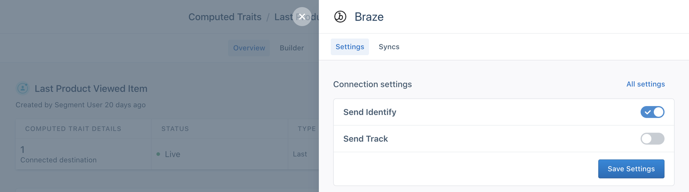
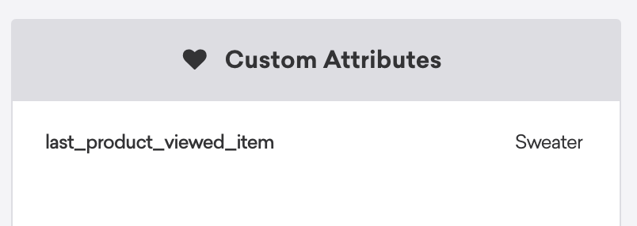
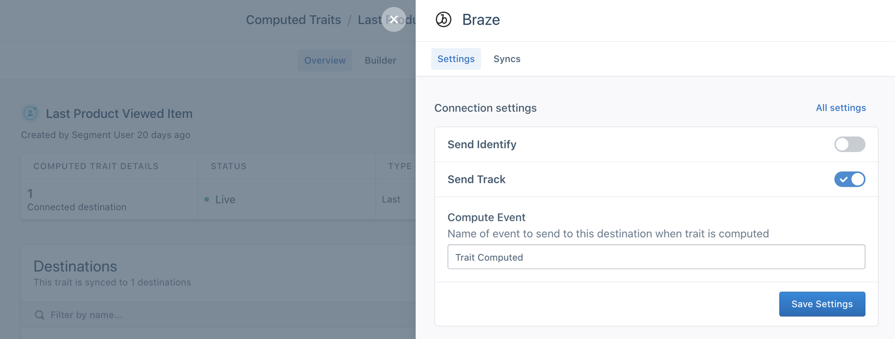
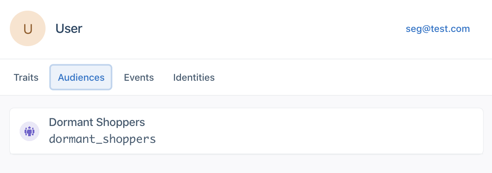
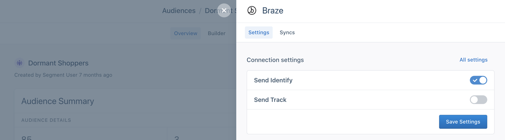
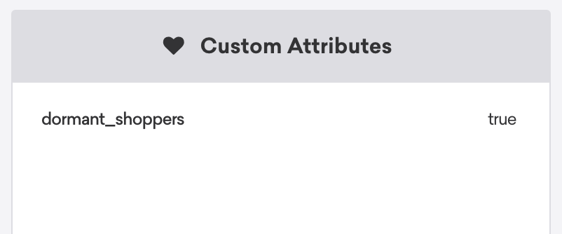
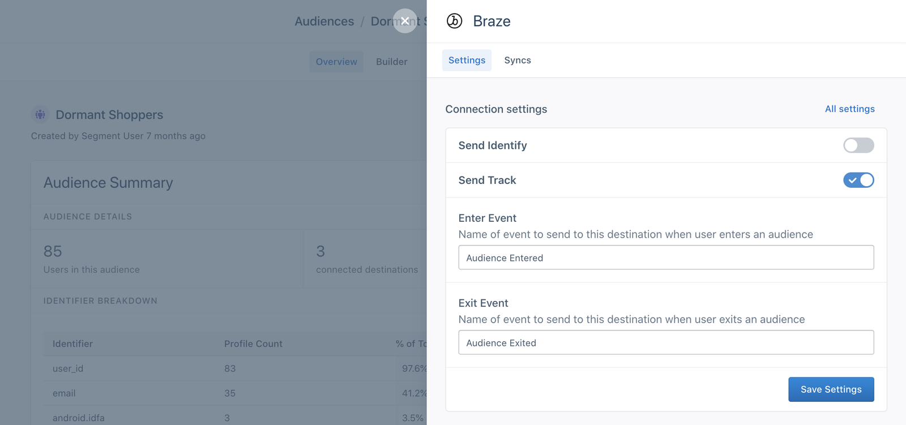
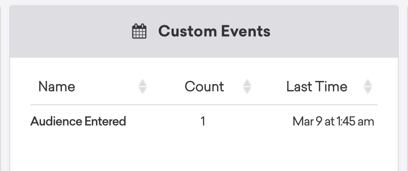

[Braze](https://www.braze.com/), formerly Appboy, is an engagement platform that empowers growth by helping marketing teams to build customer loyalty through mobile, omni-channel customer experiences.

The Braze Destination is open-sourced on GitHub. Source code for the following integrations is available:

- [iOS](https://github.com/Appboy/appboy-segment-ios) (maintained by Braze)
- [Android](https://github.com/Appboy/appboy-segment-android)(maintained by Braze)
- [Web](https://github.com/segment-integrations/analytics.js-integration-appboy) (maintained by Segment) 
- [Server](https://github.com/segmentio/integration-appboy) (maintained by Segment)

For issues with iOS or Android platforms, contact Braze support. For issues with Web or Server platforms, contact [Segment support](https://segment.com/help/contact).

> info "The Braze SDK contains three major versions"
> If you are migrating from version 1 to version 2, see information about [migration from Version 1 to Version 2](/docs/connections/destinations/catalog/braze/#migrating-to-v2-of-the-braze-web-sdk) below.

## Getting Started



1. From the Segment web app, click **Catalog**.
2. Search for "Braze" in the Catalog, select it, and choose which of your sources to connect the destination to.
3. In the Destination Settings, add the **API Key**, found in the Braze Dashboard in *App Settings > Manage App Group*.
4. Set up a new App Group REST API Key in the Braze Dashboard in *App Settings > Developer Console > API Settings*. For more information, see [Creating and Managing REST API Keys](https://www.braze.com/docs/api/basics/#creating-and-managing-rest-api-keys) in the Braze documentation. 
  - Select the `users.track` endpoint in the **User Data** section.
5. If you're adding Braze using Analytics.js, Segment automatically loads the [Braze Web SDK](https://www.braze.com/docs/developer_guide/platform_integration_guides/web/initial_sdk_setup). Otherwise, depending on the source you've selected, include Braze's library by adding the following lines to your dependency configuration.


### iOS

1. Add the Braze Segment Pod to your `Podfile`:

    ```objc
    pod 'Segment-Appboy'
    ```

    Use the latest version of the Braze Segment Pod available on [CocoaPods](https://cocoapods.org/pods/Segment-Appboy) to ensure you have the must up-to-date features and bug fixes.

2. Next, declare Braze's destination in your app delegate instance:

    ```objc
      SEGAnalyticsConfiguration *config = [SEGAnalyticsConfiguration configurationWithWriteKey:@"YOUR_WRITE_KEY_HERE"];
      [config use:[SEGAppboyIntegrationFactory instance]];
      [SEGAnalytics setupWithConfiguration:config];
    ```

    [Here](https://github.com/Appboy/appboy-segment-ios/blob/master/CocoapodsExample/Segment-Appboy/SEGAppDelegate.m) is a sample project which shows how to integrate the above.

#### Sample App

Braze created a sample iOS application that integrates Braze using Segment. See the Braze [GitHub repository](https://github.com/Appboy/appboy-segment-ios/tree/master/CocoapodsExample) for more information.

#### Device-mode set up for iOS 14 support

Braze updated the Braze iOS Segment SDK to 3.26.1 to prepare for iOS 14. As of version 3.27.0, Braze removed the `ABK_ENABLE_IDFA_COLLECTION` macro. To configure sending ISFA to Braze, see Braze's [Implementing IDFA Collection](https://www.braze.com/docs/developer_guide/platform_integration_guides/ios/initial_sdk_setup/other_sdk_customizations/#ios-14-apptrackingtransparency) documentation.

To use the latest Braze SDK to collect IDFAs you must do the following:

1. Upgrade to use Xcode12.
2. Update the Braze iOS Segment SDK to version 3.3.0 or greater.
3. Import and add the AppTrackingTransparency (ATT) Framework.
   - Navigate to your project `Info.plist` and add a “Privacy - Tracking Usage Description”. This description appears in a popup when the application initializes in iOS 14. Applications prompt users to select if they want to allow tracking.
4. Add Braze's `ABKIDFADelegate`. For more information on how to add this see [Braze's IDFA Collection documentation](https://www.braze.com/docs/developer_guide/platform_integration_guides/ios/initial_sdk_setup/other_sdk_customizations/#implementing-idfa-collection).
5. Follow [Segment's guide for collecting IDFA](/docs/connections/sources/catalog/libraries/mobile/ios/#idfa-collection-in-40-beta-and-later)

### Android

1. In the top-level project `build.gradle` add the following as a repository in *all projects > repositories*.

    ```js
    maven { url "http://appboy.github.io/appboy-android-sdk/sdk" }
    maven { url "http://appboy.github.io/appboy-segment-android/sdk" }
    ```

2. Add the Braze Segment destination dependency to your app `build.gradle`:

    ```js
   compile 'com.appboy:appboy-segment-integration:+'
   ```

    To ensure you have the most up-to-date features and bug fixes, use the latest version available on [Maven](http://search.maven.org/#search%7Cga%7C1%7Ca%3A%22appboy-segment-integration%22).

    **Note:** The `groupId` is `com.appboy` and not `com.segment.analytics.android.integrations`.

3. Next, declare Braze's destination in your `Analytics` instance:

  ```js
  Analytics analytics = new Analytics.Builder(context, "YOUR_WRITE_KEY_HERE")
    .use(AppboyIntegration.FACTORY)
    ...
   .build();
  ```

### React Native device-mode set up

<!-- LR, Mar2021: this should be a `react-dest` include but Braze was originally called Appboy-->

To add the Braze device-mode SDK to a [React Native](/docs/connections/sources/catalog/libraries/mobile/react-native/) project using Segment's `1.5.1≤` release:
1. Navigate to the root folder of your project, and run a `yarn add appboy` command to add the destination SDK to your project.
2. Add an `import` statement to your project, as in the example below.
   ```js
   import Braze from '@segment/analytics-react-native-appboy'
   ```
3. In the same project file, add the destination to the `using` list in the `await` command.
   ```js
   await analytics.setup('YOUR_WRITE_KEY', {
     // Add any of your Device-mode destinations. This ensures they load before continuing.
     using: [Braze]
     // ...
   })
   ```
4. Change to your iOS development folder ( `cd ios` ) and run `pod install`.


> note ""
> Braze was formerly known as "Appboy", and the Braze React component still uses that name. Be sure to use the old name!

## Page

If you're not familiar with the Segment Specs, take a look to understand what the [Page method](/docs/connections/spec/page/) does. An example call would look like:

```js
analytics.page();
```

Segment sends Page calls to Braze as custom events if you have enabled either **Track All Pages** or **Track Only Named Pages** in the Segment Settings. 

## Identify

> info "Tip"
> Add Segment's open-source [Middleware](https://github.com/segmentio/segment-braze-mobile-middleware) tool to optimize your integration. This tool limits [Data Point](https://www.braze.com/docs/user_guide/onboarding_with_braze/data_points/) use by debouncing duplicate identify() calls from Segment. For more information, see the project's [README](https://github.com/segmentio/segment-braze-mobile-middleware/blob/master/README.md#how-does-this-work).

If you're not familiar with the Segment Specs, take a look to understand what the [Identify method](/docs/connections/spec/identify/) does. An example call would look like:

```js
analytics.identify('ze8rt1u89', {
  firstName: 'Jane',
  lastName: 'Kim',
  email: 'jane.kim@example.com'
});
```

When you Identify a user, Segment passes that user's information to Braze with `userId` as Braze's External User ID.

If you're using a device-mode connection, Braze's SDK assigns a `device_id` and a backend identifier, `braze_id`, to every user. This allows Braze to capture anonymous activity from the device by matching on those identifiers instead of `userId`. This applies to _device-mode connections_.

To send anonymous user data in cloud-mode, you must manually include the user's `braze_id` in all your Segment API calls in the `integrations.Braze.braze_id` or `context.integrations.Braze.braze_id` object.

### Capture the braze_id of anonymous users

Pass one of the many identifiers that may exist on an anonymous user profile to the [Braze's User by Identifier REST endpoint](https://www.braze.com/docs/api/endpoints/export/user_data/post_users_identifier/){:target='_blank'} to capture and export the `braze_id`. These identifiers include:
- email address
- phone number
- device_id

Choose an identifier that is available on the user profile at that point in the user lifecycle.

For example, if you pass device_id to the User by Identifier endpoint:

```js
{
  "device_id": “{{device_id}}",
  "fields_to_export": ["braze_id"]
}
```

The endpoint returns:

```js
{
  "users": [
    {
        "braze_id": “{{braze_id}}"
    }
  ],
  "message": "success"
} 
```


> info "Tip"
> Braze is complex. If you decide to use the `braze_id`, consider [contacting Segment Success Engineering](https://segment.com/help/contact/) or a Solutions Architect to verify your Braze implementation.

Segment's special traits recognized as Braze's standard user profile fields (in parentheses) are:

| Segment Event     | Braze Event  |
|-------------------|-------------|
| `firstName`       | `first_name`|
| `lastName`        | `last_name` |
| `birthday`        | `dob`       |
| `avatar`          | `image_url` |
| `address.city`    | `home_city` |
| `address.country` | `country`   |
| `gender`          | `gender`    |

Segment sends all other traits (except Braze's [reserved user profile fields](https://www.braze.com/docs/api/objects_filters/user_attributes_object/#braze-user-profile-fields)) to Braze as custom attributes. You can send an array of strings as trait values but not nested objects.


## Track

> info "Tip"
> To lower [Data Point](https://www.braze.com/docs/user_guide/onboarding_with_braze/data_points/) use, limit the events you send to Braze to those that are relevant for campaigns and segmentation to the Braze destination. For more information, see [Schema Controls](/docs/protocols/schema/).

If you're not familiar with the Segment Specs, take a look to understand what the [Track method](/docs/connections/spec/track/) does. An example call looks like:

```
analytics.track('Purchased Item', {
    product_id: '1234',
    name: 'bag'
})
```
When you `track` an event, Segment sends that event to Braze as a custom event.

> note ""
> Braze requires that you include a `userId` or `braze_id` for all calls made in cloud-mode. Segment sends a `braze_id` if `userId` is missing. When you use a device-mode connection, Braze automatically tracks anonymous activity using the `braze_id` if a `userId` is missing.

> note ""
> Segment removes the following custom properties reserved by Braze:
>
>  - `time`
>  - `quantity`
>  - `event_name`
>  - `price`
>  - `currency`

### Order Completed

When you `track` an event with the name `Order Completed` using the [e-commerce tracking API](/docs/connections/spec/ecommerce/v2/), Segment sends the products you've listed to Braze as purchases.

### Purchases

When you pass [ecommerce events](/docs/connections/spec/ecommerce/v2/), the name of the event becomes the `productId` in Braze. An example of a purchase event looks like:

```js
analytics.track('Purchased Item', {
    revenue: '2000',
    currency: 'USD'
})
```

The example above would have "Purchased Item" as its `productId` and includes two required properties that you must pass in:

- `revenue`
- `currency`

Braze supports currency codes as specified in [their Purchase Object Specification](https://www.braze.com/docs/api/objects_filters/purchase_object/). Be aware that any currency reported other than USD displays in [the Braze UI in USD based on the exchange rate on the date it was reported](https://www.braze.com/docs/developer_guide/platform_integration_guides/web/analytics/logging_purchases/#logging-purchases).

You can add more product details in the form of key-value pairs to the `properties` object. The following reserved keys are not passed to Braze if included in your Track call's `properties` object:

- `time`
- `product_id`
- `quantity`
- `event_name`
- `price`


## Group

If you're not familiar with the Segment Specs, take a look to understand what the [Group method](/docs/connections/spec/group/) does. An example call would look like:

```js
analytics.group("1234", {
  name: "Initech",
  industry: "Technology",
  employees: 329,
  plan: "enterprise",
  totalBilled: 830
});
```

When you call `group`, Segment sends a custom attribute to Braze with the name `ab_segment_group_<groupId>`, where `<groupId>` is the group's ID in the method's parameters. For example, if the group's ID is `1234`, then the custom attribute name is `ab_segment_group_1234`. The value of the custom attribute is `true`.


## Other Features

### In-app Messaging

#### Mobile
In-app messages are registered for and requested by default. Disable this feature by disabling the **Enable Automatic In-App Message Registration** setting. This feature is available for users of the Braze Mobile SDKs.

#### Web

Once configured, you can trigger in-app message display as a result of several different event types. By default, all In-App Messages that a user is eligible for are automatically delivered to the user upon a session start event. A new session automatically starts when a user loads your site. If you'd like to force a new session for a user, simply make an identify call with the corresponding [userId](/docs/connections/spec/identify/#user-id) for that user.

If you don't want your site to immediately display new In-App Messages when they're received, you can disable automatic display and register your own display subscribers. To do this:

1. Disable your [Automatically Send In-App Messages Destinations setting](/docs/connections/destinations/catalog/braze/#settings). By default, it is enabled when you enable the Braze destination.

2. Create your subscriber by calling:

    ```js
    analytics.ready(function() {
      window.appboy.subscribeToNewInAppMessages(function(inAppMessages) {
         // Display the first in-app message. You could defer display here by pushing this message to code      within in your own application.
         // If you don't want to use Appboy's built-in display capabilities, you could alternatively pass      the in-app message to your own display code here.
         window.appboy.display.showInAppMessage(inAppMessages[0]);

        // Return an array with any remaining, unhandled messages to appboy's internal queue.
        // These will be part of the inAppMessages param the next time this subscriber is invoked.
         return inAppMessages.slice(1);
       });
    });
    ```

The `inAppMessages` parameter will be an array of [`appboy.ab.InAppMessage`](https://js.appboycdn.com/web-sdk/latest/doc/ab.InAppMessage.html) subclass or [`appboy.ab.ControlMessage`](https://js.appboycdn.com/web-sdk/latest/doc/ab.ControlMessage.html) objects, each of which has various lifecycle event subscription methods.


### Push Notifications

#### iOS

1. Follow the directions to register for push at in [Segment's iOS library](/docs/connections/sources/catalog/libraries/mobile/ios/ios-faqs/#how-do-i-use-push-notifications) docs.
2. Add the following to your application:didFinishLaunchingWithOptions

    ```
    [[SEGAppboyIntegrationFactory instance] saveLaunchOptions:launchOptions];
    ```
3. In your application's application:didReceiveRemoteNotification: method, add the following:
    ```
    [[SEGAnalytics sharedAnalytics] receivedRemoteNotification:userInfo];
    ```
4. If you integrated the application:didReceiveRemoteNotification:fetchCompletionHandler: in your app, add the following to that method:
    ```
     if ([Appboy sharedInstance] == nil) {
      [[SEGAppboyIntegrationFactory instance] saveRemoteNotification:userInfo];
    }
    ```
5. If you implemented handleActionWithIdentifier:forRemoteNotification:, add the following to that method:
    ```
     if ([Appboy sharedInstance] == nil) {
        [[SEGAppboyIntegrationFactory instance] saveRemoteNotification:userInfo];
      }
    ```
6. If you are using the `UserNotification` framework, follow [Braze's documentation](https://www.braze.com/docs/developer_guide/platform_integration_guides/ios/push_notifications/integration/#using-usernotification-framework-ios-10) to register push notifications using the `UserNotification` framework. Then in your application's `userNotificationCenter:didReceiveNotificationResponse:withCompletionHandler` method, add the following:

    ```objc
    if ([Appboy sharedInstance] == nil) {
        [[SEGAppboyIntegrationFactory instance].appboyHelper saveUserNotificationCenter:center
                                                                   notificationResponse:response];
    }
    [[SEGAppboyIntegrationFactory instance].appboyHelper userNotificationCenter:center
                                                   receivedNotificationResponse:response];
    if (completionHandler) {
        completionHandler();
    }
    ```

#### Android

1. Follow the directions in Braze's [push notification docs](https://www.braze.com/docs/developer_guide/platform_integration_guides/android/push_notifications/android/implementation_guide/).
2. If you don't have Braze automatically register for push (for example, you pass the push token from an FCM or manual GCM registration) you need to ensure you call `registerAppboyPushMessages` after Braze is initialized. You can do this by checking if Braze is initialized before trying to pass the push token, and waiting for initializing to set if not.

    You can do this in an `onIntegrationReady` method:

    ```js
    String appboyPushToken;
    bool appboyInitialized = false;
    …
    // When you get the push token
    String receivedToken;

    appboyPushToken = recievedToken;
    if (appboyInitialized) {
      Appboy.getInstance(getContext()).registerAppboyPushMessages(appboyPushToken);
    }

    ….

    Analytics.with(this).onIntegrationReady(Appboy, new Callback() {
      @Override public void onIntegrationReady(Object integration) {
        appboyInitialized = true;
        if(appboyPushToken != null) {
          Appboy.getInstance(getContext()).registerAppboyPushMessages(appboyPushToken);
        }
      }
    });
    ```

#### Client

1. To support push notifications on Chrome, you'll need to enable FCM/GCM as well as configure your site. Check out steps [one and two here for detailed instructions on both](https://www.braze.com/docs/developer_guide/platform_integration_guides/web/initial_sdk_setup#step-1-to-support-chrome-enable-fcmgcm).

2. Browser Registration. In order for a browser to receive push notifications, you must register it for push by calling:

    ```js
    analytics.ready(function() {
      window.appboy.registerAppboyPushMessages();
    });
    ```

    **Note:** Place this snippet outside of your [Segment Snippet](/docs/connections/sources/catalog/libraries/website/javascript/quickstart/#step-2-copy-the-segment-snippet) within your `script` tag.

    **Note:** This will immediately request push permission from the user.

To show your own push-related UI to the user before requesting push permission (known as a soft push prompt), you can test to see if push is supported in the user's browser by calling:

```js
analytics.ready(function() {
  if (window.appboy.isPushSupported()) {
    // Add your push logic
  }
 });
```

Braze recommends checking to see if this returns `true` since not all browsers can receive push notifications. [See below](/docs/connections/destinations/catalog/braze/#soft-push-prompts) for instructions on setting up a soft push prompt using Braze In-App Messages.

To unsubscribe a user, call:

```js
analytics.ready(function() {
  window.appboy.unregisterAppboyPushMessages();
});
```

3. Set your GCM/FCM server API key and SenderID on the Braze dashboard. You can find more details for this [here](https://www.braze.com/docs/developer_guide/platform_integration_guides/web/initial_sdk_setup#step-4-set-your-gcmfcm-server-api-key-and-senderid-on-the-Braze-dashboard).

4. To support push notifications on Safari, add your Website Push ID into your Segment Settings UI and Segment sends it when the Braze Web SDK initializes. To get your Website Push ID, follow the first two bullet points in [these instructions](https://www.braze.com/docs/developer_guide/platform_integration_guides/web/initial_sdk_setup#step-5-configure-safari-push).

### Soft Push Prompts

1. Follow [step one](https://www.braze.com/docs/developer_guide/platform_integration_guides/web/initial_sdk_setup#soft-push-prompts) to create a "Prime for Push" in-app messaging Campaign on the Braze dashboard.

2. Disable your [Automatically Send In-App Messages Destination setting](/docs/connections/destinations/catalog/braze/#settings). By default, it is enabled when you enable the Braze destination.

3. Add the following snippet to your site:

```js
analytics.ready(function() {
  window.appboy.subscribeToNewInAppMessages(function(inAppMessages) {
    var message = inAppMessages[0];
    if (message != null) {
      var shouldDisplay = true;

      if (message instanceof appboy.ab.inAppMessage) {
        // Read the key/value pair for msg-id
        var msgId = message.extras["msg-id"];

        // If this is our push primer message
        if (msgId == "push-primer") {
          // We don't want to display the soft push prompt to users on browsers that don't support push, or if the user
          // has already granted/blocked permission
          if (!appboy.isPushSupported() || appboy.isPushPermissionGranted() || appboy.isPushBlocked())     {
            shouldDisplay = false;
          }
          // Prompt the user when the first button is clicked
          message.buttons[0].subscribeToClickedEvent(function() {
            appboy.registerAppboyPushMessages();
          });
        }
      }

      // Display the message
      if (shouldDisplay) {
        appboy.display.showInAppMessage(message);
      }
     }

    // Remove this message from the array of IAMs and return whatever's left
    return inAppMessages.slice(1);
   });
 });
```

For more details on this snippet, check out Braze's docs [here](https://www.braze.com/docs/developer_guide/platform_integration_guides/web/initial_sdk_setup#soft-push-prompts).

**Note:** Place this snippet outside of your [Segment Snippet](/docs/connections/sources/catalog/libraries/website/javascript/quickstart/#step-2-copy-the-segment-snippet) within your `script` tag.

4. When you'd like to display the Soft Push to a user, call:

```js
 analytics.ready(function() {
  window.appboy.logCustomEvent("prime-for-push")
 });
```

### Enable IDFA collection

To enable IDFA collection in Braze, add following lines to your `Podfile`:

```objc
post_install do |installer|
  installer.pods_project.targets.each do |target|
    target.build_configurations.each do |config|
      if target.name == "Appboy-iOS-SDK"
        target.build_configurations.each do |config|
          config.build_settings['GCC_PREPROCESSOR_DEFINITIONS'] ||= [
          '$(inherited)', 'ABK_ENABLE_IDFA_COLLECTION']
          end
      end
    end
  end
end
```

### Migrating to v2 of the Braze Web SDK
There are three major [versions](https://github.com/Appboy/appboy-web-sdk/blob/master/CHANGELOG.md#breaking) of this SDK: 1, 2, and 3. Segment currently supports both as migrating to Version 2+ requires some important changes to your website.

If you have never implemented Braze on your site, either using Segment or natively, you can ignore this section. If you have had Braze running before and want to migrate to Version 2+ **you must ensure you remove all references to `appboy.min.css` from your site.** This is very important as it will cause issues with Version 2+ of their SDK. Once you have done this you can select Version 2+ using the "Braze Web SDK Version" with your Segment Settings UI.

## Using Braze with Personas

You can send computed traits and audiences created in Personas to Braze, and use them to run personalization campaigns or power messages to users.

Personas sends [event data](/docs/glossary/#event) about your users to Braze using an `identify` call and/or `track` call.


### Computed Traits in Braze

You can send computed traits to Braze as [custom attributes](https://www.braze.com/docs/developer_guide/platform_integration_guides/web/analytics/setting_custom_attributes/) or as [custom events](https://www.braze.com/docs/developer_guide/platform_integration_guides/web/analytics/tracking_custom_events/).

- If you send a computed trait using the `identify` call, they appear in Braze as custom attributes.
- If you send a computed trait using the `track` call, they appear in Braze as custom events.

You can choose which method to use (or choose to use both) when you connect the computed trait to the Braze destination.

#### Computed Traits using Identify calls

You can send computed traits created in Personas as `identify` calls to create custom attributes in Braze. The custom attribute is set to the value of the computed trait. The custom attribute name appears as the snake_cased version of the computed trait name you provide.

For example, if you have a Personas computed trait for “Last Product Viewed Item,” that would be named “last_product_viewed_item” in the user's Personas profile.



If the “Last Product Viewed Item” trait is connected to Braze to send `identify` calls, as in this example:



The following custom attribute, “last_product_viewed_item” appears in Braze on the user's profile:



#### Computed Traits using Track calls

You can also send computed traits created in Personas as `track` calls to create custom events in Braze. When a Personas calculates a computed trait for a user, it sends a `Trait Computed` event to Braze.

Using the same example as above, if a user has a computed trait for “Last Product Viewed Item” and the trait is connected to Braze and configured to send `track` calls:



The following custom event appears in Braze on the user's profile:


> info "Tip"
> You can change the name of the “computed trait” event that Braze receives in the Personas Destination Connection Settings.

### Audiences in Braze

You can send Audiences to Braze as [custom attributes](https://www.braze.com/docs/developer_guide/platform_integration_guides/web/analytics/setting_custom_attributes/) or [custom events](https://www.braze.com/docs/developer_guide/platform_integration_guides/web/analytics/tracking_custom_events/).

- When you send an Audience using the `identify` call, it appears in Braze as a custom attribute.
- When you send an Audience using the `track` call, it appears in Braze as a custom event.

You can choose which method to use (or choose both) when you connect the audience to the Braze destination.

#### Audiences using Identify calls

You can send audiences created in Personas as `identify` calls to create custom attributes in Braze. If a user is added to an audience, Personas sends a custom attribute to Braze with a value of `true`. The custom attribute name is be the snake_cased version of the audience name in Personas.

For example, if a user is in a “Dormant Shoppers” audience:



And the “Dormant Shoppers” audience is connected to Braze to send `identify` calls:



The “dormant_shoppers” custom attribute appears in Braze on the user's profile:




#### Audiences using Track calls

You can also send audiences created in Personas as `track` calls to create custom events in Braze. If a user is added to an audience, Personas sends an `Audience Entered` event to Braze. If a user leaves the audience (because they no longer satisfy the criteria) Personas sends an `Audience Exited` event to Braze.

Using the same example as above, if a user is in a “Dormant Shoppers” audience and the audience is connected to Braze to send `track` calls, Personas sends the following “Audience Entered” and “Audience Exited” events. (You can edit the names of these events from this screen.)



The following custom event appears in Braze on the user's profile when they enter the audience:



> info "Tip"
> You can change the name of the “Audience Entered” event that Braze receives in the Personas Destination Connection Settings.

## Setting up Personas with Braze

To send computed traits or audiences to Braze, you first must connect it to your Personas space. Once it's set up, you can select Braze as a destination for Personas data each time you create new computed traits or audiences.

1. Navigate to the **Destinations** tab in your Personas space.
2. Search for **Braze** and add the destination to your Personas space.
3. On the set up screen, enter in your App Identifier, REST API Key and Data center for Braze.


## Braze Personas Quick Info

- **Personas Destination type**: [Event](/docs/glossary/#event) - data is delivered to this Destination one-by-one on a realtime basis
- **Support for Track and Identify?**: Yes, both are supported.
- **Traits and Audiences created by**: Computed traits and audiences are added as custom attributes using `identify` calls. You can also send computed traits and audiences as custom events using `track` calls.
- **Must create audience_name field before Personas can update those values?**: No. If sent as an `identify` call, Personas automatically creates the computed trait or audience name as a custom attribute in Braze. If sent as a `track` call, Personas automatically creates a custom event in Braze.
- **Computed trait appears as**: A snake cased version of the computed trait name (for example, `last_product_viewed: 'Sweater'`) with a string for the value of the computed trait.
- **Audience appears as**: A snake cased version of the audience name (for example, `order_completed_last_30days: true` ) with a boolean value of `true` indicates that a user is in the audience.
- **Destination rate limit**: 100 requests per second (this is at the Personas Space-level, for example shared across all Audiences & Computed Traits syncing from 1 Personas Space to Braze. This rate limit would not be shared by multiple Personas Spaces.)
- **Lookback window allowed:** Yes, unlimited.
- **Identifiers required** : `userId` or `braze_id`
- **Identifiers accepted** : `userId` or `braze_id`
- **Client or Server-Side Connection**: Server-side connection for Personas

## Debounce with Middlewares

If you use the Braze destination in either [cloud or device mode](/docs/connections/destinations/#connection-modes) you can save Braze costs by "debouncing" duplicate `identify()` calls from Segment by adding our [open-source Middleware tool](https://github.com/segmentio/segment-braze-mobile-middleware) to your implementation. More information about this tool and how it works [is available in the project's README](https://github.com/segmentio/segment-braze-mobile-middleware/blob/master/README.md#how-does-this-work).


## Braze Personas FAQs

#### Which ID does Segment match on when sending data to Braze?

By default, Personas data is sent to Braze by matching the `userId`. The Segment `userId` maps to Braze's External ID. If the user is anonymous and does not have a `userId`, you can also choose to send data using the `braze_id` auto-generated by Braze. To use `braze_id`, you must pass the `braze_id` to Segment as a [Segment externalId](/docs/personas/identity-resolution/externalids/) in the `context.integrations.Braze.braze_id` object. If `braze_id` is sent as an `externalId` **and** `userId` is missing, Personas matches on `braze_id` when sending to Braze. You can check the **Identities** tab on a user's Personas profile to confirm that `braze_id` was successfully picked up as an `externalId`.


You can find the `braze_id` in the Braze UI or by using Braze's [Users by Identifier API Endpoint](https://www.braze.com/docs/api/endpoints/export/user_data/post_users_identifier/).

#### Do Personas audiences sync with [Braze Segments](https://www.braze.com/docs/user_guide/engagement_tools/segments/)?
No. Audiences are sent to Braze as either custom attributes or custom events. You can use these events and attributes when building your Braze Segments and Campaigns.

#### How long do my computed traits and audiences exist in Braze?
All Braze user profile data (including custom events, custom attributes) is stored for as long as those profiles are active.

#### What happens if I delete a computed trait or audience in Segment?
When you delete an audience or trait in Segment they are not deleted from Braze. Data sent to Braze is immutable and cannot be deleted or modified once they receive it. However, you can [blocklist](https://www.braze.com/docs/user_guide/administrative/app_settings/manage_app_group/custom_event_and_attribute_management/#blacklisting-custom-attributes-custom-events-and-products) custom attributes and events in Braze.
