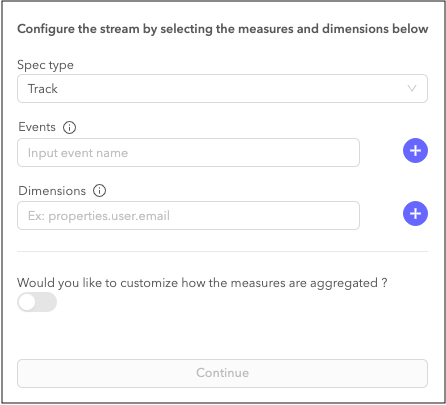
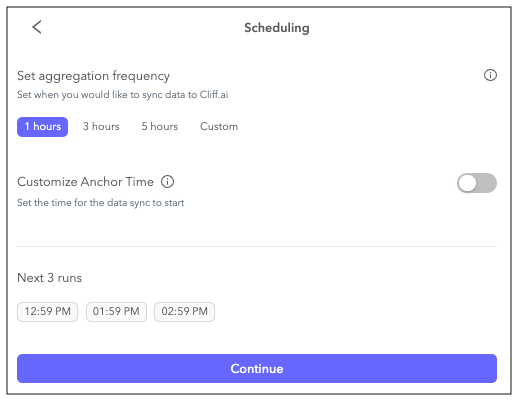

[Cliff](https://cliff.ai/?utm_source=segmentio&utm_medium=docs&utm_campaign=partners) monitors all your metrics in real time, detects unexpected changes (such as a sudden spike or dip), and notifies you immediately. It also shows you the root cause behind the unexpected change.

This destination is maintained by Cliff.ai. For any issues with the destination, [contact the Cliff Support team](mailto:support@cliff.ai).

## Getting Started



1. Go to the [Cliff Integrations library](https://app.cliff.ai/apps/anomaly-detection/integrations/inbound).
2. Find "Segment" in the list of available integrations and click **Start**.
3. Name your integration and click **Authorise Segment**.
4. Select your Workspace and Source and click **Allow**.
5. [Create a Data Stream on Cliff](https://app.cliff.ai/apps/anomaly-detection/data-streams/create-streams). Choose which Segment events and dimensions to start monitoring. Enter the name of the event and click the blue **+** button. Repeat to add dimensions. Click **Continue**.
   
   **Note**: Cliff ingests _only_ the events you select in this screen.
6.  Select how often Cliff should batch the data that Segment sends.



## Track

If you aren't familiar with the Segment Spec, take a look at the [Track method documentation](/docs/connections/spec/track/) to learn about what it does. An example call would look like:

```js
analytics.track('Login Button Clicked')
```

Segment sends Track calls to Cliff as a `track` event.

## Page

If you aren't familiar with the Segment Spec, take a look at the [Page method documentation](/docs/connections/spec/page/) to learn about what it does. An example call would look like:

```js
analytics.page()
```

Segment sends Page calls to Cliff as a `pageview`.

## Screen

If you aren't familiar with the Segment Spec, take a look at the [Screen method documentation](/docs/connections/spec/screen/) to learn about what it does. An example call would look like:

```objc
[[SEGAnalytics sharedAnalytics] screen:@"Home"];
```

Segment sends Screen calls to Cliff as a `screenview`.

## Identify

If you aren't familiar with the Segment Spec, take a look at the [Identify method documentation](/docs/connections/spec/identify/) to learn about what it does. An example call would look like:

```js
analytics.identify('userId123', {
  email: 'john.doe@example.com'
});
```

Segment sends Identify calls to Cliff as an `identify` event.

## Group

If you aren't familiar with the Segment Spec, take a look at the [Group method documentation](/docs/connections/spec/group/) to learn about what it does. An example call would look like:

```js
analytics.group("0e8c78ea9d97a7b8185e8632", {
  name: "Initech",
  industry: "Technology",
  employees: 329,
  plan: "enterprise",
  "total billed": 830
});
```

Segment sends Group calls to Cliff as a `group` event.
