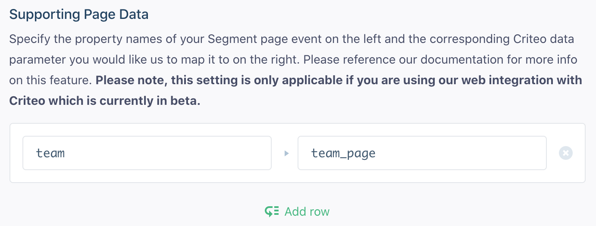
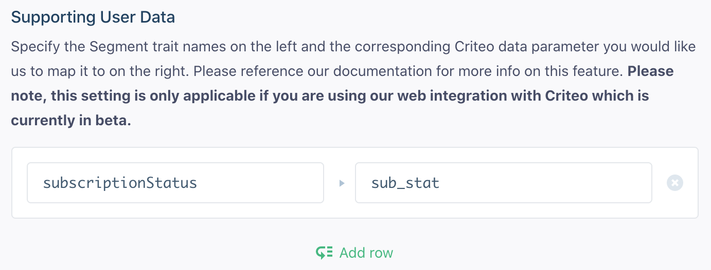

## Getting Started

> info "Information about Criteo App & Web Events and Analytics.js"
> If you connect the Criteo App & Web Events destination to an Analytics.js source, the connection defaults to Device-mode. Cloud-mode connections are not available with Analytics.js.

Currently this destination supports events originating from Mobile or Web sources (not Server). You can read more [about sources here](/docs/connections/sources/).

To get started with Criteo Events and Segment, you'll need:

1. An existing account with [Criteo](http://www.criteo.com/).
2. A data source integrated with either one of our mobile SDK's ([iOS](/docs/connections/sources/catalog/libraries/mobile/ios/) or [Android](/docs/connections/sources/catalog/libraries/mobile/android/)) or JavaScript library ([Analytics.js](/docs/connections/sources/catalog/libraries/website/javascript/))


## Track

Criteo Events is built to help you track key purchase funnel events and details. To accomplish that, you'll want to [`track`](/docs/connections/spec/track/) your user's actions using the following spec'd events to ensure you're following Criteo's best practices.

We use the context fields that we capture with our SDKs automatically to populate Criteo Events' tag with the app's name, user's language, locale, userId, deviceType and deviceId so you just need to make sure that the event names and properties match up! Refer to our [common fields guide](/docs/connections/spec/common/#context-fields-automatically-collected) to identify which context fields we collect automatically for each of our client-side libraries (analytics.js, analytics-ios or analytics-android).

### Product Viewed

When a user views a particular product or offering inside your application, you should call our [Product Viewed](/docs/connections/spec/ecommerce/v2/#product-viewed) event and we'll map that to Criteo Events' `viewProduct` tag. You'll need to make sure that the products on your `Product List Viewed` event have a `productId` property. As with all our integrations, casing does not matter! Your properties  can be camelCase or snake_case, both will work.

 analytics.track('Product Viewed', {
  product_id: '507f1f77bc',
  sku: 'G-32',
  category: 'Games',
  name: 'Monopoly: 3rd Edition',
  brand: 'Hasbro',
  variant: '200 pieces',
  price: 18.99,
  quantity: 1,
  coupon: 'MAYDEALS',
  currency: 'usd',
  position: 3,
  value: 18.99,
  url: 'https://www.example.com/product/path',
  image_url: 'https://www.example.com/product/path.jpg'
});
 

```js
analytics.track('Product Viewed', {
  product_id: '507f1f77bc',
  sku: 'G-32',
  category: 'Games',
  name: 'Monopoly: 3rd Edition',
  brand: 'Hasbro',
  variant: '200 pieces',
  price: 18.99,
  quantity: 1,
  coupon: 'MAYDEALS',
  currency: 'usd',
  position: 3,
  value: 18.99,
  url: 'https://www.example.com/product/path',
  image_url: 'https://www.example.com/product/path.jpg'
});
```

On web, the previous JavaScript example would result in the firing of the following Criteo Events tag:

```js
window.criteo_q.push({ event: 'viewItem', item: '507f1f77bc' })
```

### Product List Viewed

When a user views a list of products inside your application, you should call our [Product List Viewed](/docs/connections/spec/ecommerce/v2/#product-list-viewed) event and we'll map that to Criteo Events' `viewListing` tag. Same as above, make sure you have your item's `productId` or `product_id` on the event!

 analytics.track('Product List Viewed', {
  list_id: 'hot_deals_1',
  category: 'Deals',
  products: [
    {
      product_id: '1',
      sku: '45790-32',
      name: 'Monopoly: 3rd Edition',
      price: 19,
      position: 1,
      category: 'Games',
      url: 'https://www.example.com/product/path',
      image_url: 'https://www.example.com/product/path.jpg'
    },
    {
      product_id: '2',
      sku: '46493-32',
      name: 'Uno Card Game',
      price: 3,
      position: 2,
      category: 'Games'
    }
  ]
}); 

```js
analytics.track('Product List Viewed', {
  list_id: 'hot_deals_1',
  category: 'Deals',
  products: [
    {
      product_id: '1',
      sku: '45790-32',
      name: 'Monopoly: 3rd Edition',
      price: 19,
      position: 1,
      category: 'Games',
      url: 'https://www.example.com/product/path',
      image_url: 'https://www.example.com/product/path.jpg'
    },
    {
      product_id: '2',
      sku: '46493-32',
      name: 'Uno Card Game',
      price: 3,
      position: 2,
      category: 'Games'
    }
  ]
});
```

On web, the previous JavaScript example would result in the firing of the following Criteo Events tag:

```js
window.criteo_q.push({ event: 'viewList', item: ['1', '2'] })
```

### Cart Viewed

When a user views their Cart or Order details inside your application, you should call our [Cart Viewed](/docs/connections/spec/ecommerce/v2/#cart-viewed) event and we'll map that to Criteo Events' `viewBasket` tag.

You will need to have a products array of product objects in your Segment [Cart Viewed](/docs/connections/spec/ecommerce/v2/#cart-viewed) event with at least `id`, `price` and `quantity` properties on each product object in that array.

 analytics.track('Cart Viewed', {
  cart_id: 'd92jd29jd92jd29j92d92jd',
  products: [
    {
      product_id: '507f1f77bcf86cd799439011',
      sku: '45790-32',
      name: 'Monopoly: 3rd Edition',
      price: 19,
      position: 1,
      quantity: 6,
      category: 'Games',
      url: 'https://www.example.com/product/path',
      image_url: 'https://www.example.com/product/path.jpg'
    },
    {
      product_id: '505bd76785ebb509fc183733',
      sku: '46493-32',
      name: 'Uno Card Game',
      price: 3,
      position: 2,      quantity: 2,
      category: 'Games'
    }
  ]
});
 

```js
analytics.track('Cart Viewed', {
  cart_id: 'd92jd29jd92jd29j92d92jd',
  products: [
    {
      product_id: '507f1f77bcf86cd799439011',
      sku: '45790-32',
      name: 'Monopoly: 3rd Edition',
      price: 19,
      position: 1,
      quantity: 6,
      category: 'Games',
      url: 'https://www.example.com/product/path',
      image_url: 'https://www.example.com/product/path.jpg'
    },
    {
      product_id: '505bd76785ebb509fc183733',
      sku: '46493-32',
      name: 'Uno Card Game',
      price: 3,
      position: 2,
      quantity: 2,
      category: 'Games'
    }
  ]
});
```

On web, the previous JavaScript example would result in the firing of the following Criteo Events tag:

```js
window.criteo_q.push({ event: 'viewBasket', item: [
    {
        id: '507f1f77bcf86cd799439011',
        price: '19',
        quantity: 6
    },
    {
        id: '505bd76785ebb509fc183733',
        price: '3',
        quantity: 2
    }
]})
```

### Order Completed

When a user completes an order or purchase inside your application, you should call our [Order Completed](/docs/connections/spec/ecommerce/v2/#order-completed) event and we'll map that to Criteo Events' `trackTransaction` tag.

You will need to have a products array of product objects in your Segment [Order Completed](/docs/connections/spec/ecommerce/v2/#order-completed) event with at least `id`, `price` and `quantity` properties on each product object in that array. You also must pass an `orderId`.

 analytics.track('Order Completed', {
  checkout_id: 'fksdjfsdjfisjf9sdfjsd9f',
  order_id: '098dsf098f',
  affiliation: 'Google Store',
  total: 27.50,
  subtotal: 22.50,
  revenue: 25.00,
  shipping: 3,
  tax: 2,
  discount: 2.5,
  coupon: 'hasbros',
  currency: 'USD',
  products: [
    {
      product_id: '507f1f77bcf86cd799439011',
      sku: '45790-32',
      name: 'Monopoly: 3rd Edition',
      price: 19,
      quantity: 1,
      category: 'Games',
      url: 'https://www.example.com/product/path',
      image_url: 'https:///www.example.com/product/path.jpg'
    },
    {
      product_id: '505bd76785ebb509fc183733',
      sku: '46493-32',
      name: 'Uno Card Game',
      price: 3,
      quantity: 2,
      category: 'Games'
    }
  ]
}); 

```js
  analytics.track('Order Completed', {
    checkout_id: 'fksdjfsdjfisjf9sdfjsd9f',
    order_id: '098dsf098f',
    affiliation: 'Google Store',
    total: 27.50,
    subtotal: 22.50,
    revenue: 25.00,
    shipping: 3,
    tax: 2,
    discount: 2.5,
    coupon: 'hasbros',
    currency: 'USD',
    products: [
      {
        product_id: '507f1f77bcf86cd799439011',
        sku: '45790-32',
        name: 'Monopoly: 3rd Edition',
        price: 19,
        quantity: 1,
        category: 'Games',
        url: 'https://www.example.com/product/path',
        image_url: 'https:///www.example.com/product/path.jpg'
      },
      {
        product_id: '505bd76785ebb509fc183733',
        sku: '46493-32',
        name: 'Uno Card Game',
        price: 3,
        quantity: 2,
        category: 'Games'
      }
    ]
  });
```

On web, the previous JavaScript example would result in the firing of the following Criteo Events tag:

```js
window.criteo_q.push({ event: 'trackTransaction', id: '098dsf098f', currency: 'USD', item: [
    {
        id: '507f1f77bcf86cd799439011',
        price: '19',
        quantity: 1
    },
    {
        id: '505bd76785ebb509fc183733',
        price: '3',
        quantity: 2
    }
]})
```

### Application Opened

**This is only relevant if you are using this integration for mobile. For the equivalent on web, see below.**

Our [Application Opened](/docs/connections/spec/mobile/#application-opened) event will map to Criteo Events' `viewHome` tag. This event is automatically collected by the latest versions of our SDKs so update if you haven't already!

## Page

Criteo Events' `viewHome` tag tracks top of funnel visits to your site's home page. We integrate with this functionality on web using the use of our `.page` method.

There are two ways of letting Segment know which `.page` event should trigger this tag:

1. You can define the [`name`](/docs/connections/sources/catalog/libraries/website/javascript/#page) argument in the `.page` method as 'Home':

```js
analytics.page('Home')
```

2. You can give us the URL of your home page as an integration setting. Reference the [settings](#settings) section for more info.

## Other Features

### Extra Data

**This functionality is currently only available using our web integration with Criteo. We are working on adding it for mobile.**

Criteo Events supports the ability to send extra data with events about a page or user to supply your events with more context (This is a feature that is set up with the assistance of your Crtieo Account Manager).

To enable this functionality, you will need to provide us with the names of the Criteo Events data parameters you would like us to pass along as well as the name of the properties or traits of the Segment `.page` or `.identify` events that you would like us to map them from.

This is set up using the **Supporting User Data** and **Supporting Page Data** settings in your Criteo Events integration settings. In each of these, you can provide us with a list of key/value mappings designating the name of the Segment property/trait on the left and the corresponding Criteo Events parameter it should map to on the right.

Here is an example of Supporting Page Data:



Here is an example of Supporting User Data:



Once this is complete, we will do the following:

We will compare the properties of any `.page` events you invoke with the **Supporting Page Data** mappings. If a match is found, we will set the values of those properties as the values of Criteo Events data parameters you defined and pass them along with any future events that occur on the page. **If you are using this functionality, make sure the `.page` event is being invoked on the page before any subsequent `.track` events.**

For example, if you set the page event mappings defined above and triggered a page event like this:

```js
analytics.page('Team Page', { team: 'New York Giants' })
```

And then on that same page triggered one of the `.track` events documented above ([Product Viewed](#product-viewed) for example) the subsequent Criteo tag would look like this:

```js
window.criteo_q.push({ event: 'viewItem', item: 'PRODUCT-ID', team_page: 'New York Giants' })
```

Because `identify` events cache any user traits you've specified in localstorage, we can do a similar lookup as above with the **Supporting User Data** mappings. If there are any matches, we will pass that data along as their corresponding Criteo data parameters.

For example, if you set the trait mappings defined above and had, at some point, previously triggered an `identify` event like this:

```js
analytics.identify('userId', { subscriptionStatus: 'trial' })
```

Any future `.track` events documented above would have `sub_status` as an extra data parameter (assuming the user had not cleared their localstorage). Here's the same `viewItem` event as an example:

```js
window.criteo_q.push({ event: 'viewItem', item: 'PRODUCT-ID', sub_status: 'trial' })
```

**Note: Of course if you later change the user's `subscriptionStatus` to be a different value using the use of another `identify` call, the `sub_status` value will also be updated.**

### Setting Emails

It's easy to associate emails with a user, if there's an `email` property in a [`track`](/docs/connections/spec/track/) call, we'll include the `setHashedEmail` event to Criteo along with your event. We'll take care of hashing it for you

### Criteo Data Centers

Criteo has multiple data centers to better serve global companies and we will automatically infer from your users' devices which data center to send the data to for you so you don't need to worry about it!

## Troubleshooting

### Sending Dates

Criteo Events can receive dates in a specific format, in order for us to pass along dates to Criteo, make sure you follow the spec laid out in our [Spec](/docs/connections/spec/)

## FAQ

### Is the mobile integration bundled?

Even though we don't support integrating with Criteo Events using Segment from a server source, it's still not necessary for you to [bundle](/docs/connections/spec/mobile-packaging-sdks//) the Criteo Events SDK into the Segment SDK! This is because while our mobile integration with them is powered from our servers, the integration requires metadata that can only be supplied by the user's mobile device (which is collected and passed along automatically by the Segment mobile SDK).
