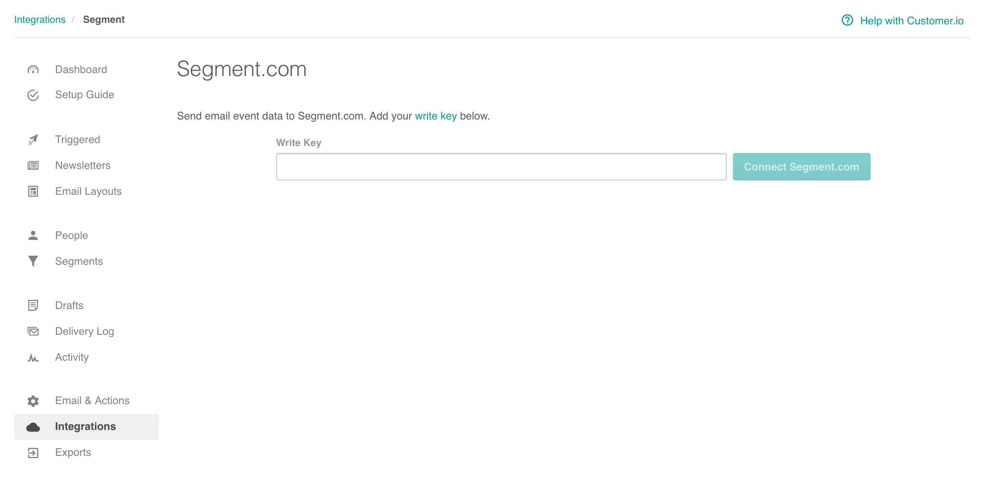

[Customer.io](https://customer.io/) lets you send automated email, push, SMS, letters, and webhooks based on your customer's activities in your app or product. It makes conversion tracking, optimization and remarketing easier. The `analytics.js` Customer.io Destination is open-source. You can browse the code [on GitHub](https://github.com/segment-integrations/analytics.js-integration-customerio).

This document was last updated on January 26, 2018. If you notice any gaps, out-dated information or want to leave some feedback to help improve the documentation, [let us know](https://segment.com/help/contact)!

> success ""
> **Good to know**: This page is about the Customer.io Segment destination, which receives data from Segment. There's also a page about the [Customer.io Segment source](/docs/connections/sources/catalog/cloud-apps/customer-io/), which sends data _to_ Segment!


## Getting Started



To connect Customer.io as a Segment destination:
1. Navigate to **Connections > Destinations** in Segment.
2. Click **Add Destination**.
3. Search for `Customer.io` and select it.
4. Click **Configure Customer.io** and choose which source to connect the destination to.
5. Enter your settings for these fields and click **Save**:

Field | Details
----- | -------
Destination Name | The name you want to identify the destination with.
Connection Mode | You can choose between **Cloud Mode** and **Device Mode**. Segment recommends using Cloud Mode.
How would you like to set up this destination? | You can choose to fill the settings manually or copy the settings from an existing destination instance.

6. Enter your **API Key** and **Site ID** on the Settings tab of your new destination. You can find these in your Customer.io account under **Account Settings > API Credentials**.
7. Click the toggle to activate the integration and start sending data to your Customer.io destination.

If you want to sync your settings directly from your Customer.io workspace instead, go to **Settings > Integrations** and find the **Segment Destination** integration. .


## Page

If you're not familiar with the Segment Specs, take a look to understand what the [Page method](/docs/connections/spec/page/) does. An example call would look like:

```javascript
analytics.page();
```

Page events send to Customer.io as a `Page View` event where names and properties are optional. In the Customer.io "Activity View", the event will have "Activity Type" set to "Page View" and "Activity Name" set to the page name. If there is no page name, "Activity Name" defaults to the page URL.

## Screen

If you're not familiar with the Segment Specs, take a look to understand what the [Screen method](/docs/connections/spec/screen/) does. An example call would look like:

```objc
[[SEGAnalytics sharedAnalytics] screen:@"Home"];
```

Screen events send to Customer.io as a custom event. In the Customer.io "Activity View", "Activity Type" is `event` and "Activity Value" sets to `Viewed {screen name} Screen`. For the earlier example the "Activity Value" will be `Viewed Home Screen`. If there is no screen name, then "Activity Value" will be `Viewed Undefined Screen`.


## Identify

If you're not familiar with the Segment Specs, take a look to understand what the [Identify method](/docs/connections/spec/identify/) does. An example call would look like:

```javascript
analytics.identify('userId123', {
  email: 'john.doe@example.com'
});
```

An email address isn't required by Customer.io. It's only needed for people you intend to send email messages to (as opposed to SMS or push notifications). If you want an email to appear in the Customer.io "People View", you must provide an email as a trait labeled `email`.

When you identify a new user, the user will subscribe to Customer.io. If the user is already subscribed, the user attributes will update according to the traits provided.

To unsubscribe a user, pass in `user_id` and `unsubscribed` (with a value of true) in an `identify` call. Be sure the `user_id` and `email` match the values in Customer.io, which you can find in the "Overview" section under the "Attributes" column within an individual user's view in the Customer.io UI. Here is an example of how to unsubscribe a user:

```javascript
analytics.identify('userId123', {
    email: 'john.doe@example.com',
    unsubscribed: true
  }
)
```
## Track

If you're not familiar with the Segment Specs, take a look to understand what the [Track method](/docs/connections/spec/track/) does. An example call would look like:

```javascript
analytics.track('Clicked Button');
```

Track events send to Customer.io as `custom events`. In the Customer.io "Activity View", "Activity Type" sets to `event` and "Activity Name" sets to the event name.

## Device Token Set up

Set `device.token` before you send the `Application Installed`, `Application Uninstalled`, or `Application Opened` events to Segment.

For that, you need to make the following calls:

- For Android, you need to make a call to `putDeviceToken` when Segment client initializes.
    - Read [more here](/docs/connections/sources/catalog/libraries/mobile/android/#how-should-i-use-outbounds-push-notifications) for adding tokens for Android devices
- For iOS, you need to make a call to `segment.registeredForRemoteNotifications` when you receive the `didRegisterForRemoteNotificationsWithDeviceToken` event.
    - Read [more here](/docs/connections/sources/catalog/libraries/mobile/ios/#how-do-i-use-push-notifications) for adding tokens for iOS devices

## Application Installed

[Application Installed](/docs/connections/spec/mobile/#application-installed) events will add or update a device in the person's Customer.io profile using [this](https://customer.io/docs/api/#apitrackcustomersdevices_update) API endpoint. Note, you must pass a device token in your event payload using a `context.device.token` property. See more on Contextual properties [here](/docs/connections/spec/common/#context).

 api-example '{
"action": "track",
"userId": "019mr8mf4r",
"event": "Application Installed",
"properties": {
  "version": "1.2.3",
  "build": 1234
},
"context": {
  "device": {
    "token": "ff15bc0c20c4aa6cd50854ff165fd265c838e5405bfeb9571066395b8c9da449",
    "type": "ios"
  }
}
}'}}} 

```js
{
"action": "track",
"userId": "019mr8mf4r",
"event": "Application Installed",
"properties": {
  "version": "1.2.3",
  "build": 1234
},
"context": {
  "device": {
    "token": "ff15bc0c20c4aa6cd50854ff165fd265c838e5405bfeb9571066395b8c9da449",
    "type": "ios"
  }
}
}
```

 ## Application Opened
[Application Opened](/docs/connections/spec/mobile/#application-opened) events will add or update a device in the person's Customer.io profile using the same endpoint as above.  If a device already exists, Customer.io will update its `last_used_at` timestamp. Again, make sure you pass a device token in your event payload using a `context.device.token` property. See more on [Contextual properties](/docs/connections/spec/common/#context).

 api-example '{
"action": "track",
"userId": "019mr8mf4r",
"event": "Application Opened",
"properties": {
  "version": "1.2.3",
  "build": 1234
},
"context": {
  "device": {
    "token": "ff15bc0c20c4aa6cd50854ff165fd265c838e5405bfeb9571066395b8c9da449",
    "type": "ios"
  }
}
}'}}} 

```js
{
"action": "track",
"userId": "019mr8mf4r",
"event": "Application Opened",
"properties": {
  "version": "1.2.3",
  "build": 1234
},
"context": {
  "device": {
    "token": "ff15bc0c20c4aa6cd50854ff165fd265c838e5405bfeb9571066395b8c9da449",
    "type": "ios"
  }
}
}
```

 ## Application Uninstalled
[Application Uninstalled](/docs/connections/spec/mobile/#application-installed) events will remove the device from the person's Customer.io profile using [this](https://customer.io/docs/api/#apitrackcustomersdevices_delete) API endpoint. Note, you must pass a device token in your event payload using a `context.device.token` property. See more on [Contextual properties](/docs/connections/spec/common/#context).


 api-example '{
"action": "track",
"userId": "019mr8mf4r",
"event": "Application Uninstalled",
"properties": {
  "version": "1.2.3",
  "build": 1234
},
"context": {
  "device": {
    "token": "ff15bc0c20c4aa6cd50854ff165fd265c838e5405bfeb9571066395b8c9da449",
    "type": "ios"
  }
}
}'}}} 

```js
{
"action": "track",
"userId": "019mr8mf4r",
"event": "Application Uninstalled",
"properties": {
  "version": "1.2.3",
  "build": 1234
},
"context": {
  "device": {
    "token": "ff15bc0c20c4aa6cd50854ff165fd265c838e5405bfeb9571066395b8c9da449",
    "type": "ios"
  }
}
}
```

### Sending Data from Customer.io

Customer.io supports sending [email events](/docs/connections/spec/email/) to other tools on the Segment platform. These events send as `track` calls to the other destinations you've turned on.

To enable this feature, go to the Account Settings in Customer.io and add your Segment write key:




## Best Practices

### Rate Limits
Customer.io has limits on the data collected by their API. To ensure your events arrive in Customer.io, make sure that you're respecting the limits placed on the [Customer.io API](https://learn.customer.io/api/#api-documentationlimits). If you're using Segment's [HTTP API](/docs/connections/sources/catalog/libraries/server/http/) to send a batch of events to Customer.io at once, make sure you throttle the `import` to 100-200 requests per second.

## Troubleshooting

### No Events in Customer.io from the Browser
Remember that before Segment can send events to Customer.io from client-side Javascript, the current user must identify with their `userId`. The user's email address is only used to identify them if that is the ID on record for them in Customer.io.

### Page events not associated with user
Page events will associate to a user if the user has been previously identified in Customer.io. If you identify a user after making Page calls, the previous page events won't associate to the user in Customer.io.


## Personas

You can send computed traits and audiences generated using [Segment Personas](/docs/personas) to this destination as a **user property**. To learn more about Personas, contact Segment for a [demo](https://segment.com/contact/demo).

For user-property destinations, an [identify](/docs/connections/spec/identify/) call sends to the destination for each user that's added and removed. The property name is the snake_cased version of the audience name, with a true/false value to indicate membership. For example, when a user first completes an order in the last 30 days, Personas sends an Identify call with the property `order_completed_last_30days: true`. When the user no longer satisfies this condition (for example, it's been more than 30 days since their last order), Personas sets that value to `false`.

> note ""
> Customer.io requires you to pass a `userId` value when you sync Audiences or Computed Traits.

When you first create an audience, Personas sends an Identify call for every user in that audience. Later audience syncs only send updates for users whose membership has changed since the last sync.
