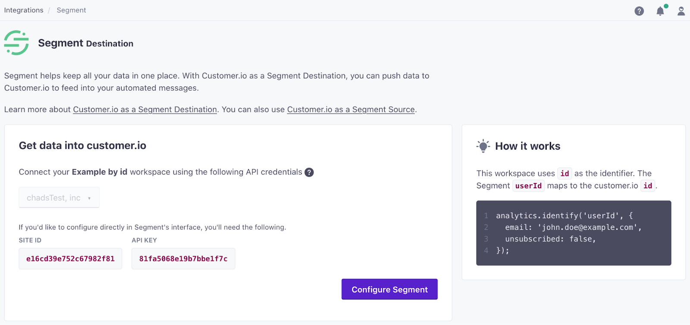
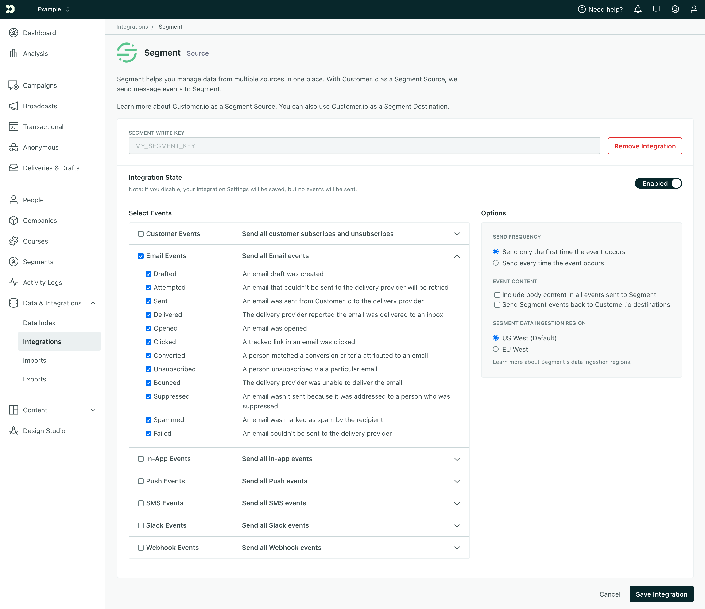

[Customer.io](https://customer.io/) helps you send automated email, push, SMS, and webhooks based on your customers' activities in your app or product. It makes conversion tracking, optimization and re-marketing easier. The `analytics.js` Customer.io Destination is open-source. You can browse the code [on GitHub](https://github.com/segmentio/analytics.js-integrations/tree/master/integrations/customerio).

> success ""
> **Good to know**: This page is about the Customer.io Segment destination, which receives data from Segment. There's also a page about the [Customer.io Segment source](/docs/connections/sources/catalog/cloud-apps/customer-io/), which sends data _to_ Segment!


## Getting Started



You can follow the setup guide through Segment using the steps below, or you can automatically sync your Customer.io connection settings to your Segment source using the flow in your Customer.io workspace's Integrations page.

1. From the Segment web app, click **Connections** > **Destinations**.
1. Search for “Customer.io”, select it, and then click **Configure Customer.io**.
1. Select the data sources you want to connect to Customer.io and click **Next**.
1. Enter your *Destination Name* and select your **Connection Mode**—Cloud Mode or Device Mode. Click **Save**.
1. Under *Connection Settings*, enter your Customer.io workspace **API Key** and **Site ID**. You'll find both in your Customer.io *Account Settings* > *API Credentials* page.

If you want to sync your settings directly from your Customer.io workspace, go to **Settings** > **Integrations** and find the **Segment Destination** integration.



## Page

If you're not familiar with the Segment Specs, take a look to understand what the [Page method](/docs/connections/spec/page/) does. An example call would look like:

```javascript
analytics.page();
```

Page events send to Customer.io as a `Page View` event where names and properties are optional. In the Customer.io "Activity Logs", the event will have "Activity Type" set to "Page View" and "Activity Name" set to the page name. If there is no page name, "Activity Name" defaults to the page URL.

## Screen

If you're not familiar with the Segment Specs, take a look to understand what the [Screen method](/docs/connections/spec/screen/) does. An example call would look like:

```objc
[[SEGAnalytics sharedAnalytics] screen:@"Home"];
```

Screen events send to Customer.io as a custom event. In the Customer.io "Activity Logs", "Activity Type" is `event` and "Activity Value" sets to `Viewed {screen name} Screen`. For the earlier example the "Activity Value" will be `Viewed Home Screen`. If there is no screen name, then "Activity Value" will be `Viewed Undefined Screen`.


## Identify

If you're not familiar with the Segment Specs, take a look to understand what the [Identify method](/docs/connections/spec/identify/) does. An example call looks like this:

```javascript
analytics.identify('userId123', {
  email: 'john.doe@example.com'
});
```

When you identify a new user, Customer.io adds the user to your Customer.io workspace. If the user exists, the identify request updates the existing person's attributes.

If your Customer.io workspace supports both `email` and `id` as identifiers (the default setting as of June 2021), you can identify people either by a database identifier (called `id` in Customer.io) or the `email` trait.

This provides a path to identify people who enter your system as leads (by email) and then assign them an ID in Customer.io when they become a customer or user.

* If you don't have an ID, pass a person's email address as the `userId` in the identify call. Customer.io maps this value to a person's `email` attribute.
* If you have an ID, set the `userId` in the identify call to the person's ID and pass `email` as a trait. This sets both a person's `id` and `email` attributes in Customer.io. If you previously identified a person by `email`, your request updates that person and assigns them an `id`.


### Updating people

When Customer.io recognizes either the `id` or `email` in your request, your identify request updates that person.

```javascript
analytics.identify('userId123', {
  email: 'john.doe@example.com',
  fav_food: 'pizza'
});
```

If you want to change the `id` or `email` you've assigned a person in Customer.io, you have to pass a person's `cio_id`, in the format `cio_<cio_id value>` as the `userId` in your identify call. Currently, you must retrieve this value from a person's page in the Customer.io interface. In the future, you'll be able to do that using this call from Customer.io API.

```javascript
analytics.identify('cio_<cio_id value>', {
  email: 'new.email@example.com',
  id: 'new-id-value'
});
```

### Unsubscribing Users

To unsubscribe a user, simply pass `unsubscribed: true` in an identify call. Be sure the `id` and/or `email` values match the values in Customer.io. You can find these values in Customer.io by selecting a person on the _People_ page, and clicking _Attributes_. Here is an example that unsubscribes a user:

```javascript
analytics.identify('userId123', {
    email: 'john.doe@example.com',
    unsubscribed: true
  }
)
```

### Identifying people in workspaces that only support ID

In older workspaces, or workspaces using Customer.io's "classic" settings, you can only identify people by ID.

You do not need to pass an email address unless you want to send emails. If you want to send emails, you must provide the email address as a trait labeled `email`.

## Track

If you're not familiar with the Segment Specs, take a look to understand what the [Track method](/docs/connections/spec/track/) does. An example call would look like:

```javascript
analytics.track('Clicked Button');
```

Track events send to Customer.io as `custom events`. In the Customer.io "Activity Logs", "Activity Type" sets to `event` and "Activity Name" sets to the event name.

## Device Token Set up

Set `device.token` before you send the `Application Installed`, `Application Uninstalled`, or `Application Opened` events to Segment.

For that, you need to make the following calls:

- For Android, you need to make a call to `putDeviceToken` when Segment client initializes.
    - Read [more here](/docs/connections/sources/catalog/libraries/mobile/android/#how-should-i-use-outbounds-push-notifications) for adding tokens for Android devices
- For iOS, you need to make a call to `segment.registeredForRemoteNotifications` when you receive the `didRegisterForRemoteNotificationsWithDeviceToken` event.
    - Read [more here](/docs/connections/sources/catalog/libraries/mobile/ios/#how-do-i-use-push-notifications) for adding tokens for iOS devices

## Application Installed

[Application Installed](/docs/connections/spec/mobile/#application-installed) events will add or update a device in the person's Customer.io profile using [this](https://customer.io/docs/api/#operation/add_device) API endpoint. Note, you must pass a device token in your event payload using a `context.device.token` property. See more on Contextual properties [here](/docs/connections/spec/common/#context).

 api-example '{
"action": "track",
"userId": "019mr8mf4r",
"event": "Application Installed",
"properties": {
  "version": "1.2.3",
  "build": 1234
},
"context": {
  "device": {
    "token": "ff15bc0c20c4aa6cd50854ff165fd265c838e5405bfeb9571066395b8c9da449",
    "type": "ios"
  }
}
}'}}} 

```js
{
"action": "track",
"userId": "019mr8mf4r",
"event": "Application Installed",
"properties": {
  "version": "1.2.3",
  "build": 1234
},
"context": {
  "device": {
    "token": "ff15bc0c20c4aa6cd50854ff165fd265c838e5405bfeb9571066395b8c9da449",
    "type": "ios"
  }
}
}
```


## Application Opened


[Application Opened](/docs/connections/spec/mobile/#application-opened) events will add or update a device in the person's Customer.io profile using the same endpoint as above.  If a device already exists, Customer.io will update its `last_used_at` timestamp. Again, make sure you pass a device token in your event payload using a `context.device.token` property. See more on [Contextual properties](/docs/connections/spec/common/#context).

 api-example '{
"action": "track",
"userId": "019mr8mf4r",
"event": "Application Opened",
"properties": {
  "version": "1.2.3",
  "build": 1234
},
"context": {
  "device": {
    "token": "ff15bc0c20c4aa6cd50854ff165fd265c838e5405bfeb9571066395b8c9da449",
    "type": "ios"
  }
}
}'}}} 

```js
{
"action": "track",
"userId": "019mr8mf4r",
"event": "Application Opened",
"properties": {
  "version": "1.2.3",
  "build": 1234
},
"context": {
  "device": {
    "token": "ff15bc0c20c4aa6cd50854ff165fd265c838e5405bfeb9571066395b8c9da449",
    "type": "ios"
  }
}
}
```


## Application Uninstalled


[Application Uninstalled](/docs/connections/spec/mobile/#application-installed) events will remove the device from the person's Customer.io profile using [this](https://customer.io/docs/api/#operation/delete_device) API endpoint. Note, you must pass a device token in your event payload using a `context.device.token` property. See more on [Contextual properties](/docs/connections/spec/common/#context).


 api-example '{
"action": "track",
"userId": "019mr8mf4r",
"event": "Application Uninstalled",
"properties": {
  "version": "1.2.3",
  "build": 1234
},
"context": {
  "device": {
    "token": "ff15bc0c20c4aa6cd50854ff165fd265c838e5405bfeb9571066395b8c9da449",
    "type": "ios"
  }
}
}'}}} 

```js
{
"action": "track",
"userId": "019mr8mf4r",
"event": "Application Uninstalled",
"properties": {
  "version": "1.2.3",
  "build": 1234
},
"context": {
  "device": {
    "token": "ff15bc0c20c4aa6cd50854ff165fd265c838e5405bfeb9571066395b8c9da449",
    "type": "ios"
  }
}
}
```

### Sending Data from Customer.io

You can enable Customer.io as a Segment Source to send[ email events](/docs/connections/spec/email/) to other tools on the Segment platform. These events are sent as track calls to the other destinations you've turned on.

To enable this feature:

1. In Customer.io go to **Settings** > **Integrations**.
2. Find the Segment Source integration.
3. Add your _Segment Write Key_ and click **Connect Segment**.



## Best Practices

### Rate Limits
Customer.io has limits on the data collected by their API. To ensure your events arrive in Customer.io, make sure that you're respecting the limits placed on the [Customer.io API](https://customer.io/docs/api/#tag/trackLimit). If you're using Segment's [HTTP API](/docs/connections/sources/catalog/libraries/server/http/) to send a batch of events to Customer.io at once, make sure you throttle the `import` to 100-200 requests per second.

## Troubleshooting

### No Events in Customer.io from the Browser
Remember that before Segment can send events to Customer.io from client-side JavaScript, the current user must identify with their `userId`. The user's email address is only used to identify them if that is the ID on record for them in Customer.io.

### Page events not associated with user
Page events will associate to a user if the user has been previously identified in Customer.io. If you identify a user after making Page calls, the previous page events won't associate to the user in Customer.io.


## Personas

You can send computed traits and audiences generated using [Segment Personas](/docs/personas) to this destination as a **user property**. To learn more about Personas, contact Segment for a [demo](https://segment.com/contact/demo).

For user-property destinations, an [identify](/docs/connections/spec/identify/) call sends to the destination for each user that's added and removed. The property name is the snake_cased version of the audience name, with a true/false value to indicate membership. For example, when a user first completes an order in the last 30 days, Personas sends an Identify call with the property `order_completed_last_30days: true`. When the user no longer satisfies this condition (for example, it's been more than 30 days since their last order), Personas sets that value to `false`.

> note ""
> Customer.io requires you to pass an identifier value (ID or email, depending on your workspace settings), when you sync Audiences or Computed Traits.

When you first create an audience, Personas sends an Identify call for every user in that audience. Later audience syncs only send updates for users whose membership has changed since the last sync.
