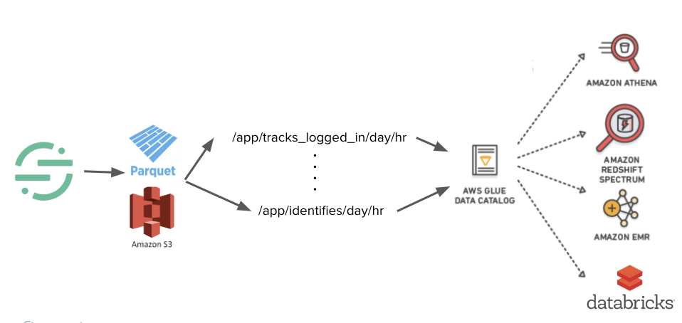
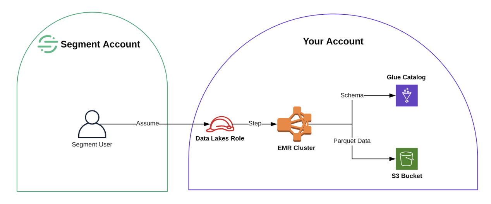

Segment Data Lakes let you send Segment data to cloud data stores (for example AWS S3 to start) in a way that is optimized for Data analytics and Data Science workloads. Segment data is great for building machine learning models for personalization and recommendations, and for other large scale advanced analytics. However, without Data Lakes, you might need to do a significant amount of processing to get real value out of this data.

Segment Data Lakes blends the experience of using our existing S3 destination and data warehouse destination. It makes data in S3 more actionable and accessible for customers by building in logical data partitions, storing it in a read optimized encoding format (Parquet initially), and integrating deeply with existing schema management tools, such as the AWS Glue Data Catalog. These formats are optimized for use with systems like Spark, Athena, or Machine Learning vendors like DataBricks or DataRobot.

With Segment Data Lakes, Data Engineering, Analysts, and Data Science teams can keep hot and cold data in different places, reduce costs, remove resource contention to optimize performance, and have a flexible model to consume data across Parquet to build materialized views and aggregations.

To learn more, read our blog post on [Cultivating your Data Lake](https://segment.com/blog/cultivating-your-data-lake).

## How Segment Data Lakes Work

Segment builds a Data Lake on top of what’s already in Segment today - out of the box event collection, Parquet transformations, and a logical table structure, to provide a clean Data Lake to query and gain insights from.

The three tenets to create a clean and easy to use Data Lake are:

- **Fast and efficient**: All data is sent to S3 in Parquet format for easy read access.
- **Break down data in logical structure**: All data is partitioned by source, event type, date and hour. This narrows in on the data you care about when querying, and provides the same tracks and events tables that you get with Segment’s warehouse product.
- **Accessible data structure**: Data structure is fed into the Glue Data Catalog for all tools to be able to target specific pieces of data, giving you flexbility to build on top of the raw data set.

From here you can connect a multitude of tools to glean insights from the S3 data - Athena, Spectrum, Databricks, EMR.

Today, Segment sends Segment event data in S3 for you by doing the processing in an EMR cluster within your AWS account. Conducting the data processing in your VPC will provide privacy and data ownership gains for you short term.

### Using a Data Lake with a Data Warehouse

Data Lakes bridges the gap between today’s S3 experience and warehouse experience for Segment customers, in order to provide a flexible blob storage solution to Data teams as they scale.

When using Data Lakes, you can either solely use Data Lakes as your source of data and query all of your data directly from S3, or you can use Data Lakes alongside a data warehouse.

The Data Lakes and Warehouses products are not in parity with each other, but instead they are compatible because there is an understandable mapping between the two. This mapping enables you to identify and manage the differences to bridge the experience between Data Lakes and Warehouses.

Additionally, Data Lakes offers the ability to configure different components of the set up to increase compatibility with Warehouses. This configuration includes the number of Glue Databases used, setting a table prefix, and selecting between two schemas.

## Data Lakes Schema

### S3 Partition Structure

To ensure the data is actionable and accessible, Segment partitions the data in S3 by the source, event type, then the day and hour an event was received by Segment.

Here’s a sample of what this looks like:
`s3://<top-level-Segment-bucket>/data/<source-id>/segment_type=<event type>/day=<day>/hr=<hour>`

Checkout, track events
`s3://data-lake/segment-data-lake/data/xxxxxxxxxx/segment_type=track_checkout/day=2019-10-01/hr=12`

Identify calls
`s3://data-lake/segment-data-lake/data/xxxxxxxxxx/segment_type=identify/day=2019-10-02/hr=22`

### Glue Database

When enabling the Data Lakes destination for a source, you set the Glue Database name in the **Settings** tab. The name of the Glue Database is where your schema will be written.

Setting the Glue Database name will define whether all sources live in one Glue Database, or a different database for each source. For those looking to query data across Data Lakes and a data warehouse simultaneously, the latter option will provide this flexibility.

> info ""
> Segment can create the Glue databases for you if you grant it the correct IAM role permissions. If you do not grant Segment the correct permissions, then you must manually create the Glue databases for Segment to write to.

> warning ""
> If you change a database name or table prefix, new tables will be created which will require a replay of historical data.

#### One Glue Database for all sources

If you choose to have data from all sources live in one database, you’ll need to also define a table prefix in the **Data Lakes > Source** settings.

This table prefix separates event tables for each source, to prevent different event types across sources from colliding, and make it be possible to tell whether a `tracks` table is for Source A or Source B. We recommend setting the table prefix to the source slug.

Here's an example of what the table name looks like with and without a prefix:

**With Prefix**:
- `Source A: db.iOS_prod_tracks_page_views`
- `Source B: db.android_prod_tracks_page_views`

**Without Prefix**:
- `Source A: db.tracks_page_views`
- `Source B: db.tracks_page_views `

As you can see in the second example, the table names for the two sources are identical even though they contain track events for different sources. By adding a prefix, you can specify which source each table is referring to.

#### One Glue Database per source

Separating each source in its own Glue Database creates better organization and easier querying across the data. It's also consistent with the table structure seen in Segment warehouses, so we recommend using this configuration if you’re looking to use Data Lakes with your data warehouse.

In this configuration, a table prefix is not needed. We recommend keeping the default setting `(null)`.

Here’s what the table names will look like:

**With Prefix**:
`$dbname.$tableprefix_$eventtype`
Examples: `ios_prod.ios_track_page_view`, `ios_dev.identify`

**Without Prefix**:
`$dbname.$eventtype`
Examples: `ios_prod.track_page_view`, `ios_dev.identify`

**Warehouse**:
`$source_slug.$event_type`
Examples: `ios_prod.page_view`, `ios_dev.identify`

### Data Types
Data Lakes infers the data type for the event it receives. Data Lakes looks at the group of events received every hour to infer the data type for that event.

If a bad data type is seen, such as text in place of a number or an incorrectly formatted date, Data Lakes attempts a best effort conversion to cast the field to the target data type. Fields that cannot be casted may be dropped. There is always the option to correct the data type in the schema to the desired type and perform a replay to ensure no data is lost. [Contact us] (https://segment.com/help/contact/) if a data type needs to be corrected.

## Getting Started

### Step 1 - Pre-Requisites

Before you set up Segment Data Lakes, you’ll need the following resources:

- An authorized [AWS account](https://aws.amazon.com/account/)
- A [S3 bucket](https://github.com/terraform-aws-modules/terraform-aws-s3-bucket) to send data to and store logs
- A subnet within a VPC for the EMR cluster to run in

### Step 2 - Set Up AWS Resources

You can use this [open source Terraform repo](https://github.com/segmentio/terraform-aws-data-lake) to automate a lot of the set up work to get Segment Data Lakes up and running. We also have [UI based setup docs](https://docs.google.com/document/d/1GlWzS5KO4QaiVZx9pwfpgF-N-Xy2e_QQcdYSX-nLMDU/edit?usp=sharing) if you prefer to use these instead.

The Terraform module and UI instructions provide a base level of permissions to Segment (for example, the correct IAM role to allow Segment to create Glue databases on your behalf). If you want stricter permissions, or other custom configurations, you can customize these manually.

### Step 3 - Enable Destination

Once you’ve set up the necessary AWS resources:

1. Visit [the Data Lakes landing page in your workspace](https://app.segment.com/goto-my-workspace/destinations/catalog/data-lakes). (Make sure you're in the correct workspace before continuing.)

2. Click **Configure Data Lakes**.

3. Select the source to connect to the Data Lakes destination. Each source must be individually connected to the Data Lakes destination, however you can copy the settings from another source by clicking the “…” button (next to the button for “Setup Guide”).

   > **Note**: All sources must be included in the external ID list or else the source data cannot be synced to S3.

4. In the Settings tab, enter and save the following connection settings:
   - **AWS Region**: The AWS Region where your EMR cluster, S3 Bucket and Glue DB reside.
   - **EMR Cluster ID**: The EMR Cluster ID where your jobs will be run.
   - **Glue Catalog ID**: The Glue Catalog ID (this must be the same as your AWS account ID).
   - **Glue Database Name**: The name of the Glue Database where your schema will be written.
   - **IAM Role ARN**: The ARN of the IAM role that Segment will use to connect to your Data Lake.
   - **S3 Bucket**: Name of the S3 bucket used by the Data Lake. The EMR cluster will be configured to store logs in this bucket.
   - _(Optional)_ **Table Prefix**: Optional prefix to use for the tables created in Glue. This configuration is useful if you prefer to use the same Glue Database for all your sources where the prefix can help separate out event tables for each source. Refer to the Glue Database section above to learn the recommended way to use the table prefix.

5. Enable the Data Lakes destination by toggling the switch next to the “Setup Guide” button to on.

Once the Data Lakes destination is enabled, the first sync will begin ~2 hours later.

> warning ""
> Warning: Changing the table prefix will modify the table names created in Glue and will require a backfill for the older data.

### (Optional) Step 4 - Replay Historical Data

If you’re a Business plan customer and would like to [replay historical data](/docs/guides/what-is-replay/) into your Data Lake to have a more valuable data set, please reach out to the Segment team to request a replay.

Replays can take varying amounts of time based on the volume of data and number of events in each source. We recommend starting with a replay of data from the last six months to allow you to have a data set to get started, and then replaying more data after that.

We are able to use a separate EMR cluster for replays to ensure the regular Data Lakes syncs aren't interrupted, and the replays finish faster. To do this, Segment will spin up and down an EMR cluster to use just for replays.

## FAQs

##### How often is data synced to Data Lakes?
Data Lakes currently offers 12 syncs in a 24 hour period. Unlike Warehouses, Data Lakes does not offer support to customize the data sent via a custom sync schedule, or manage what data is sent using Selective Sync at this time.

##### What should I expect in terms of duplicates in Data Lakes?
The guarantee for duplicate data found in Data Lakes matches Segment’s overall guarantee for duplicates - 99% guarantee of no duplicates for data within a [24 hour look-back window] (https://segment.com/docs/guides/duplicate-data/).

Customers who have advanced requirements for duplicates can add an additional de-duplication step downstream to further reduce duplicates beyond this look back window.

##### Can I send all of my Segment data into Data Lakes?
Data Lakes currently supports data from all event sources, including website libraries, mobile, server and event cloud sources.

Data Lakes does not currently support any [object cloud sources] (https://segment.com/docs/connections/sources/#object-cloud-sources), as well as the users and accounts tables from event cloud sources.

##### Are user deletions and suppression supported?
User deletions are currently not supported in Data Lakes, however user suppression is.

##### How does Data Lakes work with Protocols?
Data Lakes does not currently have a direct integration with [Protocols] (https://segment.com/docs/protocols/).

Today you can expect any changes made with Protocols to events at the source level will impact data for all downstream destinations, including Data Lakes.
- *Mutated events* - If Protocols mutates an event due to a rule set in the Tracking Plan, then that mutation will appear in Segment's internal archives and thus reflected in both Data Lakes and Warehouses. To illustrate this, if you were to want the event `product_id` to be reflected as `productID` and have set this in Protocols, then this event will appear in both Data Lakes and Warehouses as `productID`.
- *Blocked events* - If an event is set to be blocked in the Protocols Tracking Plan, then the event does not get forwarded to any downstream Segment destinations, including Warehouses and Data Lakes. However events marked with a violation will be passed to both Warehouses and Data Lakes.

Data types and labels available in Protocols are not currently supported by Data Lakes or Warehouses.
- *Data Types* - Warehouses and Data Lakes will infer the data type for each event using their own schema inference systems instead of using a data type set in Protocols for an event. This may lead to instances where the data type set in Warehouses and/or Data Lakes is different than the data type set in the tracking plan. For example, if you set `product_id` to be an integer in the Protocols Tracking Plan, if the event was sent into Segment as a string, then Data Lakes and Warehouses may infer this data type as a string in the Glue Data Catalog.
- *Labels* - Labels set in Protocols are not sent to Data Lakes.

##### How do I connect a source to Data Lakes?
To connect a source to Data Lakes, you'll need to:
1. Add the source_id found in the Segment workspace into the list of [external ids] (https://github.com/segmentio/terraform-aws-data-lake/tree/master/modules/iam#external_ids) within the IAM policy. You can either update this within the AWS console, or re-run [Terraform] (https://github.com/segmentio/terraform-aws-data-lake).
