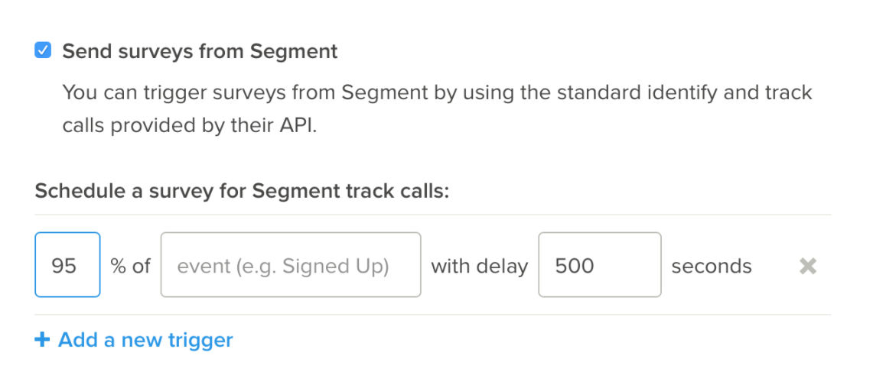

[Delighted](https://delighted.com/?utm_source=segmentio&utm_medium=docs&utm_campaign=partners) is the modern customer feedback solution used by the world's most coveted brands to deliver stellar experiences to their customers.

This destination is maintained by Delighted. For any issues with the destination, [contact the Delighted Support team](mailto:hello@delighted.com)

_**NOTE:** The Delighted Destination is currently only compatible with email surveys._


## Getting Started



1. From the Segment web app, click **Catalog**.
2. Search for "Delighted" in the Catalog, select it, and choose which of your sources to connect the destination to.
3. In the destination settings, enter your Delighted "API Key" in Segment's Settings UI. You can retrieve this from your Delighted Settings > API > Your API Key. It should look like "T8jtGnuYaNerDedVMYrcgn1dRdywfGOl".
4. If you're using Segment's client-side `analytics.js` library, your changes appear in the Segment CDN in about 45 minutes, and then Analytics.js starts asynchronously loading Delighted's JavaScript library onto the page and begins sending data.


## Identify

If you're not familiar with the Segment Specs, take a look to understand what the [Identify method](/docs/connections/spec/identify/) does. An example call would look like:

```js
analytics.identify('userId123', {
  email: 'required@email.com',
  plan: 'free',
  language: 'EN'
});
```

Identify calls will add to your list of People in Delighted. The only trait that is required by Delighted is `email`. All additional traits will be added to Delighted surveys as metadata (Delighted calls this metadata *Properties*) which you can use to [segment feedback](https://help.delighted.com/article/111-introduction).

## Track

If you're not familiar with the Segment Specs, take a look to understand what the [Track method](/docs/connections/spec/track/) does. An example call would look like:

```
analytics.track('Purchased Product');
```

Track calls will trigger a Delighted survey if you have configured the event name in [your Delighted dashboard](https://delighted.com/integrations/segment) to appear _exactly_ as the event name in your Track call.

This also enables you to define the "Sample Rate" and an optional "Delay" for the triggered surveys.



**NOTE**: Delighted has built in protections for over surveying called *Survey Throttling*. This will ensure the same person won't be surveyed more than once per month ([adjustable in your Delighted account settings](https://delighted.com/account/edit_min_survey_interval)). *Survey Throttling* provides you peace of mind so that you can use frequent `track` calls like purchase or contact events.

## Sending data from Delighted back to Segment (optional)

You can optionally configure Delighted to send feedback from Delighted _email surveys_ to Segment. This can be useful for data warehousing, forwarding to other services (such as email marketing automation tools), or performing further analysis with the BI tools you have connected to Segment.

Copy the `Write Key` of the Segment Source where you want to send data and paste into the Delighted Segment Destination page.

Delighted will then send all _email survey_ feedback triggered using the Segment integration into back into Segment. Refer to our [Delighted Source](/docs/connections/sources/catalog/cloud-apps/delighted/) documentation for more information.
