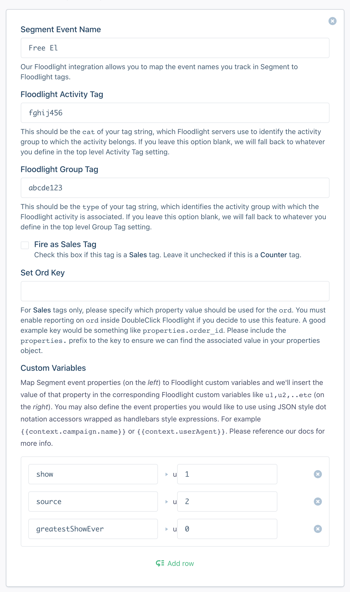
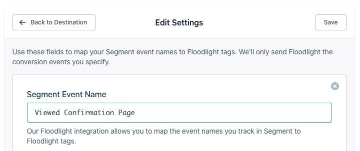

The [DoubleClick Floodlight](https://support.google.com/searchads/answer/7298761?hl=en) destination allows you to make calls directly to Floodlight based on your mapped events. All you have to do is enter your **DoubleClick Advertiser ID** in the Doubleclick Floodlight destinations settings in the Segment App, then map the Segment `track` events to their corresponding Floodlight tags.

This destination _requires_ that you send device-specific information such as the `IDFA` or the `advertisingId`. The best way to send events to Doubleclick Floodlight from mobile devices is using [one of the Segment mobile libraries](/docs/connections/sources/catalog/#mobile), because they collect this information automatically. If you use [one of the Segment server source libraries](/docs/connections/sources/catalog/#server) instead, you must manually include the required `advertisingId`.  You can also send data from [Analytics.js](/docs/connections/sources/catalog/libraries/website/javascript/) and Segment makes direct HTTP requests to Doubleclick Floodlight from your browser.

## Track

Before you send `track` events to DoubleClick Floodlight, you **must** first go to the  DoubleClick Campaign Manager and create the Floodlight tags (**Sales** or **Counter**). Once you do that, you can map the Segment events to those tags from in the destination's settings in the Segment App.

To track custom properties first create [custom variables](#setting-up-custom-variables) inside DoubleClick Campaign Manager.

After you finish configuring Doubleclick Floodlight, Segment maps the following properties and settings when it receives a mapped event:

- `dc_rdid` is set as `IDFA` or `AdvertisingId` (for mobile data only)
- `src` is pulled from your destination settings
- `cat` and `type` are pulled from your event mappings from the settings OR your top level **Activity Tag** and **Group Tag** settings
- `ord` for **counter** tags are a random number to prevent browser caching
- `ord` for **sales** tags are set to whatever you define in your settings! (ie. `properties.order_id`) Include the `properties.` prefix to the key to ensure Segment finds the associated value in your `properties` object.
- `qty` for **sales** tags only, Segment sums the quantity of products in your `products` array property or falls back on top level `properties.quantity`
- `cost` for **sales** tags only Segment sends the `revenue`
- `u$` (if any) is pulled from your property mapping setting
- `dc_lat` is set to `0` or `1` depending on whether the device has **Limit Ad Tracking** enabled (for mobile data only)

**Important:** Floodlight requires that you [set a `User-Agent` header](images/cDlD6KmuuOK.png) with that of the app where the track event took place. The Segment Android and Analytics.js (JavaScript) library automatically collect the `userAgent`. However you must manually send the user agent string inside the `context` object if you are using the iOS library. If `context.userAgent` is not provided, Segment tries to generate a user agent string based on some device and operating system information that is already has.

A generated user agent string might look something like the following:

`Segment/1.0 (iPhone OS; CPU iPhone7,2; en-US) Apple; Version 8.1.3`

### Example

Assuming the below is an example Floodlight tag mapping:



With the following `track` call:

```objc
[[SEGAnalytics sharedAnalytics] track:@"Free El"
                           properties:@{ @"show": @"Stranger Things", @"source": @"Netflix", @"greatestShowEver": YES }];
```

Will send the following `GET` request to DoubleClick Floodlight:

```
https://ad.doubleclick.net/ddm/activity/src=1234567;cat=fghij456;type=abcde123;dc_rdid=38400000-8cf0-11bd-b23e-10b96e4ddddd;u1=Stranger%20Things;u2=Netflix;u3=true;ord=1312312312;dc_lat=0
```

### Accessing Other Event Properties

By default, the Segment event property you define for each custom variable mapping is matched against the property values found in the `properties` object of a `track` event. On device-mode web, you can use JSON style dot-notation-accessors wrapped in double curly brackets to map to other fields in the event's raw payload to your custom variables. For example, some acceptable values could be `{{userId}}`, `{{anonymousId}}`, or `{{context.page.referrer}}`. You can find the complete structure of a standard Segment event payload [here](/docs/connections/spec/common/#structure). Please note that some fields may not be available for mapping, such as fields within the `context.campaign` object.

**Note:** `dc_rdid` and `dc_lat` are automatically collected by Segment's mobile libraries and `ord` is uniquely generated for each event.

## Page

The Segment DoubleClick Floodlight destination also supports tracking named `page` events as conversions. To enable this feature, follow the same steps explained above for `track` events but in the destination settings, enter the conversion "event" name. Use the structure in the example below, replacing `PAGE NAME` with the `name` parameter you pass to the Segment `page` event:

**Viewed `PAGE NAME` Page**

Here's an example for tracking a `page` event with the name **Confirmation**:



The name is case sensitive.

See the [Analytics.js documentation](/docs/connections/sources/catalog/libraries/website/javascript/#page) for more on the `name` parameter.

### Pages with categories

If you are passing category names to `page` events you would like to track as conversions, you must slightly modify the event name you input into your destination settings. Instead of **Viewed `PAGE NAME` Page**, enter it as: **Viewed `CATEGORY NAME` `PAGE NAME` **Page**

For example, if you had a `page` event with the name as **Confirmation** that was being categorized as part of a group of **Checkout** pages, you would enter:

**Viewed Checkout Confirmation Page**

See the [Analytics.js documentation](/docs/connections/sources/catalog/libraries/website/javascript/#page) for more on the `category` paramter.

## Setting up Custom Variables

There are two things you need to do in order to send custom track properties as custom Floodlight variables. Refer to Google's [Custom Floodlight Variables](https://support.google.com/campaignmanager/answer/2823222?hl=en) documentation.

Custom Floodlight variables use the keys u1=, u2=, and so on, and can take any values that you choose to pass to them. You can include custom Floodlight variables in any of your Floodlight activity tags and report on their values in Report Builder.

To create or edit a custom variable:

For each custom variable you want to create or edit, enter a Friendly Name, which is the name for the variable that is used in reports. For example, if you are using a custom variable to include users' ZIP codes in the Floodlight tags, you could use ZIP Code as the Friendly Name.

Choose the Type of custom variable you're creating. Choose string if you want the variable to include alphanumeric characters or special characters. The only characters you can't use are ", < and >. Choose number if you want to pass numeric values.

If you add Custom Floodlight Variables to a report as metrics, they are summed in the report as if they are numeric values, even if the variables are actually strings. The string variables will display a value of 0.

Click **Save**.

## COPPA Compliance

DoubleClick Floodlight lets you set a parameter called `tag_for_child_directed_treatment` as either `0`, or `1` to mark a specific tag as coming from a user under the age of 13.

If you want to set this flag, you can send an integration option namespaced as `coppaCompliant` with `true` or `false` (default):

```java
Analytics.with(context).track("Free El", new Properties().putValue("show", "Stranger Things").putValue("source", "Netflix").putValue("greatestShowEver", true), new Options().setIntegrationOptions("DoubleClick Floodlight", new ValueMap().putValue("coppaCompliant", true)));
```

> success ""
> **Tip**: This flag was previously called `copaCompliant` (a typo) instead of `coppaCompliant`. The method has been aliased to preserve the old functionality, and you do not need to update it if you used the old spelling.

## Sending Personally Identifiable Information (PII)

Don't map custom variables that contain Personally Identifying Information (PII).

The terms of your DoubleClick contract prohibit passing any information to us that we could use or recognize as personally identifiable information (PII). If you enter certain key-values into a field in a DoubleClick product, you may see a warning that reminds you that you must not use key-values to pass data that we would recognize as PII. Key-values that trigger this warning include, for example, email and username. Note that it is okay to use these key-values if your purpose is not to collect information that DoubleClick could use or recognize as PII. (For example, email=weekly is fine, but passing a user's email address is not.) If you do choose one of these key-values, DoubleClick may contact you in the future to confirm that you are not using them in a way that is prohibited.
