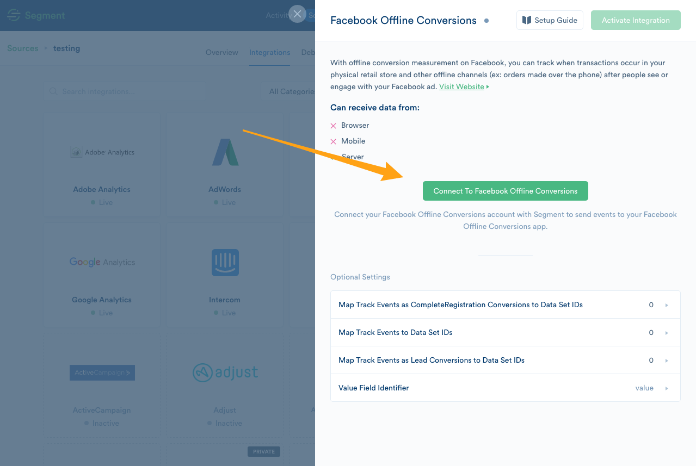
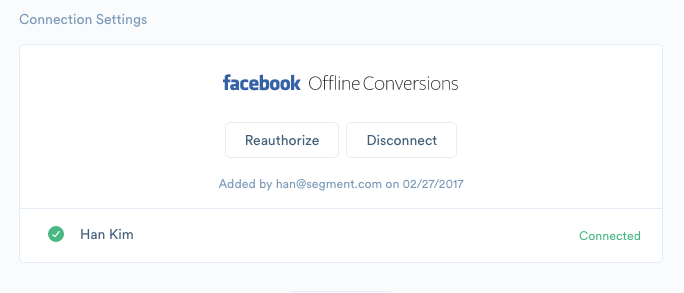
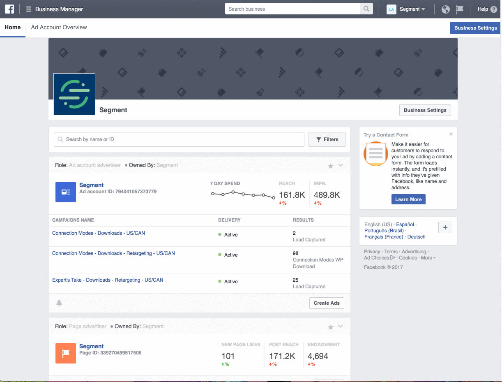
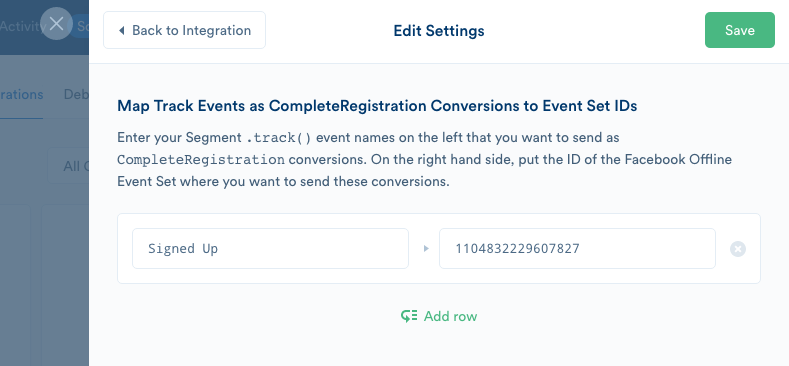
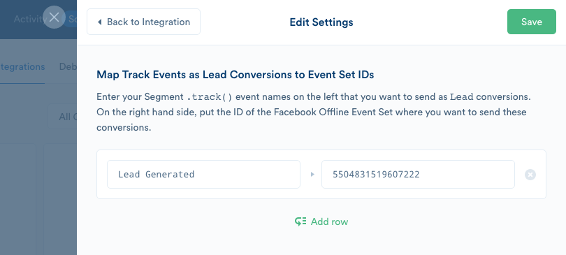
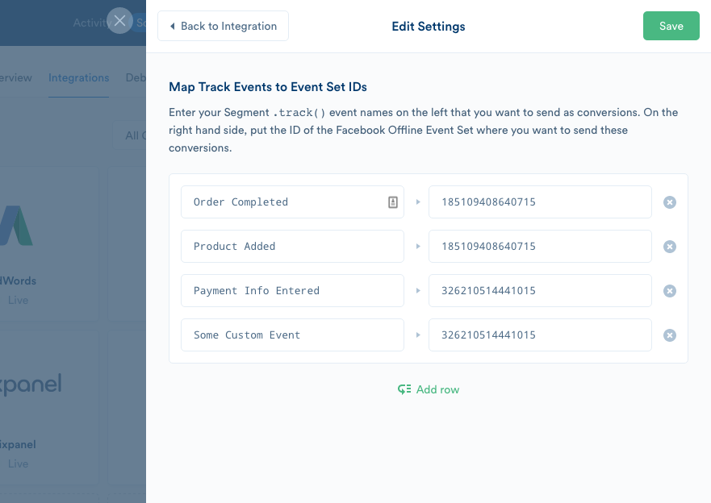

[Facebook Offline Conversions](https://www.facebook.com/business/help/1782327938668950?utm_source=segmentio&utm_medium=docs&utm_campaign=partners) enables offline event tracking, so marketers can run campaigns, upload transaction data, and compare in-store transactions.

> info "Customer Information Parameters Requirements"
> As of Facebook Marketing API v13.0+, Facebook began enforcing new requirements for customer information parameters (match keys). To ensure your events don't throw an error, Segment recommends that you review [Facebook’s new requirements](https://developers.facebook.com/docs/graph-api/changelog/version13.0#conversions-api){:target="_blank"}.

## Other Facebook Destinations Supported by Segment
This page is about the **Facebook Offline Conversions**. For documentation on other Facebook destinations, see the pages linked below.

| **Facebook Destination**                                                                                    | Supported by Personas |
| ----------------------------------------------------------------------------------------------------------- | --------------------- |
| **[Facebook App Events](/docs/connections/destinations/catalog/facebook-app-events/)**                      | Yes                   |
| **[Facebook Offline Conversions](/docs/connections/destinations/catalog/facebook-offline-conversions/)**    | Yes                   |
| **[Facebook Pixel](/docs/connections/destinations/catalog/facebook-pixel/)**                                | No                    |
| **[Facebook Custom Audiences](/docs/connections/destinations/catalog/personas-facebook-custom-audiences/)** | Yes                   |
| **[Facebook Conversions API](/docs/connections/destinations/catalog/actions-facebook-conversions-api/)**    | Yes                   |


## Getting Started



1. From the Segment web app, click **Catalog**.

2. Search for "Facebook Offline Conversions" in the Catalog, select it, and choose which of your sources to connect the destination to.

3. Authorize Segment to send data on your behalf by connecting through OAuth:



By doing so, we will ask for `ads_management` and `public_profile` access scopes which will allow Segment to have proper permissions to send offline events to your Event Sets. You can read more about Facebook's [access and authentication](https://developers.facebook.com/docs/marketing-api/access) if you would like to know exactly what these scopes allow.

**IMPORTANT**: Note that the Segment user that is OAuthing **MUST** have admin access in your company's Facebook Business Manager account. Otherwise, the authorization will fail.

Once you complete the OAuth flow, you should be connected.



_Note_: Once we retrieve your access token, they should not expire. However, if for whatever reason you are not seeing conversions come through you should check your destination settings and you should reauthorize.

4.  You **MUST** map the name of every Segment `track` event that you'd like to send and the corresponding ID of the Event Set where you want to send the conversions to. This is to avoid sending unwanted `track` events as conversions.

You can find Facebook Offline Event Set ID by going to your **Offline Events** page in your Facebook **Business Manager** account and clicking the desired Offline Event Set here:



## Track

If you're not familiar with the Segment Specs, take a look to understand what the [Track method](/docs/connections/spec/track/) does. An example call would look like:

```js
analytics.track({
  userId: '019mr8mf4r',
  event: 'Order Completed',
  properties: {
    revenue: 39.95,
    shippingMethod: '2-day'
  }
});
```

There are 3 places you can map your Segment `track` events:

1) Map `track` events to Facebook's `CompleteRegistration` conversions:



2) Map `track` events to Facebook's `Lead` conversions:



3) Map all other custom or ecommerce `track` events to any Event Set ID:



The following table shows how we map Segment's [semantic ecommerce](/docs/connections/spec/ecommerce/v2) or custom event names to Facebook's semantic conversion event names:

<table>
  <tr>
    <td>**Segment Event Name**</td>
    <td>**Facebook Semantic Conversion Event Name**</td>
  </tr>
  <tr>
    <td>Products Searched</td>
    <td>Search</td>
  </tr>
  <tr>
    <td>Product Viewed</td>
    <td>ViewContent</td>
  </tr>
  <tr>
    <td>Product List Viewed</td>
    <td>ViewContent</td>
  </tr>
  <tr>
    <td>Product Added to Wishlist</td>
    <td>AddToWishlist</td>
  </tr>
  <tr>
    <td>Product Added</td>
    <td>AddToCart</td>
  </tr>
  <tr>
    <td>Checkout Started</td>
    <td>InitiateCheckout</td>
  </tr>
  <tr>
    <td>Payment Info Entered</td>
    <td>AddPaymentInfo</td>
  </tr>
  <tr>
    <td>Order Completed</td>
    <td>Purchase</td>
  </tr>
</table>

_Note_: `Lead` and `CompleteRegistration` events can be mapped separately in **Map Track Events as Lead Conversions to Event Set IDs** and **Map Track Events as CompleteRegistration Conversions to Event Set IDs** destination settings respectively.

The following table shows how we map Segment raw message fields or `properties` to Facebook's semantic conversion event parameters:

<table>
  <tr>
    <td>**Segment Property**</td>
    <td>**Facebook Semantic Conversion Parameters**</td>
  </tr>
  <tr>
    <td>Hardcoded as `"Segment"`</td>
    <td>`upload_tag`</td>
  </tr>
  <tr>
    <td>`timestamp`</td>
    <td>`event_time`</td>
  </tr>
  <tr>
    <td>See event name mapping above</td>
    <td>`event_name`</td>
  </tr>
  <tr>
    <td>`currency`</td>
    <td>`currency`</td>
  </tr>
  <tr>
    <td>`value`, `price`, or `revenue`*</td>
    <td>`value`</td>
  </tr>
  <tr>
    <td>Hardcoded as `"product"` or `"product_group"`*</td>
    <td>`content_type`</td>
  </tr>
  <tr>
    <td>`products.$.product_id`s or `category`*</td>
    <td>`content_ids`</td>
  </tr>
  <tr>
    <td>Any remaining `properties`</td>
    <td>`custom_data`</td>
  </tr>
</table>

_Note_: For only `Product List Viewed` will we set the `content_type` as `"product_group"` and use `properties.category` for the `content_ids`. All other applicable events will use `properties.$.product_id`(s) and `"product"` respectively. Any pre-purchase events will default to map Facebook's `value` parameter to Segment's `properties.value`. You can override this by choosing `"price"` in the **Value Field Identifier** dropdown in your settings. `Order Completed` events will always use
`properties.revenue`.

### Attribution and "Match Keys"

Facebook requires that you send at least _one_ `match_key` in order for them to attribute which Facebook user should be tied to a conversion. The more user information you send with your `track` calls, the better the accuracy of Facebook's attribution. Once Facebook has successfully attributed a conversion for a given user, they will store the mapping between the `userId` to the rest of `match_keys` such as the `email` address for all future conversions.

Since `track` events by default do not require you to send user metadata, it is still possible for us to send a conversion as long as you send us a `userId` (which we map to Facebook's `extern_id`). However, for better attribution results, we recommend you send as much applicable user data through `context.traits` as shown in the mapping table below:

<table>
  <tr>
    <td>**Segment `context.traits` Properties**</td>
    <td>**Facebook Match Key Parameters**</td>
  </tr>
  <tr>
    <td>`email`</td>
    <td>`email`</td>
  </tr>
  <tr>
    <td>`phone`</td>
    <td>`phone`</td>
  </tr>
  <tr>
    <td>`gender`</td>
    <td>`gen`</td>
  </tr>
  <tr>
    <td>`firstName` or `name`*</td>
    <td>`fn`</td>
  </tr>
  <tr>
    <td>`lastName` or `name`*</td>
    <td>`ln`</td>
  </tr>
  <tr>
    <td>`address.city`</td>
    <td>`ct`</td>
  </tr>
  <tr>
    <td>`address.state`</td>
    <td>`st`</td>
  </tr>
  <tr>
    <td>`address.postalCode`</td>
    <td>`zip`</td>
  </tr>
  <tr>
    <td>`address.country`</td>
    <td>`country`</td>
  </tr>
  <tr>
    <td>See Note Below *</td>
    <td>`lead_id`</td>
  </tr>
</table>

```js
// node.js library example

analytics.track({
  userId: 'hamsolo813',
  event: 'Product Added',
  properties: {
    cart_id: 'cart1234',
    product_id: 'product12356',
    sku: 'G-32',
    category: 'Games',
    name: 'Monopoly: 3rd Edition',
    brand: 'Hasbro',
    variant: '200 pieces',
    price: 18.99,
    quantity: 1,
    coupon: 'MAYDEALS',
    position: 3
  },
  context: {
    traits: {
      email: 'hamsolo813@hamsolo813.com',
      phone: '4011234567',
      gender: 'm',
      name: 'ham solo',
      address: {
        city: 'East Greenwich',
        state: 'RI',
        postalCode: '02818',
        country: 'USA'
      }
    }
  }
});
```

_Note_: You can choose to exlicitly send `firstName` or `lastName` separately or just send `name`. We will properly map to `fn` and `ln` properly. If your server has access to Facebook's **Lead IDs** from their Lead Ads product, you can opt to send this using integration specific options:

```js
// node.js library example

analytics.track({
  userId: 'hamsolo813',
  event: 'Order Completed',
  properties: {
    ...
  },
  context: {
    'Facebook Offline Conversions': { leadId: '<LEAD ADS ID>' }
  }
});
```

We will use SHA256 to hash all `match_keys` that include personally identifiable data in compliance with Facebook's privacy requirements.

Keep in mind that Facebook's furthest possible attribution window is 28 days. It is recommended that you send your server side `track` conversions within 62 days of the offline conversion occuring.

## Limited Data Use



> info ""
> The **Use Limited Data Use** destination setting is disabled by default for all Facebook destinations except for Facebook Pixel. This must be enabled manually from the destination settings if you're using other Facebook destinations.

### Data Processing Destination Setting

You can change the **Use Limited Data Use** destination setting to enable or disable Limited Data Use. This must be enabled (set to “on”) if you want to send data processing parameters as part of the the Limited Data Use feature.

### Data Processing Initialization Parameters

The Data Processing parameters you set are the Data Processing Options Segment uses when sending data to Facebook.

The Facebook API does not accept an IP address field to determine the geolocation of a user. Instead, you would need to set the specific user geography options (**Data Processing Options Country** and **Data Processing Options State**) in the `integrations` object.

> warning ""
> If the **Use Limited Data Use** destination setting is enabled, but you do *not* pass the Data Processing parameters in the `integrations` object, Segment sends an empty data processing object which disables LDU for this event.

The example below shows how you might set custom Data Processing parameters for a Segment server library.

```javascript
// node.js library example

analytics.track({
  event: 'Membership Upgraded',
  userId: '97234974',
  integrations: {
    "Facebook Offline Conversions": {
      "dataProcessingOptions": [[], 1,1000]
    }
  }
})
```
