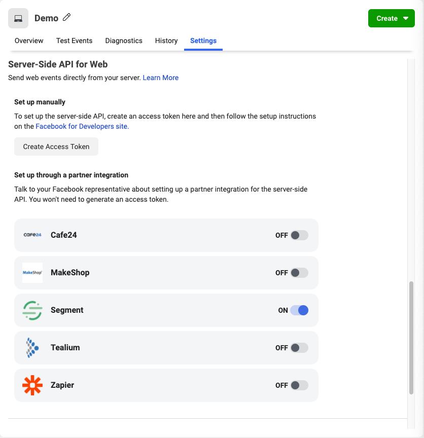

[Facebook Pixel Server-Side API](https://developers.facebook.com/docs/marketing-api/server-side-api) allows advertisers to send events from their servers directly to Facebook. Server-Side events are linked to a pixel and are processed like browser pixel events. This means that Server-Side events are used in measurement, reporting, and optimization in the same way as browser pixel events.

The Facebook Pixel server-side component can be used in one of two ways:
1. In addition to the [existing Client-Side (web) Pixel](/docs/connections/destinations/catalog/facebook-pixel/).
2. As a stand-alone, Server-Side only offering.

For beta-testing, we are releasing the Server-Side component as a standalone destination.

### Other Facebook Destinations Supported by Segment

This page is about the **Facebook Pixel Server-Side**. For documentation on other Facebook destinations, including Facebook Pixel, see the pages linked below.

| **Facebook Destination**   | Supported by Personas |
| ---------------------- | --------------------- |
| **[Facebook App Events](/docs/connections/destinations/catalog/facebook-app-events/)**                  | Yes                   |
| **[Facebook Offline Conversions](/docs/connections/destinations/catalog/facebook-offline-conversions/)** | Yes                   |
| **[Facebook Pixel](/docs/connections/destinations/catalog/facebook-pixel/)**                             | No                    |
| **[Facebook Custom Audiences](/docs/connections/destinations/catalog/personas-facebook-custom-audiences/)**      | Yes                   |

## Getting Started



### Set up in Facebook Events Manager

Before you begin:
- Make sure the advertiser has set up a business.
- Create a pixel and assign it to that business.

Once you have configured the business and pixel:
1. Go to your [Events Manager](https://business.facebook.com/events_manager/pixel/settings) page and navigate to the pixel settings.
2. Select your pixel (for example, Jasper’s Market Pixel).
3. Select the **Settings** tab.
4. Scroll down to **Server-Side API for Web**
5. Toggle the Segment Partner Integration ‘On’

> note ""
> This section only appears if you enabled the Facebook Pixel Client-side integration. Once enabled, Facebook automatically gives you Server-Side API access.



Learn more about your pixel event data in Events Manager in the [Facebook Ads Help Center](https://www.facebook.com/business/help/898185560232180?id=1205376682832142).

### Set up in Segment

1. Go to the [Facebook Pixel Server-Side Destination catalog page](https://app.segment.com/goto-my-workspace/destinations/catalog/facebook-pixel-server-side) and click **Configure Facebook Pixel Server Side**.

   The server-side destination is not visible in the catalog, as it is in private beta. Instead, go to: `https://app.segment.com/goto-my-workspace/destinations/catalog/facebook-pixel-server-side`
2. Configure the destination's settings:

   - Pixel ID (_Required_)
   - Map Categories to FB Content Types (_Optional_)
   - Map Your Events to Standard FB Events (_Optional_)

## Track

Currently, Facebook Pixel Server-Side only supports Track calls.

If you're not familiar with the Segment Specs, take a look to understand what the [Track method](https://segment.com/docs/connections/spec/track/) does. An example call would look like:

```javascript
analytics.track("My Custom Event", {
  checkinDate: new Date(),
  myCoolProperty: "foobar",
});
```
### Mapping to Facebook Standard Events

To send _Standard events_ (as opposed to "custom events"), use the Segment destination setting labeled **Map Your Events to Standard FB Events**. Then, when Segment receives an event that appears in that mapping, the event is sent to Facebook as the standard event you specified. All properties included in the event are sent as event properties. You learn more about these in the Facebook pixel [standard events documentation](https://developers.facebook.com/docs/facebook-pixel/implementation/conversion-tracking#standard-events).

In addition, Segment specially handles the following event types, and sends them as Standard events:

- **Order Completed** is sent as `Purchase`
- **Product Added** is sent as `AddToCart`
- **Product List Viewed** is sent as `ViewContent`
- **Product Viewed** is sent as `ViewContent`
- **Products Searched** is sent as `Search`
- **Checkout Started** is sent as `InitiateCheckout`

Facebook requires a currency for "Purchase" events -- if you leave it out, Segment will set a default value of "USD".

You can also use the "Map  Your Events to Standard FB Events" setting to map any other events to one of Facebook's Standard Events. Any unmapped events are automatically sent to Facebook Pixel Server-Side as a _custom_ event.

Segment maps the following Segment traits to [Facebook properties](https://developers.facebook.com/docs/marketing-api/server-side-api/parameters):

| **Segment Property**                  | **Pixel Property**       | **Notes**            |
| ------------------------------------- | ------------------------ | -------------------- |
| `event`                               | `event_name`             |                      |
| `messageId`                           | `event_id`               |                      |
| `timestamp`                           | `event_time`             |                      |
| `userId`                              | `external_id`            | Any unique ID from the advertiser, such as membership IDs, user IDs, and cookie IDs. See [Alternative External IDs](#alternative-external-ids).    |
| `context.ip `                         | `user_data.client_ip_address` |                 |
| `context.userAgent`                   | `user_data.client_user_agent` |                 |
| `context.traits.email`                | `user_data.em`           | hashed               |
| `context.traits.phone`                | `user_data.ph`           | hashed               |
| `context.traits.firstName`            | `user_data.fn`           | hashed               |
| `context.traits.lastName`             | `user_data.ln`           | hashed               |
| `context.traits.address.city`         | `user_data.ct`           | hashed               |
| `context.traits.address.postalCode`   | `user_data.zp`           | hashed               |
| `context.traits.address.state`        | `user_data.st`           | hashed               |
| `context.traits.birthday`             | `user_data.db`           | hashed               |
| `properties.fbp`                      | `fbp`                    |                      |
| `properties.fbc`                      | `fbc`                    |                      |
| `properties.revenue`                  | `custom_data.value`      | Customizable, see [Alternative Value Properties](#alternative-value-properties)  |
| `properties.currency`                 | `custom_data.currency`   | Defaults to USD if not set  |
| `properties.products`                 | `custom_data.contents`   | Must be an array. `num_items` is set to the length of this   |
| `properties.products[x].price`        | `custom_data.contents[x].item_price` | Must be an integer   |
| `properties.products[x].product_id`   | `custom_data.contents[x].id`         | Must be a string     |
| `properties.products[x].quantity`     | `custom_data.contents[x].quantity`   | Must be an integer   |
| `properties.query`                    | `custom_data.search_string `         |          |
| `properties.status`                   | `custom_data.status`                 |          |


To access the `contexts` and `context.traits` objects in a Track call, you can use the [context-traits format](https://segment.com/docs/connections/sources/catalog/libraries/website/javascript/#context--traits) as in the example below.

```javascript
analytics.track("Clicked Email", {
    emailCampaign: 'First Touch'
},
{
    traits: {
        name: "John Doe"
    }
});
```

Any properties you send that aren't listed above are sent in the 'Custom Data' part of the Segment payload to Facebook.

### Alternative External IDs

By default, Segment sends the `userID` as `externalID`, and if `userID` is absent falls back to `anonymousID`. To use a different field in your payload as the external ID, use the "Alternative External ID Field". Example values for this setting include `context.traits.email` and `properties.externalid`.

### Alternative "Value" Properties

For most events Segment sends revenue for the Pixel value field, but for
the pre-purchase events "Product Viewed" and "Product Added", Segment
uses the value of the "Value Field Identifier" setting to determine which
property to use for the "value" field. This field defaults to
`price`.

## Limited Data Use



> info ""
> The **Use Limited Data Use** destination setting is disabled by default for all Facebook destinations except for Facebook Pixel. This must be enabled manually from the destination settings if you're using other Facebook destinations.



Facebook uses the `context.ip` to determine the geolocation if it exists on the event.

You can manually change the Data Processing parameters by adding settings to the `integrations` object. The example below shows how you might set custom Data Processing parameters in Node.

```javascript
// node.js library example

    analytics.track({
      event: 'Membership Upgraded',
      userId: '97234974',
      integrations: {
        "Facebook Pixel Server-Side": {
          "dataProcessingOptions": [[], 1,1000]
        }
      }
    })
```

## Verify Events in Facebook

After you start sending events, you should start seeing them in twenty
minutes. You can confirm that Facebook received them:

1.   Go to the Events Manager.
2.   Click on the corresponding pixel.
3.   In the **Overview** tab, look for events where the "Connection Mode" is `Server`.

> info ""
> **Note**: It might take a few minutes before events appear in the Events Manager.


