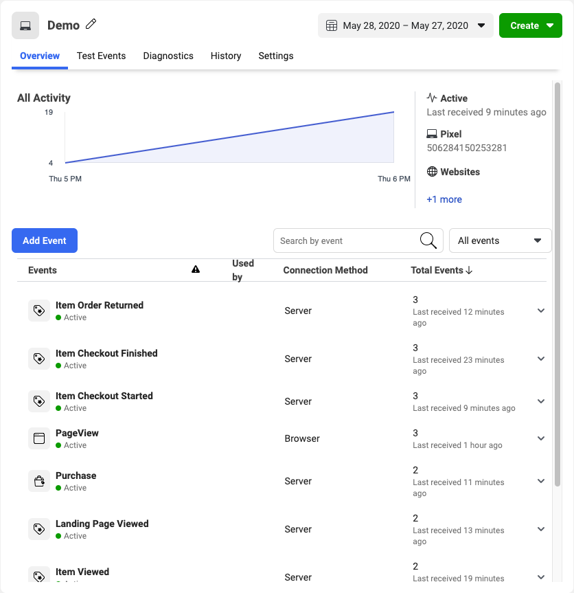

<!-- LR: 2/16/2021: Redirect pulls in from `facebook-conversions-api` because while this destination's display name has changed, the slug is still the old name and the docs build needs to match on slug to find it in `destinations.yml` -->

[Facebook Conversions API](https://developers.facebook.com/docs/marketing-api/conversions-api){:target="_blank"} allows advertisers to send events from their servers directly to Facebook. Server-side events are linked to a pixel and are processed like browser pixel events. This means that server-side events are used in measurement, reporting, and optimization in the same way as browser pixel events.

> info "Customer Information Parameters Requirements"
> As of Facebook Marketing API v13.0+, Facebook began enforcing new requirements for customer information parameters (user data). To ensure your events don't throw an error, Segment recommends that you review [Facebook’s new requirements](https://developers.facebook.com/docs/graph-api/changelog/version13.0#conversions-api){:target="_blank"}.

> info "Server Event Parameter Requirements"
> On February 15th, 2021, Facebook began enforcing new requirements for server event parameters. After that date, events sent to the Conversions API that don't meet the new requirements might not be available for optimization, targeting, or measurement. For details on how to implement these requirements see [Server Event Parameter Requirements](/docs/connections/destinations/catalog/facebook-pixel-server-side/#server-event-parameter-requirements).

> info "Destination name change"
> Facebook Conversions API was renamed from Facebook Pixel Server-Side.

### Other Facebook Destinations Supported by Segment

This page is about the **Facebook Conversions API** destination. For documentation on other Facebook destinations, including Facebook Pixel, see the pages linked below.

| **Facebook Destination**                                                                                    | Supported by Personas |
| ----------------------------------------------------------------------------------------------------------- | --------------------- |
| **[Facebook App Events](/docs/connections/destinations/catalog/facebook-app-events/)**                      | Yes                   |
| **[Facebook Custom Audiences](/docs/connections/destinations/catalog/personas-facebook-custom-audiences/)** | Yes                   |
| **[Facebook Offline Conversions](/docs/connections/destinations/catalog/facebook-offline-conversions/)**    | Yes                   |
| **[Facebook Pixel](/docs/connections/destinations/catalog/facebook-pixel/)**                                | No                    |

## Getting Started



Next, set up your Pixel to work with the Facebook Conversions API destination. You can use an existing Facebook Pixel that you already have set up, or create a new one. If you don't already have a Facebook Pixel configured, follow the "New Pixel" instructions below to create one.

### Option 1 - Create a new pixel

1. Go to the Facebook Business [Events Manager](https://www.facebook.com/events_manager/) and click  **Connect Data Sources**.
2. Choose Web, App, or Offline and then click **Get Started**.
3. Select "Conversions API" and then click **Connect**.
4. Choose "Segment" from the list of partners.
5. Enable the setting to "Authorize Segment Connection" and then click **Continue**.

### Option 2 - Configure an existing pixel

1. Go to the Facebook BusinessEvent Manager Pixel Settings.
2. Scroll down to the **Set up through a partner integration** section and click **Choose Partner**.
3. Choose "Segment" from the list of partners.
4. Enable the setting to  "Authorize Segment Connection" and then click **Continue**.

### Set up in Segment

1. From the Destinations catalog page in the Segment App, click **Add Destination**.
2. Search for "Facebook Conversions API" in the Destinations Catalog, and select the "Facebook Conversions API" destination.
3. Choose which Source should send data to the "Facebook Conversions API" destination.
4. Go to the Facebook Business [Event Manager Pixel Settings](https://business.facebook.com/events_manager/pixel/settings), find and copy the "Pixel ID".
5. Enter the "Pixel ID" in the "Facebook Conversions API" destination settings in Segment.


> info ""
> See the [Configuration options](#configuration-options) section below for additional implementation steps

## Configuration options

The Segment Facebook Conversions API destination gives you several ways to implement your conversion tracking. You can use it as a compliment to [Facebook Pixel](/docs/connections/destinations/catalog/facebook-pixel/), or as a stand-alone alternative.

The following implementation options are available:
1. [Send the same events from both the browser and the server](#send-the-same-events-from-both-the-browser-and-the-server).
2. [Send different events; some from the browser others from the server](#send-different-events-some-from-the-browser-others-from-the-server).
3. [Only send events from the server](#only-send-events-from-the-server).

### Send the same events from both the browser and the server

This approach provides a redundancy that ensures maximum signal reliability. Events that previously could have been lost (for several different reasons) when sent from browser, are now captured using the conversions API. You can use this if you do not want to miss any events coming from the browser.

#### Match rate considerations

For this option to work best, pass the same `external_id` from the browser and the server. To achieve this, go to the Facebook Pixel destination settings in Segment and enable the **Enable Advanced Matching** and **Use User ID or Anonymous ID as External ID** settings. By default, the Facebook Conversions API destination uses the `userId` (or `anonymousId` if not present) to set the `external_id`, so when you configure Facebook Pixel to use the same settings, Facebook matches users by those IDs.

You can also increase the match rate for events from a server source by sending [user traits in the context object of the track events](#default-mappings-to-facebook-properties). You can also collect other fields from the browser, such as `userAgent`, `ip` address, and [Facebook's parameters (fbp, fbc)](https://developers.facebook.com/docs/marketing-api/conversions-api/parameters/fbp-and-fbc) and pass them to the server, and manually add them to the events.

#### Deduplication considerations

Events are only deduplicated if the same event is sent _first_ from the browser and _then_ from the server.  When events are received in this order, the server event is discarded. If the events are sent from the server and _then_ the browser, they create a duplicate. If you send two consecutive browser events with the same information, neither is discarded. If you send two consecutive server events with the same information, neither is discarded.

### Send different events - some from the browser others from the server

Use this approach if you want to separate tracking events completed on a user's browser from events completed outside the browser, such as a server-based payment system. Sensitive information is best kept out of browsers, so any data you don't want exposed to users should only be sent using a server source. You can also set up the Conversions API to measure customer actions that are deeper in your marketing funnel. Seeing these deeper funnel events means you can more accurately measure how your ads are helping you reach your business goals.

#### Match rate considerations

For this option to work best, the same `external_id` needs to be passed from the browser and the server. To achieve this, go to your Facebook Pixel destination settings in Segment and enable the **Enable Advanced Matching** and **Use User ID or Anonymous ID as External ID** settings. By default the Facebook Conversions API destination uses the `userId` (or `anonymousId` if not present) to set the `external_id`, so when you set up Facebook Pixel to use the same settings, Facebook can then match the users.

You can also send [user traits in the context object of the track events](#default-mappings-to-facebook-properties)to increase the match rate for events from a server source. Collect other fields from the browser, like `userAgent`, `ip` address, and [Facebook's parameters (fbp, fbc)](https://developers.facebook.com/docs/marketing-api/conversions-api/parameters/fbp-and-fbc){:target="_blank"}, pass them to the server, and manually add them to the events.

#### Deduplication considerations

If you choose this option, each source sends different events and no deduplication is needed.

### Only send events from the server

Use this approach if you don't want to track users from the browser with Facebook Pixel. By default, Facebook Pixel collects cookie data, as well as browser data such as the IP Address and the User Agent, some of which you might not want to collect. By sending from a Segment server source to Facebook's Conversions API, you can control which identifiers you pass to Facebook.

#### Match rate considerations

If you use Facebook Conversions API as a stand-alone without certain data fields collected from the browser, the match rate might not be as high as if you included them.

You can also increase the match rate for events from a server source by sending [user traits in the context object of the track events](#default-mappings-to-facebook-properties). You can also collect other fields from the browser, such as `userAgent`, `ip` address, and [Facebook's parameters (fbp, fbc)](https://developers.facebook.com/docs/marketing-api/conversions-api/parameters/fbp-and-fbc) and pass them to the server, and manually add them to the events.


#### Deduplication considerations
If you choose this option, you are only sending events once, and no deduplication is needed.


## Track

Currently, Facebook Conversions only supports Track calls.

For more information about Track calls, see the [Track method](/docs/connections/spec/track/) in the Segment Spec.

## Server Event Parameter Requirements

Beginning February 15th 2021, Facebook requires the `action_source` server event parameter for all events sent to the Conversions API. This parameter is used to specify where the conversions occurred. If `action_source` is set to 'website' then the `client_user_agent` and the `event_source_url` parameters are also required. Events sent to the Conversions API after February 15th that do not meet the requirements may not be available for optimization, targeting, or measurement.

| Server Event Parameter | Requirement                                 | Implementation                 p                                                                      |
| ---------------------- | ------------------------------------------- | ---------------------------------------------------------------------------------------------------- |
| `action_source`        | Always required                             | It is set automatically but it can be set manually.                                                  |
| `client_user_agent`    | Only required if `action_source` = "website" | It must be set manually if using a server library. It is set automatically if using the Segment web library. |
| `event_source_url`     | Only required if `action_source` = "website" | It must be set manually if using a server library. It is set automatically if using the Segment web library. |


### Action Source

`action_source` is set to "website" as a default value.

You can set `action_source` manually by passing it as a property of a Track event. You can use either snake case or camel case to include `action_source` as a property in Track events.

| Action Source Values | Description                                                                                               |
| -------------------- | --------------------------------------------------------------------------------------------------------- |
| `chat`               | Conversion was made through a messaging app, SMS, or online messaging feature.                                |
| `email`              | Conversion happened over email.                                                                           |
| `other`              | Conversion happened in a way that is not listed.                                                          |
| `phone_call`         | Conversion was made over the phone.                                                                       |
| `physical_store`     | Conversion was made in person at your physical store.                                                     |
| `system_generated`   | Conversion happened automatically, for example, a subscription renewal that's set on auto-pay each month. |
| `website`            | Conversion was made on your website.                                                                      |


### Client User Agent

`client_user_agent` is set by including `context.userAgent` in the track event. The value used should be the user agent of the browser where the conversion event occurred. If you're using a server library, set `client_user_agent` manually. If you're using the Segment web library, `client_user_agent` is set automatically.

### Event Source URL

`event_source_url` is set by including `context.page.url` in the track event. The value used should be the browser URL where the conversion event occurred. If you're using a server library, set `event_source_url` manually. If you're using the Segment web library, `event_source_url` is set automatically.

### Implementing Server Event Parameter Requirements

If `action_source` is set to 'website', the `context.userAgent` and the `context.page.url` fields are required. Segment server-side libraries do not collect `context.userAgent` or `context.page.url` by default. This data must be retrieved manually from the client and passed to the server.

The snippet below provides an example of a [`Product Added`](/docs/connections/spec/ecommerce/v2/#product-added) event using Node.js. Notice in this example that the `action_source` parameter has not been set manually by passing this field into the event. The `action_source` parameter will default to "website". Since `action_source` = "website" the `client_user_agent` and the `event_source_url` parameters are required. Therefore the `context.userAgent` and the `context.page.url` fields have been  manually passed into the event.

```javascript
analytics.track({
  context: {
    userAgent: "Mozilla/5.0 (Macintosh; Intel Mac OS X 11_1_0) AppleWebKit/537.36 (KHTML, like Gecko) Chrome/88.0.4324.96 Safari/537.36",
    page: {
      url: "https://segment.com/"
    }
  },
  userId: "97980cfea0067",
  event: "Product Added",
  properties: {
    brand: "Hasbro",
    cart_id: "skdjsidjsdkdj29j",
    category: "Games",
    coupon: "MAYDEALS",
    image_url: "https://www.example.com/product/path.jpg",
    name: "Monopoly: 3rd Edition",
    position: 3,
    price: 18.99,
    product_id: "507f1f77bcf86cd799439011",
    quantity: 1,
    sku: "G-32",
    url: "https://www.example.com/product/path",
    variant: "200 pieces"
  },
});
```

### Default Mappings to Facebook Standard Events

The following mappings are automatic and require no additional set up. Any of the Segment Ecommerce Events in the table below will be sent as the corresponding Facebook Standard Event. You learn more about these in the Facebook pixel [standard events documentation](https://developers.facebook.com/docs/facebook-pixel/implementation/conversion-tracking#standard-events).

| Segment E-commerce Event | Facebook Standard Event |
| ----------------------- | ----------------------- |
| `Checkout Started`      | `InitiateCheckout`      |
| `Order Completed`       | `Purchase`              |
| `Product Added`         | `AddToCart`             |
| `Product List Viewed`   | `ViewContent`           |
| `Product Viewed`        | `ViewContent`           |
| `Products Searched`     | `Search`                |

> info ""
> Facebook requires a currency for "Purchase" events -- if you leave it out, Segment will set a default value of "USD".

### Custom Mappings to Facebook Standard Events

To map any of your Segment Events (not listed in the table above) to a Facebook _Standard event_, use the Segment destination setting labeled **Map Your Events to Standard FB Events**. Then, when Segment receives an event that appears in that mapping, the event is sent to Facebook as the standard event you specified. All properties included in the event are sent as event properties.


### Facebook Custom Events
Any unmapped events are automatically sent to Facebook Conversions as a _custom_ event. If Facebook's predefined standard events aren't suitable for your needs, you can track your own custom events, which also can be used to define [custom audiences](https://developers.facebook.com/docs/facebook-pixel/implementation/custom-audiences) for ad optimization. Custom events also support parameters, which you can include to provide additional information about each custom event.

> warning ""
> Custom event names cannot exceed 50 characters in length.

### Default Mappings to Facebook Properties

Segment maps the following Segment traits to [Facebook properties](https://developers.facebook.com/docs/marketing-api/server-side-api/parameters):

| **Segment Property**                | **Pixel Property**                   | **Notes**                                                                                                                                       |
| ----------------------------------- | ------------------------------------ | ----------------------------------------------------------------------------------------------------------------------------------------------- |
| `context.ip`                        | `user_data.client_ip_address`        |                                                                                                                                                 |
| `context.page.url`                  | `event_source_url`                   |                                                                                                                                                 |
| `context.traits.address.city`       | `user_data.ct`                       | hashed                                                                                                                                          |
| `context.traits.address.postalCode` | `user_data.zp`                       | hashed                                                                                                                                          |
| `context.traits.address.state`      | `user_data.st`                       | hashed                                                                                                                                          |
| `context.traits.birthday`           | `user_data.db`                       | hashed                                                                                                                                          |
| `context.traits.email`              | `user_data.em`                       | hashed                                                                                                                                          |
| `context.traits.firstName`          | `user_data.fn`                       | hashed                                                                                                                                          |
| `context.traits.lastName`           | `user_data.ln`                       | hashed                                                                                                                                          |
| `context.traits.phone`              | `user_data.ph`                       | hashed                                                                                                                                          |
| `context.userAgent`                 | `user_data.client_user_agent`        |                                                                                                                                                 |
| `event`                             | `event_name`                         |                                                                                                                                                 |
| `messageId`                         | `event_id`                           |                                                                                                                                                 |
| `properties.action_source`          | `action_source`                      |                                                                                                                                                 |
| `properties.currency`               | `custom_data.currency`               | Defaults to USD if not set                                                                                                                      |
| `properties.fbc`                    | `fbc`                                |                                                                                                                                                 |
| `properties.fbp`                    | `fbp`                                |                                                                                                                                                 |
| `properties.products[x].price`      | `custom_data.contents[x].item_price` | Must be an integer                                                                                                                              |
| `properties.products[x].product_id` | `custom_data.contents[x].id`         | Must be a string                                                                                                                                |
| `properties.products[x].quantity`   | `custom_data.contents[x].quantity`   | Must be an integer                                                                                                                              |
| `properties.products`               | `custom_data.contents`               | Must be an array. `num_items` is set to the length of this                                                                                      |
| `properties.query`                  | `custom_data.search_string`          |                                                                                                                                                 |
| `properties.revenue`                | `custom_data.value`                  | Customizable, see [Alternative Value Properties](#alternative-value-properties)                                                                 |
| `properties.status`                 | `custom_data.status`                 |                                                                                                                                                 |
| `timestamp`                         | `event_time`                         |                                                                                                                                                 |
| `userId`                            | `external_id`                        | Any unique ID from the advertiser, such as membership IDs, user IDs, and cookie IDs. See [Alternative External IDs](#alternative-external-ids). |

> info "About hashing"
> For each of the hashed properties above, Segment's integration code hashes the values before they're sent to the destination.

To access the `contexts` and `context.traits` objects in a Track call, you can use the [context-traits format](/docs/connections/sources/catalog/libraries/website/javascript/#context--traits) as in the example below.

```javascript
analytics.track("Clicked Email", {
    emailCampaign: 'First Touch'
},
{
    traits: {
        name: "John Doe"
    }
});
```

### Custom Mappings to Facebook Properties
Any properties you send that aren't listed above are sent in the `custom_data` part of the Segment payload to Facebook.

### Alternative External IDs

By default, Segment sends the `userId` as `external_id`, and if `userId` is absent falls back to `anonymousId`. To use a different field in your payload as the `external_id`, use the **Alternative External ID Field** setting. An example value for this setting would be `properties.externalId`.

### Alternative Value Properties

For most events Segment sends revenue for the Pixel value field, but for
the pre-purchase events `Product Viewed` and `Product Added`, Segment
uses the value of the **Value Field Identifier** setting to determine which
property to use for the `value` field. This field defaults to
`price`.

## Limited Data Use



> info ""
> The **Use Limited Data Use** destination setting is disabled by default for all Facebook destinations except for Facebook Pixel. This must be enabled manually from the destination settings if you're using other Facebook destinations.



Facebook uses the `context.ip` to determine the geolocation if it exists on the event.

You can manually change the Data Processing parameters by adding settings to the `integrations` object. The example below shows how you might set custom Data Processing parameters in Node.

```javascript
// node.js library example

analytics.track({
  event: 'Membership Upgraded',
  userId: '97234974',
  integrations: {
    "Facebook Conversions API": {
      "dataProcessingOptions": [[], 1,1000]
    }
  }
})
```

## Verify Events in Facebook

After you start sending events, you should start seeing them in twenty
minutes. You can confirm that Facebook received them:

1.   Go to the Events Manager.
2.   Click on the corresponding pixel.
3.   In the **Overview** tab, look for events where the "Connection Method" is `Server`.

> info ""
> **Note**: It might take a few minutes before events appear in the Events Manager.


