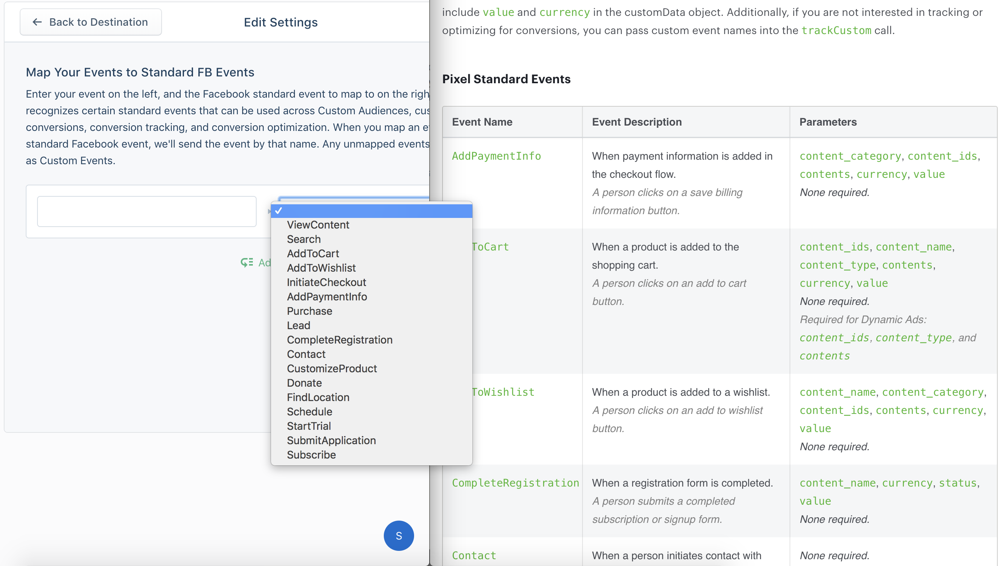

[Facebook Pixel](https://developers.facebook.com/docs/facebook-pixel) lets you measure and optimize the performance of your Facebook Ads. It makes conversion tracking, optimization and remarketing easier than ever. The Facebook Pixel Destination is open-source. You can browse the code [on GitHub](https://github.com/segment-integrations/analytics.js-integration-facebook-pixel).

> warning ""
> Facebook has deprecated the modular "Ads For Websites" suite, which previously comprised Facebook Custom Audiences and Facebook Conversion Tracking. We've consolidated those two destinations into this new and improved "Facebook Pixel" destination.


**Use Cases**

* [Increase conversions by retargeting shopping cart abandoners on Facebook](https://segment.com/recipes/abandon-cart-retargeting-facebook/)


## Other Facebook Destinations Supported by Segment
This page is about the **Facebook Pixel**. For documentation on other Facebook destinations, see the pages linked below.

| **Facebook Destination**                                                                                    | Supported by Personas |
| ----------------------------------------------------------------------------------------------------------- | --------------------- |
| **[Facebook App Events](/docs/connections/destinations/catalog/facebook-app-events/)**                      | Yes                   |
| **[Facebook Offline Conversions](/docs/connections/destinations/catalog/facebook-offline-conversions/)**    | Yes                   |
| **[Facebook Pixel](/docs/connections/destinations/catalog/facebook-pixel/)**                                | No                    |
| **[Facebook Custom Audiences](/docs/connections/destinations/catalog/personas-facebook-custom-audiences/)** | Yes                   |
| **[Facebook Conversions API](/docs/connections/destinations/catalog/actions-facebook-conversions-api/)**    | Yes                   |


## Getting Started



1. From the Segment web app, click **Catalog**.
2. Search for "Facebook Pixel" in the Catalog, select it, and choose which of your sources to connect the destination to.
3. In the destination settings, enter your `pixelId` from the [Pixels tab in Facebook Ads Manager](https://www.facebook.com/ads/manager/pixel/facebook_pixel).

Segment automatically initializes Facebook's pixel with your `pixelId` upon loading `analytics.js`.

## Page

If you're not familiar with the Segment Specs, take a look to understand what the [Page method](/docs/connections/spec/page/) does. An example call would look like:

```javascript
analytics.page();
```

Segment maps `analytics.page()` to Facebook's `fbq('track', "PageView")` method and will forward all page views accordingly. Note that the integration will ignore any parameters you pass to `analytics.page()`.

## Identify

If you're not familiar with the Segment Specs, take a look to understand what the [Identify method](/docs/connections/spec/identify/) does. An example call would look like:

```javascript
analytics.identify('ze8rt1u89', {
  name: 'Zaphod Kim',
  gender: 'Male',
  email: 'jane.kim@example.com',
  phone: '1-401-555-4421',
  address: {
    city: 'San Francisco',
    state: 'Ca',
    postalCode: '94107'
  }
});
```

When you make an Identify call with Segment, it will update Facebook Pixel the next time the user loads a page on your website. Facebook Pixel does not support immediately updating user properties using Identify. When you perform an Identify call in Segment, it will update in Facebook Pixel using their Advanced Matching feature.

## Track

If you're not familiar with the Segment Specs, take a look to understand what the [Track method](/docs/connections/spec/track/) does. An example call would look like:

```javascript
analytics.track("My Custom Event", {
  checkinDate: new Date(),
  myCoolProperty: "foobar",
});
```

On our analytics.js client-side integration we support all three [documented](https://developers.facebook.com/docs/facebook-pixel/api-reference#events) methods of sending events to Facebook.

At any time, you can define a custom `contentType` on the integration options. If the value is present, it will take
precedence over any other setting or default value.

```javascript
analytics.track('Checkout Started', {
    revenue: 2,
    products: [{
      id: "FB_product_1234",
      currency: "USD",
      category: "tshirts",
      quantity: 1,
      price: 2
    }]
  },
  { 'Facebook Pixel': { contentType: 'mycustomtype' } }
);
```

### Standard Events

To send *Standard* events, use the Segment destination setting labeled "Map Your Events to Standard FB Events". Then, any time Segment receives one of the events in that mapping, it will be sent to Facebook as the standard event you specified. All properties you included in the event will be sent as event properties. You can find documentation on these events [here](https://developers.facebook.com/docs/facebook-pixel/implementation/conversion-tracking/#standard-events).

In addition, Segment will specially handle the following event types and send them as Standard events:

- "Order Completed" will be sent as "Purchase"
- "Product Added" will be sent as "AddToCart"
- "Product List Viewed" will be sent as "ViewContent"
- "Product Viewed" will be sent as "ViewContent"
- "Products Searched" will be sent as "Search"
- "Checkout Started" will be sent as "InitiateCheckout"

Facebook requires a currency for "Purchase" events -- if you leave it out, Segment will set a default value of "USD".

You can set custom properties for the events listed above. Use the setting "Standard Events custom properties" to list
all the properties you want to send.

Here is how you'd specify standard events in the settings view:



You can map more than one Track event to the same Facebook standard event.

### Legacy Events

To send *Legacy Conversion* events, use the Segment setting called "Legacy Conversion Pixel IDs". Any events that appear in that mapping will be sent to Facebook with the specified Pixel ID used as the Facebook Pixel `eventName`. Conversion events only support `currency` and `value` as event properties, so only these will be associated with the event. `currency` will default to "USD" if left out.

### Custom Events

To send *Custom* events, send any event that does not appear in either mapping. All properties you included in the event will be included as event properties.

### Timestamps

Facebook Pixel uses a custom timestamp format: an ISO 8601 timestamp without timezone information. For the following event fields, if you pass in a JavaScript `Date` object, it will be converted to this custom format. If you pass in a string, it is assumed that the string is already formatted as Facebook expects:

- `checkinDate`
- `checkoutDate`
- `departingArrivalDate`
- `departingDepartureDate`
- `returningArrivalDate`
- `returningDepartureDate`
- `travelEnd`
- `travelStart`

### Advanced Matching

The Segment Facebook Pixel integration supports [Advanced Matching](https://developers.facebook.com/docs/facebook-pixel/advanced/advanced-matching) which enables you to send your customer data through the pixel to match more website actions with Facebook users. With this additional data, you can report and optimize your ads for more conversions and build larger re-marketing audiences. When the page loads, before we fire off the pixels, we'll check for traits that the user has been previously identified with and send that along with each call.

Facebook accepts the following properties:

- First name
- Last name
- Email
- Phone number
- Gender
- Birthday
- City
- State
- Zip code

If you follow Segment's [spec](/docs/connections/spec/identify/#traits), these properties send in the correct format.

When you use Advanced Matching, Facebook also accepts an External ID. This can be any unique ID from the advertiser, like loyalty membership IDs, user IDs, and external cookie IDs. To send an `external_id` to Facebook you can either:

- Send the Segment `userId` or `anonymousId` as `external_id` using the **Use User ID or Anonymous ID as External ID** setting
- Indicate which user trait you would like Segment to map to `external_id` using the **Advanced Match Trait Key for External ID** setting

## Limited Data Use



> info ""
> The **Use Limited Data Use** destination setting is disabled by default for all Facebook destinations except for Facebook Pixel. This must be enabled manually from the destination settings if you're using other Facebook destinations.



Facebook uses the `context.ip` to determine the geolocation of the event.

You can manually change the Data Processing parameters by adding settings to the `integrations` object. For Facebook Pixel, you must store these settings in the [Load object](/docs/connections/sources/catalog/libraries/website/javascript/#load-options) so that Segment can set them *before* it calls `init`. The example below shows how you might set custom Data Processing parameters in Analytics.js.

```javascript
analytics.load("replace_with_your_write_key", {
  integrations: {
    'Facebook Pixel': {
      dataProcessingOptions: [['LDU'], 1, 1000]
    }
  }
});
```

## Settings

### Map Categories to FB Content Types

If you're using real estate, travel, or automotive [Dynamic Ads](https://www.facebook.com/business/learn/facebook-create-ad-dynamic-ads) you can map `category` values to `content_type` values. For example, you might map the category "cars" to the "vehicle" content type so Facebook promotes relevant vehicles from your catalog. To understand which content types you can map to, consult the [Facebook Dynamic Ads](https://developers.facebook.com/docs/marketing-api/dynamic-ad) documentation.

For most implementations we recommend leaving these mappings blank. By default, we'll set `content_type` to "product".

## Troubleshooting

### PII Blocklisting

Facebook enforces strict guidelines around sending Personally Identifiable Information (PII) as properties of Pixel events. In order to adhere to these guidelines, Segment will automatically scan `track` event properties for PII and remove any that get flagged from the event to Facebook. The following keys are currently filtered:

- email
- firstName
- lastName
- gender
- city
- country
- phone
- state
- zip
- birthday

Any `track` events with properties containing those keys will be sent to Facebook with those properties omitted.

If you have events that use any of those keys for non-PII properties, you can manually allowlist them using the **Allowlist PII Properties** setting. You may also add to this list and/or optionally hash blocklisted properties with the **Blocklist PII Properties** setting.

### Inconsistent or Missing Conversions

The most common reason for Facebook conversion pixels to fire inconsistently is that the page redirects or reloads before the pixel has time to be loaded on the page. Make sure your page does not redirect or reload for at least 300ms after the conversion event happens. In some cases a delay of 500ms is necessary.

We recommend using our `trackLink` or `trackForm` helpers to delay the page redirect. [Documentation here](/docs/connections/sources/catalog/libraries/website/javascript#track-link). You can extend the delay by [setting the timeout to 500ms](/docs/connections/sources/catalog/libraries/website/javascript#extending-timeout).

### Extra or Duplicate Conversions

This may be due to conversion events being sent from your development, staging, or testing environments. We recommend setting up separate source for each environment. That way you can either point events to test conversion pixels in Facebook Conversion Tracking or turn off Facebook Conversion Tracking completely in non-production environments.

Double check that your mapped conversion events aren't happening anywhere else on your site. If the user reloads the conversion page or re-triggers the tracked event they may be double counted.

Facebook's conversion reports count view-through conversions as well as click-through conversions by default. You can change that setting inside Facebook Conversion Tracking in the report attribution settings.

### Facebook Conversions Not Matching Google Analytics

Facebook counts conversions per person, as opposed to Google Analytics which counts per browser cookie session (unless you're using [Google Analytics User-ID](/docs/connections/destinations/catalog/google-analytics/#user-id)).

If someone saw or clicked on your ad on a mobile phone then later came back directly to purchase on a desktop machine Google Analytics wouldn't know that this was the same person, but Facebook would. In that scenario Google Analytics counts 2 unique visits with a conversion last attributed to a direct visit on desktop. Facebook counts one conversion with the conversion properly attributed to the last ad click/view on mobile.


