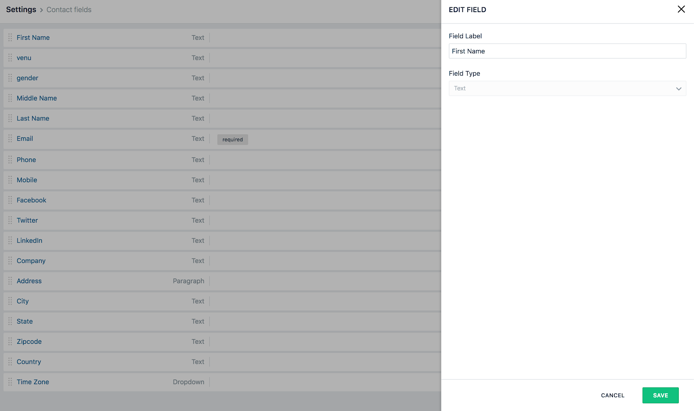
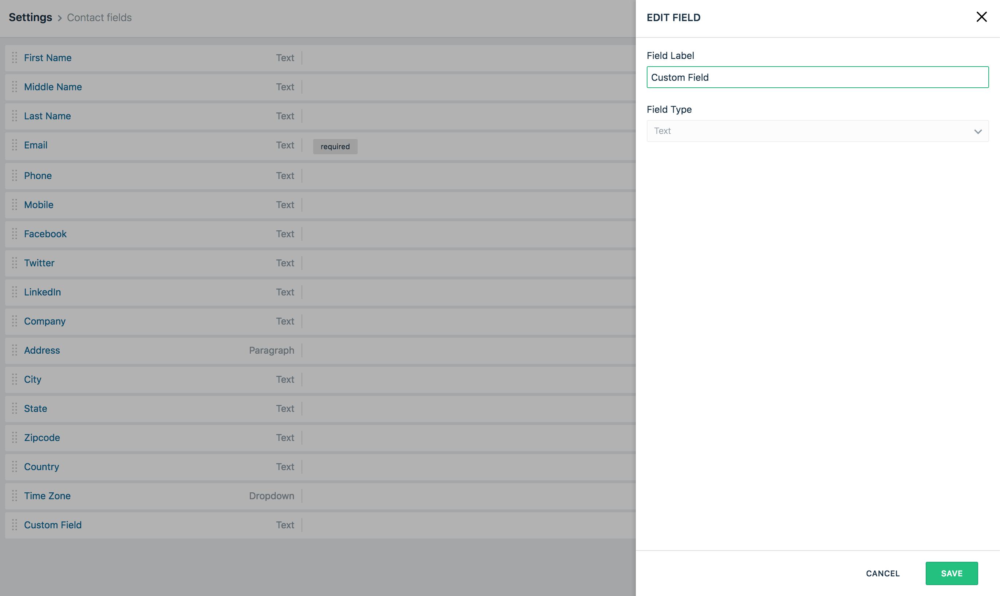

Segment makes it easy to send your data to [Freshmarketer](https://www.freshmarketer.com/?utm_source=segmentio&utm_medium=docs&utm_campaign=partners) (and lots of other destinations). Once you collect your data using Segment's [open source libraries](/docs/connections/sources/catalog/), Segment translates and routes your data to Freshmarketer in the format it can use.

This destination is maintained by Freshmarketer. For any issues with the destination, [contact the Freshmarketer Support team](mailto:support@freshmarketer.com).




## Getting Started



1. From your Segment UI's Destinations page click **Add Destination**.
2. Search for "Freshmarketer" in the Destinations Catalog and confirm the Source you'd like to connect to.
3. Go to your Freshmarketer dashboard (Admin Settings > API Settings) and copy your API Key.
4. In the Freshmarketer settings in the Segment UI, paste your API Key.

## Identify

If you're not familiar with the Segment Specs, take a look to understand what the [Identify method](/docs/connections/spec/identify/) does. An example call would look like:

```js
// On server-side
analytics.identify({
  "userId": "123",
  "anonymousId": "a80b66d5-b86d-41bd-866f-fe04ee7841af",
  "traits": {
    "email": "derek@example.org",
    "name": "Derek Sivers",
    "industry": "Music"
  }
})
```

```js
// On client-side
analytics.identify({
  "email": "derek@example.org",
  "name": "Derek Sivers",
  "industry": "Music"
})
```

You can use `identify` to create a contact when a website visitor fills a webform. When you identify a user, we'll pass that user's information to Freshmarketer.

By default, every new `identify` is created as a contact. If the `userId` is already present in the Freshmarketer contact list, it is treated as an update. To update existing user data, pass the corresponding `userId` with all the traits that have updated values. On updating, if any of the traits added during contact insertion is missed while updating, then that trait will be set as empty.

*Note: A `userId` is required in order to send events to Freshmarketer. You must also send `traits.email` in your payload.*

### Default Traits

You can find default list of field names in Settings - > Custom fields for field mapping.

All attributes that are a part of traits should correspond to the field Label of those fields in Freshmarketer. Attributes that are not mapped with their corresponding fields are ignored.



### Custom Traits

As part of traits, you can a Field Label to send custom fields created in Freshmarketer. Also, custom fields will not be automatically created. You have to create them with the exact name and type to map to your field in Freshmarketer before proceeding to send data from Segment.

Below is the Custom Field created in Freshmarketer product(Settings > Contact fields). You can drag and drop a field to create a new one.


