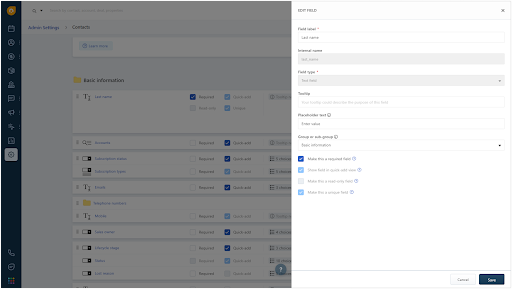

[Freshsales Suite](https://www.freshworks.com/crm/suite/){:target="_blank"} is a cloud CRM software that breaks organizational silos across sales, marketing, and support, allowing businesses to connect with customers across all touchpoints in one system.

This destination is maintained by Freshsales. For any issues with the destination [contact the Freshsales support team](mailto:support@freshsales.io).

## Getting Started

Freshsales Suite - CRM supports identify, page, and track methods, allowing users to create and update Freshsales contacts through Segment. To enable the Freshsales Suite - CRM destination, navigate to **Freshsales Admin Settings > Third Party Integrations > Segment** on the Freshsales platform. Click **Install** and select the Segment source you wish to connect to your Freshsales Suite - CRM destination. You can also add the Freshsales Suite - CRM destination from the Segment destinations catalog. You will have to provide the subdomain and API key in the destination settings, which are found in your Freshsales account.


## Supported methods

Freshsales Suite - CRM supports the following methods.


### Identify

You can use identify to create a contact when a website visitor fills a webform. When you identify a user, we’ll pass that user’s information to Freshsales.


#### UserId

userId is a mandatory field which is used to identify the contact in Freshsales. If your user identifier is not email, then email has to be a part of traits.

```json=
{
  "userId": "97980cfea0067",
  "type": "identify",
  "traits": {
    "firstName": "John",
    "lastName": "Doe",
    "email": "john.doe@example.com",
    "cfAlternateNumber": "98765432",
    "company": {
      "name": "Example.com"
    }
  }
}

```

#### Traits

Traits are pieces of information you know about a user that are included in an identify method.

#### Default Traits

Segment has reserved some traits that have semantic meanings for users. You should only use reserved traits for their intended meaning. Check the [Segment Spec](https://segment.com/docs/connections/spec/identify/#traits) to get a list of reserved traits.



All attributes that are a part of traits should correspond to the internal names of those fields in Freshsales. Attributes that are not mapped with their corresponding fields are ignored.

However, we make exception to two attributes: title and phone, which are reserved traits in Segment. They are automatically mapped to Freshsales attributes job_title and work_number respectively.

#### Custom Traits

As part of traits, you can send custom fields created in Freshsales by using their internal names in camel case. You can find internal names in the corresponding field settings page. Also, custom fields will not be automatically created. You have to create them in Freshsales before proceeding to send data from Segment. To learn more about creating custom fields in Freshsales click [here](https://crmsupport.freshworks.com/en/support/solutions/articles/50000002389-how-to-create-custom-fields-for-contacts-accounts-and-deals-).


#### Objects

Accounts and Deals associated with a contact can also be updated in Freshsales. The objects, company and deal, in the identify payload, correspond to the Accounts and Deals objects in Freshsales. Using the identify method, when creating a contact, it is also possible to create the corresponding Account and Deal in Freshsales. To do so, pass the company or the deal objects within traits in the identify call.

```json=
{
  "userId" : "97980cfea0067",
  "type": "identify",
  "traits" : {
    "firstName": "John",
    "lastName": "Doe",
    "email": "john.doe@example.com",
    "company": {
      "name": "Example.com"
    },
    "deal" :{
      "name" : "Sample Deal",
      "amount": 1234
    }
  }
}
```

### Track

You can track activities of your website visitors. If a user is subscribing to a newsletter and you want to track it, use the track method to accomplish that.

```json=
{
  "userId" : "john.doe@example.com",
  "event": "Email Bounced",
  "type": "track",
  "properties" : {
    "emailId": "110688",
    "emailSubject": "Welcome to Example.com",
    "campaignId": "123",
    "campaignName": "New Customer Discount"
  }
}
```

Segment has standardized a series of reserved event names that have special semantic meaning. We map these events to tools that support them whenever possible. See the [Semantic Events docs](/docs/connections/spec/semantic) for more detail. Custom events are supported as well.

### Page

If you want to track users visiting your sites, you can use the page method. When you call a page event, we send a pageview to Freshsales. You can send extra data paramerties within properties in the event payload. [See the reserved properties for more details](/docs/connections/spec/page/#properties).

```json=
{
  "userId" : "john.doe@example.com",
  "name": "Page view",
  “type”: ”page”, 
  "properties" : {
    "title": "Welcome to pricing page | Example.com",
    "url" : "http://example.com/pricing"
  }
```

### TroubleShooting

#### Custom Fields Aren't Updating

Make sure that the traits you’re passing through match the custom field’s internal name and data type.
