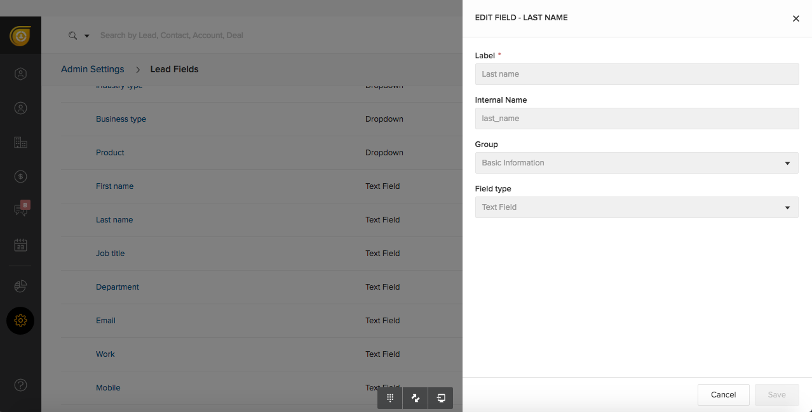
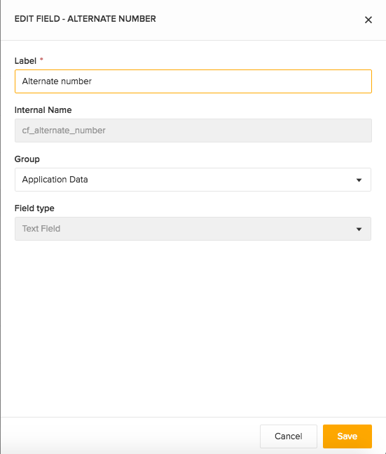

This destination is maintained by [Freshsales](https://www.freshworks.com/freshsales-crm/?utm_source=segmentio&amp;utm_medium=docs&amp;utm_campaign=partners). For any issues with the destination contact us at support@freshsales.io.

## Getting Started

You can create and update Freshsales Leads and Contacts through Segment. We support `identify`, `page`, and `track` methods.

Once your Segment source starts receiving data, you can send them to Freshsales by enabling this destination. You can enable it from Freshsales Admin Settings for Third Party Integrations. Select the Segment source from which data has to be forwarded to Freshsales.

You can also enable Freshsales destination from Segment destinations dashboard. You will have to provide the subdomain of your Freshsales Account and an admin API key.

## Identify

You can use `identify` to create a lead or a contact when a website visitor fills a webform. When you `identify` a user, we'll pass that user's information to Freshsales.

### User ID
`userId` is a mandatory field which is used to identify the lead or contact in Freshsales. If your user identifier is not email, then email has to be a part of traits.

<pre>
{
  "userId": "97980cfea0067",
  "traits": {
    "firstName": "John",
    "lastName": "Doe",
    "email": "john.doe@example.com",
    "cfAlternateNumber": "98765432",
    "company": {
      "name": "Example.com"
    }
  }
}
</pre>

By default, every `identity` is created as a lead. If you'd like an identity to be a contact, you'd need to pass `fs_contact` as `true` as a part of traits.

<pre>
{
  "userId" : "97980cfea0067",
  "traits" : {
    "firstName": "John",
    "lastName": "Doe",
    "email": "john.doe@example.com",
    "fsContact": "true",
    "cfAlternateNumber": "98765432",
    "company": {
      "name": "Example.com"
    }
  }
}
</pre>

### Traits
`traits` are pieces of information you know about a user that are included in an `identify` method.

### Default Traits
Segment has reserved some traits that have semantic meanings for users. You should only use reserved traits for their intended meaning. Check the [Segment Spec](/docs/connections/spec/identify/#traits) to get a list of reserved traits.



All attributes that are a part of traits should correspond to the internal names of those fields in Freshsales. Attributes that are not mapped with their corresponding fields are ignored.

However, we make exception to two attributes `title` and `phone` that are part of default traits. They are automatically mapped to Freshsales attributes `job_title` and `work_number` respectively.

### Custom Traits:
As part of traits, you can send custom fields created in Freshsales by using their internal names in camel case. You can find internal names in corresponding field settings page. Also, custom fields will not be automatically created. You have to create them in Freshsales before proceeding to send data from Segment. To learn more about creating custom fields in Freshsales check this [link](https://support.freshsales.io/support/solutions/articles/214558-how-to-add-custom-fields-for-leads-contacts-accounts-and-deals).



### Objects:
Accounts and Deals associated to a contact or lead can also be updated in Freshsales. The objects company and deal in the identity correspond to the Accounts and Deals in Freshsales. You can pass the `traits` of the company or the deal along with the respective objects in the identity.

```
{
  "userId" : "97980cfea0067",
  "traits" : {
    "firstName": "John",
    "lastName": "Doe",
    "email": "john.doe@example.com",
    "fsContact": "true",
    "company": {
      "name": "Example.com"
    },
    "deal" :{
      "name" : "Sample Deal",
      "amount": 1234
    }
  }
}
```

## Track

You can track activities of your website visitors. If a user is subscribing to a newsletter and you want to track it, use `track` method to accomplish that. When you `track` an event, we will send that event to Freshsales.

### Track request payload


```
{
  "userId" : "john.doe@example.com",
  "event": "Email Bounced",
  "properties" : {
    "emailId": "110688",
    "emailSubject": "Welcome to Example.com",
    "campaignId": "123",
    "campaignName": "New Customer Discount"
  }
}
```

Segment has standardized a series of reserved event names that have special semantic meaning. We map these events to tools that support them whenever possible. See the [Semantic Events docs](/docs/connections/spec/semantic) for more detail. Also, custom events are supported.

## Page

If a user is visiting your web pages and you want to track it, then use page method to do that.
When you call a `page` event, we send a pageview to Freshsales. You can send extra pieces of information as part of properties. See the [reserved properties](/docs/connections/spec/page/#properties) for more detail.

### Sample Page request payload

```
{
  "userId" : "john.doe@example.com",
  "name": "Page view",
  "properties" : {
    "title": "Welcome to pricing page | Example.com",
    "url" : "http://example.com/pricing"
  }
}

```

## Troubleshooting

### Custom Fields Aren't Updating

Make sure that the traits you're passing through match the custom field's internal name and data type.
