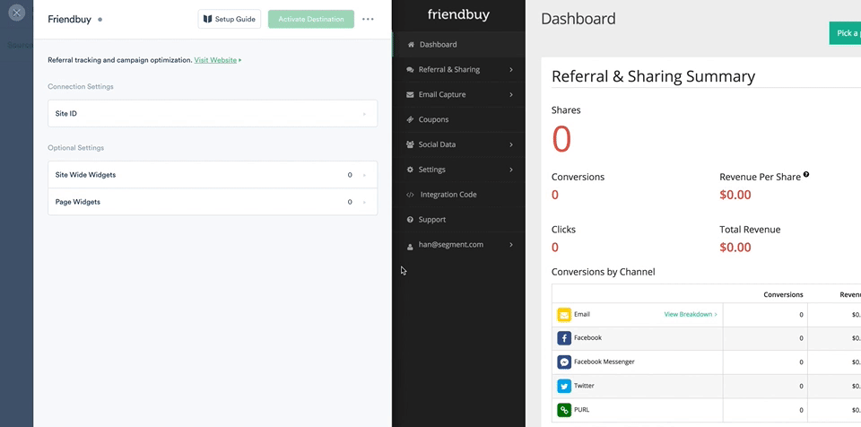
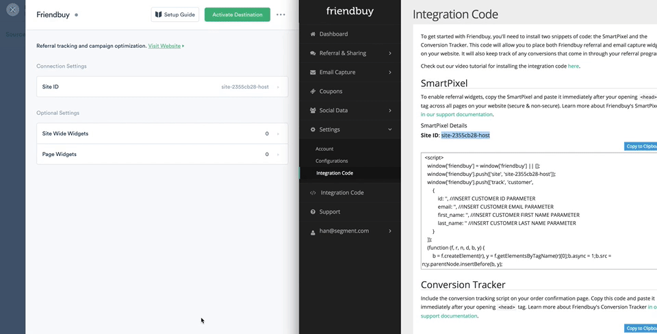

## Getting Started

Setting up Friendbuy is very simple! Just login to your Friendbuy account, go to **Integration Code** > and copy the **Site ID** above the snippet box. Then paste it into your Friendbuy Destiation setting back in the Segment UI as seen in the gif below:



This Destination allows you to:

- Map your `.page()` calls to facilitate [Widget Management](http://developers.friendbuy.com/#widget-management)
- Map your `.identify()` calls to facilitate [Customer Tracking](http://developers.friendbuy.com/#customer-tracking)
- Map your `.track()` calls to facilitate [Order Tracking](http://developers.friendbuy.com/#order-tracking) and [Product Tracking](http://developers.friendbuy.com/#product-tracking)

----------
## Page

In order to load specific widgets on your various web pages, you can configure your settings to map your _named_ `.page()` call(s) to your desired Friendbuy Widget(s). You will also be able to configure a number of optionally [advanced widget configurations](http://developers.friendbuy.com/#widget-options) such as **auto delay** and **custom parameters**. See the following gif for example:



There are two types of Widgets you can map to your `.page()` calls:

- Site Wide Widgets
  - These types of widgets are recommended by Friendbuy to load on all your webpages. If you wish to use these types of widgets, you can add them under the *Side Wide Widgets* setting. _NOTE_: You are NOT required to map a site wide widget if the **Call To Action** type is a ribbon served by Friendbuy. This type of overlay widget will just load when we boot up Friendbuy's library.

- Other widgets
  - All other widgets will fall under this category whereby you can map the `name` of a unique Segment `.page()` call to a widget ID.

_NOTE_: If you have mapped a site wide overlay widget loads on every `.page()` call, even if we have loaded a different widget on the page that you have explicitly mapped.

----------
## Identify

When you call `.identify()`, we will send the following mapped traits:

| **Segment Traits**    | **Friendbuy Standard Fields** |
| --------------------- | ----------------------------- |
| `userId`              | `id` **REQUIRED**             |
| `email`               | `email`                       |
| `firstName`           | `first_name`                  |
| `lastName`            | `last_name`                   |

Here is a sample Javascript  `.identify()` call with the all the standard traits:

```js
analytics.identify('2', {
  firstName: 'Buzz'
  lastName: 'Lightyear',
  email: 'captain.lightyear@toystory.com',
});
```

**NOTE**: Friendbuy does not accept any custom traits.

### Stripe and Chargebee Customer ID

If you are integrated with Stripe or Chargebee and would like to send those IDs to Friendbuy, you can pass them as integration specific options:

```js
analytics.identify('2', {
  firstName: 'Buzz'
  lastName: 'Lightyear',
  email: 'captain.lightyear@toystory.com',
}, {
  integrations: {
    Friendbuy: {
      stripeCustomerId: <email@stripe.com>,
      chargebeeCustomerId: <email@chargebee.com>
    }
  }
});
```

## Track / Order Completed

This Destination accepts only `Order Completed` events as decribed in our [ecommerce spec](https://segment.com/docs/connections/spec/ecommerce/v2/#order-completed).

Friendbuy has a concept of [Order Tracking](http://developers.friendbuy.com/#order-tracking) and [Product Tracking](http://developers.friendbuy.com/#product-tracking) where the former describes how to send data about the top level order whereas the latter documents instructions on sending data about each of the product within that order.

When sending the order details, we will make the following translation:

| **Segment Properties**    | **Friendbuy Standard Fields** |
| ------------------------- | ----------------------------- |
| `order_id`                | `id` **REQUIRED**             |
| `context.traits.email`    | `email`                       |
| `revenue`                 | `amount`                      |
| `coupon`                  | `coupon_code`                 |

Then we will iterate over each item in your `properties.products` and send the following mapping:


| **Segment Properties**  | **Friendbuy Standard Fields** |
| ----------------------- | ----------------------------- |
| `sku`                   | `sku`                         |
| `price`                 | `price`                       |
| `quantity`              | `quantity`                    |

**NOTE**: You can optionally specify if the customer who made the order is a new customer by passing `new_customer` under your integration specific options:

```js
  integrations: {
    Friendbuy: {
      newCustomer: true,
    }
  }
```
