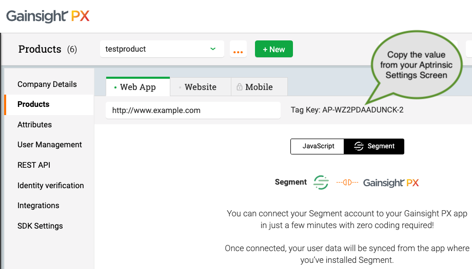

[Gainsight PX](https://www.gainsight.com/product-experience/) (formerly known as Aptrinsic) provides a personalized product experience platform to help companies acquire, retain, and grow customers by creating real-time, personalized engagements driven by product usage data. With Gainsight PX, companies can implement an effective product-led go-to-market strategy that will increase product adoption and customer lifetime value.

Our Gainsight PX destination code is open sourced on GitHub, feel free to check it out: [Gainsight PX integration code](https://github.com/segment-integrations/analytics.js-integration-aptrinsic).

## Getting Started



1. From the Segment web app, click **Catalog**.
2. Search for "Gainsight PX" in the Catalog, select it, and choose which of your sources to connect the destination to.
3. To find your Gainsight PX key, log into Gainsight PX and navigate to Settings > Products > Web App. If you have not already entered the URL for your web application, do that and click the Generate button. The Tag Key is the value to the right of the URL value. Use the "Copy" button to copy the value to your clipboard.

   

4. Paste the Gainsight PX Tag Key into the Segment connection settings API Key field.


Your changes appear in the Segment CDN in about 45 minutes, and then Analytics.js starts asynchronously loading the Gainsight PX snippet on your page, and sending data.

> note ""
> **Note**: If you use this integration, you should remove the Gainsight PX native tag code from your page, since Segment loads it for you.

Don't miss out the [The Configuration Checklist - Segment.com](https://www.gainsight.com/product-experience/) in Gainsight PX!

## Identify
If you're not familiar with the Segment Specs, take a look to understand what the [Identify method](/docs/connections/spec/identify/) does.

An example identify call is shown below:

```js
analytics.identify('97980cfea0085', {
  email: 'gibbons@example.com',
  name: 'Monica Gibbons'
});
```

When you identify a user, we will pass that user's information to Gainsight PX with
userId as the Gainsight PX's user identifier. User traits are mapped to visitor
metadata in Gainsight PX. Any matching custom attributes will also be mapped into
Gainsight PX. You'll be able to find all users and traits in the "Audience explorer" in Gainsight PX.

Segment must be running on all pages of the web application or site that you want to use Gainsight PX on.
Your Segment integration must include use of the identify call (identifies the user & group/account).

## Track
If you're not familiar with the Segment Specs, take a look to understand what the [Track method](/docs/connections/spec/track/) does.

An example track call is shown below:

```js
analytics.track("Form submitted", {
  product: "book",
  title: "The Name of the Wind"
});
```

When you track an event, we will send the event name together with the properties included in the track call. In Gainsight PX you will be able to create new funnels based on the custom events and properties received from Segment. You can also add "custom events" in the features created in the "Product Mapper" view.

## Group
If you're not familiar with the Segment Specs, take a look to understand what the [Group method](/docs/connections/spec/group/) does.

An example group call is shown below:

```js
analytics.group("0e8c78ea9d9dsasahjg", {
  name: "group_name",
  employees: 3,
  plan: "enterprise",
  industry: "Technology"
});
```

When you call group, we will send groupId as the account id to Gainsight PX. Group
traits are mapped to account metadata in Gainsight PX.
