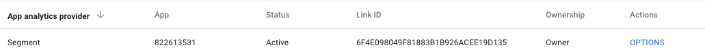

> warning "The Google Ads (Classic) destination is outdated."
> For website tracking, Google released a new version of Google Ads that uses [a global site tag (gtag.js)](https://support.google.com/google-ads/answer/7548399?hl=en){:target="_blank"}. Segment supports the global site tag in the [Google Ads (Gtag) destination](/docs/connections/destinations/catalog/google-adwords-new/). For mobile tracking, Google recommends using their [Firebase SDKs](https://support.google.com/google-ads/answer/6397604?hl=en){:target="_blank"}. Segment supports a Firebase implementation with the [Google Firebase destination](/docs/connections/destinations/catalog/firebase/).

## Getting Started

With Segment, you can use your events to fire a Google Ads conversion pixel from your website **in client-side JavaScript.**
You can also trigger Google Ads (Classic) conversion from your mobile app using the **Server to Server** destination, so you don't need to include the SDK in your app. The server to server connection requires mobile device specific details to forward the events to Google Ads (Classic). Google Ads (Classic) **does not work with any server-side libraries**. Make sure when you're setting up your Google Ads (Classic) conversions that you choose the appropriate tracking method.

### Configure the Google Ads (Classic) destination

1. From the Segment Destinations Catalog find and select Google Ads (Classic).
2. Click **Configure Google Ads (Classic)**.
3. Select the source you will use to send data to Google Ads (Classic).
4. Provide a meaningful name to this instance of the destination.
5. On the destination Settings tab, enter the **Conversion ID** from your Google Ads (Classic) account. 
6. Select the Event Mappings setting. Enter the name of the event as it appears in the [`track`](/docs/connections/spec/track) call and map it to your Google Ads (Classic) conversion's `google_conversion_label`.

## Web

This section details the configuration of the Google Ads (Classic) destination with Analytics.js sources.

### Additional iOS Cloud Mode Setup for iOS 14

With the release of Segment's latest Analytics-iOS SDK, which includes support for upcoming iOS 14 tracking changes, you must decide if you _need_ to collect the user's IDFA or not. If you do not need to collect IDFA, you can update your Analytics-iOS SDK to the next version, and Segment sets `device.adTrackingEnabled` to `false`, and starts deleting the `device.advertisingId` from the context object in your payloads. If you _do_ need to collect the IDFA, you must import the IDFA closure as a config to the library, or import the Ad Tracking Transparency framework from Apple.

Google Adwords maps the IDFA to `rdid`, and returns a 4xx error on the outbound request if no `device.advertisingId` key appears in the payload.

To work around this, enable the **Fallback to Zeroed IDFA when advertisingId key not present** destination setting for Google Adwords in the Segment web app. When enabled, Segment checks if a `device.advertisingId` exists in the payload, and if none exists, sets the `rdid` to `'00000000-0000-0000-0000-000000000000'`.

To maintain backwards compatibility, if you do not enable this setting and no `device.advertisingId` key appears in the payload, Segment rejects the message.


### Conversion ID

To find a conversion ID look inside of your Google Ads (Classic) account and navigate to Tools -> Conversions, then click the red +Conversion button. You'll be prompted to choose what types of conversions you'd like to track. For the purposes of integrating with Segment, you'll choose either "Website" or "App".

If you select "Website," click through to the "Review and Install" step in the Google Ads (Classic) dashboard. Scroll down to the "Install your tag" section and look for `w.google_conversion_id`. Copy the string directly to the right of it, and paste it into the Google Ads (Classic) section of your Segment destination tab.

If you select "App" you can choose to track conversions from Firebase, Google Play, or first opens and in-app actions. For more on setting up mobile tracking, see [Server to Server Destination for Mobile Apps](#mobile--server) further down on this page.

> info ""
> If using the New Adwords Experience, the Conversion ID can now be found in a different location. Navigate to Tools, Billing, and Settings menu and, then, select "Measurement: Conversions", which opens to the "Conversion Actions" table. From here you can drill down to the conversion "Tag setup" to view the tag details. From here, select Use Google Tag Manager card in order to expose the Conversion ID.

### Conversion Value

If you want to pass a value along with the conversion event include an event property labeled `revenue`, like this:

```javascript
analytics.track('Order Completed', { revenue: 33 });
```
### Dynamic Remarketing Tags

If you enable **Send Remarketing Tag** for an event mapping in your settings, Segment sends a dynamic remarketing tag in addition to a normal conversion tag. You can use these properties in your Google Ads (Classic) account to create audiences to remarket to.

If you'd like to **only** send a Dynamic Remarketing Tag you can just leave the **Label** field blank.

### Multiple Conversion IDs

If you wish to map multiple conversion IDs for a single event, you can simply create multiple mappings in the **Event Mappings** setting with the same event name and different conversion IDs.

## Troubleshooting

### Testing Conversion Pixels

To test Google Ads conversion tracking you'll have to click through one of your existing ads.

Keep in mind that the conversion data must be processed by Google before it shows up in your Google Ads (Classic) reporting, which can take up to 24 hours.

### Inconsistent Conversions

The most common reason for Google Ads (Classic) conversion pixels to fire inconsistently is that the page redirects or reloads before the pixel has time to be loaded on the page. Make sure your page does not redirect or reload for at least 300ms after the conversion event happens.

Segment recommends using the `trackLink` or `trackForm` helpers to delay the page redirect. [Documentation here](/docs/connections/sources/catalog/libraries/website/javascript#track-link).

## Mobile & Server

### Legacy Migration

The server-to-server integration with Google Ads (Classic) integrates with the [App Conversion Tracking and Remarketing API](https://developers.google.com/app-conversion-tracking/api/) which is responsible for receiving and processing in-app conversion events. Google recently released an entirely new version of this API that is slated to completely replace the [legacy API](https://developers.google.com/app-conversion-tracking/api/legacy/android-conversion-tracking-server) in the near future. If you are an existing user of this integration and are migrating to this new version, there are three important changes to be aware of:

1) App Event Mappings

Google has replaced the concept of associating conversion events with **conversion ids** and **conversion labels**. Instead, conversion events are simply associated with their event name. Once you've enabled the new integration in your settings, you can begin creating and tracking new conversion events in Google Ads (Classic) that are tied to your Segment `track` event names and ignore the legacy [Event Mappings](/docs/connections/destinations/catalog/google-ads-classic/#event-mappings) configuration step.

2) App Event Types

The API has a new concept of **event types**. Each of these types are meant to be associated with common in-app actions that a user could take (app installs, product views, etc.). This is the same concept as the [Semantic Event Spec](/docs/connections/spec/semantic/). The event type mappings Segment supports are outlined in the sections below.

> warning ""
> If you have migrated from a legacy AdWords account to a new one, Google Ads (Classic) will automatically migrate your existing conversion events to your new account. Segment will continue to respect these event mappings even if they share the same event names as the new "spec'd" event mappings outlined below and ignore the new **event type** mapping. This is to ensure there is no disruption in your data. If you wish to bypass this, you simply need to delete the event mapping in your [settings](/docs/connections/destinations/catalog/google-ads-classic/#event-mappings).

1) Authorization/Authentication

The new API has a new authentication and authorization process that will require some configuration steps both in your AdWords account and your Segment Account. This process is outlined below.

### Authorization / Authentication
To authorize Segment to track conversion events using the Google Ads (Classic) API on your behalf, you must complete the following steps:

#### Generate a Link ID in your Google Ads (Classic) Account

Authorization between an Google Ads (Classic) account and a third-party-application is done using the use of a Link Id. This process is detailed [here](https://support.google.com/adwords/answer/7365001).

> warning ""
> During this process, you are required to enter a Provider ID. Segment's Provider ID is: `7552494388`.

Once this step is complete, you should see a screen that looks like this showing the new Link Id:



#### Add your Link ID as an Integration Setting

Once you have a Link ID, you need to add them to your Google Ads (Classic) [destination settings](#settings) in your Segment account. **Make sure the API version setting is set to 2.**

### Track
All `track` events are by default sent to your Google Ads (Classic) account and from there, you can choose which ones you want to designate as **Conversion Events**. All events sent to Google Ads (Classic) require an **event type** specification. This is an enumerated list of nine potential values:

 1. first_open
 2. session_start
 3. in_app_purchase
 4. view_item_list
 5. view_item
 6. view_search_results
 7. add_to_cart
 8. ecommerce_purchase
 9. custom

Segment integrates with these event types using the use of the [Semantic Event Spec](/docs/connections/spec/semantic/). Each individual mapping Segment supports is documented in the sections below. Any event Segment receives that is not a mapped semantic event will be sent to Google Ads (Classic) as a `custom` event type.

### Application Installed

The [Application Installed](/docs/connections/spec/mobile/#application-installed) event is sent to Google Ads (Classic) as a `first_open` event type. This event is used to attribute successful app installs.

### Order Completed

The [Order Completed](/docs/connections/spec/ecommerce/v2/#order-completed) event is sent to Google Ads (Classic) as a `ecommerce_purchase` event type. This event is used to attribute successful revenue generating conversions.

> warning ""
> If you are tracking a successful purchase from an App Store (either the iOS App Store or the Google Play Store)  be sure to set the `affiliation` property of the event to either `App Store` (for iOS) or `Google Store` (for Android). If these are present, Segment maps the event as an `in_app_purchase` event type. Here is an example for Android:

```javascript
analytics.track('Order Completed', {
  // This is a required property.
  affiliation: 'Google Store',
  revenue: 25.00,
  orderId: '50314b8e9bcf000000000000',
  products: [
    {
      productId: '507f1f77bcf86cd799439011',
      sku: '45790-32',
      name: 'Monopoly: 3rd Edition',
      price: 19,
      quantity: 1,
      category: 'Games',
      url: 'https://www.example.com/product/path',
      imageUrl: 'https:///www.example.com/product/path.jpg'
    }
  ]
})
```

### Product List Viewed

The [Product List Viewed](/docs/connections/spec/ecommerce/v2/#product-list-viewed) event is sent to Google Ads (Classic) as a `view_item_list` event type. This event is used to attribute views of a product list page.

### Product Added

The [Product Added](/docs/connections/spec/ecommerce/v2/#product-added) event is sent to Google Ads (Classic) as an `add_to_cart` event type. This event is used to attribute additions of a product to a user's shopping cart.

### Products Searched

The [Products Searched](/docs/connections/spec/ecommerce/v2/#products-searched) event is sent to Google Ads (Classic) as a `view_search_results` event type. This event is used to attribute product searches.

### Product Viewed

The [Products Viewed](/docs/connections/spec/ecommerce/v2/#product-viewed) event is sent to Google Ads (Classic) as a `view_item` event type. This event is used to attribute views of a specific product page.

### Other Features

#### Attribution Postbacks
If a conversion event is successfully attributed to an active campaign, Google Ads (Classic) will respond with information about the campaign. If the conversion event was an `Application Installed` event (used to track successful app installs), Segment maps the attribution information to an [`Install Attributed`](/docs/connections/spec/mobile#install-attributed) event and send it back to your Segment source to get proliferated out to your other downstream integrations. You can enable this functionality in your integration settings.

#### Tracking Value and Currency
To track the monetary value of a conversion, make sure your event contains a `.revenue` property with a Number designating the total value of the conversion. You may also pass a three letter `currency` property (ex. USD, EUR, etc...).

## Mobile & Server (Legacy)

> warning ""
> Google Ads (Classic) has plans to deprecate the API that the functionality outlined here relies on. Reference the documentation that supports their new API version above.

You can specify key mobile events as conversion events inside of Google Ads conversion dashboard. When these events fire from your mobile apps, Segment triggers these Google Ads (Classic) conversions. Segment SDKs should include the following properties, which are required to send the conversions. If you notice these properties aren't being logged, check the debugger to ensure the properties are included in your events.


| Property   | Mapping                                                   |
| ---------- | --------------------------------------------------------- |
| label      | The Advertising Label from the destination settings panel |
| rdid       | `context.device.advertisingId`                            |
| bundleid   | `context.app.namespace`                                   |
| appversion | `context.app.version`                                     |
| osversion  | `context.os.version`                                      |
| sdkversion | `contet.app.build`                                        |

The following properties are optional, if you'd like to see more, [contact Segment Support](https://segment.com/help/contact/).

| Property      | Mapping               |
| ------------- | --------------------- |
| referrer      | `context.referrer.id` |
| value         | `properties.revenue`  |
| currency_code | `properties.currency` |


Here's Google documentation for the endpoint Segment connects to [for iOS apps](https://developers.google.com/app-conversion-tracking/ios/conversion-tracking-server#reporting_in-app_conversions_from_an_analytics_server) and [for Android Apps](https://developers.google.com/app-conversion-tracking/android/conversion-tracking-server#in-app_conversions). It can take 24-48 hours for conversions to show up in the conversions dashboard.
