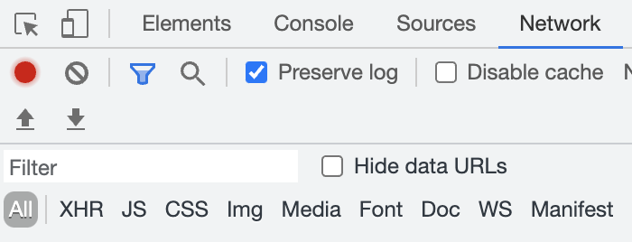
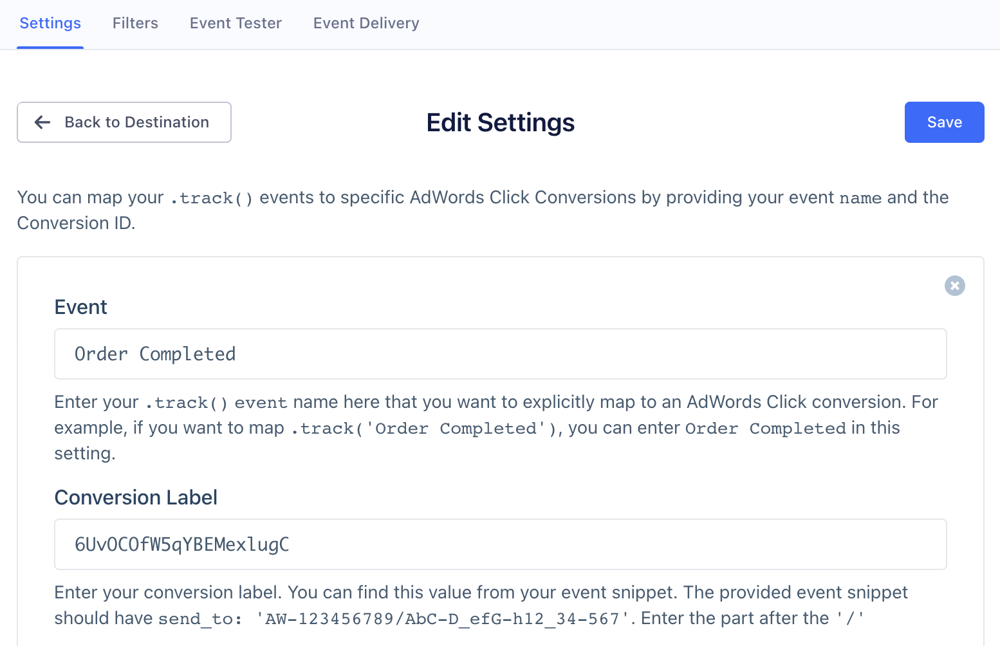
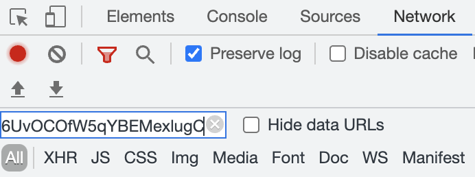

The [Google global site tag (gtag.js)](https://support.google.com/google-ads/answer/7548399?hl=en){:target="_blank"} is a JavaScript tagging framework and API that allows you to send web conversions to Google Ads. With the Segment Google Ads (Gtag) destination, Segment loads gtag.js for you so you can make efficient use of your existing tracking implementation.

> warning ""
> Only use this destination if your Google Ads account is using Gtag. If you're using Google Tag Manager, don't add the global site tag (gtag.js) in your GTM containers. You should also disable any [Google Ads (Classic)](/docs/connections/destinations/catalog/adwords/) destinations within the same source, since **Google Ads (Classic)** can't load at the same time as **Google Ads (Gtag)**.

> info ""
> If you're sending [enhancement data to Google Ads](/docs/connections/destinations/catalog/actions-google-enhanced-conversions/) in parallel with Gtag, you must include the same Order ID (Transaction ID) on both sets of data. This is required to properly deduplicate conversions between Gtag conversions and enhanced conversions. To send Order ID (Transaction ID) to Gtag, include `order_id` as a property on your web events. 

## Getting Started

You can use this destination to map your `.page()` calls to **Page Load Conversions** or `.track()` calls to **Click Conversions**. Currently this is only supported on the browser.

### Configure the Google Ads (Gtag) destination

1. From the Segment Destinations Catalog find and select Google Ads (Gtag).
2. Click **Configure Google Ads (Gtag)**.
3. Select the source you will use to send data to Google Ads (Gtag).
4. Provide a meaningful name to this instance of the destination.
5. On the destination Settings tab, enter the **Conversion ID** from your Google Ads (Gtag) account. 
6. Select the 'Click Conversion' setting. Enter the name of the event as it appears in the [`track`](/docs/connections/spec/track) call and map it to your Google Ads (Gtag) conversion label.

## Page

If you want to map all your unnamed `.page()` calls to a default Page Load Conversion, you can enter the Conversion ID in **Settings > Default Page Conversion**. However, if you created specific Page Load Conversions in Google Ads that you'd like to map your named `.page()` calls in Segment, you can map the events in **Settings > Page Load Conversions**.

Segment forwards all the `properties` of the page call, such as `path`, `title`, `url`, because by default, Google Ads (Gtag) makes these available in your remarketing campaigns.

You can send Google's semantic properties, such as `value`, `currency`, or `transaction_id`, as integration specific options. However, Segment recommends you to  create a **Click Conversion** instead, and map them to `.track()` calls. The example below shows these properties as integration-specific options:

```javascript
analytics.page({}, {
  'Google Adwords New': {
    value: 25,
    currency: 'USD',
    order_id: 'order123'
  }
});
```

> note ""
> **NOTE:** The `'Google Adwords New'` is case sensitive. Segment prefers you to use `order_id` rather than  `transaction_id` to stay more consistent with the [ecommerce spec](/docs/connections/spec/ecommerce/v2). However, Segment will send it as `transaction_id` in the request itself to satisfy Google's specifications.

## Track

You can map your custom `.track()` events to any **Click Conversions** you created inside Google Ads. Segment passes any `properties` so you can use them during your remarketing campaigns.

If you pass `properties.value`, `properties.currency`, or `properties.order_id`, Segment maps them to Google's semantic `value`, `currency`, or `transaction_id` respectively.

The only exception is that for `Order Completed` events, Segment will map Google's semantic `value` field to your `properties.revenue` or `properties.total`. If you pass both as properties, `properties.revenue` takes precedence.

## Troubleshooting Google Ads Conversions
To figure out if an event is flagged for conversion, follow these steps:
1. Confirm that the events mapped to a Google Ads conversion are being sent in device-mode while using the Segment Analytics.js library. To do this:
    1. Go to **Connections > Sources** in your workspace and choose your Source.
    2. Go to the **Debugger** tab.
    3. Click on an event and look at the **Raw** view to make sure the events have a library name of `analytics.js`. There should be a snippet of code that looks like this:

      ```js
        "library": {
          "name": "analytics.js",
      ```

2. Verify that the [Google Conversion ID](/docs/connections/destinations/catalog/google-ads-gtag/#google-conversion-id) in your Segment workspace is correct.
3. Find your ad online and click it. This will redirect you to your website.
4. Open the Network tab in your browser and make sure the **Preserve log** checkbox is checked and **All** is selected. Keep this Network tab and webpage open.

      

5. Go to the **Settings** tab for your Gtag destination in Segment on a new webpage and choose **Click Conversions** to look at the mapped `track()` events and make sure the events are mapped to the correct **Conversion Label**.

      

6. Go back to your website and trigger the event mapped to the conversion. For example, as shown in the image above, it would be `Order Completed`.
7. Go to the Network tab in your browser and enter the **Conversion Label** linked to the event you triggered in the **Filter** field.

      

8. See if the value for the `ct_cookie_present` changed to `true`. If `true`, it means that Google Ads counts the event as a conversion.  

> info ""
> Google Ads considers an event as a conversion when the user arrives to your website as a result of an Ad _click_. The Google SDK is responsible for checking if the user came from an Ad click and sets the parameter `ct_cookie_present` to true. Without clicking through an ad, Google Ads doesn't reflect the conversion because this information is missing in the network requests.

## Multiple Google Ads Accounts

If you are an enterprise that uses multiple Google Ads Gtag accounts (usually managed by various third party agencies) you can override the top level default Google Conversion ID at the event level by entering it into the settings.
