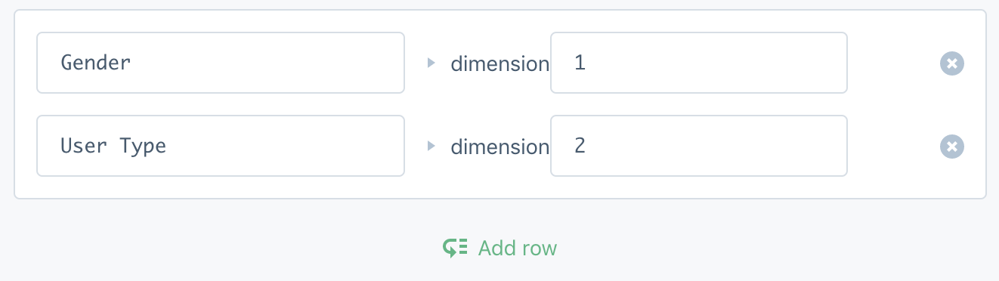
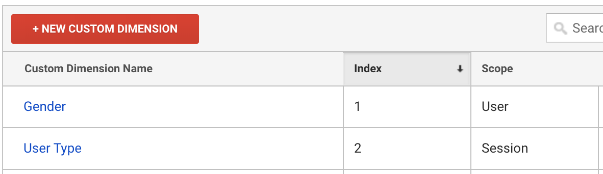
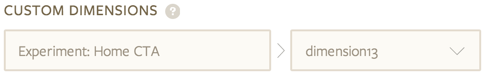
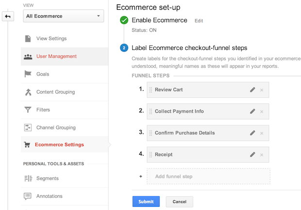
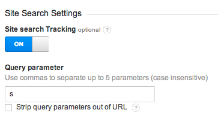

> warning "Migrate mobile implementations to Firebase"
> Google ended support for Google Analytics classic on iOS and Android mobile apps on October 31st 2019. To continue measuring and optimizing user engagement in your mobile apps, [migrate your implementation to use the Firebase SDKs](migrating). If you are using Google Analytics 360 you do not need to migrate.


#### Which Google destination should I use?

If your Google Measurement ID starts with a G, you're using G-Codes from Google Analytics 4, and should consider using [Segment's Google Analytics 4 destination](/docs/connections/destinations/catalog/actions-google-analytics-4/).

Although GA4 is now the default when you create a new property, you can still [create a Universal Analytics property](https://support.google.com/analytics/answer/10269537). You can use a UA property with [Segment's Google Universal Analytics destination](/docs/connections/destinations/catalog/google-analytics/).

Different Measurement IDs begin with different prefixes, which indicate which Google destination you should use.

| Prefix | Google Account type       | Segment Settings    |
| ------ | -------------------------- | ----------------- |
| UA     | Your global site tag is controlled by Google Universal Analytics. The ID is your Google Universal Analytics Measurement ID. To find the property associated with this ID, use the [account search feature](https://support.google.com/analytics/answer/6100731) in Google Universal Analytics. If the property doesn't appear, you probably don't have access to it. | [Google Universal Analytics](/docs/connections/destinations/catalog/google-analytics/): Tracking ID           |
| G      | Your global site tag is controlled by Google Analytics 4 (GA4). The ID is your Google Analytics Measurement ID.       | [Google Analytics 4](/docs/connections/destinations/catalog/actions-google-analytics-4/): Measurement ID |
| AW     | Your global site tag is controlled by Google Ads. The numeric string following the AW prefix is your Google Ads Conversion ID.        | [Google Ads](/docs/connections/destinations/catalog/google-ads-gtag/): Google Conversion ID                  |
| DC     | Your global site tag is controlled by a Floodlight tag. The numeric string following DC is your Advertiser ID.       | [Floodlight](/docs/connections/destinations/catalog/doubleclick-floodlight/): DoubleClick Advertiser ID      |
| other  | Your global site tag is controlled by a different Google product or may be implemented incorrectly. Use the [Tag Assistant extension](https://support.google.com/tagassistant/answer/2947093) for Google Chrome to verify.      | n/a      |


## Getting Started

Segment supports Google Universal Analytics client-side and server-side tracking.
To use Google Universal Analytics for mobile devices, you must use [Google Firebase](/docs/connections/destinations/catalog/firebase/) instead of the original Google Universal Analytics destination. See the [migration guide](migrating/) for more instructions.

When you enable the Google Universal Analytics destination in Segment:

- Your changes appear in the Segment CDN in about 45 minutes, and then Analytics.js starts asynchronously loading Google Universal Analytics JavaScript library on your web page. **This means you should remove Google's snippet from your page.**

- Your Google Universal Analytics real-time dashboard starts showing live, concurrent visitors.

- Google Universal Analytics starts automatically collecting data on your site. It takes several hours for Google to process this data and add it to your reports, but you should still see events appear in the Google Universal Analytics real-time events dashboard.

> info "Classic tracking deprecated"
> These docs cover Google Analytics Universal features, since the [Classic tracking method has been depreciated](http://analytics.blogspot.com/2014/04/universal-analytics-out-of-beta-into.html).


## Page and Screen

When you make a [Page call](/docs/connections/spec/page/), Segment sends a `pageview` to Google Universal Analytics. You can send pageviews from the browser, or using any of the [Segment server libraries](/docs/connections/sources/catalog/#server).

The resulting `page` event name in Google Universal Analytics corresponds to the `fullName` of the page event. `fullName` consists of a combination of the `category` and `name` parameters. For example, `analytics.page('Home');` produces a Page event called `Home` in the Google Universal Analytics dashboard, but `analytics.page('Retail Page', 'Home');` produces an event called `Retail Page Home`.

When you send Page events from a server library you must include a `url` property, or else Google Universal Analytics silently rejects the Page event.

If you send a [`screen`](/docs/connections/spec/screen) call using a server library, you must pass in an [application name](https://developers.google.com/analytics/devguides/collection/analyticsjs/field-reference#appName) using Segment's `context.app.name` object, or Google rejects your event.


### Virtual Pageviews

Virtual pageviews are when you send a pageview to Google Universal Analytics when the page URL didn't actually change, for example when a full-screen modal dialog appears. You can do this with Segment by making a [Page call](/docs/connections/spec/page/) with optional properties, like in the following example. Include both the category and name, in addition to the properties.

```javascript
analytics.page('Form', 'Signup Modal', {
  title: 'Signup Modal',
  url: 'https://segment.com/#signup',
  path: '/#signup',
  referrer: 'https://segment.com/'
});
```


### Including URL Query Strings

By default Segment only sends the domain and path to Google Universal Analytics. For example, if someone views a page with the url `http://example.com/pagename/?xyz=123&r=5`, Segment sends `http://example.com/pagename/` to Google Universal Analytics as the URL.

In some cases, for example if you're tracking search queries, you might want to include the whole URL including the query string to Google Universal Analytics. To do this, go to the Google Universal Analytics destination settings in the Segment App, navigate to the Advanced Options section, and check **Include the Query String in Pageviews**.

## Identify

It is against Google's terms of service to pass Personally Identifiable Information (PII) to the Google Universal Analytics reporting interface. For that reason Segment never passes anything from an [Identify call](/docs/connections/spec/identify/) to Google unless you specifically tell it to. You can read about Google's best practices for avoiding this [here](https://support.google.com/analytics/answer/6366371?hl=en).


### User ID

[Google Universal Analytics Universal tracking method](https://support.google.com/analytics/answer/3123663) allows you to set a user ID for your identified visitors.

To use this feature you must [set up User-ID in your Google Universal Analytics property](https://support.google.com/analytics/answer/3123666) and create a User-ID view.

To pass the `id` from your [Identify calls](/docs/connections/spec/identify) to Google Universal Analytics, go to the Google Universal Analytics destination settings in the Segment App, navigate to the Advanced Options section, and enable the **Send User-ID to GA** setting.

An example call might look like the following:

```javascript
analytics.identify('12345', {
  email: 'jakep@example.com',
  name: 'Jake Peterson'
});
```

In this example set the `User-ID` to `12345` for Google Universal Analytics, but don't share the `email` or `name` traits with Google.

If you are passing an **email**, **phone number**, **full name** or other PII as the `id` in an [Identify call](/docs/connections/spec/identify) do not use this feature. That is against the Google Universal Analytics terms of service and your account could be suspended.


### Custom Dimensions

Google Universal Analytics has multiple scopes for each custom dimensions: hit (synonymous with events), session, user, product (which requires that enhanced ecommerce be enabled). Segment's device-mode [Analytics.js library](/docs/connections/sources/catalog/libraries/website/javascript/) supports all of them.

#### Setting up Custom Dimensions
First, [configure the Custom Dimensions](https://support.google.com/analytics/answer/2709829?hl=en) from your Google Universal Analytics admin page.

Once you finish this set up in Google Universal Analytics, you can to map traits and properties to your custom dimensions. Go to the Google Universal Analytics destination settings in the Segment App and locate the **Custom Dimensions** setting. This is where you will enter your mapping.

The following images show an example of mapping "Gender" to dimension "1" and "User Type" to dimension "2":

On Segment:

On Google:


You can only map each trait or property to one Custom Dimension at a time.

When you finish mapping dimensions and save the settings, Segment checks if the user traits and properties in [Identify](/docs/connections/spec/identify/), [Track](/docs/connections/spec/track/) and [Page](/docs/connections/spec/page/) calls are defined as a dimension. If they are defined in your mapping, Segment sends that dimension to Google Universal Analytics.

In the server-side integration, you can opt-in to mapping top-level and `context` object fields to dimensions and metrics using the **Enable Mappings from Top-Level or Context Fields - Server Side Only** setting. If this setting is enabled, top-level and `context` object fields defined in the **Custom Dimensions** mapping and found in [Identify](/docs/connections/spec/identify/), [Track](/docs/connections/spec/track/), [Page](/docs/connections/spec/page/) and [Screen](/docs/connections/spec/screen) calls are sent to Google Universal Analytics.

> info ""
> Traits in [Identify calls](/docs/connections/spec/identify) that map to Custom Dimensions are only recorded to Google Universal Analytics when the next [Track call](/docs/connections/spec/track) or [Page call](/docs/connections/spec/page) is fired from the browser.

Continuing the example above, we can set the **Gender** trait with the value of **Male**, which maps to `dimension9`, and it will be passed to Google Universal Analytics _when we make the 'Viewed History' Track call_.

You would make the following Identify call:
```js
analytics.identify({
  Gender: 'Male'
});
```

And then the following Track call:
```javascript
analytics.track('Viewed History');
```

### Server side Identify

If you are sending Identify calls from your server libraries or have [Segment Cloud App sources](/docs/connections/sources/catalog/#cloud-apps) that send back Identify calls with enriched user traits, you can send that data to your GA account using custom dimensions and metrics.

Unlike the device-mode destination which runs directly on the device, and which can use the browser and the global window `ga` tracker, in a server library implementation Segment checks your `traits`, then checks your settings for custom dimension or metric mappings, and then sends the Identify with an explicit event.

You can specify what the event action should be called in the Google Universal Analytics settings. If you don't specify a name, Segment uses a default of event **'User Enriched'**. Since an event category is also required, you can specify which `trait` you want Segment to set this value to. For example, if you send a trait such as `type`, Segment sets the value of `traits.type` as the event category if defined, and if it is not, sets it to the default value **'All'**.

> info ""
> **Note**: Segment marks enriched user trait events as a **Non-interaction** event. Non-interaction events are available if you're using Google Universal Analytics.

### A/B Test Versions to Dimensions

Segment makes it simple to save your A/B testing versions to custom dimensions in Google Universal Analytics by mapping an experiment to a custom dimension in the Google Universal Analytics destination settings.

If you are using cloud-mode or server-side Google Universal Analytics destinations, you can also send this data automatically using the `experiment_id`, `experiment_name`, `variation_id`, and `variation_name` properties. If both an experiment and variation are defined, then this is sent automatically. Segment uses the ids before using the names. If both an ID and a name exist, Segment sends the ID first. For example, if you an `experiment_id`, an `experiment_name`, and a `variation_name` in a call, only the `experiment_id` and `variation_name` are sent to Google Universal Analytics.

When you have an active A/B test on a page, Segment either sets that experiment as a property or a user trait, depending on how you choose to send experiment data to other tools on your A/B testing tool's Segment settings page. The property or trait for A/B test experiments are labeled like the following examples:

```javascript
'Experiment: EXPERIMENT_NAME': 'EXPERIMENT_VARIATION'
```

For example, if you have an experiment called **Home CTA** and a visitor sees a variation called **Create free account now**, Segment sets the following property or trait:

```javascript
'Experiment: Home CTA': 'Create free account now'
```

To record that property or trait as a custom dimension you would map **Experiment: Home CTA** to a custom dimension, as in the following example:



> success ""
> Remember to set up `dimension13` in your Google Universal Analytics Admin first, as described above.

## Track

Segment records a Google Universal Analytics event whenever you make a [Track call](/docs/connections/spec/track). You can see your events inside Google Universal Analytics under **Behavior** -> **Events** -> **Overview**. Keep reading for more details about the Google Universal Analytics event category, action, label, value and how to populate them.

You can send events from the browser or your server. Here's a basic Track call example:

```javascript
analytics.track('Logged In');
```

For this example these event attributes are sent to Google Universal Analytics:

| **Event Category** | All       |
| **Event Action**   | Logged In |

> info ""
> **Note**: In device-mode only, if you pass `category` to the [`page`](/docs/connections/destinations/catalog/google-analytics/#page-and-screen) call, Segment will use the `category` from `page` instead of setting default **Event Category** to `All`.

And another Track call example, this time with all Google Universal Analytics event parameters:

 api-example '{
  "userId": "12345",
  "action": "track",
  "event": "Logged In",
  "properties": {
    "category": "Account",
    "label": "Premium",
    "value": 50
  }
}'}}} 

```js
{
  "userId": "12345",
  "action": "track",
  "event": "Logged In",
  "properties": {
    "category": "Account",
    "label": "Premium",
    "value": 50
  }
}
```

That call creates a Google Universal Analytics event with these attributes:

| **Event Category** | Account   |
| **Event Action**   | Logged In |
| **Event Label**    | Premium   |
| **Event Value**    | 50        |


For **Event Value** you can name the event property `value` or `revenue`. Segment recommends that you use `value` for client-side tracking and `revenue` for more accurate server-side revenue tracking. Calling it `revenue` is best if the event made you money directly. That way Segment can also pass the revenue data to other destinations you enable.


### Non-interaction Events

Google Universal Analytics allows you to tag some events as ["non-interaction" events](https://support.google.com/analytics/answer/1033068#NonInteractionEvents). To create an event with the `nonInteraction` flag, pass Segment an event property labeled `nonInteraction` with the value of `1`. You can also set all events to be non-interactive by default in the Advanced Options.

Here's an example:

 api-example '{
  "action": "track",
  "event": "Viewed Legal Info",
  "properties": {
    "nonInteraction": 1
  }
}'}}} 

```json
{
  "action": "track",
  "event": "Viewed Legal Info",
  "properties": {
    "nonInteraction": 1
  }
}
```

> info ""
> Enhanced ecommerce events cannot be tagged with the `nonInteraction` flag or Advanced Options. Instead, in device-mode, Segment marks all enhanced ecommerce events as **Non-interaction** events. When you use cloud-mode or server-side, Segment marks the `Order Refunded`, `Promotion Viewed`, `Promotion Clicked`, `Product List Viewed`, and `Product List Filtered` enhanced ecommerce events as **Non-interaction** events. All other enhanced ecommerce events do not include a non-interaction flag.

## Enabling E-Commerce tracking

Segment supports Google Universal Analytics basic e-commerce tracking across all libraries. Follow the [E-commerce tracking spec](/docs/connections/spec/ecommerce/v2/) and Segment records the appropriate data to Google Universal Analytics.

Before you begin, enable Ecommerce tracking for the view you want to track transactions to. You can do this in Google Universal Analytics by navigating to **Admin > View Settings** and switching the **Ecommerce Settings** switch to ON.

Transactions do not appear in your reports until you enable this setting.

All [Ecommerce spec events](/docs/connections/spec/ecommerce/v2/) are recommended, but not required. The only required event is `Order Completed`. For each order completed you must include an `orderId`, and for each product inside that order, you must include an `id` and `name` for each product. **All other properties are optional**.


## Enabling Enhanced E-Commerce tracking

Segment supports Google Universal Analytics Enhanced E-Commerce tracking across both device-mode (Analytics.js, Analytics-android, Analytics-ios) and cloud-mode sources. Enhanced Ecommerce allows you to combine impression data, product data, promotion data, and action data. This is required for product-scoped custom dimensions.

To get started, enable enhanced ecommerce in Google Universal Analytics and use the standard [Ecommerce tracking spec](/docs/connections/spec/ecommerce/v2/), and Segment records the data to Google Universal Analytics formatted using their enhanced ecommerce API.

Before you begin, enable Ecommerce tracking for the view you want to track transactions in. You can do this in Google Universal Analytics by navigating to **Admin > View Settings** and switching the **Ecommerce Settings** switch to ON.

Next, go to your Google Universal Analytics destination settings in the Segment App, and enable **Enhanced Ecommerce**.

Similar to regular e-commerce, the only required event is `Order Completed`. This call also must include an `orderId` and an array of products, each containing an `id` or `name`.

For all events that include product details, you must pass either `name` or `product_id`. For `product_id` Segment defaults to `properties.product_id` and fallback to `properties.sku`.

**All other properties are optional**. The Refunded Order event also requires an `orderId`.

> warning ""
> **Note**: Segment's Android SDK v2.0.0 does not support `properties.sku` since no mapping to this property is available in Google's latest SDK. Instead, pass this as a `product_id`.


### Measuring Checkout Steps

To take get the most out of the Enhanced E-commerce features, you should implement some specific events. The biggest difference between "e-commerce" and "enhanced e-commerce" is support for checkout steps. To track your checkout funnel and measure metrics like cart abandonment, etc, you must first configure your checkout funnel in the Google Universal Analytics admin interface to give each checkout step an easily readable label.:



Next, add `Viewed Checkout Step` and `Completed Checkout Step` events to your checkout flow for each step of the funnel you set up in Google Universal Analytics. Make sure you pass the step number and step-specific options as a property of those events, as in the examples below.

The example below shows two Track calls: one for when the user first arrives at the first checkout step, and one for when they complete it. These correspond to the "Review Cart" funnel step in the example image above.

```js
//upon arrival at first checkout step ('Review Cart' per the screenshot example above)
analytics.track('Viewed Checkout Step', {
  step: 1
});

//upon completion of first checkout step ('Review Cart')
analytics.track('Completed Checkout Step', {
  step: 1
});
```

Next, are two Track calls for entering and exiting the second step of the funnel, "Collect Payment Info".
```js
//upon arrival at second checkout step ('Collect Payment Info' per the screenshot example above)
analytics.track('Viewed Checkout Step', {
  step: 2
});

//upon completion of this checkout step ('Collect Payment Info')
analytics.track('Completed Checkout Step', {
  step: 2,
//if this is the shipping step
  shippingMethod: 'FedEx',
//if this is the payment step
  paymentMethod: 'Visa'
});
```

The next four examples are similar, for the additional two steps in the checkout flow. By instrumenting these, you can tell where a user leaves the checkout process.

```js
//upon arrival at third checkout step ('Confirm Purchase Details' per the screenshot example above)
analytics.track('Viewed Checkout Step', {
  step: 3
});

//upon completion of third checkout step ('Confirm Purchase Details')
analytics.track('Completed Checkout Step', {
  step: 3,
//you will need to provide either an empty shippingMethod or paymentMethod for the event to send.
  shippingMethod: '' // or paymentMethod: ''
});

//upon arrival at fourth checkout step ('Receipt' per the screenshot example above)
analytics.track('Viewed Checkout Step', {
  step: 4
});

//upon completion of fourth checkout step ('Receipt')
analytics.track('Completed Checkout Step', {
  step: 4,
//you will need to provide either an empty shippingMethod or paymentMethod for the event to send.
  shippingMethod: '' // or paymentMethod: ''
});
```

> info ""
> **Note**: Both `shippingMethod` and `paymentMethod` are semantic properties and part of the [Ecommerce spec](/docs/connections/spec/ecommerce/v2/). Use the exact spelling if you want to send these properties.

The four steps above are only an example, and you can create as many steps in your funnel as you need. You still must track the `Order Completed` event per the standard [Ecommerce tracking spec](/docs/connections/spec/ecommerce/v2/) after you've tracked the checkout steps.

For client-side integrations we use Google Universal Analytics' `ProductAction` class to track Checkout Steps and Options. You can read the Google Universal Analytics developer docs for information on specific methods:
<!-- commenting out until we can confirm that these aren't useful. the pages are still up, if all mobile needs to use firebase this seems weird to include here -->
<!-- - [Android](https://developers.google.com/android/reference/com/google/android/gms/analytics/ecommerce/ProductAction)-->
<!-- - [iOS](https://developers.google.com/analytics/devguides/collection/ios/v3/reference/interface_g_a_i_ecommerce_product_action) -->
- [Analytics.js - Enhanced E-Commerce](https://developers.google.com/analytics/devguides/collection/analyticsjs/enhanced-ecommerce)
- [Analytics.js - E-Commerce](https://developers.google.com/analytics/devguides/collection/analyticsjs/ecommerce)

### Measuring Promotions

Enhanced Ecommerce allows you to measure the internal and external marketing efforts that support your sales. To use Enhanced Ecommerce's promotion reports, collect data about promotion impressions and promotion clicks with Analytics.js, like in the following examples:

```js
analytics.track('Viewed Promotion', {
  id: <id>,
  name: <name>,
  creative: <creative>, // optional
  position: <position> // optional
});
```

```js
analytics.track('Clicked Promotion', {
  id: <id>,
  name: <name>,
  creative: <creative>, // optional
  position: <position> // optional
});
```

For client-side integrations, we use Google Universal Analytics' Promotions class to measure promotions. You can read their developer docs for information on specific methods:
<!-- same note as above re mobile -->
<!-- - [Android](https://developers.google.com/android/reference/com/google/android/gms/analytics/ecommerce/Promotion)-->
<!-- - [iOS](https://developers.google.com/analytics/devguides/collection/ios/v3/reference/interface_g_a_i_ecommerce_promotion)-->
- [Analytics.js - Enhanced E-Commerce](https://developers.google.com/analytics/devguides/collection/analyticsjs/enhanced-ecommerce)
- [Analytics.js - E-Commerce](https://developers.google.com/analytics/devguides/collection/analyticsjs/ecommerce)

### Coupons

To send coupon data to your `Order Completed` event when using Enhanced E-commerce, you can add the `coupon` property on the order level, or the product level, or both. In the example below, the Segment Google Universal Analytics Ecommerce destination accepts `total` *or* `revenue`, but not both. We recommend that you use `revenue` for compatibility with several other destinations that also use the term `revenue`.

For better flexibility and total control over tracking, Segment lets you decide how to calculate how coupons and discounts are applied. For example:
<!-- This example needs more explanantion - which of the lines are most interesting to us? what are we looking at here?-->

```js
analytics.track({
  userId: '019mr8mf4r',
  event: 'Order Completed',
  properties: {
    orderId: '50314b8e9bcf000000000000',
    total: 27.5,
    shipping: 3,
    tax: 2,
    discount: 2.5,
    coupon: 'hasbros',
    currency: 'USD',
    repeat: true,
    products: [
      {
        id: '507f1f77bcf86cd799439011',
        sku: '45790-32',
        name: 'Monopoly: 3rd Edition',
        price: 19,
        quantity: 1,
        category: 'Games',
        coupon: '15%OFF'
      },
      {
        id: '505bd76785ebb509fc183733',
        sku: '46493-32',
        name: 'Uno Card Game',
        price: 3,
        quantity: 2,
        category: 'Games',
        coupon: '20%OFF'
      }
    ]
  }
});
```

### Measuring Product Impressions

Enhanced Ecommerce also allows you to collect impression information from users who have viewed or filtered through lists containing products. This allows you to collect information about which products have been viewed in a list, which filters or sorts they applied to a list of results, and the positions of each product within that list.

Product impressions are mapped to the 'Product List Viewed' and 'Product List Filtered' Analytics.js events. You can find more information about the parameters and requirements here in the [Ecommerce tracking spec](/docs/connections/spec/ecommerce/v2/).

Analytics.js allows you to easily collect and send this data, like in the examples below:
<!-- need more explanation of what we're looking at here. -->

```js
analytics.track('Product List Viewed', {
  category: 'cat 1',
  list_id: '1234',
  products: [
    {
      product_id: '507f1f77bcf86cd799439011',
      sku: '45790-32',
      name: 'Monopoly: 3rd Edition',
      price: 19,
      category: 'Games'
    }
  ]
});
```

```js
analytics.track('Product List Filtered', {
  category: 'cat 1',
  list_id: '1234',
  filters: [
    {
      type: 'department',
      value: 'beauty'
    },
    {
      type: 'price',
      value: 'under'
    }],
  sorts:[ {
    type: 'price',
    value: 'desc'
  }],
  products: [
    {
      product_id: '507f1f77bcf86cd799439011',
      sku: '45790-32',
      name: 'Monopoly: 3rd Edition',
      price: 19,
      category: 'Games'
    }
  ]
});
```

> success ""
> **Tip:** To tie product clicks and views to the same Product List Name in Google Universal Analytics, include a `list` property in your 'Product Viewed' and 'Product Clicked' events. The value in the `list` property should match the value in the `list_id` property for the corresponding 'Product List Viewed' and 'Product List Filtered' events.

### Refunds

To view refund in Google Universal Analytics, you must have enhanced e-commerce enabled.

For full refunds, you can send this event when an order or transaction is refunded:

```js
analytics.track('Order Refunded', {
    order_id: '50314b8e9bcf000000000000',
  });
```

For partial refunds, you must include the `order_id` as well as the `productId` and `quantity` for the items refunded:

```js
analytics.track('Order Refunded', {
    order_id: '50314b8e9bcf000000000000',
    products: [
      {
      product_id: '123abc',
      quantity: 200
      }
    ]
  });
```


## Server Side

When you track an event or pageview with one of the server-side libraries or [HTTP API](/docs/connections/sources/catalog/libraries/server/http/) Segment sends it to the Google Universal Analytics REST API.

**You must include a server-side tracking ID in your Google Universal Analytics destination settings or else Segment cannot pass server-side events to Google Universal Analytics.** The tracking ID can be the same UA code as your regular property ID, or you can choose to send the server-side events to a separate Google Universal Analytics property.

<!-- copyedit mark -->
### Combining Server-side and Client-side Events

Google Universal Analytics uses cookies to keep track of visitors and their sessions while visiting your website. The cookie data is stored in the visitor's browser, and is sent along to Google Universal Analytics every time a new pageview or event occurs. This allows Google Universal Analytics to show a single unique visitor between multiple page reloads.

Your servers also have access to this cookie, so they can re-use it when you send server-side events to Segment. If you don't use the existing cookie Segment has to create a new one to make the server-side request to Google Universal Analytics. When we create a new cookie the client-side and server-side events from the same user will look like two distinct visitors in Google Universal Analytics.

To use server-side Google Universal Analytics, there are three options with Segment:

1. **Pass your Google Universal Analytics cookies to Segment (preferred).**
2. Use two Google Universal Analytics profiles: one for client-side data and one for server-side data.
3. Ignore the additional visitors generated by not passing the cookie.


### Passing Cookies from Universal Analytics

> info " "
> When you add `Google Universal Analytics` to the `integrations` object, the Google Universal Analytics event appears in the Segment debugger as `Google Analytics`.

Universal Analytics (analytics.js) uses the [`clientId`](https://developers.google.com/analytics/devguides/collection/analyticsjs/cookie-usage#analyticsjs) to keep track of unique visitors.


*A Google Analytics Universal cookie will look like this:*
```
_ga=GA1.2.1033501218.1368477899;
```

The `clientId` is this part: `1033501218.1368477899`

You can double check that it's your `clientId` by running this script in your JavaScript console:

```javascript
ga(function (tracker) {
    var clientId = tracker.get('clientId');
    console.log('My GA universal client ID is: ' + clientId);
});
```

If you want the server-side destination to use your user's `clientId`, pass it to us in the `integrations['Google Universal Analytics'].clientId` object. You must pass this value manually on every call as we do not store this value for you.

*Here's a Ruby example:*
```ruby
Analytics.track(
  user_id: '019mr8mf4r',
  event: 'Clicked a Link',
  properties: {
    linkText     : 'Next'
  },
  integrations: {
    'Google Universal Analytics' => {
      clientId: '1033501218.1368477899'
    }
  }
)
```

If you do not pass `integrations['Google Universal Analytics'].clientId`, we look for the `userId` or `anonymousId` value and set the hashed value of either `userId` or `anonymousId` as the `cid`. By default, we prioritize `userId` over `anonymousId` which may have implications for reports that tie anonymous-to-known user behavior. In those cases, you can choose to prioritize `anonymousId` by enabling the **Prefer Anonymous ID for Client ID - Server Side Only** setting.


### User Agent

By default, we won't set the `user-agent` header. If you have your user's `user-agent` server-side, you can send it to us using the `context` object. The `context` object is an optional argument supported by all server-side sources.

Here's a Ruby example:

```ruby
Analytics.track(
  user_id: '019mr8mf4r',
  event: 'Loaded a Page',
  properties: {
    url: 'http://example.com/pricing'
  },
  context: {
    user_agent: 'Mozilla/5.0 (Macintosh; Intel Mac OS X 10_8_2) AppleWebKit/537.17 (KHTML, like Gecko) Chrome/24.0.1312.57 Safari/537.17'
  }
)
```


### Visitor Geo-Location

Google Universal Analytics uses the IP address of the HTTP request to determine the location of the visitor. This happens automatically for client-side tracking, but takes a little more work for server-side calls.

For geo-location to work from a server-side call you'll need to include the visitor's `ip` in your `.track()` call.

*Here's a Ruby example:*
```ruby
Analytics.track(
    user_id: '019mr8mf4r',
    event: 'Purchased Item',
    properties: { revenue: 39.95 }
    context: { ip: '11.1.11.11' })
```


### UTM Parameters

If you want to send UTM parameters to Google Universal Analytics using one of the Segment server-side sources they need to be passed manually. The client-side Javascript library ([Analytics.js](/docs/connections/sources/catalog/libraries/website/javascript)) is highly recommended for collecting this data since it all happens automatically.

Your UTM params need to be passed in the `context` object in `context.campaign`. For Google Universal Analytics `campaign.name`, `campaign.source` and `campaign.medium` all need to be sent together for things to show up in reports. The other two params (`campaign.term` and `campaign.content`) are both optional, but will be forwarded to GA if you send them to Segment.

### Measurement Protocol Parameters

Google Universal Analytics uses a reserved set of [Measurement Protocol Parameters](https://developers.google.com/analytics/devguides/collection/protocol/v1/parameters) which are automatically collected by the device-mode Google Universal Analytics tracker.

To include Measurement Protocol Parameters when sending server-side events to Google Universal Analytics:

1. Collect the value of the parameter as a Segment trait or property
2. Configure the Segment Google Universal Analytics destination to [map the trait or property](#map-traits-or-properties-to-measurement-protocol-params) to a specific Measurement Protocol Parameter key

Segment supports the `plt`, `pdt`, `gclid`, `dt`, and `cid` Measurement Protocol Parameters.


## Features

Segment supports the following Google Universal Analytics features.

- [Client-side (Analytics.js) library methods](#client-side-library-methods)
- [Anonymize IP Address](#anonymize-ip-address)
- [Consent Mode](#consent-mode)
- [Cookie Domain Name](#cookie-domain-name)
- [Custom Dimensions](#custom-dimensions)
- [Cross-domain Tracking](#cross-domain-tracking)
- [Ecommerce Transactions](#enabling-e-commerce-tracking)
- [Events](#track)
- [Ignored Referrers](#ignored-referrers)
- [Multiple Trackers](#multiple-trackers)
- [Query strings in Pageview](#including-url-query-strings)
- [Remarketing](#remarketing) (Demographics & Interest Reports)
- [Server-Side Tracking](#server-side)
- [Site Search](#site-search)
- [User-ID](#user-id)
- [Virtual Pageviews](#virtual-pageviews)
- [Optimize](#optimize)
- [User Deletion](#user-deletion)

> success ""
> In general, Segment's Google Universal Analytics destination supports Google Analytics Universal features, and does not support the deprecated Google Analytics Classic features.

### Client-Side Library Methods

Because Segment's client-side snippet wraps Google Universal Analytics's Javascript, all GA library methods that don't map to Segment methods are available client side. Although invoking a native library method won't send data to Segment or other Segment-enabled destinations, the method *will* send data to Google Universal Analytics.

To access Google Universal Analytics methods while using Segment, write these methods inside an `analytics.ready()` function, for example:

```javascript
analytics.ready(function(){
  // GA library methods here
})
```


### Anonymize IP Address

Check the box in the Advanced Options for Google Universal Analytics inside of Segment.


### Remarketing

Google's remarketing (The remarketing tag formerly known as Doubleclick) is used to tag visitors for remarketing campaigns. It is also used to identify demographic and interest data on visitors that is displayed in Demographic & Interest reports inside of Google Universal Analytics.

Turn this feature on by checking the box in your Google Universal Analytics destination settings.

Since remarketing is loaded through Segment Google Universal Analytics will not be able to validate that the code is present on the page. Just click **Skip validation** and your data will start showing up within a few hours.


### Across Sub-domains

This works automatically if you're using the Universal tracking method. To track across sub-domains we recommend upgrading to universal if you haven't already.

If you need to set a specific domain name keep reading :)


### Multiple Trackers

Although Segment does not support loading multiple trackers through the destinations settings page (you will probably run into Google Universal Analytics's [rate limits](https://developers.google.com/analytics/devguides/collection/ios/v3/limits-quotas?hl=en)), you can load a 2nd tracker on the page manually.

Here's how you'd initialize the second tracker and send a pageview to the second tracker Google Universal Analytics property:

```javascript
analytics.ready(function(){
  ga('create', 'UA-XXXXX-Y', 'auto', {'name': 'secondTracker'});
  ga('secondTracker.send', 'pageview');
})
```

*Note*: Make sure this script is placed after your Segment snippet, ideally at the end of the head tag.

After you create the second tracker, you probably want to use the `.on()` emitter to automatically send data to this separate Google Universal Analytics instance based on when you make other Segment calls.

The below code would trigger an event to Google Universal Analytics when you make a Segment track call.

```javascript
analytics.on('track', function(event, properties, options){
   // custom logic based on event properties
  ga('secondTracker.send', {
    hitType: 'event',
    eventCategory: properties.category || 'All',
    eventAction: event,
    eventLabel: properties.label || 'All'
  })
});
```

**Important**: Keep in mind you will need to do all the data translation/properties mapping inside this `.on()` function before you send the event to Google Universal Analytics like you see in the [destination code](https://github.com/segment-integrations/analytics.js-integration-google-analytics/blob/master/lib/index.js#L161-L207).

To do this server side, you can create a separate [source](/docs/connections/sources/) in Segment, and within this source enter your GA credentials for the second tracker.

This source can be your server-side source. From there, its easy to send data to multiple projects server-side, as you can see in this [Node example](/docs/connections/sources/catalog/libraries/server/node/#multiple-clients) you can initialize multiple instances of the library.

### Consent Mode

Segment does not support Google's [Consent Mode](https://support.google.com/analytics/answer/9976101?hl=en){:target="_blank"} feature. Consent Mode enables you to adjust how Google's tags load on your site, based on whether users consent to your use of cookies. This feature requires Google's gtag.js library, and does not work when you use Segment's Google Universal Analytics destination, because it loads [Google's analytics.js library](https://support.google.com/analytics/answer/7476135?hl=en#zippy=%2Cin-this-article){:target="blank"} instead of the gtag.js library. 

### Cookie Domain Name

The Google Universal Analytics **Cookie Domain Name** setting allows you to specify the domain that the `_ga` cookie will be set on. By default the cookie is placed on the top level domain: `domain.com`.

We default the **Cookie Domain Name** to `auto`, which automatically sets the cookie at the root domain level, which allows you to track across multiple sub-domains, but does not work on `localhost`. You can find this setting in your Google Universal Analytics destination settings.

If you need to test on `localhost`, but don't need to track between multiple sub-domains, then you can set the domain to `none`.

If you only want the cookie to persist on a single sub-domain, enter that sub-domain in the **Cookie Domain Name** field, like this: `swingline.example.com`. In this case visitors to `conclusions.example.com` or `example.com` will not be tracked.

For more information on Google Universal Analytics cookies and domains name see [Google's docs on the subject](https://developers.google.com/analytics/devguides/collection/analyticsjs/domains).


### Cross-Domain Tracking

Segment supports Google Universal Analytics tracking across multiple top level domains, but it requires a bit of work from you. There are two ways to track visitors across domains.


#### Tracking Visitors with User-ID

If you're identifying your users with a [User-ID](#user-id) cross-domain tracking becomes simple. All you have to do is make sure you identify your users on each domain and Google will merge those users together as one.

The only problem with this approach is that it only works for identified users, anonymous visitor sessions will not be maintained across domains.


#### Tracking Anonymous Visitors

When a visitor comes to your website, `domain1.com`, Google Universal Analytics sets a first-party cookie that represents that user. That cookie looks like `182119591.1441315536`, and is tied to `domain1.com` (making it a first party cookie).

When your visitor clicks a link to go another domain, let's say `domain2.com`, you'll need to tell the new site about the `domain1.com` cookie. This is done by rewriting your `domain2.com` links to include this `domain1.com` cookie, like so:

```html
http://company2.com?_ga=1.182119591.1441315536.1362115890410
```

Luckily, Google Universal Analytics provides an auto-linking plugin to make this easier. To access the `ga` methods while using Segment they must be inside an `analytics.ready()` function, which should appear after your basic Segment snippet, like this:

```javascript
analytics.ready(function () {
    ga('require', 'linker');
    ga('linker:autoLink', ['company2.com']);
});
```

To make things easy Segment enables `allowLinker` by default so all you need to do is run these two functions with any domains you want to track across to in the second call above.

You'll have to send the `clientId` as described in the [Google Universal Analytics Domain Guide](https://developers.google.com/analytics/devguides/collection/analyticsjs/cross-domain) to get this setup.


### Site Search

In order to populate the Site Search report in Google Universal Analytics there are a few you need to do...

1. When someone searches on your site, the search term they used must be added to the URL query, like this: `domain.com?s=coconuts`. The key ("s" in this case) can be any letter or string of letters.

2. In your Segment source destinations catalog open the Google Universal Analytics settings, click to the Advanced Options tab, scroll down and make sure the box is checked for **Include the Querystring in Page Views**.

3. Inside Google Universal Analytics, go to the **Admin** section, then click **View Settings** for the view you want to add Site Search to. Turn on **Site search Tracking** and enter the string from #1 into the Query parameter field. In this example it'd look like this:




### Webmaster Tools

When you use Segment to load Google Universal Analytics, the script loads the Google Universal Analytics script. If you use [Google Universal Analytics as the verification option](https://support.google.com/webmasters/answer/1120006?hl=en) in Google Webmaster Tools, you'll need to switch to the [Meta tags verification option](https://support.google.com/webmasters/answer/79812?hl=en) instead. This will require you to find the `<meta name=google-site-verification" ..>`  tag in Webmaster Tools and place it in your master HTML template.


### Cannonical Urls

Segment tracks the canonical URL and automatically sends it to Google Universal Analytics for you. As long as there is a `<meta rel="canonical">` tag on your page, we'll make sure Google Universal Analytics gets the right canonical URL from it.

### Optimize

> info ""
> You can only use this feature in device-mode.

To integrate with the Google Universal Analytics [Optimize plugin](https://support.google.com/360suite/optimize/answer/6262084#optimize-ga-plugin), insert your Optimize **Container ID** in your destination settings. Segment adds the plugin when Analytics.js next initializes the Google Universal Analytics snippet.

> warning ""
> Make sure your Container ID is spelled correctly and that your Optimize container is ENABLED in Google. If you don't enable this, your Google Universal Analytics destination silently errors out every time you make a call.

Google recommends that you deploy [page hiding](https://support.google.com/360suite/optimize/answer/6262084#page-hiding) to prevent the page from flashing or flickering when an A/B test loads. You must add this code manually, since it needs to load synchronously. Note that you must include the Optimize container ID in the page hiding snippet too.

### User Deletion

You can use Segment's in-app Privacy Tool to send deletion requests using `userId`s. This deletes a user from your connected raw Data Destinations and forwards a deletion request to Google Universal Analytics. [See the Privacy Tools documentation](/docs/privacy/user-deletion-and-suppression/) to learn more.

To enable user deletion for Google Universal Analytics:
1. Navigate to the the **User Deletion** setting in your Segment Google Universal Analytics destination settings
2. Authenticate your Google Universal Analytics account using OAuth.

> info ""
> **NOTE:** Segment supports user deletion for Google Universal Analytics in Universal Analytics and not Classic Analytics. You can send user deletion requests using a `userId` through the Privacy Tool. This means you must  have the User-Id feature enabled in your Google Universal Analytics Property within the your Google Universal Analytics dashboard and have Segment sending your Property `userIds` by enabling the setting **Send User-ID to GA**.


## Troubleshooting

### Metrics vs. Dimensions

They both allow you to track custom data properties in Google Universal Analytics. However, Metrics are for event properties with a numeric data type and Dimensions are for event properties with a string data type.


### Real-Time Reports

Google Universal Analytics doesn't process their data in real-time in most of their reports. The easiest way to see if the data is streaming in is to check the Real-Time reports inside Google Universal Analytics.

If you see events in your real-time reports, but they never show up in other reports that is usually due to a filter you have applied. You can see your active filters inside Google Universal Analytics by clicking on **Admin** then under your View on the right click on **Filters**.


### Self Referrals

This article does a great job of explaining GA self referrals and how to fix them: https://threeventures.com/how-to-fix-self-referrals-in-google-analytics/


### Time Frame

Google Universal Analytics's default reporting time frame is a month ago to yesterday. You'll need to adjust it from a month ago to today's date to see today's already processed events.


### HTTPS

If your site uses `https://`, go to your Google Universal Analytics property settings page and change your **Site URL** to use the `https://` protocol.


### Bounce Rates

Using Segment won't affect your bounce rates in Google Universal Analytics.

If you see your bounce rates drop after installing Segment make sure you don't have multiple copies of the snippet on your page. Also be sure you're not calling `page` more than once when the page loads.

If you call `track` on page load make sure to set `nonInteraction` to `1`. You can also set all events to be non-interactive by default in Advanced Options. Read more in the [non-interaction events](#non-interaction-events) docs.


### Traffic from Boardman or Segmentio Browser

If you are seeing traffic from Boardman or see Segment as the browser, this is most likely because you are sending calls to Google Universal Analytics from the **server side** (our AWS servers reside in Boardman, Oregon). In order to prevent the Boardman issue, you would have to manually pass the `IP` information in the `context` object from the server.

Here is an example:

```ruby
Analytics.track(
    user_id: '507f191e810c19729de860ea',
    event: 'Visited Agency Profile',
    properties: { name: 'Ram Estate Agent', favorite_color: 'blue' },
    context: { ip: '127.0.0.1' }
)
```

To prevent the Segment as the browser issue, you want to manually pass in the `user_agent`:

```ruby
Analytics.track(
    user_id: '507f191e810c19729de860ea',
    event: 'Visited Agency Profile',
    properties: { name: 'Ram Estate Agent', favorite_color: 'blue' },
    context: { user_agent: 'some user-agent' }
)
```
