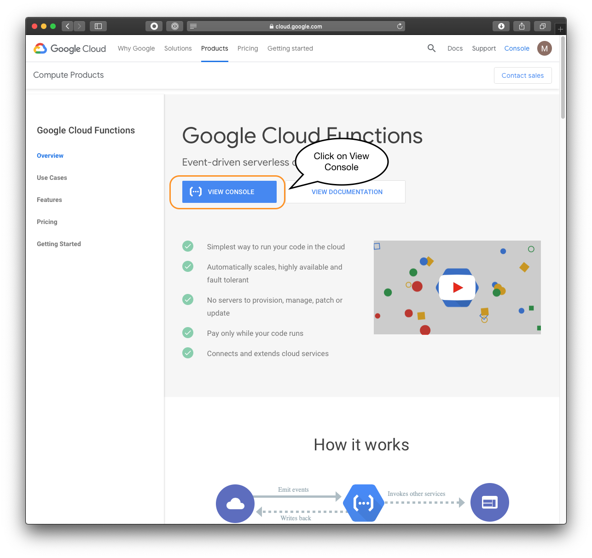
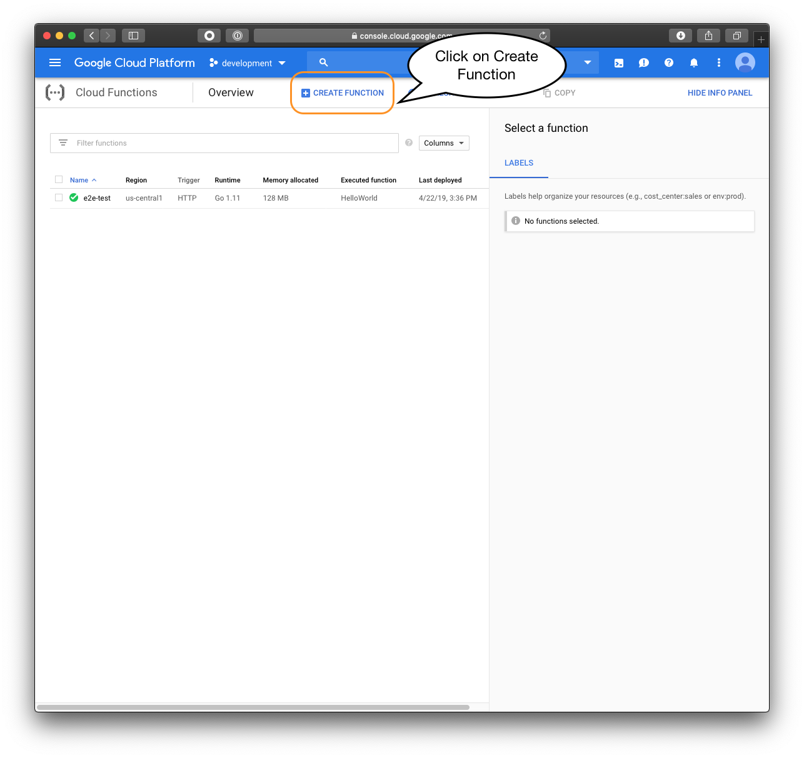
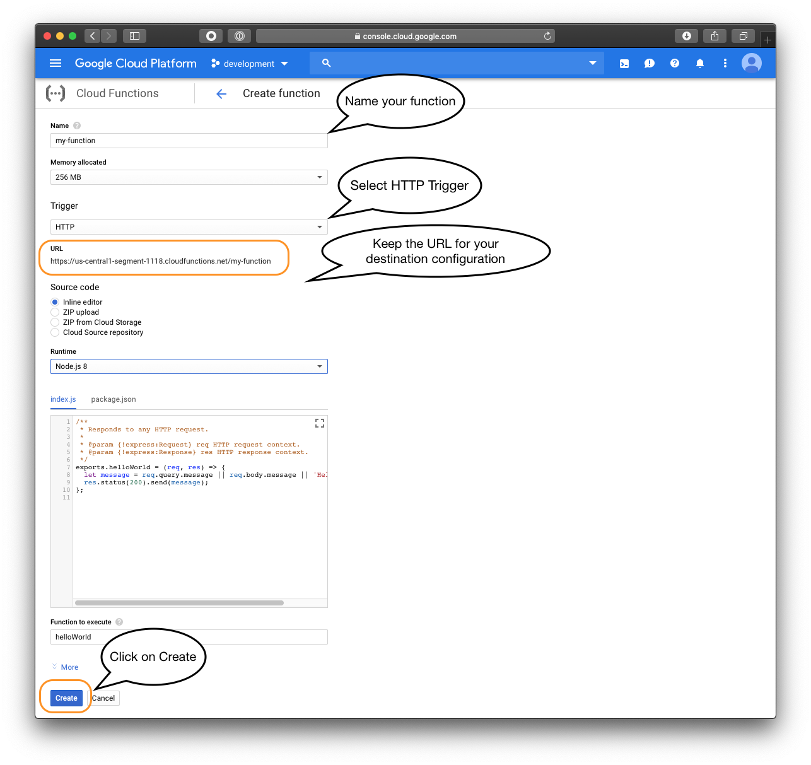

Segment makes it easy to send your data to Google Cloud Function (and lots of other destinations). Once you collect your data using Segment's [open source libraries](/docs/connections/sources/catalog/), Segment translates and routes your data to Google Cloud Function in a format it can use.

[Google Cloud Function](https://cloud.google.com/function) is a lightweight compute solution for developers to create single-purpose, stand-alone functions that respond to Cloud events without the need to manage a server or runtime environment.



# Getting Started



## Build a Google Cloud Function to Process Segment Events

In order to process events from Segment, you will need to provide a Google Cloud Function that can handle your event flow:

- Go to https://cloud.google.com/functions.
- Click on `VIEW CONSOLE`.

- Select a project.
- Click on `CREATE FUNCTION`.

- In the `Name` field, give a name to your function.
- In the `Memory allocated` field, define how much memory your function can use.
- In the `Trigger` field, select `HTTP`. Then keep the given `URL` in order **to configure your segment destination**.
- In the `Source code` field, select how you will provide your function code.
- In the `Runtime` field, select what language is used in your code.
- In the `Function to execute` field, type the name of your function as it is defined in your code.
- Click on `Create` to create the Google Cloud Function.

## Configure Google Cloud Function Destination

Once the Google Cloud Function is created, a destination that will call the function must be configured:

- In our `Destinations` section, click on `Add Destination`. You will be redirected to our `Catalog`.
- Search and client on `Google Cloud Function` destination.
- Click on `Configure Google Cloud Function`.
- Fill the settings.

**Settings:**

| **HTTP Trigger**       | The URL given under the `Trigger` section when you created the Google Cloud Function.                                                                                                                                                                                                                                        |
| ---------------------- | ---------------------------------------------------------------------------------------------------------------------------------------------------------------------------------------------------------------------------------------------------------------------------------------------------------------------------- |
| **API Key** (optional) | A string to identify that a request is coming from Segment.   The API key is injected in the `Authorization` header as a basic authorization header without password. See https://en.wikipedia.org/wiki/Basic_access_authentication.  Deciding whether to check the API key depends on the function implementer. |
