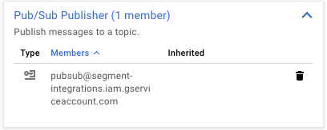
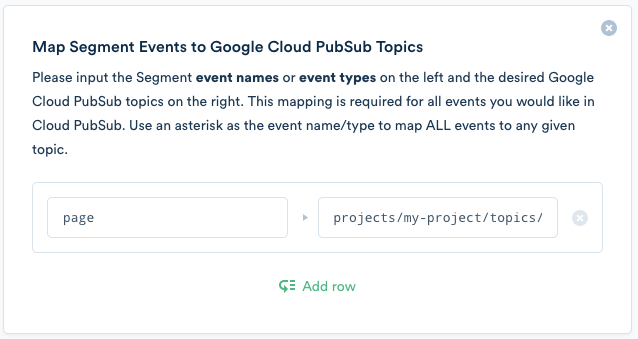

When you enable Google Cloud Pub/Sub in the Segment app, Segment starts sending the events you specify to Pub/Sub topics of your choice. The Segment Google Cloud Pub/Sub destination supports all of the Segment methods, and sends data from [any of the Segment libraries](/docs/connections/sources/catalog/).

## Authentication

In order for Segment to publish events to a Pub/Sub topic on your behalf, you must grant Segment's [Google Cloud Service Account](https://cloud.google.com/iam/docs/understanding-service-accounts) publish access to your chosen topic. Follow these steps to enable this:

1. In your Google Cloud Console, [navigate to your Pub/Sub topic list](https://console.cloud.google.com/cloudpubsub/topicList).
2. Select one or more topics using the checkboxes to the left of each topic name. **Permissions** options appear at the right of the page once you make a selection.
3. In the **Add Members** input field, copy/paste Segment's Service Account email: `pubsub@segment-integrations.iam.gserviceaccount.com`.
4. Click the **Select a Role** drop-down menu and choose **Pub/Sub Publisher**.
5. Click **Add**.

You should now see the Segment Service Account email as a Pub/Sub Publisher like this:

## Event Mapping

To use the Google Cloud Pub/Sub destination you must first decide which Segment events to route, and which of your Pub/Sub topics you want to route them to. Define this mapping in your [destination settings](#settings).

Segment `track` events can map based on their **event name**. For example, if you have an event called `User Registered`, and you wanted these events to be published to a topic called `projects/my-project/topics/user-registered`, you would create a row in your destination settings that looks like this:

> warning ""
> **Make sure you use the full topic path!** Paths are formatted as `projects/${PROJECT_NAME}/topics/${TOPIC_NAME}`

You can map any Segment **event type** (`page`, `track`, `identify`, `screen`, etc.). This allows you to publish all occurrences of a Segment event type to a specific Pub/Sub topic. To do this, create a row with the event type (track, identify, page, etc.) and its corrensponding topic as in the example below.

Events are **case insensitive** so `Page` is equivalent to `page`.

To route _all_ events to a topic, use an `*` as the event name.

## Data Model

The structure of a Pub/Sub message uses [the PubsubMessage structure](https://cloud.google.com/pubsub/docs/reference/rest/v1/PubsubMessage).

The Segment destination publishes the entire Segment event payload as a Base64 encoded string, and sets it as the value of the `data` parameter in the Pub/Sub message payload. Segment sets the `publishTime` to be the `timestamp` of the Segment event.

Segment does not currently use the optional `attributes` parameter. If you use this functionality, [contact us](https://segment.com/help/contact).
