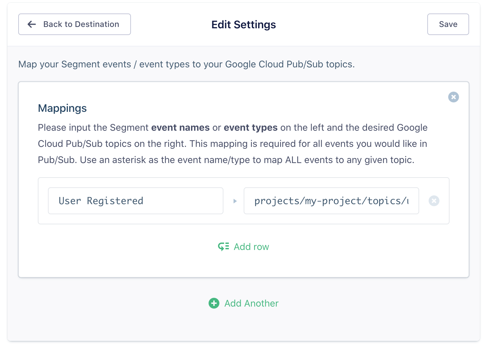
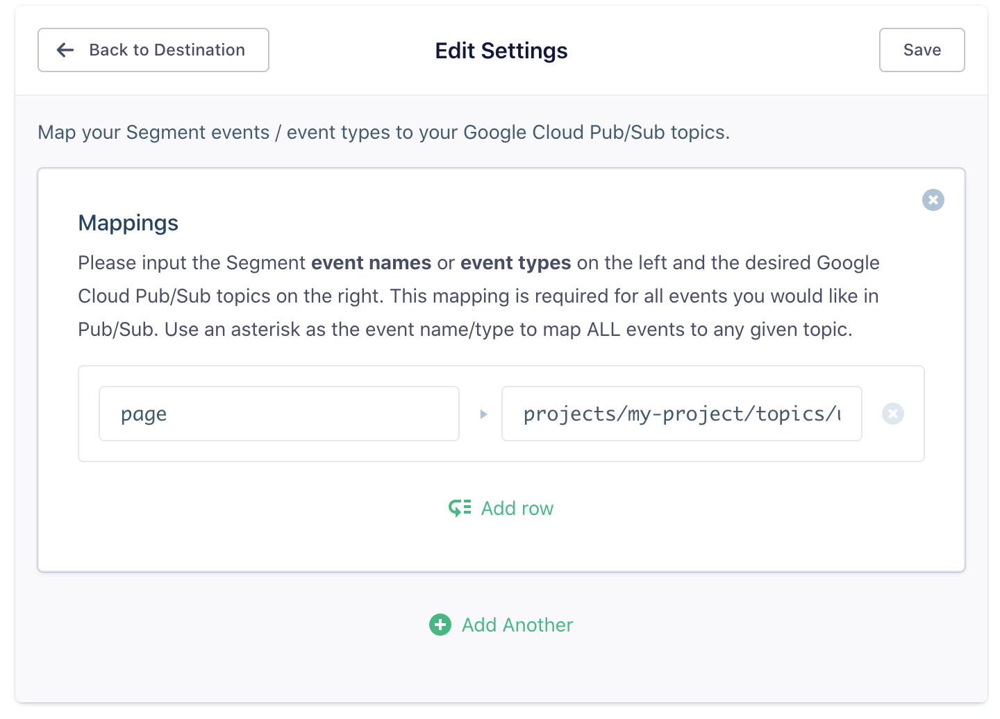

## Getting Started

When you toggle on Google Cloud Pub/Sub in Segment, we'll start sending your specified Segment events to Pub/Sub topics of your choice. Our Google Cloud Pub/Sub destination supports all of the Segment methods, and will send data from any one of our libraries.

## Authentication

In order for us to publish events to a Pub/Sub topic on your behalf, you must grant our [Google Cloud Service Account](https://cloud.google.com/iam/docs/understanding-service-accounts) publish access to your chosen topic. Follow these steps to enable this:

1. In your Google Cloud Console, navigate to your Pub/Sub topic list. You should be able to access this list [here](https://console.cloud.google.com/cloudpubsub/topicList).
2. Once there, either select an individial topic or multiple using the checkboxes to the left of each topic name. Once you have made a selection, you should see some **Permissions** options on the right of the page.
3. In the **Add Members** input field, copy/paster Segment's Service Account email: `pubsub@segment-integrations.iam.gserviceaccount.com`.
4. Click the **Select a Role** dropdown and choose **Pub/Sub Publisher**.
5. Click **Add**.

You should now see our Service Account email as a Pub/Sub Publisher like this:

## Event Mapping

To begin using the Google Cloud Pub/Sub destination you must first decide on which Segment events you would like to route to which of your Pub/Sub topics. This mapping then needs to be defined in your [destination settings](#settings).

Segment `track` events can map based on their **event name**. For example, if you have an event called `User Registered`, and you wanted these events to be published to a topic called `projects/my-project/topics/user-registered`, you would create a row in your destination settings that looks like this:

**Make sure you use the full topic path!** They are formatted like this `projects/${PROJECT_NAME}/topics/${TOPIC_NAME}`

Any Segment **event type** (ie. `page`, `track`, `identify`, `screen`, etc.) can also be mapped. This allows you to publish all occurrences of a given Segment event type to a given Pub/Sub topic. To do this, you simply to create a row with the event type (track, identify, page, etc.) and it's corrensponding topic:

Events can be defined **insensitive to case** so `Page` will be equivalent to `page`.

If you would like to route all events to a topic, use an * as the event name.

## Data Model

The structure of a Pub/Sub message follows this structure: [PubsubMessage](https://cloud.google.com/pubsub/docs/reference/rest/v1/PubsubMessage)

Our integration will publish the entire Segment event payload as a Base64 encoded string and set it as the value of the `data` parameter in the Pub/Sub message payload. We will set the `publishTime` to be the `timestamp` of the Segment event.

We do not currently integrate with the optional `attributes` parameter. If you use this functionality, [contact us](https://segment.com/help/contact).
