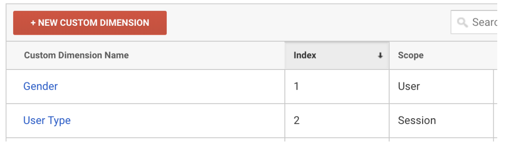

> note ""
> The Gtag Destination is in a closed Early Access Preview. To join the preview, contact [Segment Support](https://segment.com/help/contact/) or your CSM. The use is governed by [(1) Segment First Access](https://segment.com/legal/first-access-beta-preview/){:target="_blank"} and Beta Terms and Conditions and [(2) Segment Acceptable Use Policy](https://segment.com/legal/acceptable-use-policy/){:target='_blank'}.


## Getting started

The Google Site Tag (Gtag) Device Mode destination allows you to unify tracking across the Google Suite using the gtag.js library. This early Access Preview Gtag Destination supports sending data to Google Analytics. To enable, add your **Google Measurement ID** into the destination settings. You can either choose to use a Web Measurement Id or a Web + App Measurement Id.


## Page calls

When you make a [Page call](/docs/connections/spec/page), Segment sends a pageview to Google Analytics. Pageviews send from the browser.

The resulting `page` event name in Google Analytics corresponds to the `fullName` of your page event. The `fullName` is a combination of the `category` and `name` parameters. For example, `analytics.page('Home');` produces a `Home` Page event in GA's dashboard, but `analytics.page('Retail Page', 'Home');` produces an event called `Retail Page Home`.

### Virtual pageviews

Virtual pageviews are when you send a pageview to Google Analytics when the page URL didn't actually change. You can do this through Segment by making a [Page call](/docs/connections/spec/page) with optional properties, as in the example below.

```js
analytics.page({
  title: 'Signup Modal',
  url: 'https://segment.com/#signup',
  path: '/#signup',
  referrer: 'https://segment.com/'
});
```

### URL query strings

By default Segment sends the domain and path to Google Analytics. For example, if someone views the page at `http://domain.com/page/?xyz=123&r=5`, Segment sends `http://domain.com/page/` URL to Google Analytics.

In some cases, like using Google Analytics to track search queries, you might want to pass the whole URL including a query string to Google Analytics. To enable this, go to the Gtag destination settings, and check the **Include the Query String** option in the Advanced Options.

## UTM parameters

Segment recommends Analytics.js, the device-mode JavaScript library, for collecting UTM parameter data because Analytics.js collects this data automatically.

Pass UTM parameters in the `context` object in `context.campaign`. For Google Analytics, send  `campaign.name`, `campaign.source` and `campaign.medium` all together to ensure the appear in reports. The other two parameters (`campaign.term` and `campaign.content`) are both optional, but is forwarded to Google Analytics if you send them to Segment.


## Identify

Google's terms of service forbid passing Personally Identifiable Information (PII) to your Google Analytics reporting interface. For that reason Segment does not pass data from an [Identify](/docs/connections/spec/identify) call to Google unless you specifically request it. You can read about Google's best practices for avoiding this [here](https://support.google.com/analytics/answer/6366371?hl=en).

### User ID
Google Analytics Universal tracking method allows you to set a user ID for your identified visitors. [Read more here](https://support.google.com/analytics/answer/3123663).

To use this feature you must enable User-ID in your Google Analytics property and create a User-ID view, [read more here](https://support.google.com/analytics/answer/3123666).

To pass the `id` from your [Identify calls](/docs/connections/spec/identify) to the Gtag destination, go to **Other Settings** and set **Send User-ID to GA** to "on" to enable this setting.

### Send user ID
The example below represents Segment sending a User-ID value in an identify call:

```js
analytics.identify('12345', {
  email: 'example@example.com',
  name: 'Jake Peterson'
});
```

In this example the `User-ID` is `12345` for Google Analytics, but Segment won't share the `email` or `name` traits with Google.

> warning ""
> If you pass an **email**, **phone number**, **full name** or other PII as the `id` in [Identify](/docs/connections/spec/identify) do not use this feature. That is against the Google Analytics terms of service and Google may suspend your service.

### Custom dimensions
Google Analytics has several scopes for each custom dimension:

- hit (synonymous with events)
- session
- user
- product (requires enabling enhanced ecommerce).

Segment's device-mode Analytics.js library supports them all.

### Configuring custom dimensions

To configure a custom dimension:

1. Configure the Custom Dimensions in your Google Analytics admin page. For more information about creating custom dimensions in Google Analytics, see the Google support article [here](https://support.google.com/analytics/answer/2709829?hl=en).
2. After you've enabled Google Analytics in Segment, you can map traits and properties to your custom dimensions.
3. From your Segment Workspace, open the destinations catalog and select the Gtag destination, then Settings. Locate Custom Dimensions and declare the mapping.

    For example, to map a **Gender** property to dimension `1` and **User Type** to dimension `2`, make the following mappings in both Segment and Google Analytics:

    In Segment:

    

    In Google:

    


> note ""
> **Note:** You can map traits and properties to one Custom Dimension in Google Analytics.

After you map your dimensions, Segment checks the user traits and properties in [Identify](/docs/connections/spec/identify), [Track](/docs/connections/spec/track) and [Page](/docs/connections/spec/page) calls to see if you defined them as a dimension. If you have defined them in your mapping, Segment sends that dimension to Google Analytics.

> note ""
> **Note:** Segment sends traits in [Identify](/docs/connections/spec/identify) calls that map to Custom Dimensions in Google Analytics when the next [Track](/docs/connections/spec/track) or [Page call](/docs/connections/spec/page) call triggers from the browser.

Continuing the example above, you can set the **Gender** trait with the value of **Male**, which maps to `dimension 1`. Segment passes this value to Google Analytics with **Viewed History** [Track](/docs/connections/spec/track) calls.

```js
analytics.identify({
  Gender: 'Male'
});
analytics.track('Viewed History');
```

## Track

Segment records a Google Analytics event whenever you make a [Track](/docs/connections/spec/track) call. You can see your events inside Google Analytics at **Behavior** -> **Events** -> **Overview**. Keep reading for more details about the Google Analytics event category, action, label, value and how to populate them.

Segment sends events from the browser. For example, a [Track](/docs/connections/spec/track) call that captures a `Logged In` event looks like this:

```js
analytics.track('Logged In');
```

Segment sends these event attributes to Google Analytics:

| **Event Category** | All       |
| **Event Action**   | Logged In |

In this example, Segment sends all Google Analytics event parameters:

```json
{
  "userId": "12345",
  "action": "track",
  "event": "Logged In",
  "properties": {
    "category": "Account",
    "label": "Premium",
    "value": 50
  }
}
```

Segment sends these event attributes to Google Analytics:

| **Event Category** | Account   |
| **Event Action**   | Logged In |
| **Event Label**    | Premium   |
| **Event Value**    | 50        |


### Non-interaction events

To create an event with the `nonInteraction` flag pass an event property labeled `nonInteraction` with the value of 1. Alternatively, you can set events as non-interactive by default in the destination settings.

For example:

```json
{
  "action": "track",
  "event": "Viewed Legal Info",
  "properties": {
    "nonInteraction": 1
  }
}
```

## Ecommerce

Segment supports Google Analytics basic ecommerce tracking across all libraries. All you have to do is adhere to the [Ecommerce tracking API](/docs/connections/spec/ecommerce/v2/) and Segment sends the appropriate data to Google Analytics.

### Required steps

Segment recommends that you include all [Ecommerce](/docs/connections/spec/ecommerce/v2/) events. `Order Completed` is the required event in this call. For each order completed you must include an `orderId`, and for each product inside that order, you must include an `id` and `name` for each product. **All other properties are optional**.

The most important thing to remember in Google's Universal Analytics is to enable **Ecommerce** tracking on the view you want to use to track transactions.

Without this step transactions will not show up in your reports.


## Enhanced Ecommerce

Segment supports Google Analytics Enhanced Ecommerce tracking in the Gtag destination. Enhanced Ecommerce allows you to derive insights by combining impression data, product data, promotion data, and action data. Product-scoped custom dimensions require Enhanced Ecommerce tracking.

To get started, enable Enhanced Ecommerce and adhere to the standard [Ecommerce tracking API](/docs/connections/spec/ecommerce/v2/). Segment sends necessary data to Google Analytics with the Google Analytics enhanced ecommerce API

To see Enhanced Ecommerce data in your reports, you must be using Google Analytics Universal and enable Enhanced Ecommerce in your Google Analytics view.

### Required steps (enhanced)

Like standard ecommerce, `Order Completed` is the required event. This call must also include an `orderId` and an array of products, each containing an `id` or `name`.

For all events that include product details you must pass either `name` or `product_id`. For `product_id` Segment defaults to `properties.product_id` and fallback to `properties.sku`.

**All other properties are optional**. The Refunded Order event also requires an `orderId`.

### Measuring checkout steps

To take full advantage of all the features of Enhanced Ecommerce, you'll want to take advantage of some specific events. The biggest differentiator between ecommerce and Enhanced Ecommerce is support for checkout steps. To take advantage of tracking your checkout funnel and measuring metrics like cart abandonment, you'll first need to configure your checkout funnel in the Google Analytics admin interface, giving readable labels to the numeric checkout steps:


Then you'll instrument your checkout flow with `Viewed Checkout Step` and `Completed Checkout Step` events for each step of the funnel you configured in the Google Analytics admin interface, passing the step number and step-specific options through as a property of those events:

```js
    //upon arrival at first checkout step ('Review Cart' per the screenshot example above)
    analytics.track('Viewed Checkout Step', {
      step: 1
    });

    //upon completion of first checkout step ('Review Cart')
    analytics.track('Completed Checkout Step', {
      step: 1
    });

    //upon arrival at second checkout step ('Collect Payment Info' per the screenshot example above)
    analytics.track('Viewed Checkout Step', {
      step: 2
    });

    //upon completion of this checkout step ('Collect Payment Info')
    analytics.track('Completed Checkout Step', {
      step: 2,
    //if this is the shipping step
      shippingMethod: 'FedEx',
    //if this is the payment step
      paymentMethod: 'Visa'
    });

    //upon arrival at third checkout step ('Confirm Purchase Details' per the screenshot example above)
    analytics.track('Viewed Checkout Step', {
      step: 3
    });

    //upon completion of third checkout step ('Confirm Purchase Details')
    analytics.track('Completed Checkout Step', {
      step: 3,
    //you will need to provide either an empty shippingMethod or paymentMethod for the event to send.
      shippingMethod: '' // or paymentMethod: ''
    });

    //upon arrival at fourth checkout step ('Receipt' per the screenshot example above)
    analytics.track('Viewed Checkout Step', {
      step: 4
    });

    //upon completion of fourth checkout step ('Receipt')
    analytics.track('Completed Checkout Step', {
      step: 4,
    //you will need to provide either an empty shippingMethod or paymentMethod for the event to send.
      shippingMethod: '' // or paymentMethod: ''
    });
```

> note ""
> ***Note**: `shippingMethod` and `paymentMethod` are semantic properties so if you want to send that information, please do so in this exact spelling!

You can have any number of steps in the checkout funnel as you'd like. The 4 steps above serve as an example. You'll still need to track the `Order Completed` event per the standard [Ecommerce tracking API](/docs/connections/spec/ecommerce/v2/) after you've tracked the checkout steps.

For client-side integrations, to use the ability to track Checkout Steps and Options, Segment uses Google Analytics' ProductAction class. You can read Google's developer docs for information on specific methods:

- [Analytics.js - Enhanced Ecommerce](https://developers.google.com/analytics/devguides/collection/gtagjs/enhanced-ecommerce)
- [Analytics.js - Ecommerce](https://developers.google.com/analytics/devguides/collection/gtagjs/ecommerce)

### Measuring promotions

Enhanced Ecommerce allows you to go beyond measuring product performance to measure the internal and external marketing efforts that support those products. To take advantage of Enhanced Ecommerce's promotion reports, you can collect data about promotion impressions and promotion clicks with Analytics.js. For example:

```js
analytics.track('Viewed Promotion', {
  id: <id>,
  name: <name>,
  creative: <creative>, // optional
  position: <position> // optional
});
analytics.track('Clicked Promotion', {
  id: <id>,
  name: <name>,
  creative: <creative>, // optional
  position: <position> // optional
});
```

### Coupons

If you want to send coupon data to your `Order Completed` event when using Enhanced Ecommerce, you can add the `coupon` property on the order level or the product level or both. In the below example, note that the Gtag destination accepts `total` *or* `revenue`, but not both. Segment recommends using `revenue` because several other destinations use `revenue`. For better flexibility and total control over tracking, you can decide how to calculate the way in which coupons and discounts apply. For example:

```js
analytics.track({
  userId: '019mr8mf4r',
  event: 'Order Completed',
  properties: {
    orderId: '50314b8e9bcf000000000000',
    total: 27.5,
    shipping: 3,
    tax: 2,
    discount: 2.5,
    coupon: 'hasbros',
    currency: 'USD',
    repeat: true,
    products: [
      {
        id: '507f1f77bcf86cd799439011',
        sku: '45790-32',
        name: 'Monopoly: 3rd Edition',
        price: 19,
        quantity: 1,
        category: 'Games',
        coupon: '15%OFF'
      },
      {
        id: '505bd76785ebb509fc183733',
        sku: '46493-32',
        name: 'Uno Card Game',
        price: 3,
        quantity: 2,
        category: 'Games',
        coupon: '20%OFF'
      }
    ]
  }
});
```

### Measuring product impressions

Enhanced Ecommerce also allows you to collect impression information from users who have viewed or filtered through lists that contain products. This allows you to collect information about the products that users viewed in a list, which filters/sorts have they apply to a list of search results, and the positions that each product had within that list.

Product impressions map to the **Product List Viewed** and **Product List Filtered** Analytics.js events. You can find more information about the parameters and requirements in the [Ecommerce tracking API](/docs/connections/spec/ecommerce/v2/).

Analytics.js allows you to collect this data and send it to a destination. For example:

```js
analytics.track('Product List Viewed', {
  category: 'cat 1',
  list_id: '1234',
  products: [
    {
      product_id: '507f1f77bcf86cd799439011',
      sku: '45790-32',
      name: 'Monopoly: 3rd Edition',
      price: 19,
      category: 'Games'
    }
  ]
});
```

### Refunds

For refunds to work, you need to have Enhanced Ecommerce enabled.

For full refunds, fire this event whenever an order/transaction gets refunded:

```js
analytics.track('Order Refunded', {
    order_id: '50314b8e9bcf000000000000',
  });
```

For partial refunds, you must include the **productId** and **quantity** for the items you want to refund:

```js
analytics.track('Order Refunded', {
  order_id: '50314b8e9bcf000000000000',
  products: [
    {
    product_id: '123abc',
    quantity: 200
    }
  ]
});
```


## Features

Segment supports the following Google Analytics features:

- [Client-Side library methods](#client-side-library-methods)
- [Anonymize IP Address](#anonymize-ip-address)
- [Remarketing](#remarketing)
- [Multiple Trackers](#multiple-trackers)
- [Cookie Domain Name](#cookie-domain-name)
- [Cross-Domain Tracking](#cross-domain-tracking)
- [Tracking Visitors with User-ID](#tracking-visitors-with-user-id)
- [Tracking Anonymous Visitors](#tracking-anonymous-visitors)
- [Site Search](#site-search)
- [Webmaster Tools](#webmaster-tools)
- [Cannonical Urls](#cannonical-urls)
- [Optimize](#optimize)

### Client-Side library methods
Because Segment's client-side snippet wraps the `gtag.js` JavaScript SDK, all gtag.js library methods that don't map to Segment methods are available client side. Although invoking a native library method won't send data to Segment or other Segment-enabled destinations, the method *will* send data to Google.

To access gtag.js methods while using Segment, write these methods inside an `analytics.ready()` function, for example:

```js
analytics.ready(function(){
  window.gtag('config', 'GA_MEASUREMENT_ID');
})
```

### Anonymize IP address

To anonymize the IP addresses of all hits sent to Google, enable the **Anonymize IP** setting in the destination settings.

### Remarketing
Segment uses Google's remarketing (the remarketing tag formerly known as Doubleclick) to tag visitors for remarketing campaigns and to identify demographic and interest data on visitors that displays in Demographic & Interest reports inside of Google Analytics.

Enable the **Remarketing, Display Ads, and Demographic Settings** in the Google Analytics destination to access these features.

Since remarketing loads through Segment, Google Analytics cannot validate that the code is present on the page. Click **Skip validation** and your data will start showing up within a few hours.

### Multiple trackers

Although Segment does not support loading multiple trackers of the same type (for example, multiple web measurement IDs) through the destinations settings page (you will probably run into Google Analytics's [rate limits](https://developers.google.com/analytics/devguides/collection/ios/v3/limits-quotas?hl=en)), you can load a 2nd tracker on the page manually.

Here's how you'd initialize configure the second tracker:

```js
analytics.ready(function(){
  window.gtag('config', 'GA_MEASUREMENT_ID_2');
})
```

> note ""
> **Important**: Keep in mind you will need to do the data translation/properties mapping inside this `.on()` function before you send the event to Google Analytics. See the [destination code](https://github.com/segment-integrations/analytics.js-integration-google-analytics/blob/master/lib/index.js#L161-L207) for more information.

To do this server side, you can create a separate [source](/docs/connections/sources/) in Segment, and within this source enter your Google Analytics credentials for the second tracker.

This source can be your server-side source. From there, you send data to multiple projects server-side. As you can see in this [Node example](/docs/connections/sources/catalog/libraries/server/node/#multiple-clients) you can initialize multiple instances of the library.

### Cookie domain name

The **Cookie Domain Name** setting allows you to specify the domain that the `_ga` cookie is set on. By default the cookie is placed on the top level domain: `domain.com`.

Segment defaults the **Cookie Domain Name** to `auto`, which sets the cookie at the root domain level and allows you to track across multiple sub-domains, but does not work on `localhost`. You can find this setting in the Gtag destination settings.

If you need to test on `localhost`, but don't need to track between multiple sub-domains, then you can set the domain to `none`.

If you want the cookie to persist on a single sub-domain, enter that sub-domain in the **Cookie Domain Name** field, like this: `swingline.initech.com`. In this case visitors to `conclusions.initech.com` or `initech.com` will not be tracked.

For more information see Google's [cookie and user identification](https://developers.google.com/analytics/devguides/collection/gtagjs/cookies-user-id) guide.

### Cross-domain tracking

Segment supports Gtag tracking across multiple top level domains, but it requires a bit of work from you. See below for the two methods you can use to configure cross-domain tracking.

#### Tracking visitors with user-ID

If you're identifying your users with a user ID, cross-domain tracking becomes simple. All you have to do is make sure you identify your users on each domain and Google will merge those users together as one.

The caveat with this approach is that it works for identified users, anonymous visitor sessions do not persist across domains.

### #Tracking anonymous visitors

When a visitor comes to your website, `domain1.com`, Gtag sets a first-party cookie that represents that user. That cookie looks like `182119591.1441315536`, and ties to `domain1.com` (making it a first party cookie).

When your visitor clicks a link to go another domain, for example `domain2.com`, you'll need to tell the new site about the `domain1.com` cookie. To do this, rewrite your `domain2.com` links to include this `domain1.com` cookie. For example:

    `http://company2.com?_ga=1.182119591.1441315536.1362115890410`

Gtag provides an auto-linking plugin to make this easier. To access the `gtag` methods while using Segment they must be inside an `analytics.ready()` function, which should appear after your basic Segment snippet, like this:

```js
analytics.ready(function () {
  window.gtag('config', 'GA_MEASUREMENT_ID', {
    'linker': {
      'domains': ['domain2.com']
    }
  });
});
```
For more advanced cross-domain implementations Segment recommends you follow the Google's guide to [Measure activity across domains](https://developers.google.com/analytics/devguides/collection/gtagjs/cross-domain).

### Site search

To populate the Site Search report in Google Analytics, complete the following steps:

1. When someone searches on your site, you must add the search term they used to the URL query, like this: `domain.com?s=coconuts`. The key ("s" in this case) can be any letter or string of letters.
2. In your Segment source destinations catalog open the Gtag settings, scroll down to the Page Call settings and make sure to check the box for **Include Query String**.
3. Inside Google Analytics, go to the **Admin** section, then click **View Settings** for the view you want to add Site Search to. Turn on **Site search Tracking** and enter the string from #1 into the Query parameter field. In this example it'd look like this:


### Webmaster tools

When you use Segment to load Gtag, the Segment script loads the gtag.js script. If you use [Google Analytics as the verification option](https://support.google.com/webmasters/answer/9008080?hl=en) in Google Webmaster Tools, you'll need to switch to the [Meta tags verification option](https://support.google.com/webmasters/answer/79812?hl=en) instead. This will require you to find the `<meta name=google-site-verification" ..>` tag in Webmaster Tools and place it in your master HTML template.

### Cannonical urls

Segment handles tracking the canonical URL to Google Analytics for you automatically. As long as there is a `<meta rel="canonical">` tag on your page, Segment ensures Google Analytics gets the right canonical URL from it.

### Optimize

If you'd like to integrate with Google Analytics' [Optimize plugin](https://support.google.com/360suite/optimize/answer/6262084#optimize-ga-plugin), insert your **Optimize Container ID** in the destination settings and Segment will require the plugin when Google Analytics initializes.

You may want to deploy Google's [anti-flickering snippet](https://support.google.com/optimize/answer/7100284) to prevent the page from flashing / flickering when the A/B test loads, as recommended by Google. You must add this code manually, since it needs to load synchronously.

> note ""
> Include the Optimize container ID in this snippet.


## Troubleshooting

### Metrics vs. Dimensions

They both allow you to track custom data properties in Google Analytics. Metrics are for event properties with a numeric data type and Dimensions are for event properties with a string data type.

### Real-time reports
Google Analytics doesn't process data in real time in most of the Google Analytics reports. The easiest way to see if the data is streaming in is to check the Realtime reports in Google Analytics.

If you see events in your Realtime reports and those events never show up in other reports, that is due to a filter you have applied. You can see your active filters inside Google Analytics by clicking **Admin** then under your View on the right click **Filters**.

### Self referrals

This article does a great job of explaining GA self referrals and how to fix them: https://threeventures.com/how-to-fix-self-referrals-in-google-analytics/

### Time frame

Google Analytics's default reporting time frame is a month ago to yesterday. You'll need to adjust it from a month ago to today's date to see today's already processed events.

### HTTPS
If your site uses `https://`, please go to your Google Analytics property settings page and change your **Site URL** to use the `https://` protocol.

### Bounce rates
Using Segment won't affect your bounce rates in Google Analytics.
If you see your bounce rates drop after installing Segment make sure you don't have multiple copies of Segment's snippet on your page. Also be sure you're not calling `page` more than once when the page loads.

If you call `track` on page load make sure to set `nonInteraction` to `1`. You can also set all events to be non-interactive by default in `Advanced Options`. Read more in the [non-interaction events](#non-interaction-events) section.
