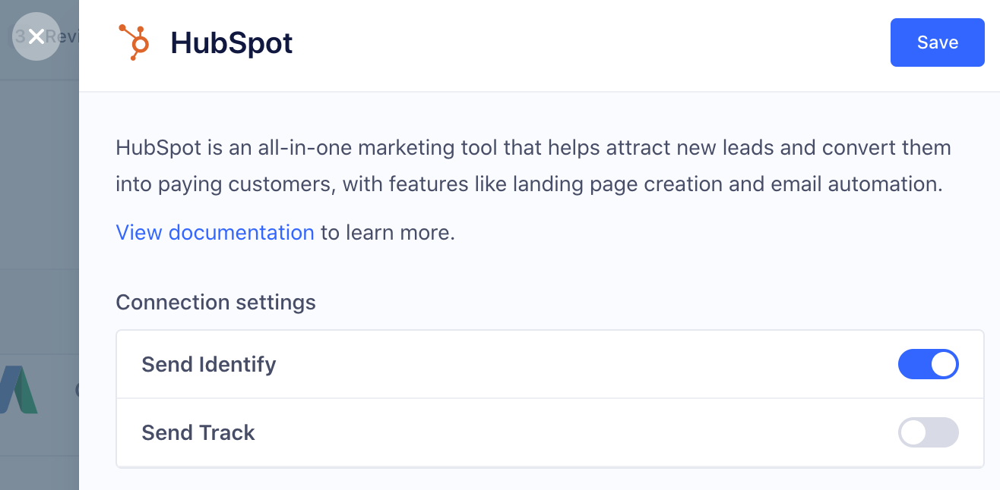
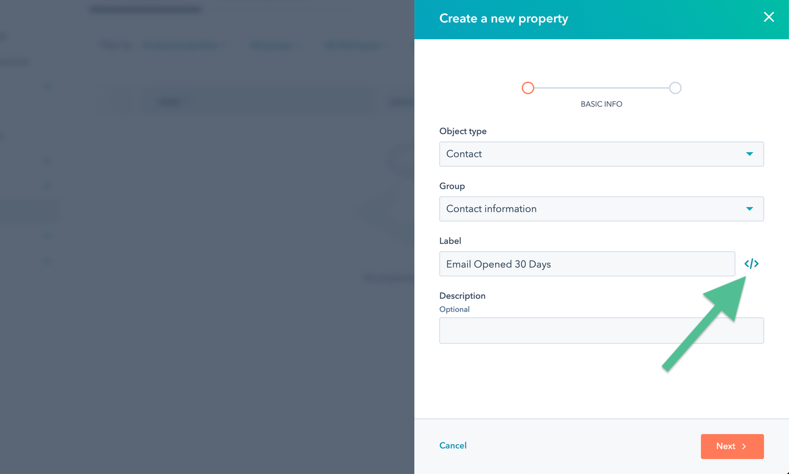
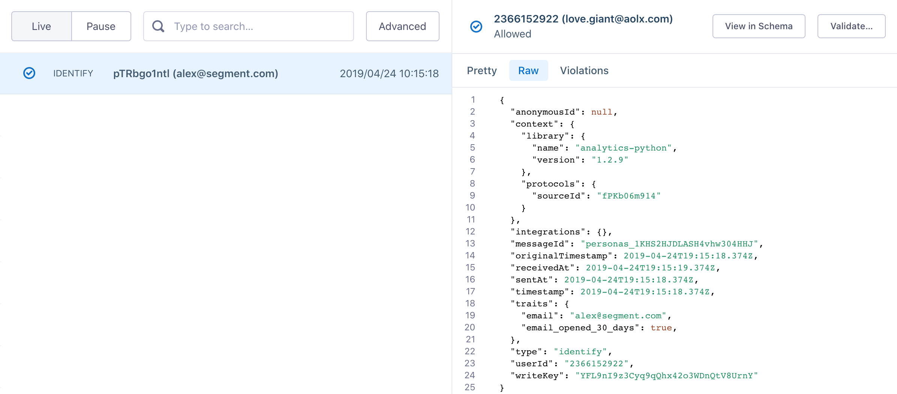

[HubSpot](https://www.hubspot.com/){:target="_blank"} is an inbound marketing and sales platform that helps companies attract visitors, convert leads, and close customers. The `analytics.js` HubSpot Destination is open-source. You can browse the code [on GitHub](https://github.com/segmentio/analytics.js-integrations/tree/master/integrations/hubspot){:target="_blank"}.

> info ""
> As of July 2022, HubSpot no longer allows new connections to authenticate with an API Key. Existing API Keys will continue to work, but to authenticate a new API connection with HubSpot, use a Private App Token. To generate a Private App access token from the HubSpot dashboard, navigate to **Integrations > Private Apps**. Segment requires the following scopes: `business-intelligence`, `crm.objects.contacts.read`, `crm.objects.contacts.write`, `crm.schemas.contacts.read`, `crm.objects.companies.read`, `crm.objects.companies.write`, `crm.schemas.companies.read`. For more information, see HubSpot's article [Private Apps](https://developers.hubspot.com/docs/api/private-apps){:target="_blank"}.

> warning ""
> The HubSpot destination is not compatible with the Segment Event Tester. As result, Segment recommends using other tools to troubleshoot the HubSpot destination.

## Getting Started


1. From the Segment web app, click **Catalog**.
2. Search for "HubSpot" in the Catalog, select it, and choose which of your sources to connect the destination to.
3. Generate a Private App access token in [HubSpot](https://developers.hubspot.com/docs/api/private-apps){:target="_blank"} and enter it in the "Private App Token" field in the Segment web app. Segment requires the following scopes: `business-intelligence`, `crm.objects.contacts.read`, `crm.objects.contacts.write`, `crm.schemas.contacts.read`, `crm.objects.companies.read`, `crm.objects.companies.write`, `crm.schemas.companies.read`. Note: HubSpot no longer allows generation of new API Keys so you must authenticate with a Private App Token.
4. Navigate to the "Settings" page in the HubSpot UI to find your Hub ID and enter it to the "Hub ID" field in the Segment web app.


When you activate the destination from the Segment web app, your changes appear in the Segment CDN in about 45 minutes, and then Analytics.js starts asynchronously loading the HubSpot snippet and recording data.


## Page

If you're not familiar with the Segment Specs, take a look to understand what the [Page method](/docs/connections/spec/page/) does. An example call would look like:

```js
analytics.page()
```

> info ""
> HubSpot supports Page calls on Device-mode connections from Analytics.js sources

Analytics.js requires an initial Page call to send data to HubSpot. The [Segment snippet](/docs/connections/sources/catalog/libraries/website/javascript/quickstart/#step-2-copy-the-segment-snippet) includes this initial call by default.

## Identify

If you're not familiar with the Segment Specs, take a look to understand what the [Identify method](/docs/connections/spec/identify/) does. An example call would look like:

```js
analytics.identify('user1234', {
  email: 'petergibbon@email.com',
  firstname: 'Peter',
  lastname: 'Gibbon'
})
```

> info ""
> HubSpot's device-mode integration has two conditions for Identify to create or update a contact: 1) Identify calls must include a `traits.email` value. 2) A Page or Track call must follow an Identify call. You can read more from [HubSpot's documentation](https://developers.hubspot.com/docs/methods/tracking_code_api/identify_visitor){:target="_blank"}. If you are using HubSpot's cloud-mode integration, an Identify call updates records without the need for a Page or Track call.

HubSpot does not accept any trait keys that contain upper case letters or spaces. Segment converts any custom traits you send to lower case, and replaces spaces with an underscore.

HubSpot removes any traits from the request that aren't contact fields in HubSpot. To find out which fields you can set, navigate to **Settings > Data Management > Objects > Contacts** and select **Manage contact properties** under the **Setup** tab. Example field names are `firstname`, `lastname`, `company`, and `phone`.

If you specify a company name (using `traits.company.name`), it appears as a *property* of the contact (you can find it in HubSpot's UI using **About [contact] > View > View All Properties**), but it does not appear as the user's company under **[contact]'s Company**.

HubSpot tags the following fields as special fields:

- address
- city
- companyName
- email
- firstName
- lastName
- position
- phone
- zip


## Track

If you're not familiar with the Segment Specs, take a look to understand what the [Track method](/docs/connections/spec/track/) does. An example call would look like:
```
analytics.track("Clicked Buy Now button", {
  value: 20.5
})
```

> warning "Important"
> Marketing Hub subscription is required to [manage legacy behavioral events](https://knowledge.hubspot.com/reports/analyze-and-manage-your-legacy-events){:target="_blank"} in HubSpot. You must have a HubSpot Enterprise account for Segment to pass traits from an Identify call to your Track call and send them as custom events to HubSpot.

The event will appear in your HubSpot UI but may take up to 60 minutes to appear in the graph visualization.

### Server

When calling from one of Segment's server-side sources, provide the contact's email as `properties.email` so that HubSpot can tie the event to the appropriate contact. An example call in Python would look like:

```python
analytics.track(
  user_id='YOUR_USER_ID',
  event='Bought Item',
  properties={
    'email' : 'peter@example.com',
  }
)
```

In this case, your HubSpot `eventId` is 'Bought Item'. If you want to use an existing `eventId`, you can use it instead of the event value (for example, `Bought Item`). If you don't want to match an existing `eventId`, you can use any event label and HubSpot will auto-create the event for you.


#### Setting Contact Properties on Track

Segment recommends that you send `traits` with an [Identify](/docs/connections/spec/identify/) call. You can also set HubSpot properties on a track call sent from any server-side source, as allowed by HubSpot's [events API](http://developers.hubspot.com/docs/methods/enterprise_events/http_api){:target="_blank"}. Segment recommends this method if you're running out of HubSpot API calls on the Identify requests.

Include HubSpot contact properties into the `context.traits` object:

```python
analytics.track(
  user_id='YOUR_USER_ID',
  event='Bought Item',
  properties={
    'email': 'peter@example.com',
  },
  context={
    'traits': {
    'firstname': 'Peter',
    'lastname': 'Gibbons'
  }
})
```

## Group

> info ""
> Group calls are not compatible with the Analytics.js library.

If you're not familiar with the Segment Specs, take a look to understand what the [Group method](/docs/connections/spec/group/) does. An example call would look like:

```js
analytics.group({
  groupId: "some_group_id",
  userId: "some_user_id",
  traits: {
    website: "https://www.example.com",
    name: "Example Inc."
  }
});
```

Group calls map to the HubSpot [Companies API](https://developers.hubspot.com/docs/methods/companies/companies-overview){:target="_blank"}. Segment's integration creates and updates company objects with whatever traits are set, and [associates individual contacts to a company](https://developers.hubspot.com/docs/methods/companies/add_contact_to_company){:target="_blank"}.


The three requirements to creating companies and associating contacts are:

1. Group calls take effect when called using server-side libraries or mobile libraries, not the client-side JavaScript library.
2. Your contact must be identified and created within HubSpot (called using `analytics.identify` for this `userId first`).
3. You must include a `website` trait in your group call, and it must be a full, valid, and complete URL. HubSpot uses the domain of the website trait as a unique identifier for companies. To create a new company you must use the full URL and not just the subdomain.

Segment can send the following group traits to HubSpot as special properties:

- address
- city
- state
- zip
- country
- description
- employees
- industry
- phone
- website
- name


## Troubleshooting


### I Don't See My Data In HubSpot

If you don't see your data in HubSpot, verify the HubSpot configuration in your Segment workspace. If you've selected the **Enable HubSpot SDK for EU** option, confirm with HubSpot that your HubSpot account is enabled for EU data residency.

### API Call Limits

HubSpot limits the total amount of hourly and daily requests Segment can make to their API on your behalf. See HubSpot's [API Usage Guidelines](https://developers.hubspot.com/apps/api_guidelines){:target="_blank"} for more information.

HubSpot Plan: Free & Starter
* Maximum Number of API Calls per 10 Seconds, per Key or Token: **100**
* Maximum Number of API Calls per Day, per Key or Token: **250,000**

HubSpot Plan: Professional and Enterprise
* Maximum Number of API Calls per 10 Seconds, per Key or Token: **100**
* Maximum Number of API Calls per Day, per Key or Token: **500,000**

HubSpot Plan: API Add-On (Any Tier)
* Maximum Number of API Calls per 10 Seconds, per Key or Token: **120**
* Maximum Number of API Calls per Day, per Key or Token: **1,000,000**


### Sending Dates as Property Values

HubSpot's API has [specific requirements](http://developers.hubspot.com/docs/faq/how-should-timestamps-be-formatted-for-hubspots-apis){:target="_blank"} regarding you to format dates before they deliver as contact properties with date types.

To ensure proper transformation of these properties, pass them to Segment as [ISO-8601](https://en.wikipedia.org/wiki/ISO_8601){:target="_blank"} formatted strings and **not** as UNIX timestamps. Here's a JavaScript example:

```js
analytics.identify('userid', {
    offerDate: new Date() // not Date.now()!
});
```

### Invalid 'lifecyclestage'

When using any of Segment's server-side sources, a connector infers `traits.lifecycle_stage` as `lifecyclestage`. If you're using a custom contact property for custom lifecycle stage's, you should give the property a distinct name, such as `custom_lifecycle_stage`.

### Loading Forms SDK

Segment gives you the option to load the [HubSpot Forms SDK](https://developers.hubspot.com/docs/methods/forms/advanced_form_options){:target="_blank"} alongside their tracking library. Enable the **Load Forms SDK** setting when you your HubSpot integration.

> info ""
> The Forms SDK expects to load synchronously but analytics.js loads asynchronously. To interact with the API, run code inside an [analytics.ready](/docs/connections/sources/catalog/libraries/website/javascript/#ready) callback. For example:

```js
analytics.ready(function(){
  hbspt.forms.create({
    portalId: '',
    formId: '',
    css: '',
    cssRequired: ''
  });
})
```

## Using HubSpot with Engage

You can send computed traits and audiences that you create in Engage to HubSpot so you can use the data in live chat, automated emails, and other HubSpot features to personalize interactions with your customers.




### Syncing Custom Traits to HubSpot

HubSpot requires that you create and define any custom traits in the HubSpot UI **before** you send any Engage data to HubSpot. If you try to sync a property from Segment that does not exist in HubSpot, the sync fails.


### How it works: User-Level Traits and Audiences

Engage sends **User-Level data** to HubSpot to update properties on a user (or `contacts` in HubSpot) record, using an **Identify** call to add or update a standard  `Property` or when Segment computes a trait, and a **Track** call when the user enters or exits an audience.

- **Computed Traits**: When the trait is first computed, Engage sends an **Identify** call to update the records of all users who are included in the computed trait. Each time the trait is computed after that, Engage sends a **Identify** call to HubSpot to update the values. For example, if a computed trait counts the number of times a user visits your pricing page, and the user visits your pricing page five times, Segment first sends an Identify call with the property `pricing_page_visits: 5`, then sends a Identify call when this number updates. This appears in HubSpot as a `Property` for the contact.

- **Audiences**: Engage uses an Identify call to add the name of the audience to the user's profile as a trait, and includes a boolean value that indicates if the user is a member of the audience. For example, when a user first completes an order in the last 30 days, Engage sends an Identify call with the property `order_completed_last_30days: true`.  When the user no longer satisfies these criteria (for example when it's been longer than 30 days since the last purchase), Engage uses a Identify call to set that value to `false`.  This appears as a `Property` for the contact in HubSpot. If using a **Track** call, events will be sent for `Audience Entered` or `Audience Exited`.
    - When you first create an audience, Engage sends an Identify call for every user in the audience. Later syncs only update users which were added or removed from the audience since the last sync.


### How it works: Account-Level Traits and Audiences

Engage sends **Account-Level data** to HubSpot using **Identify** calls to add account traits to the users' profiles, and **Identify** calls to update the trait when it recomputes, and will send a **Track** call when the group enters or exits an audience. Users are added to an account using a single **Group** call, which appends a `groupID` to each user within the account.

- **Computed Traits**: When you build computed traits with Account-Level data, Engage computes for each account based on traits or aggregated user behavior. You can then export traits for each account, or for each user within an account. Engage adds a new trait (set as the name of the computed trait) to the user profiles for each user in the group, and sets the value of that computed trait.

    For example: Imagine you have a computed trait that counts the number of times that users from a specific company visit your pricing page. If five different users visit your pricing page once each, Engage sends an Identify call with the property `pricing_page_visits: 5` to each user in the group.

- **Audiences**: When you build audiences with Account-Level data, Engage returns a set of accounts, or a set of users that match your criteria. Engage adds the name of the audience to the user's profile as a trait (both for individual users, and users within an account), and sets a boolean value to indicate if the user is in the audience. For example, if users in an account first complete an order in the last 30 days, Engage sends an Identify call with the property `order_completed_last_30days: true`. When the users in this Account no longer satisfy these criteria (for example if it's been more than 30 days since the last order), Engage sets that value to `false`. If using a **Track** call, events will be sent for `Audience Entered` or `Audience Exited`.

    - When you first create the audience, Engage sends an Identify call for *every user in the account in that audience*. Later syncs only send updates for individual accounts and users which were added or removed since the last sync.
    **Note**: For user-level events or traits, you can specify `None of the users`, `Any users`, or `All users` when you build your audience criteria.


### Creating Engage Audiences in HubSpot

1. Create your audience criteria and preview the audience in Segment. Click Select Destinations.

   

2. Next, select HubSpot as a destination for the audience in Segment. Use the default settings, which send an Identify call to mark users as members of an audience or when they have a specific trait. <!-- some clarifying changes coming here in a future update, per Dadson.-->

   

3. Enter a name for the audience, and a description.
   Write down the **Audience key** (you'll need this to configure HubSpot in the next step), but don't click **Create Audience** yet.
   


4. Go to your HubSpot Settings.
5. Create a new `property` in HubSpot for each audience you want HubSpot to receive from Engage.
   This is required because HubSpot's schema is explicitly defined.
   You must do this *before* you send any Engage data from Segment to HubSpot.

   


6. Set the object type.
   - For user-level Audiences, set the **Object Type** to `Contact` and the **Group** to `Contact information`.
   - For account-level Audiences, set the **Object type** to `Company` and the **Group** to `Company information`.

7. Enter the label for the custom property, and make sure it matches the Audience Key you wrote down from the Engage audience builder (see the tip below). Click **Next**.

> success ""
> The audience label's “internal name” in HubSpot *must exactly match* the Segment  `audience key`. You can check this by clicking the `</>` icon to the right of the Label field, and making corrections.


   

8. On the next screen, set the **Field type** for audiences to `Single Checkbox`. (This represents a boolean value that indicates audience membership.)
   (For computed traits, depending on whether the output is a string or number, select `Single-line text` or `Number`.)

   Click **Create** to finish adding the audience contact property.

   


9. Back in the Engage Audience builder, click **Create Audience**. Engage sends any users that meet the audience criteria to HubSpot immediately.


### Verify the audience

You can use the [Profiles Debugger](/docs/unify/debugger) to see the calls sent to HubSpot.



You can check back in HubSpot to see the audience boolean as a contact property. For the audience created in the example above, you could check individual contact profiles and see a contact property called  `Email Opened 30 Days` = `Yes`.


You can also see this in the contact property history for each user record.


## HubSpot Engage Details

- **Engage Destination type**: Event Method (data is delivered to this Destination one-by-one on a realtime basis)
- **Traits and Audiences created by**: Identify calls add and update traits and audiences as traits on the user, Track calls send events for `Audience Entered` and `Audience Exited`.
- **Must create audience_name field before Engage can update those values?**: Yes, you must manually create Contact properties in HubSpot before you send Custom Traits or Audiences.
- **Audience appears as**: A prose-text version of the audience name (for example, `Order Completed 30 Days: Yes`) where `Yes` indicates that the user is in the audience.
- **Destination rate limit**: Yes. HubSpot's rate limit depends on what account tier you have in HubSpot, but is *usually* 100 calls per ten seconds, or 10 per second.
- **Lookback window allowed**: Unlimited
- **Identifiers required** : `UserID` or `email`
- **Identifiers accepted** : `UserID` and `email`
- **Client or Server-Side Connection**: Server-side
