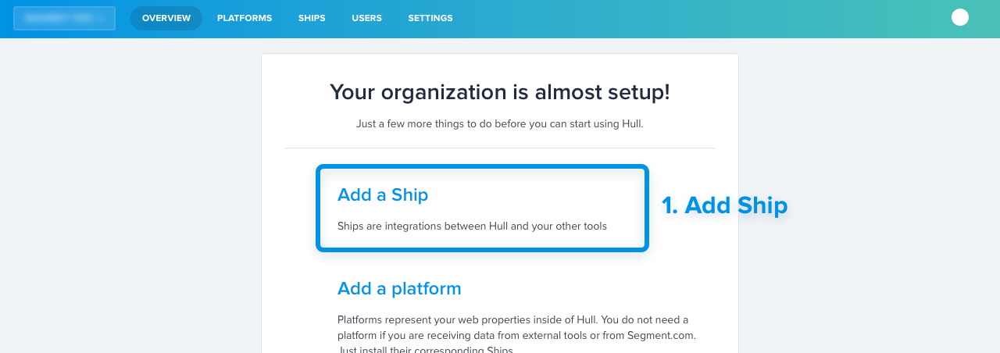
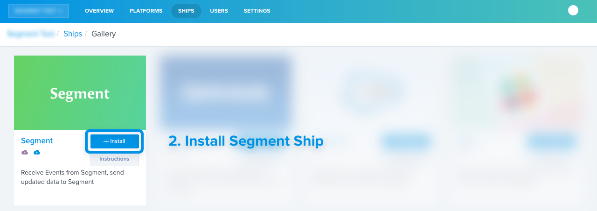
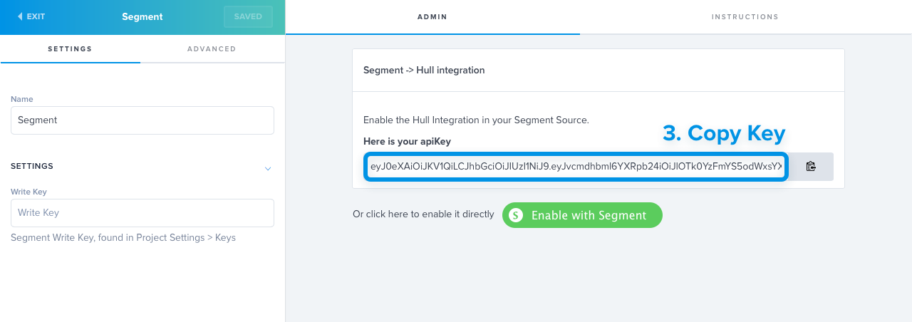
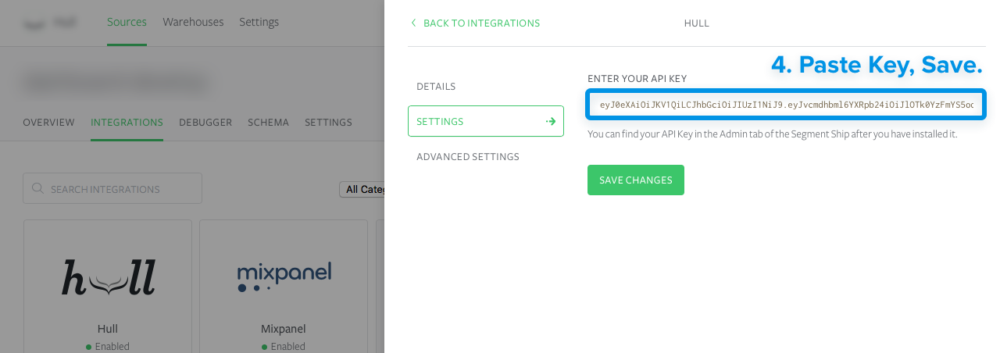
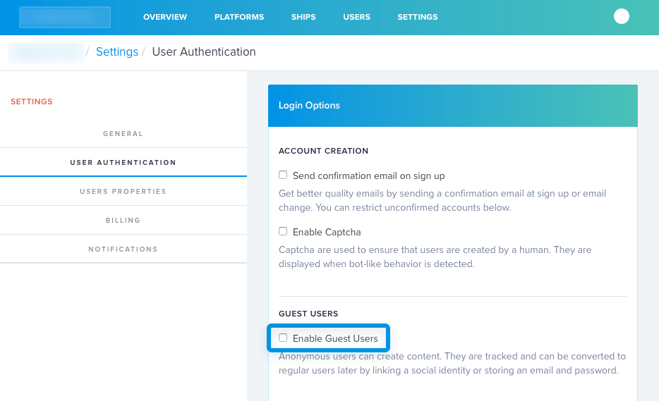

Hull is the one place to collect, transform, enrich, filter, search and segment customer data in all your tools.

It helps you creates a single actionable profile and uniform segments that sync to all your tools and make cross-channel, end-to-end personalization easy.

## Getting Started

Hull receives data from Segment using the **Segment Ship**. Here's how to install it:

Install the Segment Ship on your organization. If you just installed Hull, click on "Add a ship" on the overview page.


Pick the **Segment** Ship from the list.


Enter the Segment ship Settings, Copy the API Key


Paste it into your destinations page. Alternatively, just click the "Enable with Segment" button.


## Tracking Data from anonymous users and Leads

Enable **Guest Users** in your Dashboard's **Settings > User Authentication > Login Options**. This will create users for each `identify` call, even those without a User ID which is useful to track Leads.



This is disabled by default because it can greatly increase the number of users in your database. When enabled, users will be tracked from their very first visit and action, allowing you to build segments based on complete customer journeys.

## Publishing data back to Segment

If you enter your __Segment Write Key__ in the Ship's settings, then Hull will send customer data to Segment. When a user enters or leaves a Hull segment, a new `identify` call with be sent with the following traits :

```js
analytics.identify(userId, {
  "hull_segments": ["all","matching","segment","names"],
  "custom_1": "value_1",
  "custom_2": "value_2",
},{
  "groupId": "user's group Id if he has one"
})
```

In the Ship settings, you can choose which traits are sent to Segment.com. This lets you send any trait that has been computed or collected from enrichment steps to other tools.

You can also filter in the Ship Settings the customer segments will be sent back to Segment.com to those matching one or more of your Hull segments.

## Features

Hull supports the `identify`, `page`, `screen`, `track`, and `group` methods.

Hull stores customer properties and events and makes them available for segmentation in the Dashboard.

From there you can create and save audiences, transform and enrich customer data with *Ships*.

## Identify

Every user identified on Segment with a `userId` will be created as a User on Hull. Segment's `userId` will be mapped to Hull's `external_id` field.

The following traits will be stored as first level fields on the User object

- address
- created_at
- description
- email
- first_name
- image
- last_name
- name
- phone
- picture
- username

All other attributes from the `identify` call will be stored as [custom traits](http://www.hull.io/docs/references/hull_js/#traits) on Hull.

## Track

Every `track` in Segment will create a new Event on Hull with `"source":"segment"`.

## Screen

Every `screen` in Segment will create a new Event on Hull with `"source":"segment"` and `"event":"screen"`.

## Page

Every `page` in Segment will create a new Event on Hull with `"source":"segment"` and `"event":"page"`.

## Group

Group calls in Segment will apply the group's traits as traits on the users that belong to the group.

For instance:

```js
analytics.group("123", { name: "Wonderful", city: "Paris" });
```

will add the following traits on all users that belong to the group :

```json
{
  "group": {
    "id": "123",
    "name": "Wonderful",
    "city": "Paris"
  }
}
```

Internally, we flatten objects and use '/' as a separator. They're really stored as `traits_group/name`. Our sources handle nesting for you when you receive data coming from Hull

__Note: This feature is optional and not enabled by default. You should only enable it if your users can only belong to one group.__
