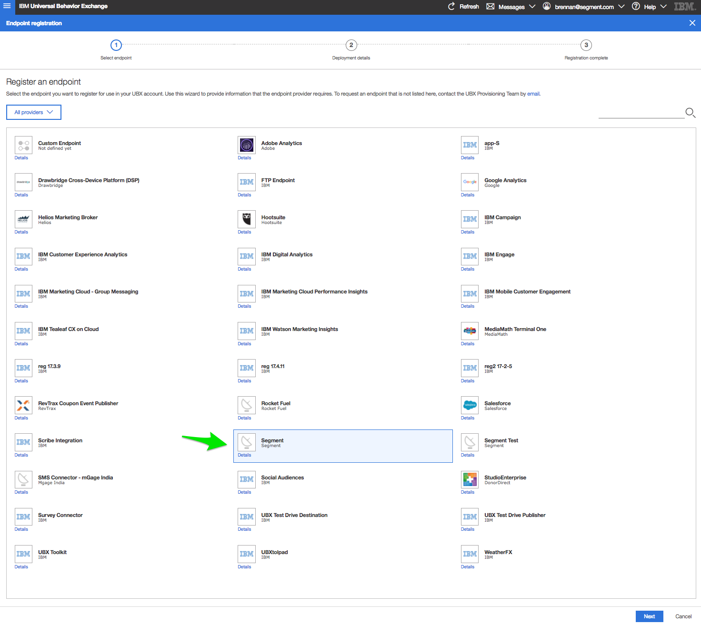
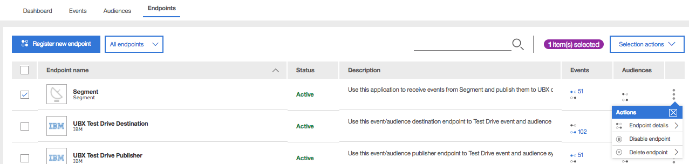
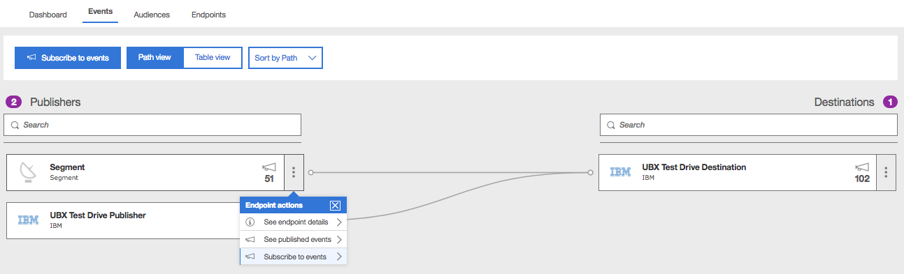

[IBM's Universal Behavior Exchange (UBX)](https://www.ibm.com/support/knowledgecenter/en/SS9JVY/UBX/kc_welcome_UBX.html)
is an API that allows users to share customer interactions, behaviors, and
target audiences among IBM solutions and applications - including the *Watson
Marketing Portfolio* - without the need for custom software integration. In
effect, UBX is the "Segment" of IBM's ecosystem. Once data is routed to IBM, you
can send it to any destination in UBX's portfolio.

_**NOTE:** IBM UBX is currently in beta and this doc was last
updated on May 7, 2018. This means that there may still be some bugs for us to
iron out and we're excited to hear your thoughts. If you are interested in
joining or have any feedback to help us improve the IBM UBX Destination and its documentation, [let us know](https://segment.com/help/contact)!_

## Getting Started

_**NOTE:** To enable Segment in UBX, navigate to "Endpoints" in the UBX dashboard,
select "Register new endpoint", then select "Segment". Once you've added the
Segment endpoint, contact [Segment
support](https://segment.com/help/contact) with your new endpoint's "endpoint
authentication key" for help activating your new endpoint. Note that the
endpoint in UBX will not be able to receive Segment data until you have enabled
both the destination in the Segment UI *and* requested activation of the
endpoint from Segment's support team._



1. From the Segment web app, click **Catalog**.
2. Search for "IBM UBX" in the Catalog, select it, and choose which of your sources to connect the destination to.
3. Enter your UBX API URL and your publisher's endpoint authentication key in
   the Segment Settings UI. You should have received an email with this URL
   shortly after setting up your UBX account. If you can't locate your URL,
   contact UBX support (the URL is also referred to as a "base URL" in
   the [IBM UBX
   documentation](https://developer.ibm.com/customer-engagement/docs/watson-marketing/ibm-universal-behavior-exchange-ubx/ubxapireference/)).
   To locate your endpoint authentication key, navigate to the "Endpoints" tab
   in UBX, then look to the far right where you'll find three vertical dots.
   Click on them and select "Endpoint details".
4. Register and provision a Segment endpoint within your UBX dashboard so you
   can access the appropriate endpoint authentication key. Do this by navigating
   to "Endpoints", then "Register a new endpoint" and select "Segment". Then
   click "Register" to proceed.

    

5. Once registered, the new endpoint's status will remain "Pending" in the
   "Endpoints" tab until it has been activated. To activate an endpoint,
   include your UBX account's API URL and your endpoint authentication key in an
   email to Segment using our [tech support form](https://segment.com/help/contact/).

    

6. Segment will activate your endpoint within 24 hours, at which time its status
   will update to "Active" in the UBX dashboard. Now, you can grab your endpoint
   authentication key again and paste it into your UBX settings in the Segment
   UI.


## General Tracking Advice

We encourage customers to review UBX's dynamic event
library closely to become
familiar with UBX's specced events and properties. Many UBX consumers only
accept specific events; likewise, many consumers function best when specific
events include particular properties. Although Segment provides robust
out-of-the-box mapping (documented below), we still recommend reviewing the
dynamic event library closely to ensure that you are sending events and
properties that enable you to get the most out of your UBX consumers.

## Page

Page calls will send a 'Page View Event' to UBX (code `ibmpageView`). The below
mappings may apply:

<table>
  <tr>
    <td>Segment Property</td>
    <td>UBX Attribute Name</td>
  </tr>
  <tr>
    <td>`name`</td>
    <td>`siteID`</td>
  <tr>
</table>

_**Note:** As with `track` events, all properties sent by the user that aren't
mapped above will be sent as attributes to UBX. To send a UBX-specced property
that isn't mapped above, simply set the Segment property name to the UBX
property code directly (e.g. `pageID`)._ Remember, you can find UBX-specific
event and property codes in their dynamic event
library.

## Track

Segment's integration with UBX supports all public recognized UBX event types.
Beware, however - UBX event destinations will only receive events to which they
are subscribed. To subscribe a UBX destination to events from the Segment
publisher, navigate to the "Events" tab and select "Subscribe to events".



Make sure that you subscribe your UBX event subscriber endpoints to the events
you'd like them to consume from the Segment publisher.

Note that while Segment supports all UBX-specced events, we have mapped the
following Segment-specced events and their properties to their UBX equivalents:

### Event Mappings

#### Mobile
Events
<table>
  <tr>
    <td>Segment Event Name</td>
    <td>UBX Event Code</td>
  </tr>
  <tr>
    <td>Application Backgrounded</td>
    <td>`appSessionClose`</td>
  </tr>
  <tr>
    <td>Application Opened</td>
    <td>`appSessionOpen`</td>
  </tr>
  <tr>
    <td>Application Installed</td>
    <td>`appInstalled`</td>
  </tr>
  <tr>
    <td>Application Uninstalled</td>
    <td>`appUninstalled`</td>
  </tr>
  <tr>
    <td>Application Crashed</td>
    <td>`appCrashed`</td>
  </tr>
</table>

We do not define any specific mobile property mappings at this time given that
Segment's spec and UBX's spec do not share closely related mobile properties.
Note, you can still pass in any attribute codes as defined in UBX's dynamic
event library, and Segment
will pass these values downstream.

#### Ecommerce
Events
<table>
  <tr>
    <td>Segment Event Name</td>
    <td>UBX Event Code</td>
  </tr>
  <tr>
    <td>Product Added</td>
    <td>`cartAdd`</td>
  </tr>
  <tr>
    <td>Order Completed</td>
    <td>`ibmcartPurchase`</td>
  </tr>
  <tr>
    <td>Product Viewed</td>
    <td>`ibmproductView`</td>
  </tr>
  <tr>
    <td>Product Removed</td>
    <td>`cartRemove`</td>
  </tr>
  <tr>
    <td>Products Searched</td>
    <td>`ibmsearchedSite`</td>
  </tr>
  <tr>
    <td>Product Reviewed</td>
    <td>`wroteReview`</td>
  </tr>
</table>

Attributes
<table>
  <tr>
    <td>Segment Property Name</td>
    <td>UBX Attribute Name</td>
  </tr>
  <tr>
    <td>`order_id`</td>
    <td>`orderID`</td>
  </tr>
  <tr>
    <td>`total`</td>
    <td>`orderTotal`</td>
  </tr>
  <tr>
    <td>`tax`</td>
    <td>`orderTax`</td>
  </tr>
  <tr>
    <td>`discount`</td>
    <td>`orderDiscount`</td>
  </tr>
  <tr>
    <td>`coupon`</td>
    <td>`orderPromo`</td>
  </tr>
  <tr>
    <td>`products`</td>
    <td>`productList`</td>
  </tr>
  <tr>
    <td>`cart_id`</td>
    <td>`orderID`</td>
  </tr>
  <tr>
    <td>`product_id`</td>
    <td>`productID`</td>
  </tr>
  <tr>
    <td>`name`</td>
    <td>`productName`</td>
  </tr>
  <tr>
    <td>`price`</td>
    <td>`basePrice`</td>
  </tr>
  <tr>
    <td>`url`</td>
    <td>`productURL`</td>
  </tr>
  <tr>
    <td>`image_url`</td>
    <td>`imageURL`</td>
  </tr>
  <tr>
    <td>`review_body`</td>
    <td>`review`</td>
  </tr>
</table>

#### Video
Events
<table>
  <tr>
    <td>Segment Event Name</td>
    <td>UBX Event Code</td>
  </tr>
  <tr>
    <td>Video Content Completed</td>
    <td>`ibmelementVideoCompleted`</td>
  </tr>
  <tr>
    <td>Video Playback Started</td>
    <td>`ibmelementVideoLaunched`</td>
  </tr>
  <tr>
    <td>Video Playback Paused</td>
    <td>`ibmelementVideoPaused`</td>
  </tr>
  <tr>
    <td>Video Playback Resumed</td>
    <td>`ibmelementVideoPlayed`</td>
  </tr>
</table>

Attributes
<table>
  <tr>
    <td>Segment Property Name</td>
    <td>UBX Attribute Name</td>
  </tr>
  <tr>
    <td>`position`</td>
    <td>`videoTimestamp`</td>
  </tr>
  <tr>
    <td>`total_length`</td>
    <td>`videoTotalLength`</td>
  </tr>
</table>

#### Email
Events
<table>
  <tr>
    <td>Segment Event Name</td>
    <td>UBX Event Code</td>
  </tr>
  <tr>
    <td>Email Bounced</td>
    <td>`emailBounce`</td>
  </tr>
  <tr>
    <td>Email Link Clicked</td>
    <td>`emailClick`</td>
  </tr>
  <tr>
    <td>Email Opened</td>
    <td>`emailOpen`</td>
  </tr>
  <tr>
    <td>Unsubscribed</td>
    <td>`emailOptOut`</td>
  </tr>
</table>

Attributes
<table>
  <tr>
    <td>Segment Property Name</td>
    <td>UBX Attribute Name</td>
  </tr>
  <tr>
    <td>`email_subject`</td>
    <td>`subjectLine`</td>
  </tr>
  <tr>
    <td>`list_id`</td>
    <td>`messageGroupId`</td>
  </tr>
  <tr>
    <td>`list_name`</td>
    <td>`messageGroupName`</td>
  </tr>
  <tr>
    <td>`link_url`</td>
    <td>`clickUrl`</td>
  </tr>
</table>

_**Note**: To send a UBX event or property that isn't mapped above, simply set
the Segment event or property name to the UBX-specced event or property code
directly (e.g. `opptyQualified`)._ Remember, you can find UBX-specific event and
property codes in their dynamic event
library.

### Property Mappings

Segment also maps some properties from the context object to their equivalent
UBX attributes. Note that UBX only supports a few data types - `string`,
`number`, `boolean` and `date`. Segment will automatically discard any
properties of a type not mentioned here, with the exception of objects, which we
will attempt to stringify. If we cannot, expect to see `[object Object]` appear
as the value in UBX.

<table>
  <tr>
    <td>Segment Property</td>
    <td>UBX Attribute Name</td>
  </tr>
  <tr>
    <td>`context.device.type`</td>
    <td>`deviceType`</td>
  </tr>
  <tr>
    <td>`context.ip`</td>
    <td>`ip`</td>
  </tr>
  <tr>
    <td>`context.location.latitude`</td>
    <td>`latitude`</td>
  </tr>
  <tr>
    <td>`context.locale`</td>
    <td>`locale`</td>
  </tr>
  <tr>
    <td>`context.location.city`</td>
    <td>`locationCity`</td>
  </tr>
  <tr>
    <td>`context.location.country`</td>
    <td>`locationCountry`</td>
  </tr>
  <tr>
    <td>`context.location.longitude`</td>
    <td>`longitude`</td>
  </tr>
  <tr>
    <td>`context.device.manufacturer`</td>
    <td>`manufacturer`</td>
  </tr>
  <tr>
    <td>`context.campaign.medium`</td>
    <td>`marketingSource`</td>
  </tr>
  <tr>
    <td>`context.campaign.source`</td>
    <td>`mediaSource`</td>
  </tr>
  <tr>
    <td>`context.device.model`</td>
    <td>`modelName`</td>
  </tr>
  <tr>
    <td>`context.os.name`</td>
    <td>`OS`</td>
  </tr>
  <tr>
    <td>`context.userAgent`</td>
    <td>`platform`</td>
  </tr>
  <tr>
    <td>`context.os.version`</td>
    <td>`versionOS`</td>
  </tr>
  <tr>
    <td>`(context.screen.width) * (context.screen.height)`</td>
    <td>`resolution`</td>
  </tr>
</table>

### Integration-Specific Option Mapping

Segment maps the following integration-specific options to UBX:

<table>
  <tr>
    <td>`integrations['ibm-ubx'].channel`</td>
    <td>`channel`</td>
  </tr>
  <tr>
    <td>`integrations['ibm-ubx'].subChannel`</td>
    <td>`attributes.subChannel`</td>
  </tr>
  <tr>
    <td>`integrations['ibm-ubx'].contactConsent`</td>
    <td>`attributes.contactConsent`</td>
  </tr>
</table>

An event containing all three integration-specific options may look something
like this:

```javascript
analytics.track('Order Completed' {
  // properties
}, {
  integrations: {
    'ibm-ubx': {
      channel: 'crm',
      subChannel: 'chat',
      contactConsent: 'email,opt-in'
    }
  }
})
```

It's important to note some information about precedent for each of these
options:

- `channel`: Segment first checks whether this value is defined in
  integration-specific options; if not and we detect `analytics-android` or
  `analytics-ios` libraries, `channel` is set to `mobile`; for all other
  libraries, `channel` is set to `web`.
- `subChannel`: This value is not appended to the outgoing payload unless
  explicity defined by the user.
- `ContactConsent`: This value is not appended to the outgoing payload unless
  explicity defined by the user. The value passed to Segment must be in the
  format `channel,subscriptionOption`. At the moment, the only acceptable
  channels are `email` and `sms`, and the only two acceptable subscription
  options are `opt-in` and `opt-out`.


## Troubleshooting

### Not seeing any data from Segment appear in UBX

- Check to ensure your Segment publisher endpoint is "Active". If not, see
  [Getting Started](#getting-started) above.
- Ensure you've subscribed your UBX destinations to the appropriate events.

## FAQ

Segment does not auto-generate events other than an initial `page` call when using our Analytics.js library and mobile lifecycle events when mobile lifecycle tracking is enabled using Segment's Android or iOS library.

This means some events supported and in some cases expected by downstream UBX destinations - including *abandonment events* - must be derived by the customer. One approach would be to integrate with a marketing tool such as [Braze](/docs/connections/destinations/catalog/braze/) or [Bronto](/docs/connections/destinations/catalog/bronto/), in which you can [set up rules that generate abandonment events](/docs/guides/destinations/how-do-i-automate-multi-channel-re-engagement-campaigns/#1st-line-of-defense-the-push-notification), which are then be sent back through Segment and downstream to UBX.

Another approach may be to schedule a cron job in your database that checks for users who have triggered a `Product Added` event, but who never went on to trigger an `Order Completed` event. In this case, one can logically deduce that the user abandoned his cart, hence you should trigger a server-side Segment event based on this rule, which Segment will process and pass downstream to UBX.

Segment's integration with UBX supports the following UBX abandonment events:

- ibmabandonedConversion
- ibmbrowseAbandonment
- ibmbrowseAbandonmentItem
- ibmcartAbandonment
- ibmcartAbandonmentItem

