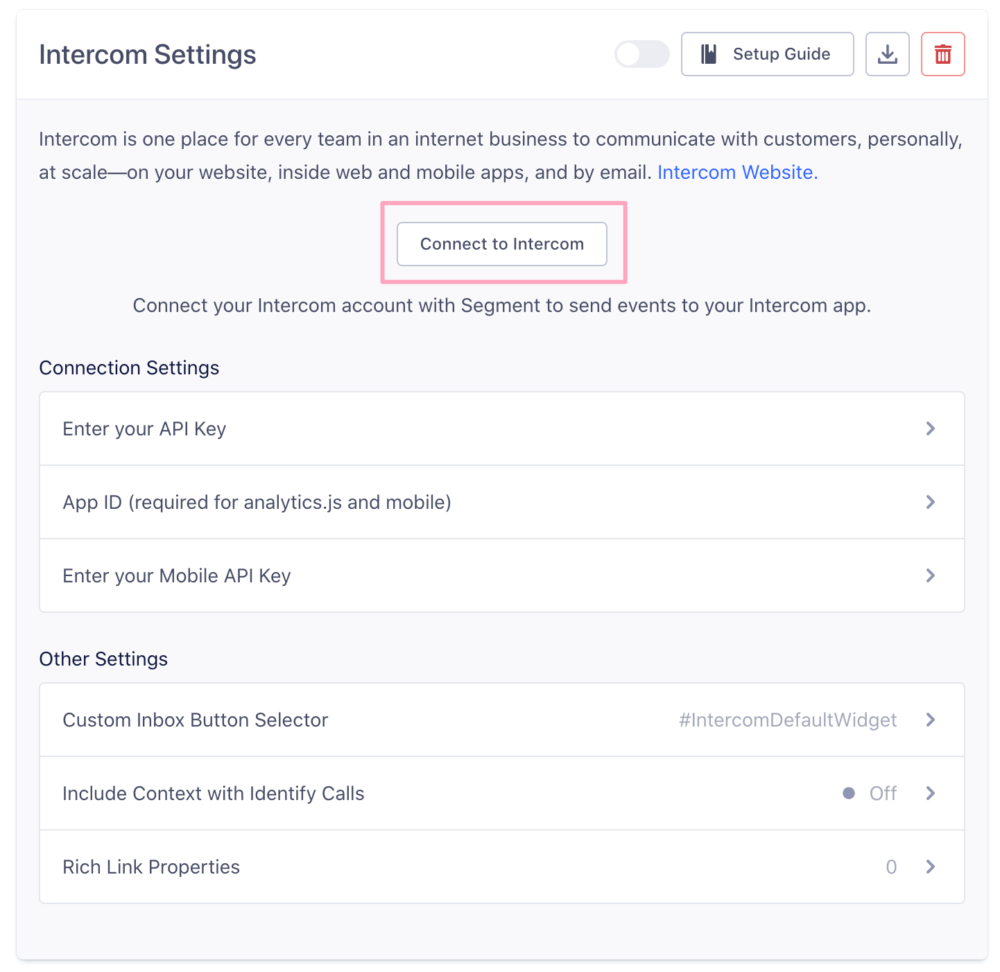
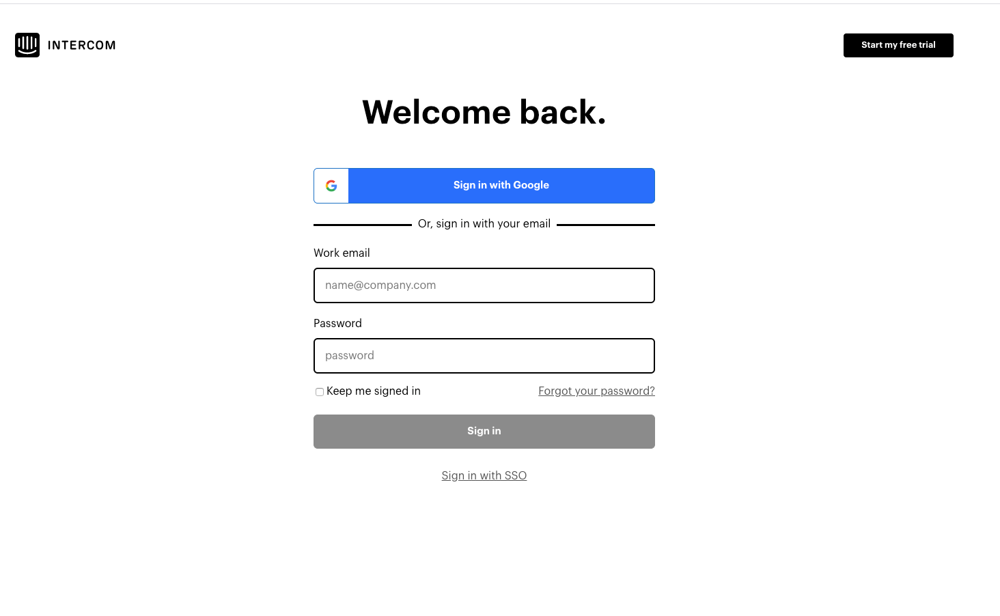

[Intercom](https://www.intercom.com/) makes customer messaging apps for sales, marketing, and support, connected on one platform. The Intercom Destination is open-source. You can browse the code for [analytics.js](https://github.com/segment-integrations/analytics.js-integration-intercom), [iOS](https://github.com/segment-integrations/analytics-ios-integration-intercom) and [Android](https://github.com/segment-integrations/analytics-android-integration-intercom) on GitHub.

## Getting Started


1.  From your Segment UI's Destinations page click **Add Destination**.
2.  Search for "Intercom" and select it in the results that appear.
3.  Choose which Source to connect Intercom to.
4.  Authorize your Intercom account in Segment and select the Intercom Account to sync with Segment.

    You can choose which account to sync from the drop down menu in the top right. If you are using [server-side sources](/docs/connections/sources#server), Segment starts passing data through once you activate the Destination. For other libraries  continue reading below.
5. Find your "App ID" in the Intercom UI following [the instructions here](https://docs.intercom.com/faqs-and-troubleshooting/getting-set-up/where-can-i-find-my-app-id){:target="_blank"} or by navigating to the Gear Menu and clicking on "App Settings" followed by "API Keys". It should look something like `9iefb489`.


Your changes appear in the Segment CDN in about 45 minutes, and then Analytics.js starts asynchronously loading Intercom's `library.js` onto your page.

This means you should remove Intercom's snippet from your page.

### Mobile

**IMPORTANT:** Our Intercom mobile components are currently in public beta. We appreciate any feedback you have on the new components, so [let us know](https://segment.com/help/contact)!

Before reading the specific instructions for iOS or Android below, make sure you enter your Mobile API Key in the Segment Settings UI. This is required to send data to Intercom from your mobile apps.

#### iOS

1. In your application, add `pod 'Segment-Intercom'` to your Podfile.
2. After adding the dependency, you must import the integration `'SEGIntercomIntegrationFactory.h'` and register it with the Segment SDK `[configuration use:[SEGIntercomIntegrationFactory instance]];`.
3. When installing Intercom, you must make sure that you have a `NSPhotoLibraryUsageDescription` entry in your `Info.plist`. This is [required by Apple](https://developer.apple.com/library/content/qa/qa1937/_index.html) for all apps that access the photo library, and is necessary due to the image upload feature. Users are prompted for the photo library permission only when they tap the image upload button.

#### Android

1. Add `compile 'com.segment.analytics.android.integrations:intercom:+'` to your app-level `build.gradle` file
2. Sync your project, then import the integration in your Application subclass or wherever you're initializing Segment:
   ```java
   import com.segment.analytics.android.integrations.intercom.IntercomIntegration;
   ```
3. Next, remember to register the `IntercomIntegration.FACTORY` with the Segment SDK:

   ```java
   analytics = new Analytics.Builder(this, "write_key")
     .use(IntercomIntegration.FACTORY)
     .build();
   ```

### React Native



## Page

If you're not familiar with the Segment Specs, take a look to understand what the [Page method](/docs/connections/spec/page/) does. An example call would look like:

```js
analytics.page();
```

The Page call only works in device-mode through Analytics.js by triggering the Intercom `update` method, which looks for new Intercom messages that should be displayed to the current user. It is not supported by any of our server-side or mobile SDKs.

### Intercom Respond

If you have [Intercom's Respond package](https://docs.intercom.com/responding-to-users-and-visitors/getting-started-with-intercom-respond), calling `page` triggers the chat widget to appear. Otherwise, you must use the [Identify method](#identify) to make the chat widget appear.

If you have the Respond package and calling `page` still does not show your chat widget, be sure to check your "Visitors on your website" setting inside your Intercom account.


## Identify

If you're not familiar with the Segment Specs, take a look to understand what the [Identify method](/docs/connections/spec/identify/) does. An example call would look like:

```javascript
analytics.identify('su3r73', {
  name: 'Iñigo Montoya',
  email: 'avenger@example.com',
  company: {
    id: '123',
    name: 'Iñigo & Friends Holding Company'
  },
  createdAt: 'Mon Mar 26 2018 17:44:51 GMT+0000 (UTC)'
});
```

When you call Identify, Segment creates or updates the user in Intercom using their [Users API](https://developers.intercom.com/reference#users). Segment does not currently support creation of leads.

*Note:* Intercom only associates Track events with known users. An Identify call with a `userId` is required before Track events are associated properly. Segment's bundled mobile SDKs also require that `identify` be called prior to `track`, but accepts setting an unknown user in Intercom using the `anonymousId`.

Keep reading for more information about the Identify call depending on the source type you send it from.

### Client

- Passing `traits.company` creates a new Intercom Company if the `company_id` does not match a known company. See the [Intercom user model documentation](https://developers.intercom.io/reference#user-model) for more details.
- Trait values must be no longer than 255 characters

When you call Identify on `analytics.js`, Segment creates the `intercomSettings` object and loads Intercom's JavaScript into the page.

Here's how Segment parameters are mapped to those in the `intercomSettings` object:

| Segment Parameter  | Intercom Parameter                   | Description                          |
| ------------------ | ------------------------------------ | ------------------------------------ |
| `userId`           | `intercomSettings.user_id`           | The user ID for this user.           |
| `traits`           | `intercomSettings.custom_attributes` | The traits associated for this user. |
| `traits.email`     | `intercomSettings.email`             | The email of this user.              |
| `traits.name`      | `intercomSettings.name`              | The full name of this user.          |
| `traits.company`   | `intercomSettings.company`           | The company associated for this user.|
| `traits.createdAt` | `intercomSettings.created_at`        | The UNIX timestamp when the user was created. |

> warning ""
> **Note:** Intercom does not accept trait values longer than 255 characters.

If a user with `traits.company` is identified and the `company_id` does not match a known company, a new company is created in Intercom. If company is a string, Segment sets the `company_id` as a hash of `company_name` as an id is required to [associate the user to the company](https://developers.intercom.io/reference#user-model). The [`group` call](/docs/connections/destinations/catalog/intercom#group) may be used to create/update company profiles explicitly.


### Server

When you call Identify from any of the server-side libraries or mobile sources in Cloud-mode we'll map our [special traits](/docs/connections/spec/identify#traits) (`email`, `firstName`, `lastName`, `createdAt`, and `company`) to Intercom special properties.

To use Intercom's `last_request_at`, you must pass in `active: true` in the context object. Then, by default Segment sets `last_request_at` to the current time; however, if you pass in your own timestamp, pass it in as `lastRequestAt` (in camelCase), and Segment sets `last_request_at` to that value in our server-side sources.

To include `last_seen_user_agent`, add it to the `context.userAgent`. Similarly with `last_seen_ip` which is used for geolocation, you can include the IP address at `context.ip`. [Click here for an example](#last-seen).

### Mobile

Intercom supports both logged-in or logged-out users. You must register your users with Intercom before you can talk to them or see what they do in your app. This means that `identify` must be called before `track`.

Intercom allows users to choose to track only known or only unknown users, as well as both. Segment supports the ability to track both by checking for logged in users (determined by the `userId`) and falling back to setting the user as "Unidentified" when this is not present.

Intercom knows when your app is backgrounded and comes alive again, so you won't need to re-register your users.

Segment maps the following Intercom standard attributes on `identify`.

| Segment Parameter                         | Intercom Parameter       | Description                          |
| ----------------------------------------- | ------------------------ | ------------------------------------ |
| `traits.userId`                           | `user_id`                | The user ID for this user.           |
| `traits.email`                            | `email`                  | The email of this user.              |
| `traits.name`                             | `name`                   | The full name of this user.          |
| `traits.phone`                            | `phone`                  | The phone number for this user.      |
| `traits.company`                          | `company`                | The company associated for this user.|
| `traits.signedUpAt`                       | `created_at`             | The signed up date as an NSDate (iOS) & Long (Android) |
| `integrations.intercom.language_override` | `languageOverride`       | The [language override](https://docs.intercom.com/configure-intercom-for-your-product-or-site/customize-the-intercom-messenger/localize-intercom-to-work-with-multiple-languages) code for this user. |
| `integrations.intercom.unsubscribed`      | `unsubscribedFromEmails` | A boolean indicating if the user has unsubscribed from emails.|
| remaining `traits`                        | `customAttributes`       | Custom attributes for this user.     |

**Note:** Intercom only supports values of type NSString, NSNumber or NSNull on iOS and String, Long, Float, Double, Boolean, Character, Byte, Short or Integer on Android. In addition, Android traits should be passed using camelCase to conform with Java convention.

#### Collect Context

When this option is selected, `identify` calls include contextual information collected by [Segment's mobile libraries](/docs/connections/sources#mobile) if it is available. This info is set as Custom Attributes on the Intercom user.

The fields collected from the [context object](/docs/connections/spec/common/) are `device.type`, `device.manufacturer`, `device.model`, `os.name`, `os.version`, `app.name`, `app.version` and appear in Intercom as `device_type`, `device_manufacturer`, `device_model`, `os_name`, `os_version`, `app_name` and `app_version`.


## Track

If you're not familiar with the Segment Specs, take a look to understand what the [Track method](/docs/connections/spec/track/) does. An example call would look like:

```javascript
analytics.track('Product Purchased', {
    order_ID: '2969302398',
    category: 'boots',
    product_name: 'yellow_cowboy_boots',
    price: 99.95,
    currency: 'EUR'
});
```
> note ""
> **Note:** Because Intercom only associates Track events with known users, an Identify call with a `userId` is required before Track events are associated properly.

When you call `track` from any of the server-side libraries or mobile sources in `cloud-mode` (i.e. without our beta Segment mobile Intercom SDK installed), you must include either the `userId` or `email` of an existing user in Intercom.


### Revenue and currency
If you send `properties.revenue` and `properties.currency`, Segment formats that according to [Intercom's Monetary Amount](https://developers.intercom.io/reference#event-metadata-types) and send it as:

```js
price: {
  amount: <properties.revenue> * 100, // since Intercom requires this in cents
  currency: <properties.currency> // defaults to 'usd'
}
```

Our bundled mobile integrations also check `properties.total` if `properties.revenue` is not present, and assign the total value as the amount value.

### Limited Properties
Intercom can only store [5 event properties](http://docs.intercom.io/Intercom-for-user-analysis/Tracking-User-Events-in-Intercom#metadata-support) per event. That means if you send an event to Segment with more than 5 properties, Intercom only shows the first 5 properties.

### Limited Events

Intercom only allows a total of 120 unique _active_ event names. If you are sending Segment more than 120 unique event names, Intercom only accepts the first 120 events that their servers see, and the rest throw an error. In Intercom, an "Active" event is one which has not been archived. If you archive an event, it makes it inactive and removes it from your 120 active events. If you need to bring your account back under the 120 event limit, archive some events from in the Intercom UI by navigating to **Settings > (workspace name) data > Events**, then click on the event to archive.

### Server-side Race Condition

Because our server-side libraries batch calls by default, it is possible for an `identify` call that would create a user record to arrive at the same time as a `track` event associated with this user. If the `track` event is processed before the user is created you get an error, and the event is not recorded.

[Adding a Flush method](/docs/connections/sources/catalog/libraries/server/node#batching) immediately following the `identify`, and before any additional `track` events helps ensure that the `identify` call reaches Intercom first to create the user. Generally, this is enough to prevent the race condition, but you can add an extra timeout if necessary.

If you still see issues, the `identify` call is most likely either not reaching Intercom at all, or is arriving too late after a subsequent [retry](/docs/connections/destinations#retries). In cases like this you can use our [Event Delivery functionality](/docs/connections/event-delivery/) to check for recent errors, and get some insight into how to prevent errors in the future.

## Group

If you're not familiar with the Segment Specs, take a look to understand what the [Group method](/docs/connections/spec/group/) does. An example call would look like:

```javascript
analytics.group('companyId123', {
  name: 'Segment'
});
```

Segment supports Intercom companies in all of our sources. Users can be put into multiple groups, which associate them to multiple companies in Intercom.

When you call Group from any of our server-side libraries or mobile sources in cloud-mode (without our Segment mobile Intercom SDK installed), you must include either the `userId` or `email` of an existing user in Intercom.

> note ""
> **Note:** In order for the Company Sessions Count to update within Intercom, the company must first be recorded in an `identify` call.


| Segment Parameter      | Intercom Parameter            | Description                                   |
| ---------------------- | ----------------------------- | --------------------------------------------- |
| `groupId`              | `companyId`                   | The ID for the company.                       |
| `traits.name`          | `name`                        | The name of the company.                      |
| `traits.plan`          | `plan`                        | The plan of the company.                      |
| `traits.monthly_spend` | `monthlySpend`                | The monthly spend of the company.             |
| `traits.company`       | `intercomSettings.company`    | The company associated for this user.         |
| `traits.createdAt`     | `intercomSettings.created_at` | The UNIX timestamp when the user was created. |
| remaining `traits`     | `customAttributes`            | Custom attributes for this user.              |


**Note:** Intercom only supports values of type `NSString`, `NSNumber` or `NSNull` on iOS, and `String`, `Long`, `Float`, `Double`, `Boolean`, `Character`, `Byte`, `Short` or `Integer` on Android. In addition, Android traits should be passed using camelCase to conform with Java convention


## Reset

Segment supports Intercom's `reset` method only for Device-mode Mobile sources. The bundled mobile SDK's `reset` method unregisters a user in Intercom. When users want to log out of your app and you call Segment's `reset` method, Segment calls:

On iOS:

```objc
  [Intercom reset];
```

On Android:

```java
  Analytics.with(context).reset();
```

## Best Practices

### Arrays and Objects

Intercom does **not** support custom arrays or objects. Per Intercom's request, we removed support for this feature starting Aug 21st, 2017. This means that if you want to send a certain user `trait` or event `property` to Intercom, you must send them at the top level.

This limitation does not apply, however, for mapping `company` objects on [`identify`](/docs/connections/spec/identify/) calls. Segment continues to handle that in the same way as before. This is only applicable for any custom traits or properties.

### Disassociating Users from a Company (server-side only)

You can disassociate a user from a company by passing in a field inside the `company` trait with `remove: true` in your `identify` calls.

```javascript
analytics.identify({
  userId: '019mr8mf4r',
  traits: {
    name: 'Michael Bolton',
    email: 'mbolton@example.com',
    plan: 'Enterprise',
    company: {
      id: 12345,
      remove: true
    },
    createdAt: 'Thu Mar 24 2016 17:46:45 GMT+0000 (UTC)'
  }
});
```

### Identity Verification

Intercom's *identity verification* helps to make sure that conversations between you and your users are kept private and that one user can't impersonate another. Segment supports identity verification through our `analytics.js` web library and our `iOS` and `Android` mobile sources.

For mobile apps, before enabling identity verification, read Intercom's docs on identity verification for [iOS](https://developers.intercom.com/docs/ios-identity-verification) and [Android](https://developers.intercom.com/docs/android-identity-verification).

If you want to enable Intercom [identity verification](https://docs.intercom.com/configure-intercom-for-your-product-or-site/staying-secure/enable-identity-verification-on-your-web-product) for `analytics.js` or our bundled mobile SDKs, you can pass in the `user_hash` variable inside the integrations object.

The `user_hash` should be a SHA256 hash of your Intercom API secret and the `userId`. The hash is not based on the email, it's based on the `userId`. Here's an example rendering an identify call with identity verification:

```javascript
analytics.identify('<%= current_user.id %>', {
    email: '<%= current_user.email %>',
    createdAt: '<%= current_user.created %>'
}, {
     Intercom: {
        user_hash: '<%= OpenSSL::HMAC.hexdigest("sha256", "YOUR_INTERCOM_APP_SECRET", current_user.id) %>'
     }
});
```

`Android` example:

```java
Traits traits = new Traits();
Map<String, Object> intercomOptions = new HashMap<>();
intercomOptions.put("userHash", "YOUR_USER_HASH");
Options options = new Options().setIntegrationOptions("Intercom", intercomOptions);
Analytics.with(context).identify("123", traits, options);
```

`YOUR_INTERCOM_APP_SECRET` is found in Intercom's identity verification set up guide.

#### Identity verification plus filtering using Destinations Object

If using Intercom identity verification AND [selective destinations functionality](/docs/connections/sources/catalog/libraries/website/javascript#selecting-destinations-with-the-integrations-object), the context object looks like this:

```js
{
 integrations: {
     All: false,
     Intercom: {
        user_hash: '<%= OpenSSL::HMAC.hexdigest("sha256", "YOUR_INTERCOM_APP_SECRET", current_user.id) %>'
     }
 }
}
```

### Unsubscribe Users

To unsubscribe users from emails, you may set a flag from **server side** libraries, `unsubscribedFromEmails`, inside `context` object:

`node.js` example:

```javascript
analytics.identify({
  userId: '4832094283057439285723523452345',
  anonymousId:'43254364571',
  context:{
    Intercom: { unsubscribedFromEmails: true }
  },
  traits: {
    firstName: 'John ',
    lastName: 'Jacob',
    email: 'jingleheimer@schmidt.com'
  }
});
```

`objective-c` example:

```objc
options:@{
  @"integrations": @{
   @"intercom" : @{
     @"unsubscribed": @YES
    }
  }
}
```

`Android` example:

```java
Traits traits = new Traits();
Map<String, Object> intercomOptions = new HashMap<>();
intercomOptions.put("unsubscribedFromEmails", true);
Options options = new Options().setIntegrationOptions("Intercom", intercomOptions);
Analytics.with(context).identify("123", traits, options);
```

**Note**: This only works from server-side libraries and bundled mobile, and does NOT work in `analytics.js`.

### Last Seen

By default Intercom updates the **Last Seen** user trait whenever a user's profile is updated by `identify` calls, or if a group call is sent with a user's `userId`. If you want to update a user without updating their **Last Seen** time, pass `active` with a value of `false` into the context (see example below) of your `identify` or `group` calls.

Note that this only works server-side; **Last Seen** is always updated client-side. Note that id or name are necessary to update company.

Here's a full `python` example of an `identify` call with `active` set to `false`:

```python
analytics.identify(user_id='some_user_id', traits={
    "email": "ben@intercom.io",
    "firstName": "Ben",
    "lastName": "McRedmond"
    "createdAt": 1363902294011,
    "plan": "Premium"
}, context={
    "ip": "192.168.0.1",
    "active": False,
    "userAgent": "Mozilla/5.0 (Macintosh; Intel Mac OS X 10_7_5) AppleWebKit/537.36 (KHTML, like Gecko) Chrome/27.0.1453.47 Safari/537.36"
})
```

### Intercom Tags

Our API doesn't support Intercom tags. Traits can be used instead of tags to create segments of users, and the advantage is you can use those traits in other destinations like Segment.

### Conditionally show the Intercom chat widget (Browser only)

You can take advantage of Intercom's `hide_default_launcher` option to selectively show the chat widget. According to Intercom's [docs](https://www.intercom.com/help/en/articles/178-customize-the-intercom-messenger-basics), you want to first hide the Messenger for all users inside their UI using Messenger settings. Then think about how you want to programmatically decide which users you'd like to show the widget to. Then you can pass an Intercom specific destination setting like this:

```js
// with analytics.js
analytics.identify('teemo', { someTrait: 'x'}, {
  Intercom: { hideDefaultLauncher: true }
});
```

**Note**: You can pass in the Intercom specific option using all supported calls for this destination (`page`, `identify`, and `group`)!

### Control the Intercom Chat Widget (Mobile only)

Our mobile SDKs give you the ability to tap into the Intercom instance our integration creates so that you can call any of Intercom's native' methods on it. This includes all methods required to interact with the Intercom chat widget.

Here's an example of how to grab the underlying Intercom instance.

On Android:

```java
analytics.onIntegrationReady("Intercom", new Callback() {
  @Override public void onReady(Object instance) {
    Intercom intercom = (Intercom) instance;
  }
});
```

```objc
[[NSNotificationCenter defaultCenter] addObserver:self selector:@selector(integrationDidStart:) name:SEGAnalyticsIntegrationDidStart object:nil];

- (void)integrationDidStart:(nonnull NSNotification *)notification
{
    NSString *integration = notification.object;

    if ([integration.name isEqualToString:@"Intercom"]) {
        // Call Intercom library methods here.
    }
}
```

You can read more about tapping into destination-specific methods on [Android here](/docs/connections/sources/catalog/libraries/mobile/android#how-can-i-use-a-destination-specific-feature) and on [iOS here](/docs/connections/sources/catalog/libraries/mobile/ios#how-do-i-know-when-a-destination-is-initialized).

### Push notification and deep linking

Our mobile SDKs do not support push notifications and deep linking out of the box. Refer to the Intercom documentation [here](https://developers.intercom.com/v2.0/docs/ios-push-notifications) and [here](https://developers.intercom.com/v2.0/docs/ios-deep-linking) for more information on setting up push notifications and deep linking on iOS and [here](https://developers.intercom.com/docs/android-fcm-push-notifications) and [here](https://developers.intercom.com/docs/android-deep-linking) for more information on these features on Android. Note our Android SDK bundles Intercom's Firebase push notification dependency, and cannot support Google Cloud Messaging push notifications at this time.


## Troubleshooting

### I'm seeing a `403 Forbidden` error

You probably have [Intercom's identity verification](#identity-verification) setting turned on but are not passing the `user_hash` correctly or at all.

You may also have to [whitelist your domain](https://docs.intercom.io/configuring-for-your-product-or-site/customizing-the-intercom-messenger#whitelist-the-domains-you-want-to-use-intercom-with) in Intercom's dashboard. Otherwise, events on non-whitelisted pages may be rejected with a 403 error.


### My Intercom Widget doesn't show up

Make sure you are sending a `page` and `identify` call when the page is loaded. This allows Intercom to register the page and the user, which would enable the widget to appear.

If you are sending those two calls, then check that the CSS selector for the widget is correct. The default is `#IntercomDefaultWidget`, but if you [customize your widget](http://docs.intercom.io/configuring-Intercom/in-app-messenger#custom-style), then be sure to update this field accordingly.

### My client-side and server-side calls are going to one Segment source, but different Intercom projects

Server-side calls go the the project selected when you authenticated your Intercom account while setting up the destination. Client-side calls go to the project referenced with the [App ID setting](#app-id-required-for-analyticsjs-and-mobile).
Make sure those projects are the same.

### I'm seeing a "Cannot have more than 120 active event names" error

Intercom only allows a total of [120 unique event names](http://docs.intercom.io/Intercom-for-user-analysis/Tracking-User-Events-in-Intercom#events-faqs). That means if you are sending Segment more than 120 unique event names, Intercom only accepts the first 120 events that hit their servers, and the rest throw an error.

If you want to prevent some of your events from being passed to Intercom and thus prevent the error, you can filter out Intercom in those events using the [Selecting Destinations](/docs/guides/how-to-guides/collect-on-client-or-server#selecting-destinations) feature available on all of Segment's libraries.

## Using Intercom with Personas

Intercom is one of the most popular Destinations used with Personas.

You can send computed traits and audiences that you create in Personas to this Destination so that you can use this data in live chat, automated emails, and other Intercom features to personalize interactions with your customers.



### User-Level Traits and Audiences in Intercom

Personas sends [**User-Level data**](/docs/glossary#event) to Intercom using an **Identify** call that appends a trait to users' profiles, or a **Track** call when a trait is computed or an audience is entered or exited.

#### User level computed traits

The name of the computed trait is added to the user profile as a trait, and the trait's value is set to the value of the computed trait. When the trait is computed, Segment sends a **Track** call. For example: imagine you have a computed trait that counts the number of times a user visits your pricing page. If the user visits your pricing page five times, Segment sends an identify call with the property `pricing_page_visits: 5`.

#### User level Audiences

The name of the audience is added to the user's profile as a trait, with boolean value that indicates if the user is in the audience. For example, when a user first completes an order in a lookback window for the last 30 days, Personas sends an identify call with the property `order_completed_last_30days: true`.  When the user no longer satisfies these criteria (for example when it's been longer than 30 days since the last purchase), Personas sets that value to `false`.

When you first create an audience, Personas sends an `identify` call for every user in the audience. Later syncs only update users which were added or removed from the audience since the last sync.

> info ""
> **Note**: Segment does not currently support the creation of **Leads** in Intercom.


### Account-Level Traits and Audiences in Intercom

Personas sends **Account-Level data** to Intercom using an **Identify** event call that appends an account trait to the users' profiles or a **Track** call when a trait is computed or an audience is entered or exited. Users are added to an account using a single **Group** call, which appends a `groupID` to each user within the account.

#### Account level computed traits

When you build computed traits with Account-Level data, Personas computes for each account based on traits or aggregated user behavior. You can then export traits for each account, or for each user within an account. The name of the computed trait is added to the profiles of users who are part of the account as a user trait, and the value of the computed trait is added to the corresponding user's user trait.

For example, imagine you have a computed trait that counts the number of times that users from a specific account visit your pricing page. If users visit your pricing page five times, Personas sends an identify call with the property `pricing_page_visits: 5`.

#### Account level audiences

When you build audiences with Account-Level data, Personas returns a set of accounts or a set of users that match your criteria. Personas adds the name of the audience to the profile (individual user, or user within the account) as a trait, with a boolean value to indicate if the user is in the audience. For example: when users in an account first complete an order in the last 30 days, Personas sends an identify call with the property `order_completed_last_30days: true`. When the users in this Account no longer satisfy these criteria (for example if it's been more than 30 days) Segment sets that value to `false`.

When you first create the audience, Personas sends an identify call for *every user in the account in that audience*. Later syncs only send updates for individual accounts and users which were added or removed since the last sync.

> success ""
> **Tip**: For user-level events or traits, you can specify `None of the users`, `Any users`, or `All users` when building your audience criteria.


## Setting Up Personas and Intercom

To send computed traits or audiences to Intercom, you first must connect it to your Personas space. Once it's set up, you can select Intercom as a destination for Personas data when you create computed traits or audiences.

1. In your Segment workspace, click Personas in the left navigation bar, and select your Personas space.
2. Click **Destinations** in your Personas space and click **Add Destination**.
3. Search for Intercom and click it when it appears in the search results
4. Click **Configure Intercom**.
5. Click **Connect to Intercom**.
   
6. Log in to Intercom to allow Segment to send data to Intercom.
   

## Intercom Personas Quick Info

- **Personas Destination type**: Event Method (data is delivered to this Destination one-by-one on a realtime basis)
- **Traits and Audiences created by**: Identify calls add traits and audiences as traits on the user
- **Must create audience_name field before Personas can update those values?**: No, Personas creates the audience for you. Segment creates the name in Intercom when it passes user `identify` calls.
- **Audience appears as**: A snake_cased version of the audience name (for example, `order_completed_last_30days: true` ) with a boolean value of `true` indicates that a user is in the audience.
- **Destination rate limit**: Yes. 83 requests per 10 seconds
- **Lookback window allowed**: Unlimited
- **Identifiers required** : `i``d` or `email`
- **Identifiers accepted** : `i``d` and `email`
- **Client or Server-Side Connection**: Server-side
