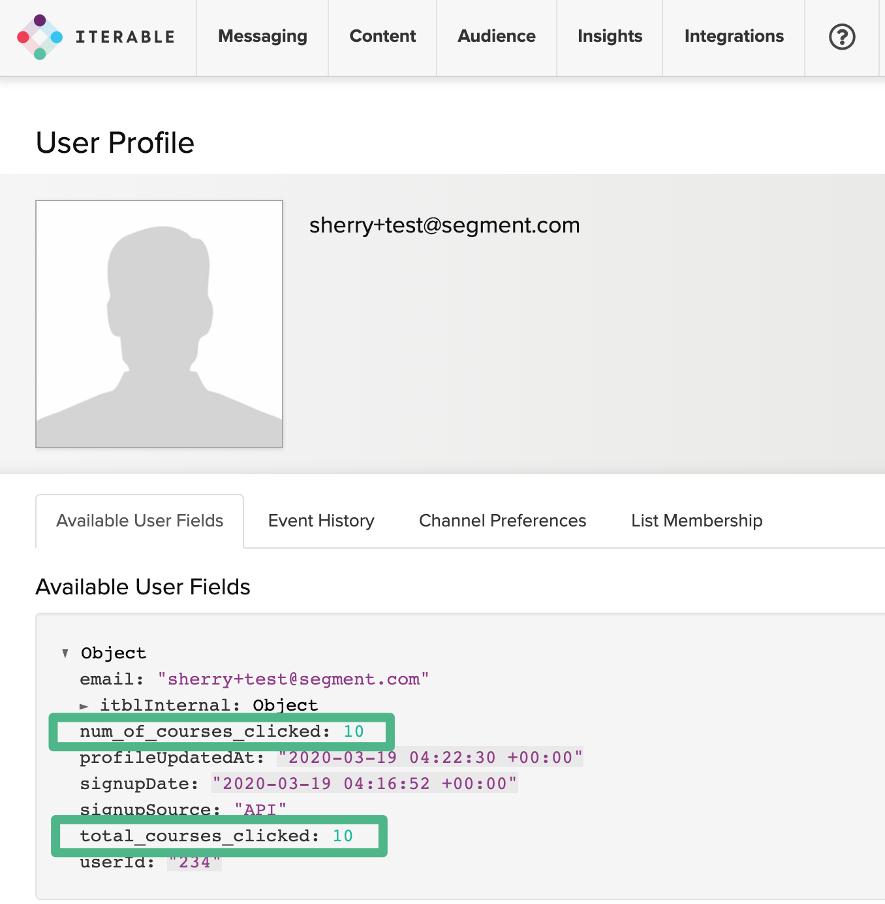

When you enable the Iterable destination from the Segment app, your data starts flowing into Iterable, where it can trigger workflows and make data available for analytics. You can find or generate your Iterable API key by going to Integrations → API keys inside the Iterable app.

<!-- LR 8/7/2020 these are all 404ing, commenting out until we can figure out if they're gone or just moved
**Use Cases**

* [Send personalized emails and messages based on topics of interest with Iterable](https://segment.com/recipes/personalized-email-by-topic-iterable/)
* [Drive more product reviews with Iterable](https://segment.com/recipes/drive-product-reviews-iterable/)
* [Personalize notifications based on topics of interest with Iterable and ClearBrain](https://segment.com/recipes/personalize-notifications-by-interest-iterable-clearbrain/)
* [Increase activation by reaching inactive users across mulitple channels with Iterable](https://segment.com/recipes/multi-channel-activation-iterable/)
* [Automatically send a follow up email when your initial email goes unopened](https://segment.com/recipes/iterable-autoresponder-emails-when-unopened/)
-->

- - -

## Identify

When you call `identify` with one of Segment's sources, Segment calls Iterable's [update user endpoint](https://api.iterable.com/api/docs#users_updateUser), to add data for that particular user. You can also call `identify` to update user fields.

Iterable keys users by `email` or a user ID. This user ID will be the Segment `userId` if sent. To use a Segment `userId` for identify calls, first call identify with both a `userId` and `email`. Iterable won't accept the request and throws an error if you fail to send one of either the `userId` or `email`.

<!-- commented out because this functionality isn't currently working ZD#355518
### Merge Nested Objects


Iterable offers the option to either merge user fields with nested data or overwrite them. (see their [docs](https://api.iterable.com/api/docs#!/users/updateUser_post_10) for more info). By default, this option is set to false. If you wish to disable this, you can pass a destination-specific property called `mergeNestedObjects` and set it's value to `true`.

Here's an example:

```js
analytics.identify({
    userId: 'user-id',
    traits: {
        settings: {
            mobile: true
        }
    },
    integrations: {
        Iterable: {
            mergeNestedObjects: true
        }
    }
});
```

This `identify` event would merge the `mobile` property for this user with any other settings that were previously a part of that users settings field.
-->


## Track

When you call `track` with one of Segment's sources, Segment calls Iterable's [track API endpoint](https://api.iterable.com/api/docs#events_track), and send over the event properties as the data fields in the request. The name of the `track` event appears as a Custom Event in Iterable, and will be available to trigger workflows, segment users, and view analytics.

If a user does not already exist in Iterable, calling `track` for a user event will add that user into the system. You can track with either an `email` or userId (if a `userId` exists for that email).

### Example steps:

First `track` event with `userId` and `email`; user will be created

Subsequent `track` with `userId`

### Ecommerce

Iterable also supports Segment's [ecommerce events](/docs/connections/spec/ecommerce/v2/). This works just as you would expect, using the `track` method.

Iterable has one important difference from the Segment Ecommerce spec. If you use the `Product Added` / `Product Removed`/ `Order Completed` events, you must include the "products" field with the cart info, as in the `Order Completed` example event. You must include [all required fields for the Purchase events in Iterable](https://api.iterable.com/api/docs#commerce_trackPurchase).  This includes the total value of the purchase as `total` (best as a float, double, and possibly an integer), and an array of objects called `products`. Each product must include an `id` or `productId` as a string, and a `name`, `price`, and `quantity` on each product object in the array. These are used to map to Iterable's expected `items` array. An example might look like this:

```js
analytics.track("Order Completed", {
  total: 100.00,
  products: [
    {
      product_id: '507f1f77bcf86cd799439011',
      name: 'Monopoly: 3rd Edition',
      price: 19,
      quantity: 1
    },
    {
      product_id: '505bd76785ebb509fc183733',
      name: 'Uno Card Game',
      price: 3,
      quantity: 2
    }
  ]
});
```


## Page

Calling `page` to track pageviews registers as a custom event in Iterable. If you have a page called "shoppingCart" the custom event is be called "shoppingCart page" in Iterable.

If a user does not already exist in Iterable, calling `page` for a user event adds that user to the system. Be sure to pass in the `email` the first time you call page for a user, since Iterable identifies users by `email`. After the first time, you can call page with `userId`.

### Example steps:

Call `page` with `userId` and `email`; if with `email` and the `email` doesn't exist, the user will be created.


## Sending Email Data from Iterable

Iterable supports sending [email events](/docs/connections/spec/email/) to other tools on the Segment platform. These events are sent as `track` calls to the other destinations you enabled.

To enable this feature, go to Destinations, Third Party, and select Segment in the Add Destinations button. Then, enter your API key.


## Sending Push Notification Data from Iterable

Iterable supports sending push notification events to Segment. These events are sent as `track` calls to the other destinations you've turned on. Push events are automatically enabled once the [Email Source](/docs/connections/sources/catalog/cloud-apps/iterable/) is enabled.

They support the following events:
`Push Delivered`, `Push Bounced`, `Mobile App Uninstalled`, `Push Opened`


## Using Iterable with Personas

Iterable is a marketing platform that can accept Personas information. You can send Iterable the computed traits and audiences you create in Personas, so you can use the data to power email, push and SMS campaigns.

> info ""
> **Note**: You must have access to Personas as part of your Segment plan to use this destination. [Contact our sales team](https://segment.com/demo/) to try this out.





### Using Computed Traits with Iterable

You can send Computed Traits created in Personas as `identify` calls to create user properties in Iterable.


From the Iterable UI, you can check a specific user profile for Computed Traits by going to **Audience → Contact Lookup**. Personas only updates user profiles that contain an `email` or `userId`.




Computed traits without a lookback window search across all historical events and update in real time.

Computed traits with a lookback window only search across events that occurred within the specified timeframe. Computed traits *with* a lookback window are updated hourly.


### Using Audiences with Iterable

You can send Personas Audiences to Iterable as `identify` or `track` calls. You can choose the type of call to send when you add Iterable as a destination for an audience. Personas only sends updates to Iterable for users who have a known `email` or `userId`.


#### Audiences using Identify Calls

When you send Audiences as `identify` calls, Personas adds a trait matching the name of the audience to the user's profile, with a boolean value to indicate if the user is in the audience. For example, when a user first completes an order in the last 30 days, Personas sends an `identify` call with the property `order_completed_last_30days:` `true`. When the user no longer satisfies these criteria (for example when their last purchase was more than 30 days ago) Personas sets that value to `false`.


You can check a specific user profile for Audience membership in the Iterable UI by going to **Audience → Contact Lookup**.


When you first create an audience, Personas sends an  `identify` call for every user in the audience. Later syncs only send updates for users who were added or removed from the audience since the last sync.

#### Audiences using Track Calls

When you use `track` calls, Segment sends an Audience Entered event when the user enters the audience, with the audience name as a property of the event. When the user exists the audience, Personas sends an Audience Exited event with the same property.


You can check a specific user profile for an Audience event in the Iterable UI by going to **Audience → Contact Lookup→ Event History** tab.


Audiences without a lookback window search across all historical events, and update in real time.

Audiences with a lookback window only searches across events that occurred within the specified timeframe. Audiences *with* a lookback window are updated hourly.


## Setting Up Personas and Iterable

To send computed traits or audiences to Iterable, you first must connect it to your Personas space. Once it's set up, you can select Iterable as a destination for Personas data when you create computed traits or audiences.

1. Navigate to the **Destinations** tab in your Personas space.
2. Search for **Iterable** and add the destination to your Personas space.
3. On the set up screen, enter in your API Key for the Iterable.


## Iterable Personas Details

- **Personas Destination type**: Event Method (data is delivered to this Destination one-by-one on a realtime basis)
- **Traits and Audiences created by**:You can add traits and audiences as user properties using `identify` calls. You can send audiences as `Audience Entered` or `Audience Exited` `track` calls with the audience name as an event property.
- **Must create audience_name field before Personas can update those values?**: No. If you send the audience as an `identify` call, Personas automatically creates the computed trait or audience name as a user property.
- **Computed trait appears as**: A lower case user property with the spaces converted to underscores.
- **Audience appears as**:  When you send Audiences as an `identify` call, Personas creates a lower case boolean user property using the audience name with spaces converted to underscores.  When you send Audiences as a `track` call, Personas sends `Audience Entered` and `Audience Exited` events, with the audience name as an event property.
- **Destination rate limit**: If sending traits and audiences as `identify` calls, 500 requests/second, per project. If sending audiences as `track` calls, 2000 requests/second, per project.
- **Lookback window allowed**: Unlimited
- **Identifiers required** : `userId` or `email`
- **Identifiers accepted** : `userId` and `email`
- **Client or Server-Side Connection**: Server-side


## Iterable Personas FAQs

#### What happens if I delete an audience or trait in Segment?

When you delete an audience or trait in Segment it is not deleted from Iterable. You cannot delete properties in Iterable, but you can hide them from the Iterable UI by going to your Iterable project settings.

#### If a user has multiple email addresses as external ids in Segment, what happens when they enter an audience or have a computed trait?

Segment sends an `identify` or `track` call for each email address on the user's account. For example, if a user has three email addresses, this creates three separate users in Iterable.
